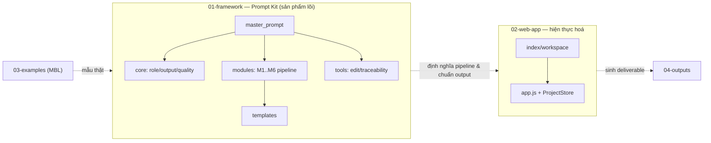

<!--
  Document ID: DOCSTRUCT-BASUPER-1.0
  Date: 2026-06-02
  Version: 1.0
  Status: Draft
  Source: quy hoạch lại theo chuẩn tổ chức tài liệu của dự án AIPlat (numbered folders + governance 00-project + doc-index + traceability). Trục component = bộ Framework (master_prompt + core + inputs + 6 modules + tools + templates) + Web App.
-->

# BA Super App — Documentation Structure

> **Mục đích:** bản đồ tài liệu toàn dự án theo **trục component**. BA Super App là dự án **lai**: **(1) Framework prompt** (bộ "kit" biến AI thành Super-BA) + **(2) Web App** (hiện thực hoá framework). Tài liệu được tổ chức thành **thư mục numbered + governance tập trung** — học cách tổ chức từ dự án **AIPlat**.

> **Trạng thái:** Reorg v1.0 (2026-06-02) — đã dựng cây numbered + governance; framework đang được viết lại sâu theo prompt-master. Bản gốc v1.0 lưu ở [`_archive/v1.0-framework`](../_archive/v1.0-framework/).

---

## Hai mảng & cách chúng nối nhau



**Nguyên tắc tách lớp:** `01-framework` = *cái gì & làm thế nào* (prompt-kit, dùng được standalone với ChatGPT/Claude/Gemini). `02-web-app` = *công cụ chạy framework*. `03-examples` = mẫu thật (MBL). `04-outputs` = nơi deliverable sinh ra rơi vào. `00-project` = governance. `_archive` = lịch sử (v1.0 + rác đã dọn).

---

## Cây thư mục (đích)

```
ba-super-app/
├── README.md · DOCUMENT-INDEX.md · CHANGELOG.md · ROADMAP.md · .gitignore
├── 00-project/                      # ★ Governance & standards
│   ├── README.md · vision.md · docs-structure.md (file này)
│   ├── conventions.md               # naming + ID + file-header + output standard
│   └── glossary.md
├── 01-framework/                    # ★ Prompt Kit (sản phẩm lõi)
│   ├── README.md · master_prompt.md
│   ├── core/      (ba-role · output-standard · quality-gates)
│   ├── inputs/    (project-context · stakeholder-map)
│   ├── modules/   (M1-discovery … M6-sprint-planning)   ← pipeline 6 phase
│   ├── tools/     (chatbot-edit · traceability-matrix)
│   └── templates/ (brd · srs · user-story · discovery · sprint …)  ← tách từ modules
├── 02-web-app/                      # Web prototype (vanilla JS + localStorage)
│   ├── README.md · index.html · workspace.html · budget_dashboard.html
│   ├── app.js · styles.css
│   └── data/  (mock_project.json · budget_data.js)
├── 03-examples/                     # mbl-showcase + sample outputs thật
├── 04-outputs/                      # deliverable do framework/web sinh ra (.gitkeep)
├── docs/                            # ★ Đặc tả SẢN PHẨM (BRD/SRS/NFR/UC/UF/Arch) — 7 component, BRD↔SRS 1:1
│   ├── 01-business/ (product-brief · brd.md + brd/01..07)
│   ├── 02-requirements/ (srs.md + srs/01..07 · nfr · use-cases · user-flows)
│   ├── 03-architecture/ (ARCHITECTURE.md) · DOCUMENT-INDEX.md
└── _archive/                        # v1.0-framework · prototype · web-scripts · plans
```

---

## Trục component — Capability ↔ File ↔ Phase

| # | Component | File | Vai trò | Maturity |
|---|---|---|---|---|
| — | **Master Controller** | `01-framework/master_prompt.md` | Điều phối: nhận diện phase, load module, conversation loop | rewrite |
| C1 | BA Role | `core/ba-role.md` | Persona Senior BA + thinking framework | keep |
| C2 | Output Standard | `core/output-standard.md` | Chuẩn format, YAML header, ID convention | keep→`conventions` |
| C3 | Quality Gates | `core/quality-gates.md` | 6 gate kiểm chất lượng theo phase | keep |
| I1 | Project Context | `inputs/project-context.md` | Template thu thập context dự án | flesh-out |
| I2 | Stakeholder Map | `inputs/stakeholder-map.md` | RACI + influence/interest | flesh-out |
| **M1** | Discovery | `modules/M1-discovery.md` | Mô tả dự án → Discovery Report | rewrite |
| **M2** | User Story | `modules/M2-user-story.md` | Feature → US + AC (Given/When/Then) | rewrite |
| **M3** | BRD | `modules/M3-brd.md` | US → Business Requirements (BRD-REQ) | rewrite |
| **M4** | SRS | `modules/M4-srs.md` | BRD → FR/NFR (SRS-FR/NFR) | rewrite |
| **M5** | Diagram | `modules/M5-diagram.md` | Tài liệu → 8 loại Mermaid (DG-) | rewrite |
| **M6** | Sprint Planning | `modules/M6-sprint-planning.md` | US ưu tiên → sprint backlog (SP-) | rewrite |
| T1 | Chatbot Edit | `tools/chatbot-edit.md` | Lệnh interactive (/us /brd /validate…) | keep |
| T2 | Traceability | `tools/traceability-matrix.md` | Ma trận US→BRD→SRS→TC | flesh-out |
| TPL | Templates | `templates/*.md` | Template output tách khỏi module | new |
| APP | Web App | `02-web-app/*` | Dashboard + workspace hiện thực pipeline | prototype |

> **Pipeline (trục chính):** `M1 → M2 → M3 → M4 → M5 → M6`, có thể quay lại bất kỳ bước qua `tools/chatbot-edit`.

---

## Quy ước đặt tên (xem chi tiết [conventions.md](conventions.md))

| Loại | Pattern | Ví dụ |
|------|---------|-------|
| Thư mục top-level | `{NN}-{slug}` | `01-framework`, `02-web-app` |
| File framework | `kebab-case.md` | `ba-role.md`, `output-standard.md` |
| Module | `M{n}-{slug}.md` | `M3-brd.md` |
| Template | `{type}-template.md` | `srs-template.md` |
| Deliverable ID | (xem conventions §ID) | `US-SALES-001`, `BRD-REQ-001`, `SRS-FR-001` |
| Header file | HTML-comment (Document ID/Date/Version/Status/Source) | (như file này) |

---

## Traceability chain

```
vision (vì sao) → framework module spec (làm gì/thế nào) → web-app (chạy) → outputs (deliverable)
                                    │
   deliverable nội bộ pipeline:  US-### → BRD-REQ-### → SRS-FR-### → TC-### → DG-###
```

| From | To | Cách trace |
|------|----|-----------|
| Vision capability → Framework module | bảng "Trục component" ở trên | "viết BRD" → `modules/M3-brd.md` |
| Framework spec → Web-app feature | `02-web-app/README.md` §mapping | M1 discovery → workspace "Pipeline" tab |
| Pipeline deliverable | US→BRD→SRS→TC | `tools/traceability-matrix.md` |

---

## Lộ trình tài liệu hoá

| Phase | Hạng mục | Trạng thái |
|---|---|---|
| **P1** | Reorg numbered + governance (00-project) + doc-index | 🟢 đang dựng |
| **P2** | Deep-rewrite framework (master_prompt + M1–M6 + templates) theo prompt-master | 🟢 đang dựng |
| P3 | Web-app: hoàn tất Phase 2 Quality Gates + nối framework logic | ⏳ |
| P4 | Examples: bổ sung sample output BRD/SRS thật (MBL) | ⏳ |

---

*docs-structure.md v1.0 — trục component Framework + Web App; numbered folders + governance tập trung; học cách tổ chức từ AIPlat.*
