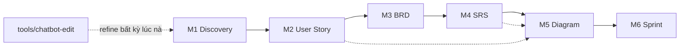

<!--
  Document ID: VISION-BASUPER-1.0
  Date: 2026-06-02
  Version: 1.0
  Status: Draft
  Source: quy hoạch lại theo chuẩn AIPlat (tài liệu vision/positioning là centerpiece). Dựa trên README + master_prompt v1.0 + kinh nghiệm dự án thật MBL (MB Life Insurance).
-->

# BA Super App — Vision & Positioning

> **Một câu:** BA Super App là **bộ "kit" prompt + web app** biến một AI tổng quát thành **Business Analyst cấp cao**, chạy trọn pipeline **Discovery → User Story → BRD → SRS → Diagram → Sprint** với **chuẩn output nhất quán** và **traceability** xuyên suốt.

---

## 1. Vấn đề

Làm tài liệu BA thủ công có 5 nỗi đau:
1. **Chậm & lặp:** mỗi dự án viết lại Discovery/BRD/SRS từ đầu, copy template cũ rồi sửa.
2. **Không nhất quán:** mỗi BA một format, một cách đánh ID, một mức chi tiết → khó review, khó bàn giao.
3. **Đứt traceability:** US không lần được về BRD/SRS/Test → sót yêu cầu, khó đánh giá tác động khi đổi scope.
4. **Chất lượng trồi sụt:** thiếu "cổng" kiểm tra completeness/consistency trước khi phát hành.
5. **Dùng AI rời rạc:** hỏi ChatGPT từng mẩu, mất ngữ cảnh, output không theo chuẩn doanh nghiệp.

---

## 2. Giải pháp — "Super BA" có kỷ luật

BA Super App đóng gói **kinh nghiệm BA + chuẩn tài liệu** thành một hệ thống prompt có cấu trúc, để AI:
- **Hỏi đúng** (Socratic, có option + default) thay vì đoán bừa ở bước Discovery.
- **Sinh đúng chuẩn** (YAML header, ID convention, Given/When/Then, Mermaid) — mọi dự án ra cùng một "khuôn".
- **Giữ traceability** US → BRD-REQ → SRS-FR → TC tự động.
- **Tự kiểm** qua Quality Gates sau mỗi phase (completeness/consistency/traceability/feasibility).
- **Refine hội thoại** — sửa bất kỳ phần nào qua lệnh, không phá vỡ liên kết.

---

## 3. Hai hình hài (cùng một lõi)

| | **Framework Kit** (`01-framework`) | **Web App** (`02-web-app`) |
|---|---|---|
| Là gì | Bộ prompt standalone | Công cụ chạy có UI |
| Dùng thế nào | Copy `master_prompt` vào ChatGPT/Claude/Gemini, hoặc gọi `/ba` trong IDE | Mở dashboard → workspace → nạp dữ liệu → chạy pipeline |
| Ưu thế | Linh hoạt, không phụ thuộc hạ tầng | Trực quan, lưu project (localStorage), quản lý nhiều dự án |
| Trạng thái | ~60% (đang viết lại sâu) | prototype (Phase 1 xong, Phase 2 dở) |

> Framework là **nguồn chân lý**; Web App là **một cách tiêu thụ**. Cải tiến framework → web app kế thừa.

---

## 4. USP (khác gì dùng ChatGPT trần?)

1. **Pipeline có phase + auto-detect** — AI tự biết đang ở Discovery hay SRS để load đúng "bộ não".
2. **Chuẩn output doanh nghiệp** — không phải văn AI chung chung; có ID, header, AC, diagram, version history.
3. **Traceability + Quality Gates tích hợp** — đối thủ (prompt lẻ) không có.
4. **Domain-adaptive** — banking/insurance/fintech/ecommerce/saas/healthcare/game qua biến, không hardcode.
5. **Dựa trên dự án thật** — chắt lọc từ MBL (~195 tài liệu, 9 module) chứ không lý thuyết.

---

## 5. Đối tượng & domain

- **Người dùng:** Business Analyst, Product Owner, Solution Consultant, team delivery.
- **Domain hỗ trợ:** Banking & Finance · Insurance · Fintech · E-commerce · SaaS/Platform · Healthcare · Game.
- **Quy mô tối ưu:** dự án vừa (≈15–60 user story) — cấu hình ở `master_prompt` (`target_scale`).

---

## 6. Pipeline (lõi giá trị)

---

## 7. Roadmap

| Giai đoạn | Mục tiêu |
|---|---|
| **Now (v1.x)** | Reorg theo chuẩn AIPlat + viết lại sâu framework (prompt-master) + governance + doc-index |
| **Next** | Web-app hoàn tất Quality Gates (Phase 2) + render Mermaid + nối AI thật (ChatGPT/Claude API) |
| **Later** | `04-outputs` tự động lưu deliverable; export Word/PDF; traceability matrix trực quan; thư viện template theo domain |

---

## 8. Không làm (drop-list, để giữ trọng tâm)

- ❌ Không thay thế công cụ quản lý dự án (Jira/Azure DevOps) — chỉ sinh tài liệu, có thể export sang.
- ❌ Không tự ý "chốt" yêu cầu — luôn để con người xác nhận (Socratic + confirm).
- ❌ Không hardcode một domain — mọi thứ qua biến `[DOMAIN]/[USER_TYPE]/[SYSTEM]/[COMPLIANCE]`.
- ❌ (MVP) Chưa làm backend/đa người dùng/đồng bộ cloud — web app là client-side localStorage.

---

*vision.md v1.0 — định vị BA Super App: prompt-kit + web-app sinh tài liệu BA chuẩn hoá, có traceability & quality gates, domain-adaptive.*
