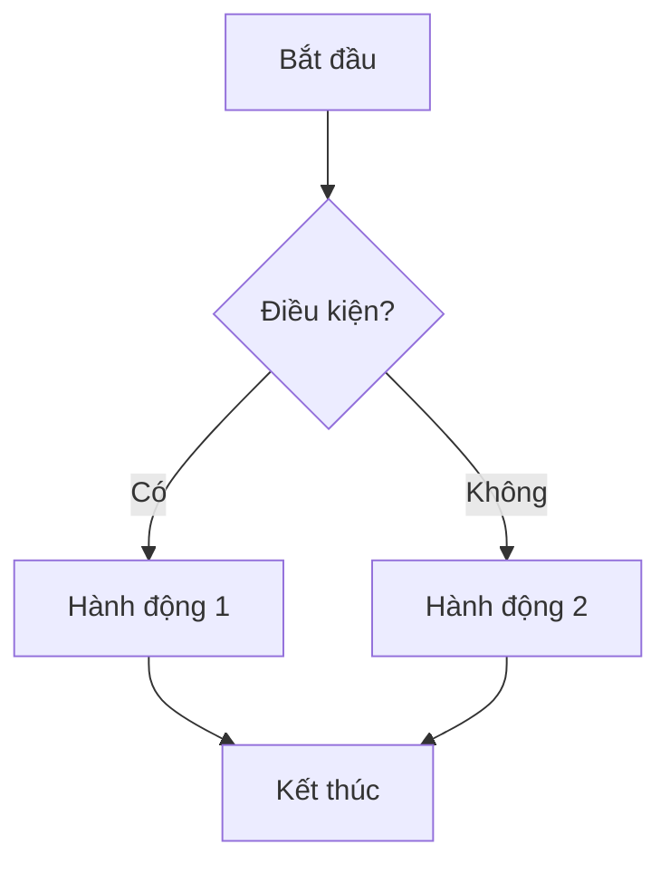
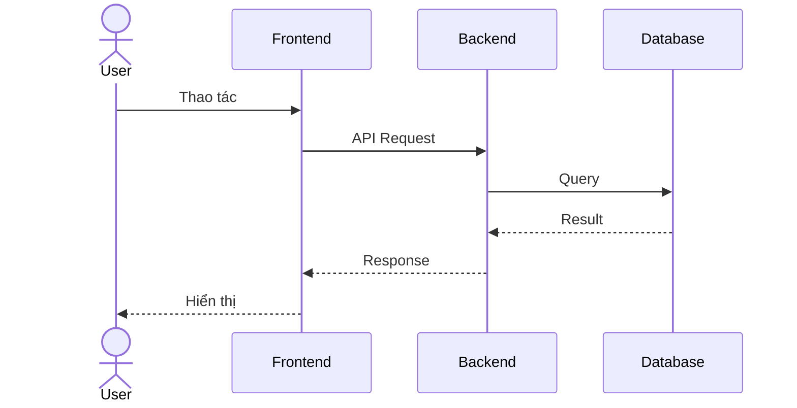
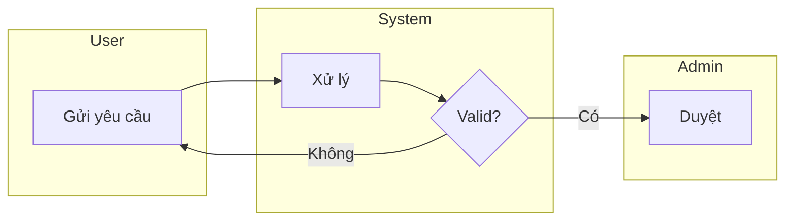

# 📏 Output Standard — Chuẩn Format Output

---

## Nguyên tắc chung

1. **Ngôn ngữ**: Tiếng Việt. Thuật ngữ kỹ thuật giữ nguyên tiếng Anh.
2. **Format**: Markdown (.md)
3. **Diagram**: Mermaid code blocks (render-ready)
4. **Structure**: Heading hierarchy (H1 → H2 → H3), không skip level

---

## Document Header (BẮT BUỘC)

Mọi document output PHẢI có YAML frontmatter:

```yaml
---
project: "[PROJECT_NAME]"
document_type: "[BRD|SRS|US|SPRINT|DISCOVERY]"
version: "1.0"
date: "[YYYY-MM-DD]"
author: "BA Super App"
status: "[draft|review|approved]"
---
```

---

## Cấu trúc Section

### Heading Rules
```
# H1 — Tên document (1 duy nhất)
## H2 — Section chính
### H3 — Sub-section
#### H4 — Chi tiết (dùng ít)
```

### Content Rules

| Loại nội dung | Format |
|---------------|--------|
| Danh sách features | Bullet points (`-`) |
| So sánh/phân tích | Table |
| Quy trình | Mermaid flowchart hoặc numbered list |
| Yêu cầu chi tiết | Numbered list với ID |
| Acceptance Criteria | Given/When/Then format |
| Trạng thái | Emoji indicators (✅🔄⏳❌⚠️) |

---

## ID Convention

| Loại | Format | Ví dụ |
|------|--------|-------|
| User Story | `US-[MODULE]-[###]` | US-SALES-001 |
| Epic | `EP-[MODULE]-[###]` | EP-SALES-001 |
| BRD Requirement | `BRD-REQ-[###]` | BRD-REQ-001 |
| SRS Functional | `SRS-FR-[###]` | SRS-FR-001 |
| SRS Non-functional | `SRS-NFR-[###]` | SRS-NFR-001 |
| Test Case | `TC-[###]` | TC-001 |
| Diagram | `DG-[TYPE]-[###]` | DG-BPMN-001 |
| Sprint | `SP-[###]` | SP-001 |

---

## User Story Format

```markdown
### US-[MODULE]-[###]: [Tiêu đề ngắn]

**As a** [user type]
**I want** [chức năng]
**So that** [giá trị/lợi ích]

**Acceptance Criteria:**

- **AC1:** Given [context], When [action], Then [result]
- **AC2:** Given [context], When [action], Then [result]

**Priority:** [Must|Should|Could|Won't]
**Story Points:** [1|2|3|5|8|13]
**Module:** [Module name]
```

---

## Acceptance Criteria Format

LUÔN dùng Given/When/Then:

```
Given [precondition - trạng thái ban đầu]
When  [action - hành động của user]
Then  [expected result - kết quả mong đợi]
```

Ví dụ:
```
Given user đã đăng nhập và ở trang Dashboard
When  user click nút "Tạo đơn hàng mới"
Then  hệ thống hiển thị form tạo đơn hàng với các trường bắt buộc được đánh dấu (*)
```

---

## Table Format

```markdown
| Column 1 | Column 2 | Column 3 |
|----------|----------|----------|
| Data     | Data     | Data     |
```

- Header row LUÔN bold (markdown tự bold)
- Align: left cho text, center cho status/number
- Không quá 6 columns (khó đọc)

---

## Mermaid Diagram Standards

### Flowchart


### Sequence Diagram


### BPMN-style (Swimlane)


---

## Priority Labels

| Label | Ý nghĩa | Màu |
|-------|---------|-----|
| 🔴 Must | Bắt buộc có (MVP) | Red |
| 🟡 Should | Nên có (v1.1) | Yellow |
| 🟢 Could | Có thể có (v2.0) | Green |
| ⚪ Won't | Không làm (out of scope) | Gray |

---

## Version Control

Mỗi document có version history ở cuối:

```markdown
## Lịch sử thay đổi

| Version | Ngày | Thay đổi | Người |
|---------|------|----------|-------|
| 1.0 | 2026-05-26 | Khởi tạo | BA Super App |
| 1.1 | 2026-05-27 | Cập nhật AC cho US-001 | [User] |
```
