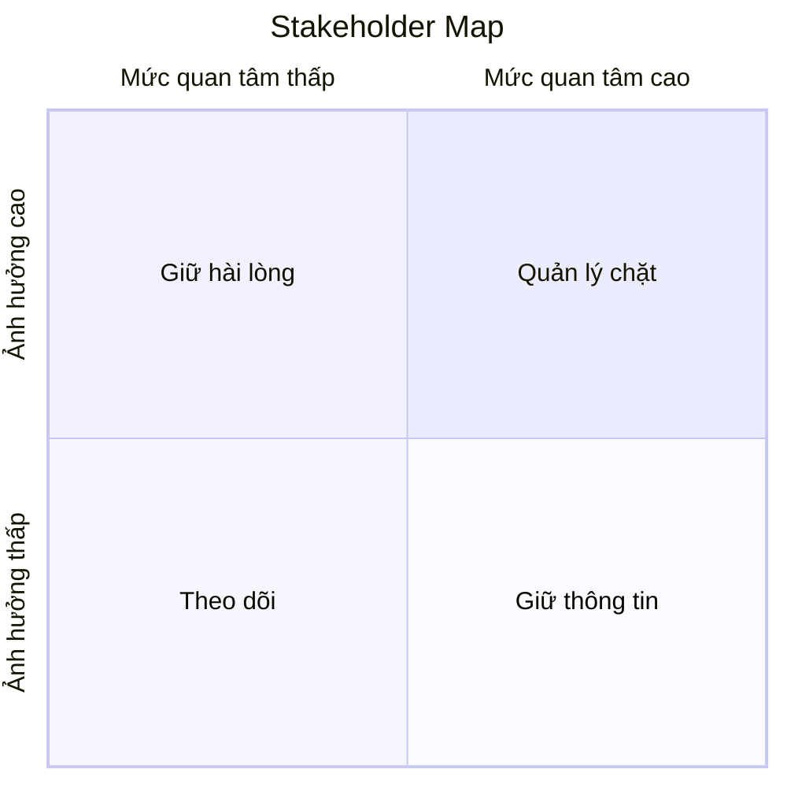

# 👥 Stakeholder Map — Template

---

## RACI Matrix

| Activity | [Stakeholder 1] | [Stakeholder 2] | [Stakeholder 3] | [Stakeholder 4] |
|----------|:---:|:---:|:---:|:---:|
| Phê duyệt yêu cầu | A | R | C | I |
| Review BRD | C | R | A | I |
| Review SRS | I | R | C | A |
| Phê duyệt design | A | C | R | I |
| UAT sign-off | A | R | C | I |

> **R** = Responsible (Thực hiện) | **A** = Accountable (Phê duyệt) | **C** = Consulted (Tham vấn) | **I** = Informed (Thông báo)

---

## Influence/Interest Grid

| Quadrant | Chiến lược | Stakeholder |
|----------|-----------|-------------|
| Quản lý chặt (High/High) | Giao tiếp thường xuyên, involve trong decisions | [Names] |
| Giữ hài lòng (High/Low) | Update định kỳ, escalate khi cần | [Names] |
| Giữ thông tin (Low/High) | Thông báo progress, collect feedback | [Names] |
| Theo dõi (Low/Low) | Minimal communication | [Names] |

---

## Communication Plan

| Stakeholder | Kênh | Tần suất | Nội dung |
|-------------|------|----------|----------|
| Product Owner | Meeting + Email | Hàng tuần | Sprint review, blockers |
| Dev Lead | Daily standup + Chat | Hàng ngày | Task status, technical Q&A |
| End Users | Workshop + Survey | Bi-weekly | UAT feedback, requirements |
| Sponsor | Report + Meeting | Monthly | Progress, risks, budget |
