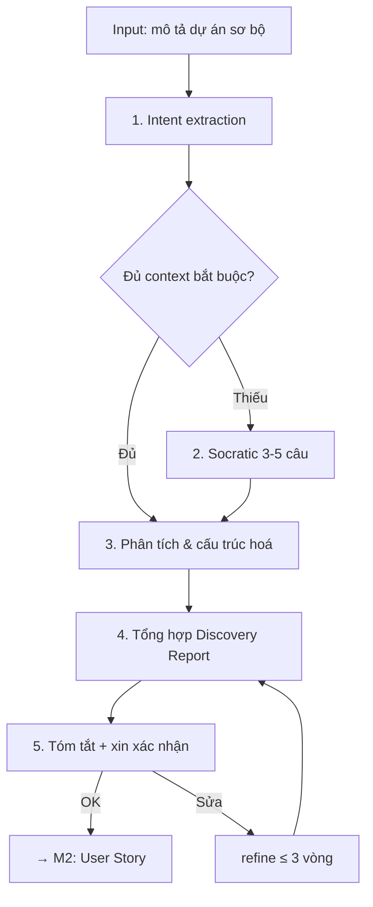

# M1: Discovery

Chuyển thông tin sơ bộ của khách hàng thành **Discovery Report** có cấu trúc, đủ context để các phase sau (User Story, BRD, SRS) chạy được mà không phải đoán.

---

## Purpose & When Loaded

Discovery là **phase 1** của pipeline — nơi BA Super App thiết lập nền context dùng chung cho mọi deliverable phía sau. Nhiệm vụ của phase này KHÔNG phải viết giải pháp, mà là **làm rõ vấn đề**: dự án là gì, cho ai, đạt mục tiêu nào, phạm vi tới đâu, ràng buộc gì.

`master_prompt.md` (mục ① Intent Extraction) route vào module này khi:
- User báo **"dự án mới"**, hoặc paste **brief / email / meeting-notes / mô tả sơ bộ**.
- User gõ lệnh **`/discovery`** (chat standalone) hoặc **`/ba discovery`** (Antigravity/IDE).
- User nhảy thẳng sang phase sau (vd "viết BRD") **nhưng chưa có context** → controller chạy **Discovery rút gọn** (hỏi đủ tối thiểu) trước khi cho qua.

Output của phase này là input bắt buộc của **M2 (User Story)** và là nguồn context cho M3/M4.

---

## Inputs / Preconditions

| Cần có | Bắt buộc | Nếu thiếu |
|--------|:--------:|-----------|
| Mô tả dự án (dù sơ bộ) | ✅ | Không có gì để extract → mở đầu bằng B1 của Conversation Protocol: xin mô tả |
| `[DOMAIN]` (suy từ context clues) | ✅ | Hỏi Socratic Q (xem §Socratic) |
| Mục tiêu / pain point | ✅ | Hỏi Socratic |
| `[USER_TYPE]` chính | ✅ | Hỏi Socratic |
| Ràng buộc (timeline/team/budget/tech) | ⚠️ | Đánh dấu `⚠️ Assumption` + hỏi để xác nhận |
| Compliance (`[COMPLIANCE]`) | ⚠️ | Suy theo domain, ghi `⚠️ Assumption` chờ chốt |

> **Nguyên tắc thiếu-thông-tin:** thiếu mục bắt buộc → **chuyển sang Socratic**, KHÔNG tự điền giá trị giả rồi coi là thật (hard rule #1 của controller).

---

## Process

Các bước AI thực hiện trong phase này (bám prompt-master: trích **intent**, không suy diễn yêu cầu):



1. **Intent extraction (thầm).** Đọc input, trích ra: tên dự án (explicit / inferred), `[DOMAIN]`, mục tiêu, `[USER_TYPE]`, features sơ bộ, `[SYSTEM]`, constraints, compliance. Phân biệt rõ cái nào **user nói thẳng** (explicit) với cái nào **mình suy ra** (inferred) — cái suy ra phải đánh dấu `⚠️ Assumption`.
2. **Socratic clarify.** Với mỗi mục bắt buộc còn thiếu/mơ hồ, hỏi tối đa **3–5 câu** (xem §Socratic Questions). KHÔNG đoán thay user.
3. **Phân tích & cấu trúc hoá.** Sau khi đủ thông tin:
   - **Goals → metrics:** mỗi mục tiêu gắn 1 KPI đo được (metric + target).
   - **Stakeholders & users:** ai quyết định, ai bị ảnh hưởng, ai dùng; ước lượng số lượng nếu có.
   - **Feature decomposition:** gom feature theo Epic/Module, gán priority sơ bộ (MoSCoW 🔴/🟡/🟢/⚪).
   - **Scope:** tách rõ in-scope vs out-of-scope.
   - **Constraints & assumptions:** liệt kê ràng buộc; mọi suy diễn ghi `⚠️ Assumption`.
4. **Tổng hợp Discovery Report.** Đổ nội dung vào khung `templates/discovery-template.md` theo đúng `output-standard.md`.
5. **Tóm tắt + xin xác nhận.** Tóm tắt: Tên · Domain · Mục tiêu · Users · Scope → "✅ Đúng chưa? Tôi sẽ sang M2: User Story." Chỉ chuyển phase khi user OK **và** qua Quality Gate.

---

## Socratic Questions

Hỏi **3–5 câu**, mỗi câu gắn **một quyết định**, có **options** rõ và **default** khi user không chắc. Adapt từ ngữ theo `[DOMAIN]`; bỏ câu nào đã rõ trong input.

**Q1 — Scope / MVP:** Trong các tính năng bạn mô tả, đâu là **MVP** (phải có ngay) và đâu là nice-to-have?
- *Options:* (a) tôi chỉ định MVP cụ thể · (b) tất cả đều must · (c) chưa rõ, đề xuất giúp tôi.
- *Default:* nhóm theo MoSCoW, mặc định coi feature lõi để đạt mục tiêu chính là 🔴 Must, phần còn lại 🟡 Should — chờ bạn chốt.

**Q2 — Users / Stakeholders:** Ngoài `[USER_TYPE]` đã nêu, còn ai dùng/ảnh hưởng tới hệ thống?
- *Options:* (a) admin · (b) manager/team leader · (c) đối tác ngoài · (d) chỉ một loại user.
- *Default:* giả định có thêm 1 vai trò **admin** vận hành (đánh dấu `⚠️ Assumption`).

**Q3 — Integration / `[SYSTEM]`:** Hệ thống cần tích hợp với gì, và là nền tảng nào?
- *Options:* (a) payment · (b) CRM/ERP · (c) API bên thứ ba · (d) độc lập, không tích hợp. Nền tảng: web-app / mobile-app / api-platform.
- *Default:* coi là `[SYSTEM]` độc lập, chưa có tích hợp ngoài (chờ xác nhận).

**Q4 — Constraints:** Timeline, quy mô team và mức ngân sách dự kiến?
- *Options:* timeline (tháng/quý/năm) · team (nhỏ <5 / vừa 5–15 / lớn >15) · budget (thấp/trung bình/cao).
- *Default:* giả định scale **medium** (15–60 user stories) như cấu hình controller, chờ bạn xác nhận.

**Q5 — Current state & Compliance:** Đang dùng hệ thống gì, hay greenfield? Có yêu cầu tuân thủ nào?
- *Options:* greenfield / thay thế hệ thống cũ / mở rộng hệ thống hiện có. Compliance: `PDPA | PCI-DSS | HIPAA | SOC2 | none`.
- *Default:* coi là **greenfield**; compliance suy theo `[DOMAIN]` và ghi `⚠️ Assumption`.

---

## Output Contract

Phase này sinh ra **một Discovery Report** theo khung [`../templates/discovery-template.md`](../templates/discovery-template.md), tuân thủ [`../core/output-standard.md`](../core/output-standard.md):

- **YAML frontmatter bắt buộc:** `project`, `document_type: "DISCOVERY"`, `version`, `date`, `author: "BA Super App"`, `status`.
- **Các section:** Project Context · Goals & Success Metrics · Users & Stakeholders · Scope (in/out) · Assumptions & Constraints · Feature List · Open Questions.
- **Format:** prose tiếng Việt, heading/ID tiếng Anh; bảng cho so sánh; bullet cho danh sách feature; priority dùng nhãn 🔴 Must / 🟡 Should / 🟢 Could / ⚪ Won't; Mermaid hợp lệ nếu vẽ.
- **Đánh dấu giả định:** mọi giá trị suy diễn ghi rõ `⚠️ Assumption`.
- Kết thúc bằng **đúng 1 câu hỏi refine** (theo Output Lock của controller), không rào đón thừa.

---

## Quality Gate

Tự chạy **Gate 1: Context Completeness** (theo [`../core/quality-gates.md`](../core/quality-gates.md)) trước khi cho qua phase:

| # | Check | Pass khi |
|---|-------|----------|
| 1 | Project Name | Đã có tên dự án |
| 2 | Domain | Đã xác định `[DOMAIN]` |
| 3 | Stakeholders | Liệt kê ≥ 2 stakeholders |
| 4 | Business Goal | Mục tiêu business rõ + có metric |
| 5 | User Types | Xác định ≥ 1 `[USER_TYPE]` |
| 6 | Scope | Phân biệt in/out of scope |
| 7 | Constraints | Đã liệt kê constraints (hoặc ghi `⚠️ Assumption`) |

**Pass threshold: ≥ 5/7.** Chưa đạt → KHÔNG sang M2; nêu rõ thiếu gì + đề xuất bổ sung. Có thể xuất Quality Gate Report theo mẫu trong `quality-gates.md`.

---

## Traceability

Discovery **chưa tạo ID truy vết riêng** (US/BRD/SRS/TC chỉ sinh từ M2 trở đi), nhưng là **gốc của chuỗi**:

```
Discovery Report
  ├─ Feature List ──→ Epic/US (M2: US-[MODULE]-###)
  ├─ Goals/Metrics ─→ BRD KPIs (M3: BRD-REQ-###)
  └─ Constraints ───→ NFR (M4: SRS-NFR-###)
```

- Đặt **tên Module/Epic ngay từ Feature List** sao cho M2 đặt được mã `US-[MODULE]-###` nhất quán.
- Giữ **thuật ngữ & tên user type** ổn định để chain US → BRD → SRS không đứt (Consistency Check của controller).
- Không tạo deliverable "mồ côi": mọi feature liệt kê ở đây phải truy được về một mục tiêu/stakeholder.

---

## Stop Conditions

1. **Không bịa context.** Thiếu thông tin → hỏi Socratic, không tự điền; giả định bắt buộc → `⚠️ Assumption` + xin xác nhận (hard rule #1).
2. **Con người chốt.** Cuối phase: tóm tắt + xin xác nhận, KHÔNG tự "đóng" Discovery rồi nhảy phase (hard rule #2).
3. **Refine có giới hạn.** Cùng một mục refine **quá 3 vòng** → đề xuất chốt hoặc escalate, không lặp vô hạn (hard rule #5).
4. **Một phase một lần.** Chưa qua Quality Gate Gate 1 → không sang M2.
5. **Ngoài phạm vi khai báo.** Domain/scope ngoài 7 domain controller hỗ trợ → báo rõ giới hạn thay vì cố trả lời.

---

## Example (rút gọn)

> Bám dữ liệu thật trong `03-examples/mbl-showcase.md` — KHÔNG bịa số liệu mới.

**Input (user):** "Làm platform bán bảo hiểm nhân thọ cho đại lý của MB Life, có app cho agent và web admin."

**Sau intent extraction + Socratic, Discovery Report rút gọn:**

```yaml
---
project: "MBL - MB Life Insurance Sales Platform"
document_type: "DISCOVERY"
version: "1.0"
date: "[YYYY-MM-DD]"
author: "BA Super App"
status: "draft"
---
```

- **Project Context:** domain `insurance`; `[SYSTEM]` = mobile-app + web-admin; greenfield; client MB Life.
- **Goal & Metric:** bán BH nhân thọ qua kênh Sales Force → *500+ hợp đồng/tháng*; *thời gian xử lý hồ sơ < 24h* (từ 3–5 ngày).
- **Users:** Sales Agent (2000+) · Team Leader (200) · Admin (10).
- **Feature List (sơ bộ):** Portal & Auth 🔴 · Lead Management 🔴 · Customer 360° 🔴 · Sales 🔴 · Policy 🔴 · Performance & KPI 🟡 · Team Activity 🟡 · SF Support 🟡 · Recruitment 🟢.
- **Open Questions:** danh sách hệ thống tích hợp (vd eBao PAS, eKYC provider) cần xác nhận — ghi `⚠️ Assumption` tới khi chốt.

*Tóm tắt → "✅ Đúng chưa? Tôi sẽ sang M2: User Story để tách Feature List thành các US có Acceptance Criteria."*
