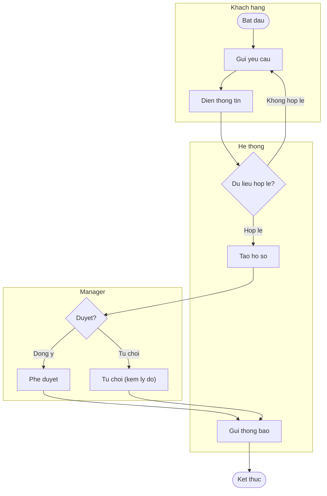
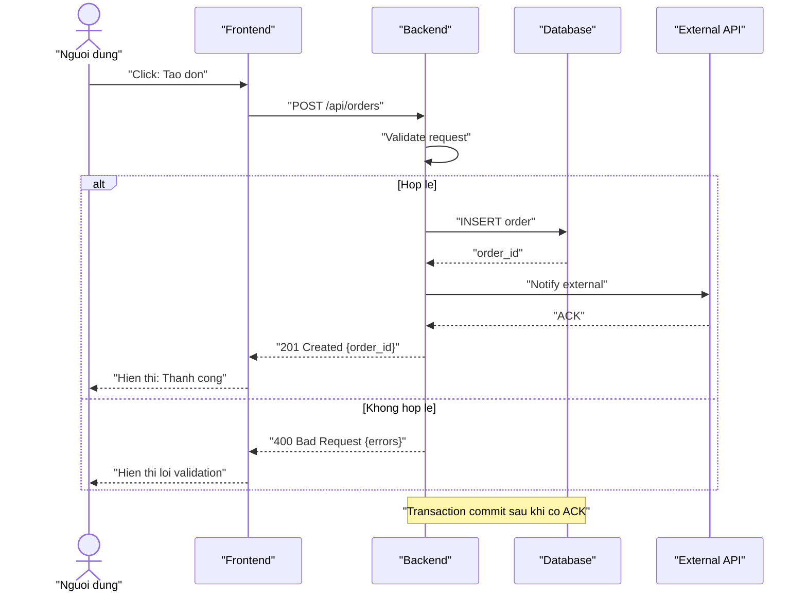
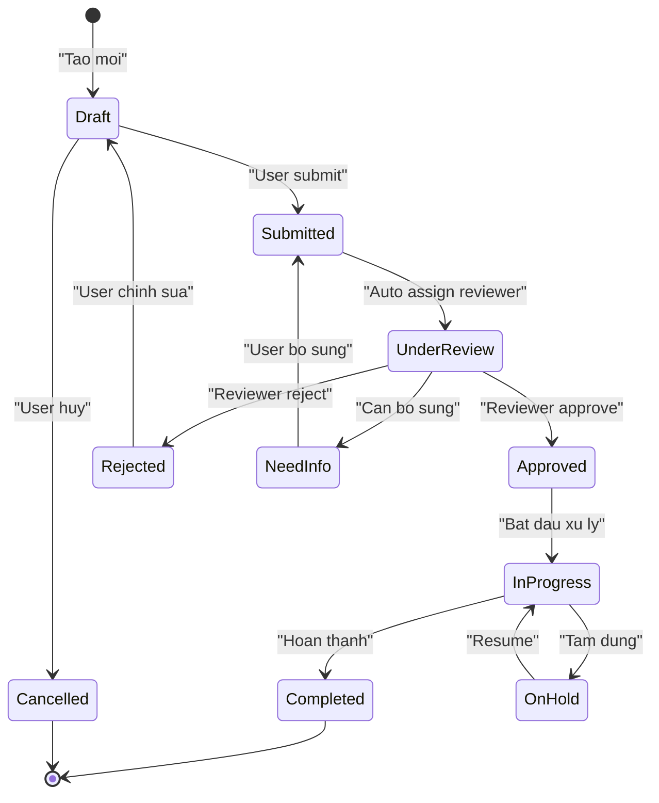
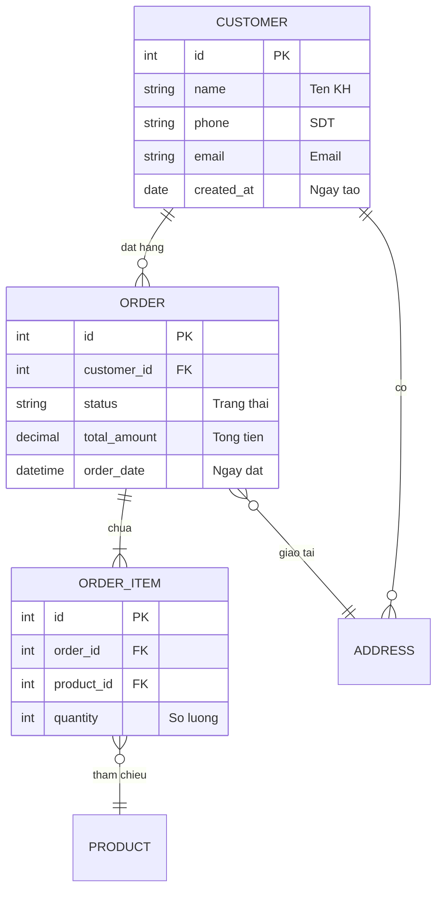
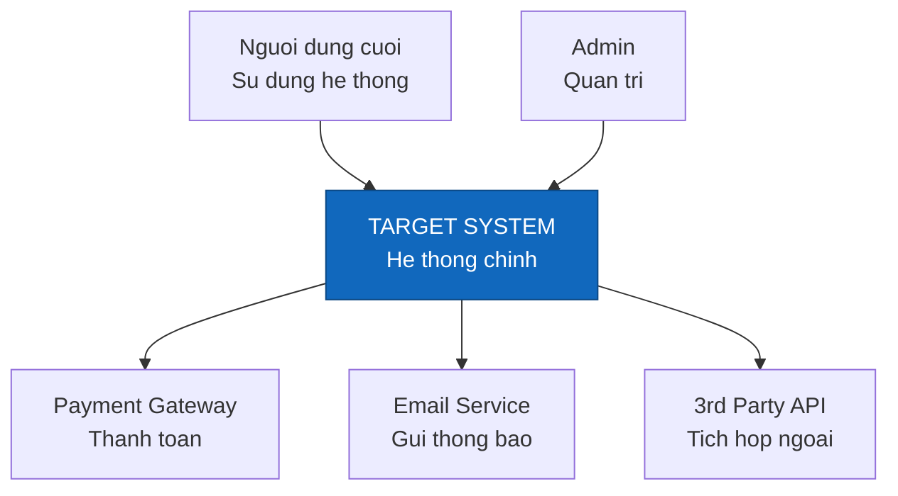
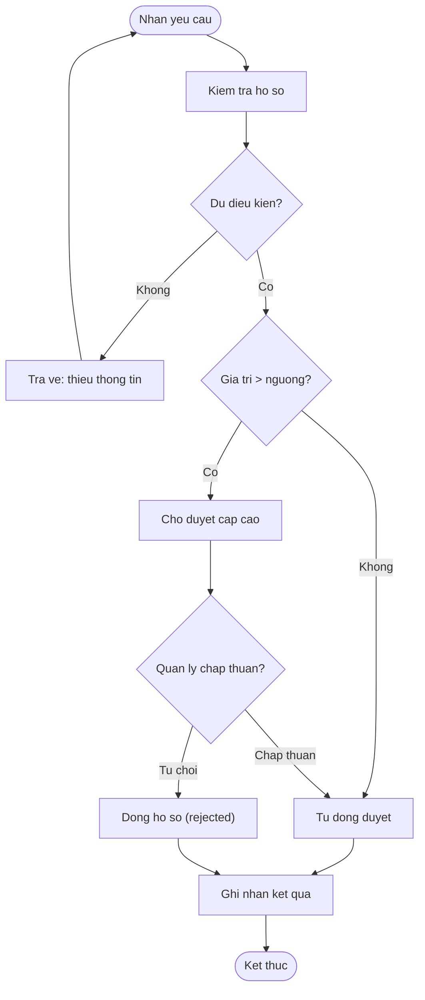
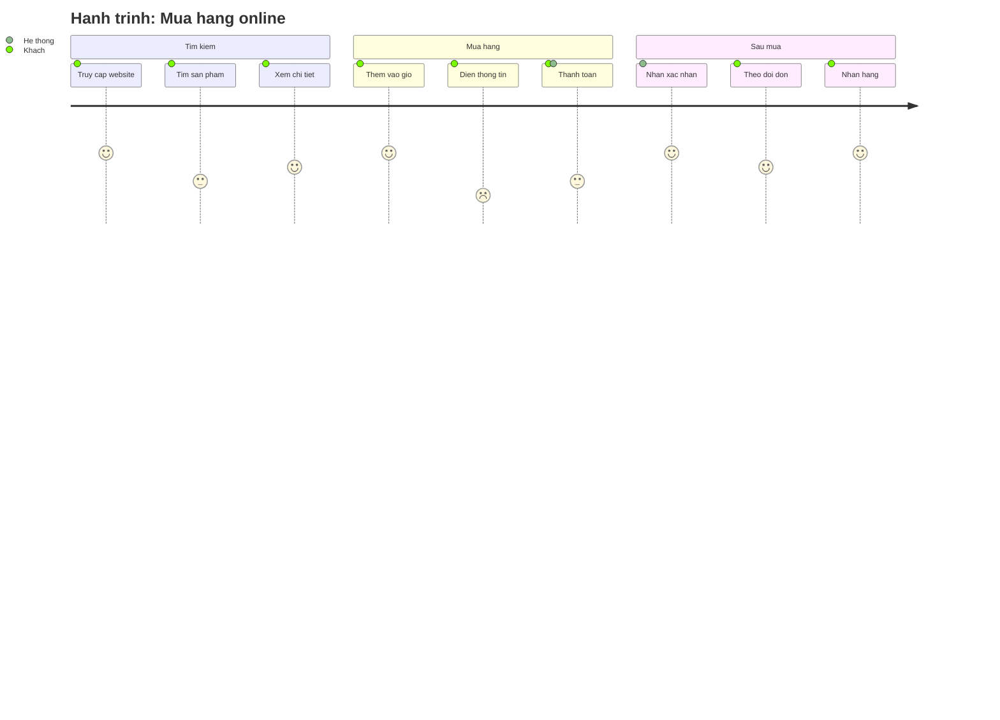
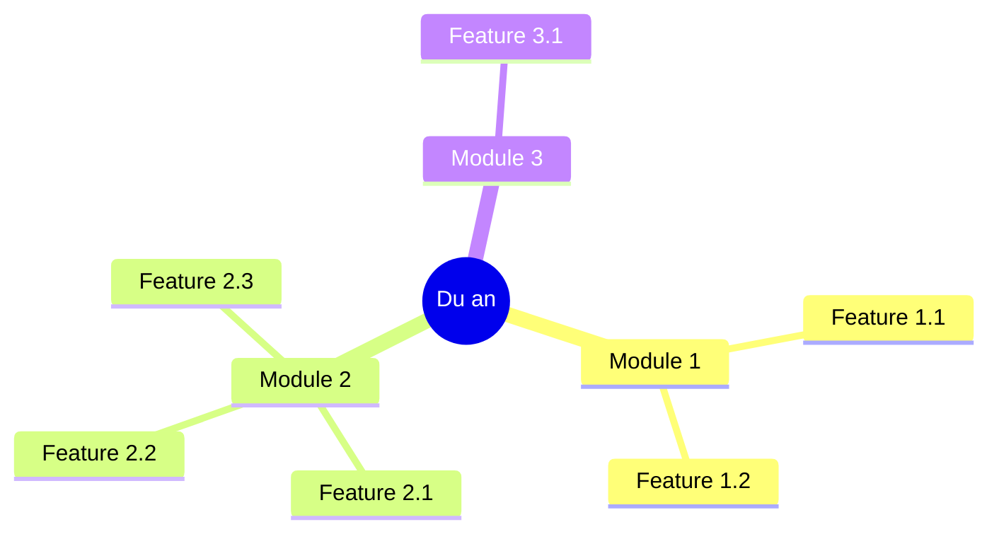

# Diagram Catalog — Thư viện mẫu Mermaid (render-ready)

> 8 mẫu Mermaid **dán-là-chạy** cho M5. Mỗi mẫu có 1 dòng *"Khi nào dùng"*, mẫu code, và *Conventions*. Khi sinh diagram thật: copy mẫu → thay nội dung → **giữ nguyên quy tắc quote nhãn**. Nhắc lại luật cứng:
> - **Quote mọi nhãn** chứa `/ : ( ) { } > , " ' #` hoặc dấu cách + ký tự đặc biệt: `A["Tao don (moi)"]`, `B{"Hop le?"}`.
> - **erDiagram:** token *type* + *tên cột* KHÔNG ngoặc; chỉ *comment* sau tên cột mới quote: `string email "Email"`.
> - Emoji chỉ đặt *trong* nhãn (đã quote nếu kèm ký tự đặc biệt), không đặt ở ID node.
> - Mục tiêu ≤ ~15 node/sơ đồ; lớn hơn → tách.

Mục lục: [1. BPMN/Swimlane](#1-bpmn--swimlane) · [2. Sequence](#2-sequence) · [3. State machine](#3-state-machine) · [4. ERD](#4-erd) · [5. C4 Context](#5-c4-context) · [6. Activity](#6-activity) · [7. User Journey](#7-user-journey) · [8. Mindmap](#8-mindmap)

---

## 1. BPMN / Swimlane

**Khi nào dùng:** mô tả quy trình nghiệp vụ nhiều vai trò, làm rõ *ai* làm *bước nào* và bàn giao giữa các bên.

**Conventions:** mỗi `subgraph` = 1 swimlane (1 vai trò/hệ thống). Quyết định = `{"..."}`; start/end = `(["..."])`; nhãn cạnh trên mũi tên `-->|"..."|`. ID node (A, B, D…) viết liền, không dấu cách.

---

## 2. Sequence

**Khi nào dùng:** mô tả các thành phần *trao đổi thông điệp gì theo thời gian* — API flow, tích hợp FE↔BE↔DB↔3rd-party.

**Conventions:** `actor` = người thật, `participant` = component. `->>` = request (liền), `-->>` = response (đứt). `alt/else` = rẽ nhánh, `loop` = lặp, `Note over A,B:` = ghi chú. Nội dung sau `:` chứa `/ ( ) {}` → **quote**.

---

## 3. State machine

**Khi nào dùng:** mô tả *vòng đời/các trạng thái* của một đối tượng (đơn, ticket, tài khoản) và sự kiện chuyển trạng thái.

**Conventions:** tên state viết liền (`UnderReview`, `NeedInfo`) — KHÔNG dấu cách. `[*]` = start/end. Nhãn sự kiện đặt sau `:` và quote nếu có ký tự đặc biệt. Mỗi state nên có đường vào và (trừ trạng thái cuối) đường ra.

---

## 4. ERD

**Khi nào dùng:** mô tả *mô hình dữ liệu* — thực thể, thuộc tính, quan hệ và lực lượng (cardinality).

**Conventions (quan trọng):** trong block thuộc tính, cú pháp là `type name PK|FK "comment"`. **type và name KHÔNG ngoặc kép**; chỉ *comment* mới quote. Cardinality: `||` đúng-một, `o{` không-hoặc-nhiều, `|{` một-hoặc-nhiều. Nhãn quan hệ sau `:` luôn quote.

---

## 5. C4 Context

**Khi nào dùng:** tổng quan kiến trúc cấp cao — hệ thống đích nằm trong *bối cảnh* nào, nói chuyện với *ai* và *hệ thống ngoài* nào.

**Conventions:** node giữa = hệ thống đích (tô màu nổi bật bằng `style`). Người dùng/hệ thống ngoài trỏ vào hoặc ra theo *chiều phụ thuộc*. Xuống dòng trong nhãn dùng ` ` (nhãn phải quote vì chứa `<` `>`). Đây là C4 *Context* — chỉ vẽ ranh giới ngoài, không vẽ nội bộ container.

---

## 6. Activity

**Khi nào dùng:** mô tả *logic xử lý* có nhiều điểm quyết định, khi quan tâm dòng công việc hơn là "ai làm".

**Conventions:** giống flowchart nhưng nhấn các *gate quyết định* `{"..."}` lồng nhau. Mỗi quyết định ≥ 2 lối ra có nhãn. Start/end `(["..."])`. Khác BPMN ở chỗ KHÔNG chia swimlane theo vai trò.

---

## 7. User Journey

**Khi nào dùng:** phân tích *trải nghiệm người dùng theo từng giai đoạn*, định vị điểm hài lòng/điểm đau (score 1–5).

**Conventions:** cú pháp `Ten buoc: <score 1-5>: <actor1>, <actor2>`. **Không** quote ở journey (Mermaid journey không hỗ trợ ngoặc kép trong tên bước) → giữ nhãn đơn giản, tránh `: ( ) ,` trong *tên bước*. Score thấp = điểm đau cần cải thiện.

---

## 8. Mindmap

**Khi nào dùng:** brainstorm / phân rã một concept (feature breakdown, cây phạm vi) thành nhiều cấp.

**Conventions:** thụt lề = cấp phân rã (2 space mỗi cấp). Node gốc bọc `(("..."))`. Tránh ký tự đặc biệt trong nhãn mindmap; nếu cần ký tự lạ thì bọc nhãn trong ngoặc kép `["..."]`. Dùng cho ý tưởng/cấu trúc, không cho luồng tuần tự.

---

## Bảng tra nhanh — mẫu nào cho việc gì

| Cần thể hiện | Dùng mẫu |
|--------------|----------|
| Ai làm bước nào (nhiều vai trò) | #1 BPMN/Swimlane |
| Thông điệp giữa các hệ thống theo thời gian | #2 Sequence |
| Các trạng thái của một đối tượng | #3 State machine |
| Thực thể & quan hệ dữ liệu | #4 ERD |
| Bối cảnh kiến trúc cấp cao | #5 C4 Context |
| Logic rẽ nhánh (không cần vai trò) | #6 Activity |
| Trải nghiệm người dùng theo giai đoạn | #7 User Journey |
| Phân rã ý tưởng/phạm vi | #8 Mindmap |
