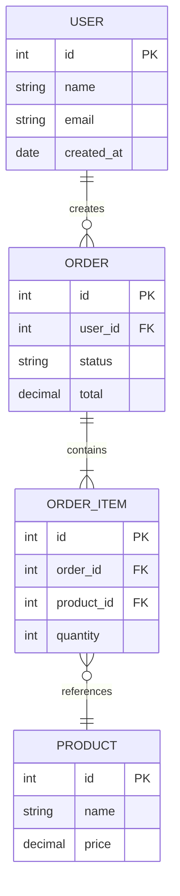
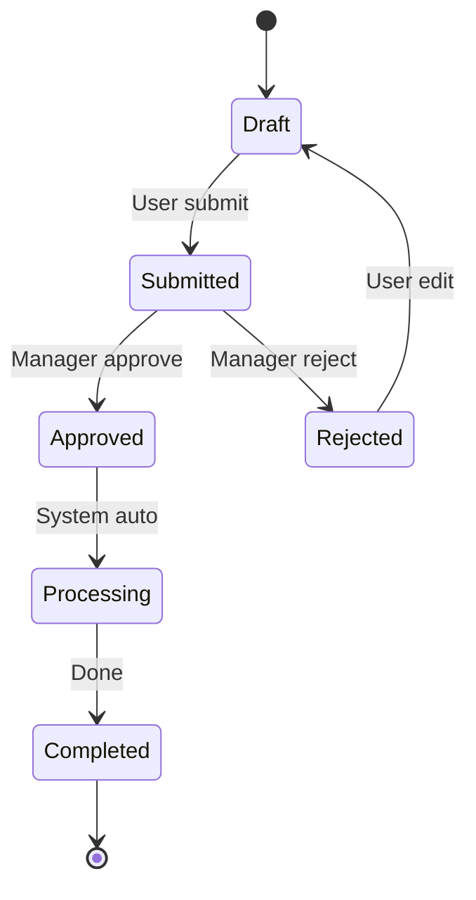

# SRS — [PROJECT_NAME]

> Software Requirements Specification cho domain **[DOMAIN]**, hệ thống **[SYSTEM]**.
> Mọi `[...]` là placeholder cần điền. Mọi `SRS-FR` phải có **Source** truy về `BRD-REQ`/`US`.

---

## 1. Giới thiệu

### 1.1 Mục đích
Tài liệu đặc tả kỹ thuật cho dự án **[PROJECT_NAME]** — chuyển yêu cầu nghiệp vụ (BRD) thành đặc tả để Dev/QA triển khai và kiểm thử.

### 1.2 Phạm vi
[Tóm tắt scope kỹ thuật, bám in-scope của BRD: module/hệ thống nào được đặc tả ở đây.]

### 1.3 Thuật ngữ (Glossary)

| Thuật ngữ | Giải nghĩa |
|-----------|------------|
| [Term] | [Definition] |
| [Acronym] | [Mở rộng + ý nghĩa] |

### 1.4 Tài liệu tham chiếu

| Tài liệu | Phiên bản | Liên quan |
|----------|-----------|-----------|
| BRD — [PROJECT_NAME] | [v1.0] | Nguồn `BRD-REQ` |
| User Stories — [MODULE] | [v1.0] | Nguồn `US-[MODULE]-###` |

---

## 2. Functional Requirements

> Mỗi yêu cầu chức năng dùng khung dưới. ID: `SRS-FR-[###]`.

### SRS-FR-001: [Tên chức năng]
- **Mô tả:** [Chi tiết kỹ thuật chức năng làm gì]
- **Source:** BRD-REQ-[###], US-[MODULE]-[###]
- **Input:** [Data/action từ user hoặc hệ thống gọi]
- **Process:** [Logic xử lý — các bước, business rule áp dụng]
- **Output:** [Kết quả trả về / trạng thái sau xử lý]
- **Validation Rules:**
  - [Rule 1]
  - [Rule 2]
- **Error Handling:**
  - [Error case 1] → [Response / mã lỗi]
  - [Error case 2] → [Response / mã lỗi]

### SRS-FR-002: [Tên chức năng]
- **Mô tả:** [...]
- **Source:** BRD-REQ-[###], US-[MODULE]-[###]
- **Input:** [...]
- **Process:** [...]
- **Output:** [...]
- **Validation Rules:**
  - [...]
- **Error Handling:**
  - [...] → [...]

<!-- Lặp lại cho mỗi SRS-FR. -->

---

## 3. Non-Functional Requirements

> ID: `SRS-NFR-[###]`. Mỗi mục PHẢI có **con số đo được**.

### 3.1 Performance (SRS-NFR-001)

| Metric | Target |
|--------|--------|
| Response time (API) | < [500]ms (p95) |
| Page load time | < [3]s |
| Concurrent users | [X] users |
| Throughput | [X] req/sec |

### 3.2 Security (SRS-NFR-002)
- **Authentication:** [JWT / OAuth2-OIDC / SSO-SAML / API key]
- **Authorization:** [RBAC / ABAC] — vai trò: [list]
- **Data encryption:** [At-rest: AES-256 / In-transit: TLS 1.2+]
- **PII handling:** [Trường PII + quy tắc masking]
- **Compliance:** [[COMPLIANCE]: PDPA / PCI-DSS / HIPAA / SOC2 / none]

### 3.3 Availability (SRS-NFR-003)
- **Uptime target:** [99.9%]
- **RPO:** [X giờ]
- **RTO:** [X giờ]

### 3.4 Scalability (SRS-NFR-004)
- **Chiến lược:** [Horizontal / Vertical]
- **Expected growth:** [X%/năm hoặc X→Y users trong Z tháng]

---

## 4. Data Model

### 4.1 Entity List

| Entity | Mô tả | Attributes chính | Relationships | Sensitivity |
|--------|-------|------------------|---------------|-------------|
| [Entity] | [Desc] | [attr1 (PK), attr2, …] | [Relations] | [PII / Normal] |

### 4.2 ERD



> Thay `USER/ORDER/...` bằng entity thật của **[DOMAIN]**. Token quan hệ (`||--o{`) không chứa ngoặc; nhãn quan hệ là một từ.

---

## 5. API Specification

> Bỏ section này nếu `[SYSTEM]` không expose API (vd data-pipeline thuần). Path prefix: `/api/v1/`.

### 5.1 API Endpoints

| Method | Endpoint | Mô tả | Auth |
|--------|----------|-------|------|
| POST | /api/v1/[resource] | Tạo mới | Bearer token |
| GET | /api/v1/[resource] | Danh sách (filter/paginate) | Bearer token |
| GET | /api/v1/[resource]/:id | Chi tiết | Bearer token |
| PUT | /api/v1/[resource]/:id | Cập nhật | Bearer token |
| DELETE | /api/v1/[resource]/:id | Xoá | Bearer token |

### 5.2 Request / Response Format

**Request — POST /api/v1/[resource]**
```json
{
  "[field1]": "[value]",
  "[field2]": "[value]"
}
```

**Response — 201 Created**
```json
{
  "id": "[id]",
  "status": "[status]",
  "createdAt": "[YYYY-MM-DDThh:mm:ssZ]"
}
```

**Error — 4xx/5xx**
```json
{
  "error": "[error_code]",
  "message": "[human-readable message]"
}
```

---

## 6. State Machines

> Cho mỗi entity có vòng đời nhiều trạng thái (đơn / hồ sơ / ticket / policy…).

### [Entity] States



> Nhãn transition đặt sau dấu `:`. Liệt kê điều kiện chuyển trạng thái nếu phức tạp.

---

## 7. Integration Points

| System | Protocol | Purpose | Data Flow |
|--------|----------|---------|-----------|
| [System] | [REST / Kafka / SFTP / gRPC] | [Mục đích tích hợp] | [In / Out / Both] |

---

## 8. Traceability

| SRS-FR | BRD-REQ | US | TC |
|--------|---------|-----|----|
| SRS-FR-001 | BRD-REQ-001 | US-[MODULE]-001 | TC-001 |
| SRS-FR-002 | BRD-REQ-002 | US-[MODULE]-002 | TC-002 |

---

## Lịch sử thay đổi

| Version | Ngày | Thay đổi | Người |
|---------|------|----------|-------|
| 1.0 | [YYYY-MM-DD] | Khởi tạo | BA Super App |
