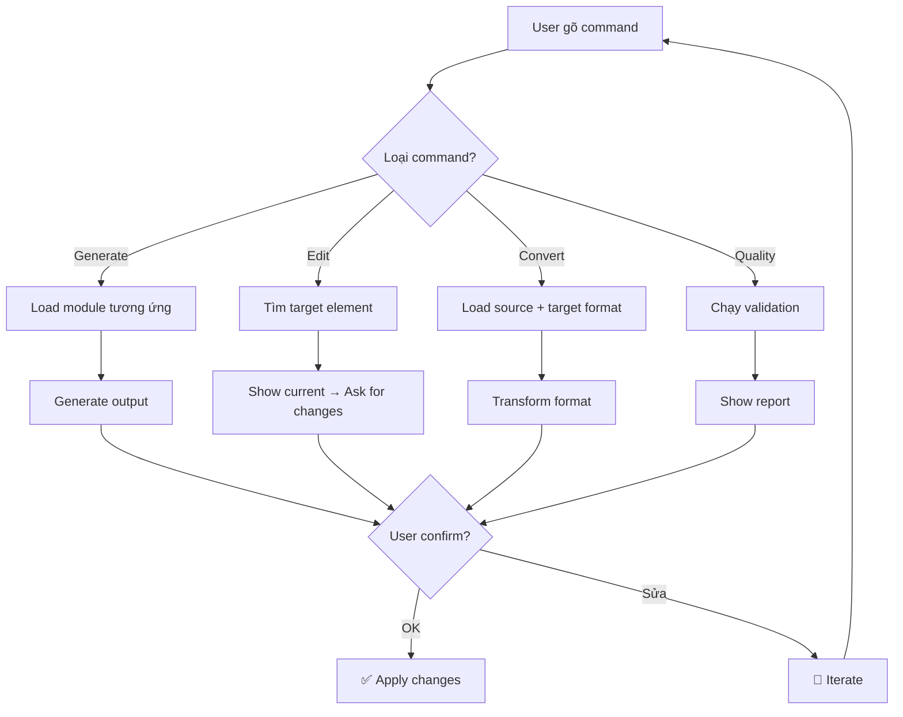

# 🤖 Chatbot Edit — Chỉnh Sửa Linh Hoạt

---

## Commands

### Document Generation
| Command | Mô tả | Ví dụ |
|---------|--------|-------|
| `/discovery` | Bắt đầu thu thập yêu cầu | `/discovery` |
| `/us [feature]` | Tạo User Story | `/us đăng nhập` |
| `/brd` | Tạo BRD từ US hiện có | `/brd` |
| `/srs` | Tạo SRS từ BRD | `/srs` |
| `/diagram [type] [scope]` | Vẽ diagram | `/diagram bpmn thanh-toan` |
| `/sprint` | Lập sprint plan | `/sprint` |

### Editing
| Command | Mô tả | Ví dụ |
|---------|--------|-------|
| `/rewrite [section]` | Viết lại section | `/rewrite AC cho US-001` |
| `/add [type] [target]` | Thêm nội dung | `/add ac US-001` |
| `/remove [target]` | Xóa nội dung | `/remove US-003` |
| `/update [target] [change]` | Cập nhật | `/update US-001 priority → Must` |
| `/merge [US-001] [US-002]` | Gộp 2 US | `/merge US-001 US-002` |
| `/split [US-001]` | Tách US thành nhiều US nhỏ | `/split US-005` |

### Conversion
| Command | Mô tả |
|---------|--------|
| `/convert us→brd` | Chuyển User Stories → BRD |
| `/convert brd→srs` | Chuyển BRD → SRS |
| `/convert us→tc` | Tạo Test Cases từ US |

### Quality
| Command | Mô tả |
|---------|--------|
| `/validate` | Chạy quality gates |
| `/trace` | Hiển thị traceability matrix |
| `/gaps` | Phát hiện yêu cầu thiếu |
| `/consistency` | Check thuật ngữ nhất quán |

### Navigation
| Command | Mô tả |
|---------|--------|
| `/status` | Xem tiến độ pipeline |
| `/list us` | Liệt kê tất cả User Stories |
| `/list brd` | Liệt kê BRD requirements |
| `/export` | Xuất toàn bộ documents |

---

## Interactive Edit Flow

---

## Context Rules

1. **Luôn nhớ project context** — không hỏi lại thông tin đã cung cấp
2. **Maintain state** — biết đang ở phase nào, đã tạo gì
3. **Incremental updates** — sửa chỗ cần sửa, giữ nguyên phần còn lại
4. **Confirm trước khi apply** — luôn show preview trước khi thay đổi
5. **Undo support** — cho phép rollback thay đổi gần nhất

---

## Natural Language Support

Ngoài commands, user có thể nói tự nhiên:

| User nói | AI hiểu |
|----------|---------|
| "Thêm AC cho story login" | `/add ac US-LOGIN-001` |
| "Vẽ flow thanh toán" | `/diagram bpmn payment` |
| "Priority của US-003 thành Must" | `/update US-003 priority → Must` |
| "Tách US-005 ra nhỏ hơn" | `/split US-005` |
| "Check xem có gì thiếu không" | `/gaps` |
| "Tạo BRD đi" | `/brd` |
