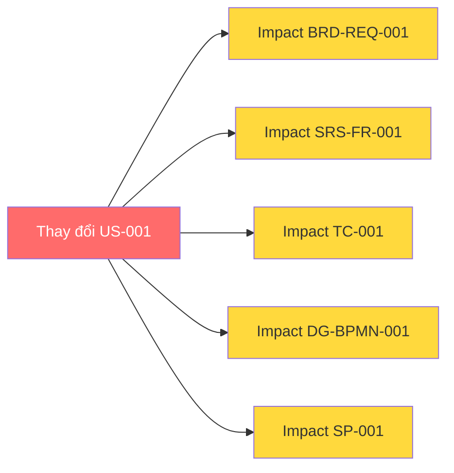

# 🔗 Traceability Matrix — Ma Trận Truy Vết

---

## Mục đích
Đảm bảo MỌI yêu cầu được track từ đầu (US) → cuối (Test Case) — **không sót, không mồ côi**. Load khi `/trace` hoặc khi Quality Gate kiểm traceability.

## Chuỗi truy vết chuẩn

```
EP-[MODULE]-### → US-[MODULE]-### → BRD-REQ-### → SRS-FR-### → TC-###
                                          │
                          DG-[TYPE]-### ◄──┘        SP-### (sprint)
```

> Mỗi deliverable PHẢI ghi trường **Source** = ID nó dẫn xuất từ đâu (vd `SRS-FR-012` ghi `Source: BRD-REQ-005, US-SALES-003`). Đây là dữ liệu để dựng ma trận. ID convention đầy đủ: [output-standard](../core/output-standard.md) · [conventions](../../00-project/conventions.md).

---

## Matrix Template

| US ID | US Title | BRD-REQ | SRS-FR | SRS-NFR | Diagram | TC | Sprint | Status |
|-------|---------|---------|--------|---------|---------|-----|--------|--------|
| US-XXX-001 | [Title] | BRD-REQ-001 | SRS-FR-001 | — | DG-BPMN-001 | TC-001 | SP-001 | ✅ |
| US-XXX-002 | [Title] | BRD-REQ-001 | SRS-FR-002 | SRS-NFR-001 | DG-SEQ-001 | TC-002 | SP-001 | 🔄 |
| US-XXX-003 | [Title] | BRD-REQ-002 | SRS-FR-003 | — | — | TC-003 | SP-002 | ⏳ |

---

## Traceability Checks

### Forward Trace (US → TC)
```
Mỗi US phải có:
✅ ≥1 BRD-REQ
✅ ≥1 SRS-FR
✅ ≥1 TC
```

### Backward Trace (TC → US)
```
Mỗi TC phải link về:
✅ 1 SRS-FR
✅ 1 BRD-REQ
✅ 1 US
```

### Orphan Detection
```
❌ SRS-FR không có BRD-REQ → Gold plating
❌ BRD-REQ không có US → Missing story
❌ US không có TC → Untestable
```

---

## Coverage Report

```markdown
## Traceability Coverage

| Metric | Count | Coverage |
|--------|:-----:|:--------:|
| Total US | [X] | — |
| US → BRD mapped | [X] | [X]% |
| US → SRS mapped | [X] | [X]% |
| US → TC mapped | [X] | [X]% |
| Orphan SRS-FR | [X] | ⚠️ |
| Orphan BRD-REQ | [X] | ⚠️ |
```

---

## Change Impact Analysis

Khi thay đổi 1 element → trace impact:



---

> **Tích hợp:** kết quả check (forward/backward/orphan) feed vào [quality-gates](../core/quality-gates.md) (gate *Traceability*). Web-app có thể trực quan hoá ma trận này ở tab "Báo cáo" (lộ trình P3 — [ROADMAP](../../ROADMAP.md)).
