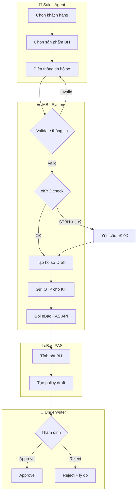
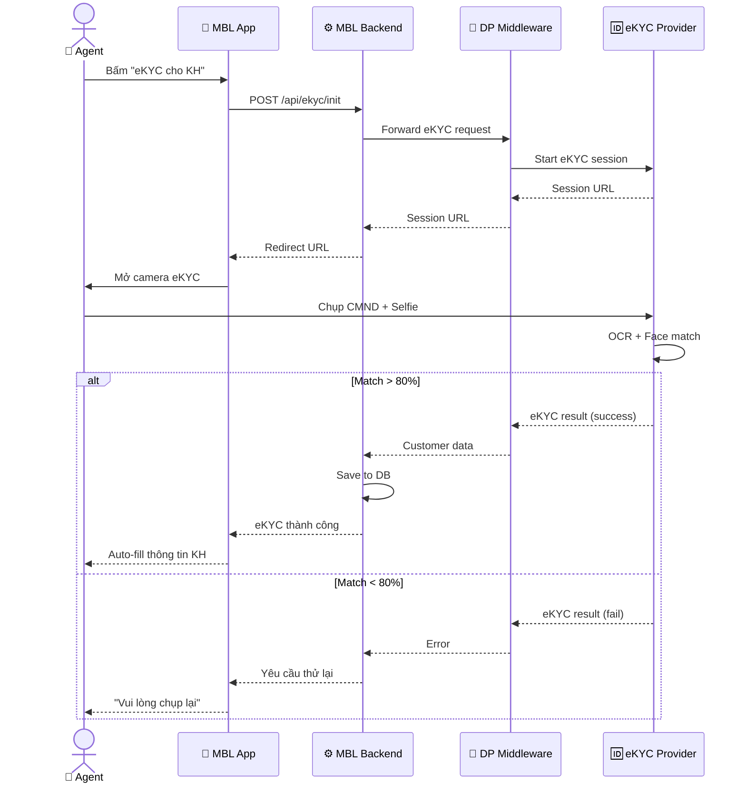

# 🏢 MBL Showcase — Ví Dụ Thực Tế

> Dự án MBL (MB Life) — platform bán bảo hiểm nhân thọ cho MB Bank.
> ~195 documentation files, 9 modules, 4 sprints.

---

## 1. Discovery Output (M1)

### Project Context

```yaml
project_name: "MBL - MB Life Insurance Sales Platform"
domain: "insurance"
system_type: "mobile-app + web-admin"
project_type: "greenfield"
client: "MB Life Insurance"

business_goal: "Xây dựng platform bán bảo hiểm nhân thọ qua kênh Sales Force (đại lý)"
success_metrics:
  - metric: "Số hợp đồng/tháng"
    target: "500+ hợp đồng"
  - metric: "Thời gian xử lý hồ sơ"
    target: "< 24h (từ 3-5 ngày)"

user_types:
  - name: "Sales Agent"
    description: "Đại lý bán bảo hiểm"
    count: "2000+"
  - name: "Team Leader"
    description: "Quản lý nhóm đại lý"
    count: "200"
  - name: "Admin"
    description: "Quản trị hệ thống"
    count: "10"
```

### Feature List (từ Discovery)

| # | Epic | Priority | Modules |
|---|------|----------|---------|
| 1 | Portal & Authentication | 🔴 Must | M01-Portal |
| 2 | Lead Management | 🔴 Must | M02-Lead |
| 3 | Customer 360° | 🔴 Must | M03-Customer |
| 4 | Performance & KPI | 🟡 Should | M04-Performance |
| 5 | Team Activity | 🟡 Should | M05-TeamActivity |
| 6 | Sales (Bán hàng) | 🔴 Must | M06-Sales |
| 7 | Recruitment | 🟢 Could | M07-Recruitment |
| 8 | Policy Management | 🔴 Must | M08-Policy |
| 9 | SF Support (Tickets) | 🟡 Should | M09-SFSupport |

---

## 2. User Story Output (M2)

### Ví dụ: EP-SALES-001

```markdown
### US-SALES-001: Tạo hồ sơ yêu cầu bảo hiểm

**Epic:** EP-SALES-001: Quy trình bán bảo hiểm online

**As a** Sales Agent
**I want** tạo hồ sơ yêu cầu bảo hiểm cho khách hàng trên mobile app
**So that** khách hàng có thể mua bảo hiểm nhanh chóng không cần giấy tờ

**Acceptance Criteria:**

**AC1:** Tạo hồ sơ thành công
- Given agent đã đăng nhập và có khách hàng đã eKYC
- When agent chọn sản phẩm, điền thông tin, nhấn "Submit"
- Then hệ thống tạo hồ sơ Draft, hiển thị mã hồ sơ, gửi OTP cho KH

**AC2:** Validate tuổi khách hàng
- Given agent đang tạo hồ sơ
- When tuổi KH < 18 hoặc > 65
- Then hệ thống hiển thị lỗi "Khách hàng không đủ điều kiện tham gia"

**AC3:** Auto-fill từ eKYC
- Given KH đã hoàn tất eKYC qua DP
- When agent chọn KH
- Then hệ thống auto-fill: họ tên, CMND, ngày sinh, địa chỉ

**Business Rules:**
- BR-001: Tuổi tham gia: 18-65
- BR-002: BMI check nếu STBH > 500 triệu
- BR-003: eKYC bắt buộc nếu STBH > 1 tỷ
- BR-004: OTP xác nhận qua SĐT đăng ký

**Priority:** 🔴 Must
**Story Points:** 8
**Dependencies:** US-PORTAL-001 (Login), US-CUST-001 (eKYC)
```

---

## 3. Diagram Output (M5)

### BPMN: Quy trình bán bảo hiểm



### Sequence: eKYC Flow



---

## 4. Sprint Plan Output (M6)

### Overview

| Sprint | Duration | Velocity | Theme |
|--------|----------|:--------:|-------|
| SP-001 | Week 1-2 | 35 SP | Foundation: Portal + Auth + eKYC |
| SP-002 | Week 3-4 | 40 SP | Core: Lead + Customer + Sales |
| SP-003 | Week 5-6 | 40 SP | Enhancement: Performance + Team + Recruitment |
| SP-004 | Week 7-8 | 30 SP | Polish: Policy + Support + UAT |

### SP-001 Detail

| # | US ID | Tiêu đề | SP | Module |
|---|-------|---------|:--:|--------|
| 1 | US-PORTAL-001 | Đăng nhập SSO | 5 | M01 |
| 2 | US-PORTAL-002 | Dashboard agent | 8 | M01 |
| 3 | US-CUST-001 | eKYC integration | 8 | M03 |
| 4 | US-CUST-002 | Customer 360° view | 5 | M03 |
| 5 | US-LEAD-001 | Tạo lead mới | 5 | M02 |
| 6 | US-LEAD-002 | Lead assignment rules | 4 | M02 |
| **Total** | | | **35** | |

---

## 5. Traceability (sample)

| US | BRD-REQ | SRS-FR | Diagram | TC | Sprint |
|----|---------|--------|---------|-----|--------|
| US-SALES-001 | BRD-REQ-006 | SRS-FR-010 | DG-BPMN-001 | TC-010 | SP-002 |
| US-CUST-001 | BRD-REQ-003 | SRS-FR-005 | DG-SEQ-001 | TC-005 | SP-001 |
| US-PORTAL-001 | BRD-REQ-001 | SRS-FR-001 | — | TC-001 | SP-001 |

---

> 💡 **Kết luận:** Tất cả output trên đều được generate tự động bởi BA Super App từ mô tả dự án ban đầu, sau đó refine qua chatbot editing. Dự án MBL thực tế đã tạo ra ~195 files documentation theo cùng pattern này.
