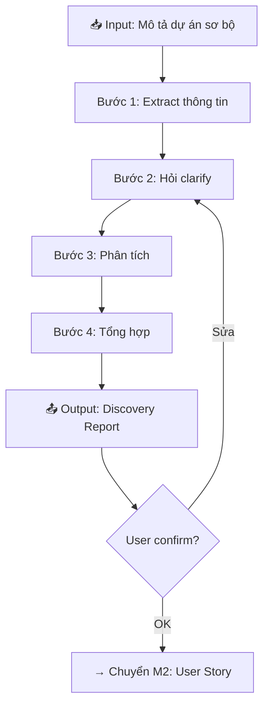

# 🔎 M1: Discovery — Thu Thập & Phân Tích Yêu Cầu

---

## Mục đích
Chuyển đổi thông tin sơ bộ từ khách hàng → Discovery Report có cấu trúc.

---

## Quy trình Discovery



---

## Bước 1: Extract thông tin từ input

Khi user paste mô tả dự án, AI extract:

| Thông tin | Source | Bắt buộc |
|-----------|--------|----------|
| Tên dự án | Explicit / inferred | ✅ |
| Domain | Context clues | ✅ |
| Mục tiêu | Explicit | ✅ |
| Users | Explicit / inferred | ✅ |
| Features sơ bộ | Explicit | ✅ |
| Constraints | Explicit / ask | ⚠️ |
| Compliance | Domain-based | ⚠️ |

---

## Bước 2: Hỏi Clarify (Socratic)

Hỏi TỐI ĐA 5 câu, mỗi câu gắn với 1 quyết định:

### Câu hỏi mẫu (adapt theo context)

**Q1 — Scope:**
> Trong các features bạn mô tả, cái nào là MVP (phải có ngay) và cái nào là nice-to-have?

**Q2 — Users:**
> Ngoài [user type đã đề cập], còn ai sử dụng hệ thống? Admin? Manager? External partner?

**Q3 — Integration:**
> Hệ thống này cần tích hợp với hệ thống nào khác? (Payment, CRM, ERP, 3rd party API?)

**Q4 — Constraints:**
> Timeline dự kiến? Team size? Budget level (thấp/trung bình/cao)?

**Q5 — Current state:**
> Hiện tại đang dùng hệ thống gì? Hoặc đây là greenfield hoàn toàn?

---

## Bước 3: Phân tích

Sau khi có đủ thông tin, thực hiện:

### 3.1 Business Goal Breakdown
- Primary goal → measurable KPIs
- Secondary goals

### 3.2 Stakeholder Analysis
- Ai quan tâm? Ai quyết định? Ai bị ảnh hưởng?
- → Fill `stakeholder_map.md`

### 3.3 Feature Decomposition
- Nhóm features theo Epic/Module
- Gán priority sơ bộ (MoSCoW)

### 3.4 Risk Identification
- Technical risks
- Business risks
- Timeline risks

---

## Bước 4: Output — Discovery Report

```markdown
---
project: "[PROJECT_NAME]"
document_type: "DISCOVERY"
version: "1.0"
date: "[YYYY-MM-DD]"
status: "draft"
---

# Discovery Report — [PROJECT_NAME]

## 1. Tổng quan dự án
[Mô tả 2-3 câu về dự án]

## 2. Business Goals
| # | Mục tiêu | KPI | Target |
|---|----------|-----|--------|
| 1 | [Goal] | [Metric] | [Value] |

## 3. Stakeholders
| Tên/Role | Vai trò | Ảnh hưởng | Kênh liên lạc |
|----------|---------|-----------|---------------|
| [Name] | [Role] | High/Med/Low | [Channel] |

## 4. User Types
| User | Mô tả | Số lượng ước tính |
|------|--------|-------------------|
| [Type] | [Description] | [Count] |

## 5. Feature List (sơ bộ)
| # | Epic/Module | Features | Priority | Ghi chú |
|---|-----------|----------|----------|---------|
| 1 | [Epic] | [Features] | 🔴Must | [Notes] |

## 6. Scope
### In-scope
- [Feature 1]
- [Feature 2]

### Out-of-scope
- [Feature X]

## 7. Constraints & Assumptions
### Constraints
- Timeline: [X]
- Budget: [X]
- Tech: [X]

### Assumptions
- [Assumption 1]

## 8. Risks (sơ bộ)
| Risk | Impact | Probability | Mitigation |
|------|--------|-------------|------------|
| [Risk] | High/Med/Low | High/Med/Low | [Action] |

## 9. Next Steps
- [ ] Review Discovery Report
- [ ] Confirm scope & priority
- [ ] → Chuyển sang M2: User Story
```

---

## Techniques hỗ trợ

| Kỹ thuật | Khi nào dùng |
|----------|-------------|
| 5 Whys | Tìm root cause của pain point |
| SWOT | Đánh giá tổng thể dự án |
| MoSCoW | Phân loại priority |
| Value Stream | Phân tích quy trình hiện tại |
| Empathy Map | Hiểu user behavior |
