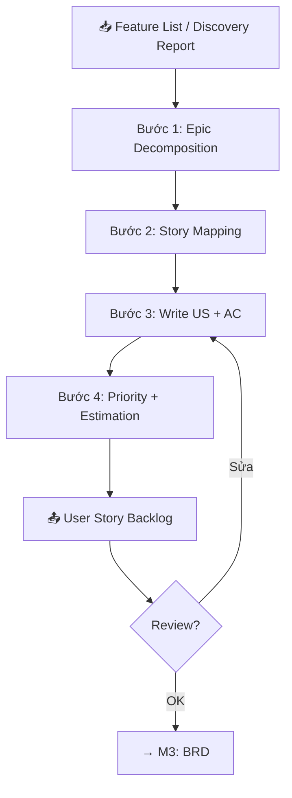
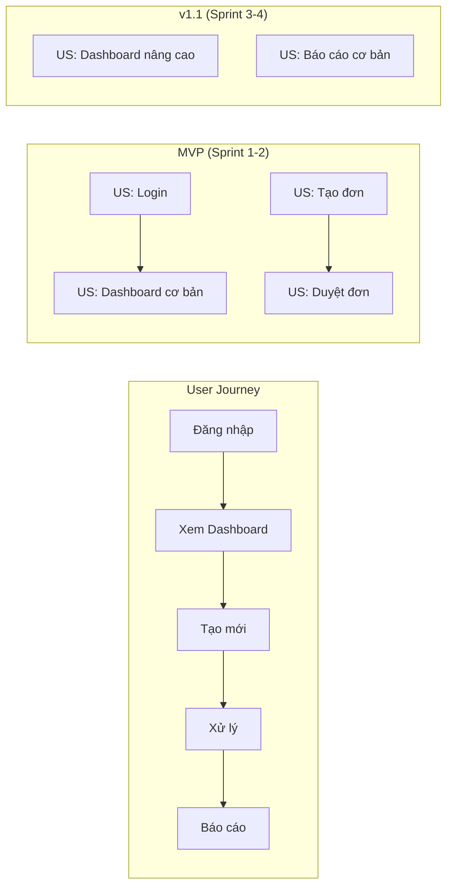

# 📝 M2: User Story — Tạo User Stories & Acceptance Criteria

---

## Mục đích
Chuyển Feature List từ Discovery → User Stories chuẩn với Acceptance Criteria chi tiết.

---

## Quy trình



---

## Bước 1: Epic Decomposition

Mỗi module/feature lớn → 1 Epic → nhiều User Stories.

```
EP-SALES-001: Quản lý đơn hàng
├── US-SALES-001: Tạo đơn hàng mới
├── US-SALES-002: Xem danh sách đơn hàng
├── US-SALES-003: Cập nhật trạng thái đơn
├── US-SALES-004: Hủy đơn hàng
└── US-SALES-005: Xuất báo cáo đơn hàng
```

### Nguyên tắc chia:
- Mỗi US phải **độc lập** (có thể dev riêng)
- Mỗi US phải **deliver value** cho user
- Mỗi US phải **test được**
- Mỗi US phải **estimate được** (2-8 SP)

---

## Bước 2: Story Mapping

Sắp xếp US theo user journey:



---

## Bước 3: Viết User Story + AC

### Format chuẩn

```markdown
### US-[MODULE]-[###]: [Tiêu đề]

**Epic:** EP-[MODULE]-[###]

**As a** [loại user]
**I want** [chức năng mong muốn]
**So that** [giá trị/lợi ích nhận được]

**Acceptance Criteria:**

**AC1:** Happy path
- Given [precondition]
- When [action]  
- Then [expected result]

**AC2:** Validation
- Given [precondition]
- When [invalid input]
- Then [error handling]

**AC3:** Edge case
- Given [special condition]
- When [action]
- Then [specific behavior]

**UI Notes:** [Ghi chú về giao diện nếu có]
**Business Rules:** [Quy tắc nghiệp vụ áp dụng]
**Dependencies:** [US khác cần hoàn thành trước]
```

### Ví dụ thực tế (từ MBL)

```markdown
### US-SALES-001: Tạo hồ sơ yêu cầu bảo hiểm

**Epic:** EP-SALES-001: Quy trình bán bảo hiểm

**As a** Sales Agent
**I want** tạo hồ sơ yêu cầu bảo hiểm cho khách hàng
**So that** khách hàng có thể mua sản phẩm bảo hiểm phù hợp

**Acceptance Criteria:**

**AC1:** Tạo hồ sơ thành công
- Given agent đã đăng nhập và chọn khách hàng
- When agent điền đầy đủ thông tin và nhấn "Tạo hồ sơ"
- Then hệ thống tạo hồ sơ với trạng thái "Draft" và hiển thị mã hồ sơ

**AC2:** Validate thông tin bắt buộc
- Given agent đang điền form tạo hồ sơ
- When agent bỏ trống trường bắt buộc (CMND, SĐT, ngày sinh)
- Then hệ thống highlight trường lỗi và hiển thị message cụ thể

**AC3:** Auto-fill từ eKYC
- Given khách hàng đã hoàn tất eKYC
- When agent chọn khách hàng đã eKYC
- Then hệ thống tự động điền thông tin từ eKYC (tên, CMND, ngày sinh)

**Business Rules:**
- Tuổi khách hàng: 18-65 tuổi
- BMI check nếu STBH > 500 triệu
- Cần eKYC nếu STBH > 1 tỷ
```

---

## Bước 4: Priority + Estimation

### Priority (MoSCoW)

| Priority | Ý nghĩa | Sprint |
|----------|---------|--------|
| 🔴 Must | MVP, không thể thiếu | Sprint 1-2 |
| 🟡 Should | Quan trọng nhưng có workaround | Sprint 3-4 |
| 🟢 Could | Nice-to-have | Sprint 5+ |
| ⚪ Won't | Out of scope release này | Backlog |

### Story Points (Fibonacci)

| SP | Effort | Ví dụ |
|:--:|--------|-------|
| 1 | Trivial | Đổi text/label |
| 2 | Nhỏ | Thêm 1 field vào form |
| 3 | Vừa | CRUD cơ bản |
| 5 | Lớn | Feature có logic phức tạp |
| 8 | Rất lớn | Integration với external system |
| 13 | Epic-level | Cần chia nhỏ hơn! |

---

## Output: User Story Backlog

```markdown
## User Story Backlog — [PROJECT_NAME]

### Tổng quan
| Metric | Value |
|--------|-------|
| Total Epics | [X] |
| Total User Stories | [X] |
| Total Story Points | [X] |
| Must-have | [X] US ([Y] SP) |
| Should-have | [X] US ([Y] SP) |

### Backlog

| ID | Tiêu đề | Epic | Priority | SP | Sprint |
|----|---------|------|----------|:--:|--------|
| US-XXX-001 | [Title] | EP-XXX-001 | 🔴 | 5 | SP-001 |
| US-XXX-002 | [Title] | EP-XXX-001 | 🔴 | 3 | SP-001 |
| US-XXX-003 | [Title] | EP-XXX-002 | 🟡 | 8 | SP-002 |

### Chi tiết từng US
[Các US chi tiết với AC ở đây]
```

---

## INVEST Checklist (tự kiểm tra)

Mỗi US phải đạt INVEST:

| Tiêu chí | Câu hỏi |
|----------|---------|
| **I**ndependent | US này có thể dev độc lập không? |
| **N**egotiable | Có thể thương lượng scope? |
| **V**aluable | Deliver giá trị cho end user? |
| **E**stimable | Team có thể estimate được? |
| **S**mall | Hoàn thành trong 1 sprint? |
| **T**estable | Có thể viết test case được? |
