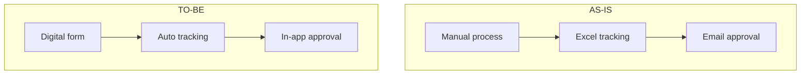

# 📊 M3: BRD — Business Requirements Document

---

## Mục đích
Tạo BRD chuẩn từ User Stories + Project Context → tài liệu nghiệp vụ chính thức.

---

## BRD Template

```markdown
---
project: "[PROJECT_NAME]"
document_type: "BRD"
version: "1.0"
date: "[YYYY-MM-DD]"
status: "draft"
prepared_by: "BA Super App"
approved_by: ""
---

# BRD — [PROJECT_NAME]

## 1. Executive Summary
[Tóm tắt 3-5 câu: dự án là gì, giải quyết vấn đề gì, cho ai]

## 2. Business Objectives

| # | Mục tiêu | KPI | Target | Timeline |
|---|----------|-----|--------|----------|
| BO-001 | [Objective] | [Metric] | [Value] | [Date] |

## 3. Scope

### 3.1 In-Scope
| # | Feature/Module | Mô tả | Priority |
|---|---------------|--------|----------|
| 1 | [Feature] | [Description] | 🔴Must |

### 3.2 Out-of-Scope
- [Feature X] — Lý do: [reason]

### 3.3 Assumptions
- [Assumption 1]

### 3.4 Dependencies
- [Dependency 1]

## 4. Stakeholders & Users

### 4.1 Stakeholders
[Reference: stakeholder_map.md]

### 4.2 User Personas
| User Type | Mô tả | Số lượng | Primary Actions |
|-----------|--------|----------|----------------|
| [Type] | [Desc] | [Count] | [Actions] |

## 5. Business Requirements

### BRD-REQ-001: [Tên requirement]
- **Mô tả:** [Chi tiết]
- **Business Rule:** [Quy tắc nghiệp vụ]
- **Source:** [US-XXX-001, US-XXX-002]
- **Priority:** 🔴 Must
- **Acceptance Criteria:** [Reference AC từ US]

### BRD-REQ-002: [Tên requirement]
[...]

## 6. Business Process Flows

### 6.1 Current State (As-Is)
[Mermaid diagram hoặc mô tả quy trình hiện tại]

### 6.2 Future State (To-Be)
[Mermaid diagram quy trình mới]

## 7. Business Rules

| # | Rule | Mô tả | Impact |
|---|------|--------|--------|
| BR-001 | [Name] | [Description] | [Modules affected] |

## 8. Data Requirements
| Entity | Mô tả | Source | Sensitivity |
|--------|--------|--------|-------------|
| [Entity] | [Desc] | [Source] | PII/Normal |

## 9. Reporting & Analytics
| Report | Mô tả | Frequency | Users |
|--------|--------|-----------|-------|
| [Report] | [Desc] | Daily/Weekly | [Users] |

## 10. Risks & Mitigations
| Risk | Impact | Probability | Mitigation |
|------|--------|-------------|------------|
| [Risk] | H/M/L | H/M/L | [Action] |

## 11. Success Criteria
- [ ] [Criteria 1]
- [ ] [Criteria 2]

## 12. Traceability

| BRD-REQ | User Story | Module |
|---------|-----------|--------|
| BRD-REQ-001 | US-XXX-001 | [Module] |

## Lịch sử thay đổi
| Version | Ngày | Thay đổi | Người |
|---------|------|----------|-------|
| 1.0 | [Date] | Khởi tạo | BA Super App |
```

---

## Hướng dẫn generate

### Từ User Stories → BRD Requirements
```
1. Nhóm các US cùng module/epic
2. Mỗi nhóm → 1 BRD-REQ
3. Merge AC → Business Rules
4. Extract data entities
5. Identify process flows
```

### Business Process Flow
Luôn vẽ 2 diagrams:
- **As-Is**: Quy trình hiện tại (nếu có)
- **To-Be**: Quy trình mới sau khi triển khai


