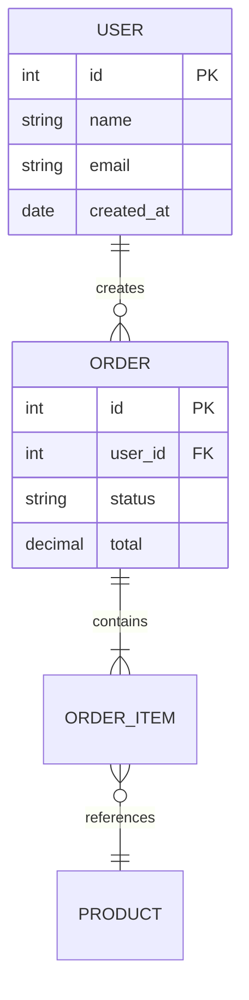
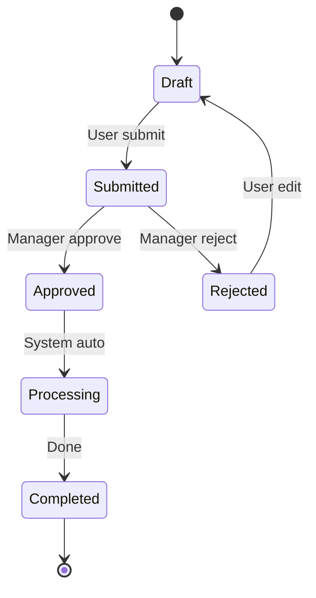

# ⚙️ M4: SRS — Software Requirements Specification

---

## Mục đích
Chuyển BRD (nghiệp vụ) → SRS (kỹ thuật) — tài liệu để Dev team hiểu và triển khai.

---

## SRS Template

```markdown
---
project: "[PROJECT_NAME]"
document_type: "SRS"
version: "1.0"
date: "[YYYY-MM-DD]"
status: "draft"
---

# SRS — [PROJECT_NAME]

## 1. Giới thiệu

### 1.1 Mục đích
Tài liệu đặc tả kỹ thuật cho dự án [PROJECT_NAME].

### 1.2 Phạm vi
[Tóm tắt scope từ BRD]

### 1.3 Thuật ngữ
| Thuật ngữ | Giải nghĩa |
|-----------|-----------|
| [Term] | [Definition] |

---

## 2. Functional Requirements

### SRS-FR-001: [Tên chức năng]
- **Mô tả:** [Chi tiết kỹ thuật]
- **Source:** BRD-REQ-001, US-XXX-001
- **Input:** [Data/action từ user]
- **Process:** [Logic xử lý]
- **Output:** [Kết quả trả về]
- **Validation Rules:**
  - [Rule 1]
  - [Rule 2]
- **Error Handling:**
  - [Error case 1] → [Response]
  - [Error case 2] → [Response]

---

## 3. Non-Functional Requirements

### 3.1 Performance
| Metric | Target |
|--------|--------|
| Response time (API) | < 500ms (p95) |
| Page load time | < 3s |
| Concurrent users | [X] users |
| Throughput | [X] req/sec |

### 3.2 Security
- Authentication: [JWT / OAuth2 / SSO]
- Authorization: [RBAC / ABAC]
- Data encryption: [At-rest / In-transit]
- PII handling: [Masking rules]

### 3.3 Availability
- Uptime target: [99.9%]
- RPO: [X hours]
- RTO: [X hours]

### 3.4 Scalability
- [Horizontal / Vertical]
- Expected growth: [X% per year]

---

## 4. Data Model

### 4.1 Entity List
| Entity | Mô tả | Attributes chính | Relationships |
|--------|--------|------------------|---------------|
| [Entity] | [Desc] | [Attrs] | [Relations] |

### 4.2 ERD
[Mermaid ERD diagram]

---

## 5. API Specification (nếu applicable)

### 5.1 API Endpoints
| Method | Endpoint | Mô tả | Auth |
|--------|----------|--------|------|
| POST | /api/v1/[resource] | Tạo mới | Bearer token |
| GET | /api/v1/[resource] | Danh sách | Bearer token |
| GET | /api/v1/[resource]/:id | Chi tiết | Bearer token |
| PUT | /api/v1/[resource]/:id | Cập nhật | Bearer token |
| DELETE | /api/v1/[resource]/:id | Xóa | Bearer token |

### 5.2 Request/Response Format
[JSON examples]

---

## 6. State Machines

### [Entity] States
[Mermaid state diagram]

---

## 7. Integration Points

| System | Protocol | Purpose | Data Flow |
|--------|----------|---------|-----------|
| [System] | REST/Kafka/SFTP | [Purpose] | In/Out/Both |

---

## 8. Traceability

| SRS-FR | BRD-REQ | US | TC |
|--------|---------|----|----|
| SRS-FR-001 | BRD-REQ-001 | US-XXX-001 | TC-001 |
```

---

## Conversion Rules: BRD → SRS

| BRD Element | → SRS Element |
|-------------|---------------|
| Business Objective | Context trong section 1 |
| Business Requirement | → Functional Requirement (SRS-FR) |
| Business Rule | → Validation Rule trong FR |
| Process Flow | → Sequence Diagram + State Machine |
| Data Requirements | → Data Model (ERD) |
| KPI/Metrics | → Non-functional (Performance targets) |
| Compliance | → Security requirements |

---

## Mermaid Templates cho SRS

### ERD


### State Machine

