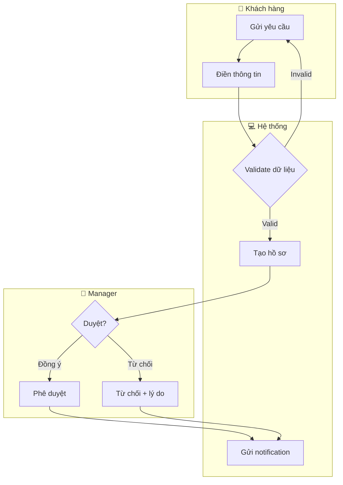
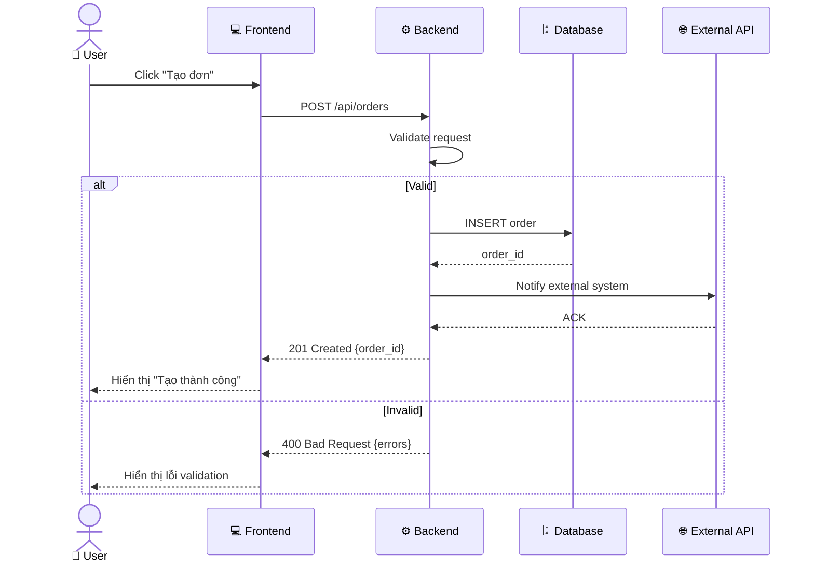
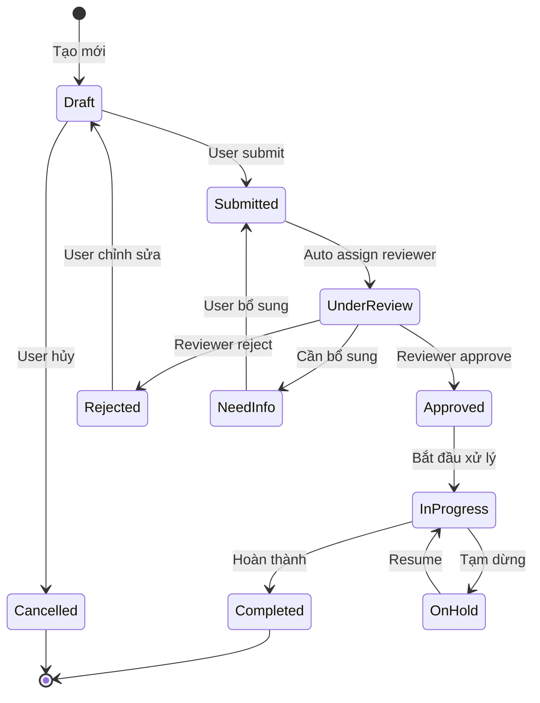
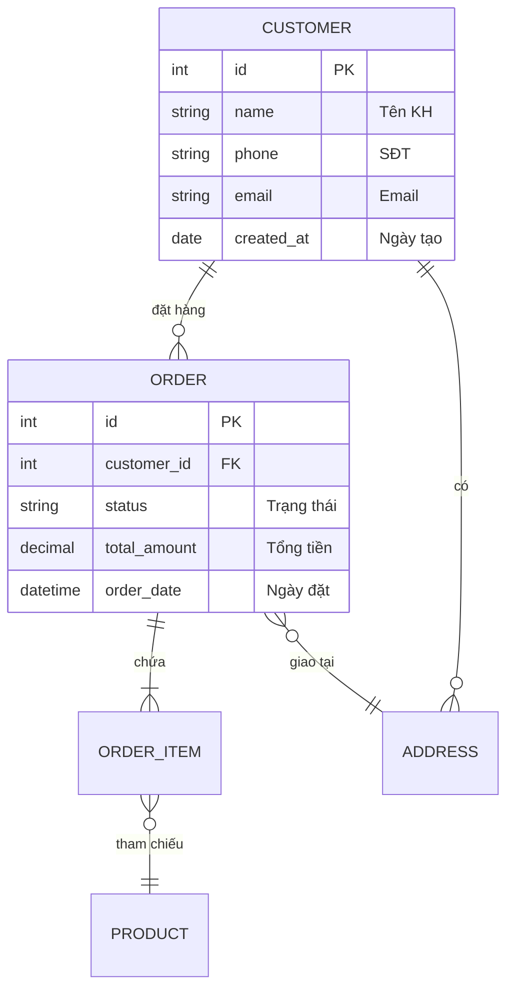
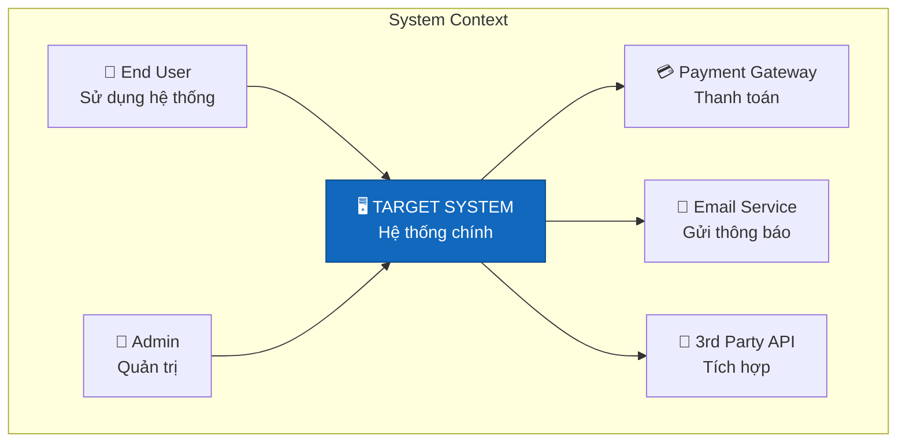
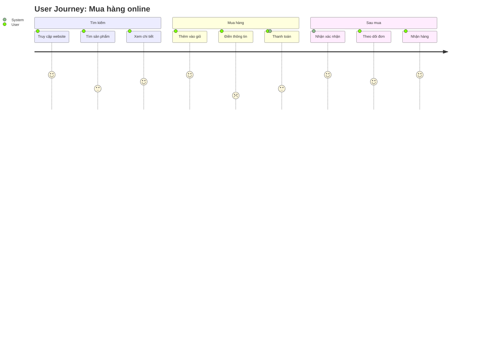
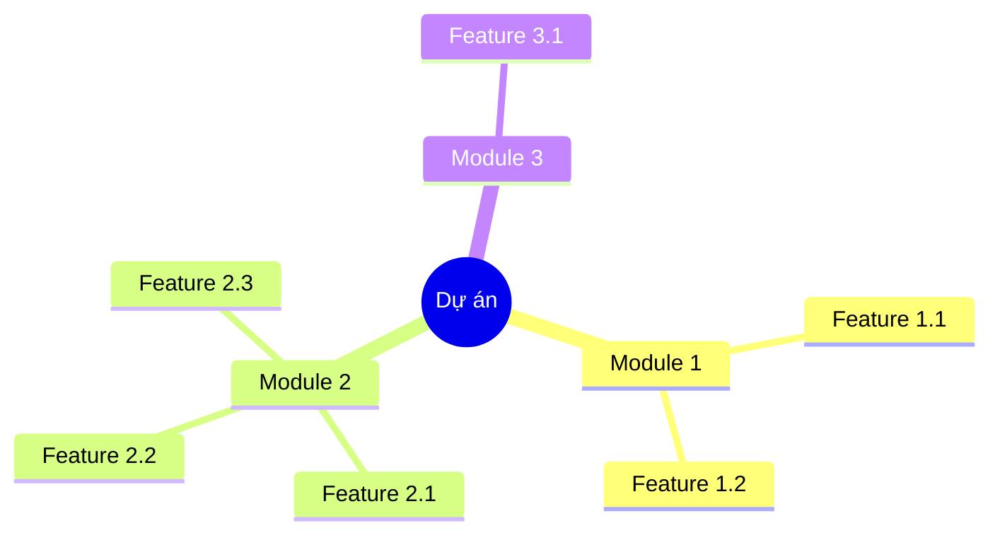

# 📐 M5: Diagram — Tạo Sơ Đồ & Diagrams

---

## Mục đích
Generate các loại diagram từ documents có sẵn — sử dụng Mermaid syntax.

---

## Supported Diagram Types

| Type | Mục đích | Khi nào dùng |
|------|---------|-------------|
| BPMN (Flowchart) | Process flow với swimlanes | Mô tả quy trình nghiệp vụ |
| Sequence | Tương tác giữa actors/systems | API flow, integration |
| State Machine | Trạng thái entity | Order states, ticket lifecycle |
| ERD | Entity relationships | Data model |
| C4 Context | System context | Architecture overview |
| C4 Container | Container-level | Deployment architecture |
| Activity | Quy trình với decision points | Complex business logic |
| User Journey | User experience flow | UX analysis |
| Mind Map | Phân rã concept | Brainstorming, feature breakdown |

---

## 1. BPMN-style (Process Flow với Swimlanes)



### Conventions BPMN:
- Mỗi swimlane = 1 actor/system
- Dùng emoji prefix cho dễ đọc (👤👔💻🏦)
- Decision: hình thoi `{}`
- Start/End: hình tròn `([])` hoặc `[*]`

---

## 2. Sequence Diagram



### Conventions Sequence:
- Actor = user thực (có emoji)
- Participant = system component
- `->>`  = request (đường liền)
- `-->>` = response (đường đứt)
- `alt/else` = conditional flow
- `loop` = repeated action
- `Note` = ghi chú quan trọng

---

## 3. State Machine



---

## 4. ERD



---

## 5. C4 Context



---

## 6. User Journey



---

## 7. Mind Map (Feature Decomposition)



---

## Cách sử dụng

### Command
```
/diagram bpmn [tên quy trình]     → BPMN flowchart
/diagram sequence [tên flow]       → Sequence diagram  
/diagram state [tên entity]        → State machine
/diagram erd [scope]               → ERD
/diagram c4 [level]                → C4 model
/diagram journey [tên scenario]    → User journey
/diagram mindmap [topic]           → Mind map
```

### Từ document có sẵn
```
/diagram from-brd                  → Auto-detect và tạo process flows
/diagram from-srs                  → Auto-detect và tạo sequence + ERD
/diagram from-us [US-ID]           → Tạo flow cho US cụ thể
```
