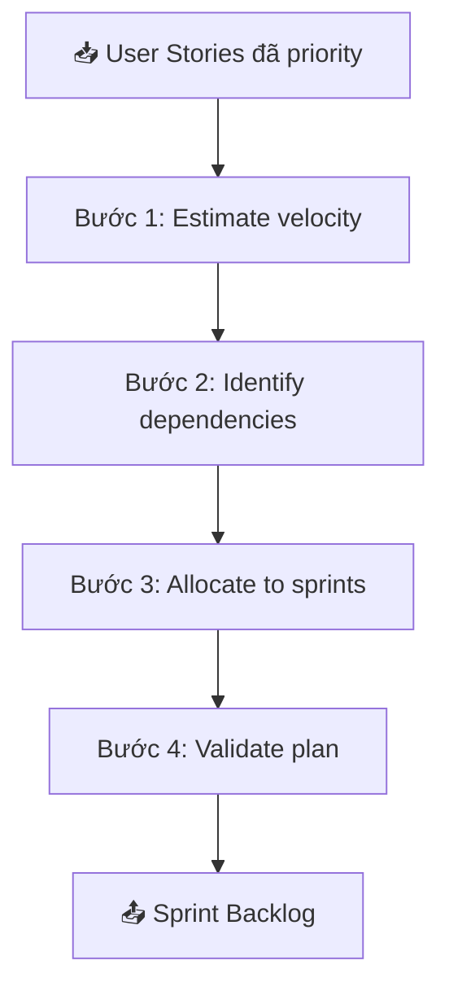
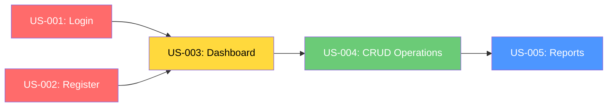
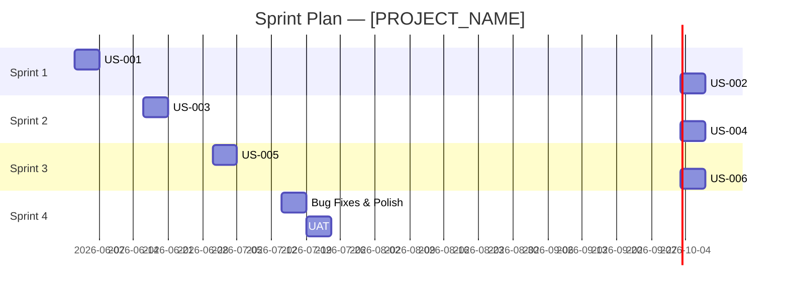

# 📅 M6: Sprint Planning — Lập Kế Hoạch Sprint

---

## Mục đích
Chia User Stories thành các Sprint 2 tuần, có estimate và dependency rõ ràng.

---

## Quy trình Sprint Planning



---

## Bước 1: Estimate Velocity

### Default velocity (team trung bình)

| Team Size | Velocity/Sprint | Ghi chú |
|:---------:|:--------------:|---------|
| 2-3 dev | 15-25 SP | Small team |
| 4-6 dev | 30-50 SP | Medium team |
| 7-9 dev | 50-80 SP | Large team |

> ⚠️ Sprint đầu tiên luôn giảm 20-30% velocity (team ramp-up)

---

## Bước 2: Identify Dependencies



### Dependency Rules:
- US phụ thuộc → phải ở sprint TRƯỚC hoặc CÙNG sprint
- Không có circular dependency
- Critical path → highlight riêng

---

## Bước 3: Sprint Allocation

### Sprint Backlog Template

```markdown
## Sprint Backlog — [PROJECT_NAME]

### Overview
| Sprint | Duration | Velocity Target | Theme |
|--------|----------|:---------:|-------|
| SP-001 | Week 1-2 | [X] SP | Foundation + MVP Core |
| SP-002 | Week 3-4 | [X] SP | MVP Complete |
| SP-003 | Week 5-6 | [X] SP | Enhancement |
| SP-004 | Week 7-8 | [X] SP | Polish + UAT |

---

### SP-001: [Theme]
**Goal:** [Sprint goal 1 câu]
**Velocity:** [X] SP / [X] SP capacity

| # | US ID | Tiêu đề | SP | Owner | Status |
|---|-------|---------|:--:|-------|--------|
| 1 | US-XXX-001 | [Title] | 3 | [Dev] | ⏳ |
| 2 | US-XXX-002 | [Title] | 5 | [Dev] | ⏳ |
| 3 | US-XXX-003 | [Title] | 3 | [Dev] | ⏳ |
| **Total** | | | **11** | | |

**Risks:**
- [Risk 1]

**Dependencies:**
- [Dependency 1]

---

### SP-002: [Theme]
[Same format...]
```

---

## Bước 4: Validate Plan

### Checklist

| Check | Tiêu chí |
|-------|---------|
| ✅ MVP First | Sprint 1-2 deliver được MVP? |
| ✅ Velocity | Không exceed velocity target? |
| ✅ Dependencies | Đã sắp xếp đúng thứ tự? |
| ✅ Buffer | Có 10-15% buffer cho bugs/changes? |
| ✅ Demo-able | Cuối mỗi sprint có deliverable demo được? |
| ✅ Risk | Đã identify risks cho từng sprint? |

---

## Sprint Timeline View



---

## Release Planning (Multi-Sprint)

| Release | Sprints | Scope | Date |
|---------|:-------:|-------|------|
| v1.0 MVP | SP-001 → SP-002 | Core features | [Date] |
| v1.1 | SP-003 → SP-004 | Enhancements | [Date] |
| v2.0 | SP-005+ | Advanced features | [Date] |
