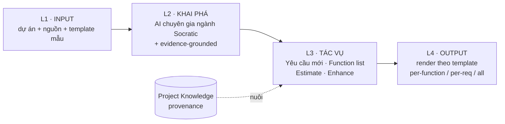

<!--
  Document ID: BRD-BASUPER-2.0
  Date: 2026-06-03
  Version: 2.0
  Status: Draft — for approval
  Source: kế thừa BRD-BASUPER-1.0 (giữ stakeholders/KPI/BR-CORE còn đúng) + chạy theo
          BACKBONE-BASUPER-V2-1.0 (registry ID chuẩn: Capability axis 12, REQ-001..022).
          Bối cảnh v2 từ IMPLPLAN-BASUPER-1.0; phạm vi P1 từ PSCOPE-BASUPER-P1-1.0.
  Template: BRD.
  QUY ƯỚC META: ID ở tài liệu này (REQ-/FR-) là đặc tả CHÍNH của sản phẩm BA Super App.
                KHÔNG lẫn với ID công cụ SINH RA cho khách (BRD-REQ-###, SRS-FR-###, TC-###).
-->

# BRD — BA Super App v2 (Business Requirements Document)

> **Business Overview** của sản phẩm **BA Super App v2** — công cụ biến AI thành **Senior Business Analyst** dẫn dắt theo ngành. Đặc tả **vì sao & cái gì** ở mức nghiệp vụ; chi tiết kỹ thuật ở [SRS](../02-requirements/srs.md) và [NFR](../02-requirements/nfr.md); kiến trúc ở [ARCHITECTURE](../03-architecture/ARCHITECTURE.md); định vị ở [vision](../../00-project/vision.md).
>
> **Lưu ý meta (quan trọng):** đây là BRD **CỦA** BA Super App — một công cụ *làm ra* BRD/SRS cho khách. Mọi ID trong tài liệu này (`REQ-###`, `FR-{PREFIX}-##`) là đặc tả **của chính sản phẩm**. Chúng **không** trùng và **không** được lẫn với `BRD-REQ-###` / `SRS-FR-###` / `TC-###` mà công cụ **sinh ra** cho dự án của khách hàng.

---

## 1. Bối cảnh & mục tiêu nghiệp vụ v2

### 1.1 Vấn đề nền (kế thừa v1)
BA Super App ra đời để giải 5 nỗi đau khi làm tài liệu BA thủ công: chậm và lặp, không nhất quán format, đứt traceability, chất lượng trồi sụt, và dùng AI rời rạc ("văn AI" không bám nguồn) — xem [vision §1](../../00-project/vision.md). v1 đã **chứng minh ý tưởng**: prompt-kit M1–M6 + web app biến AI thành Senior BA chạy pipeline Discovery→Sprint với Quality Gate + Traceability.

### 1.2 Vì sao nâng cấp lên v2 — từ "trình tạo tài liệu tuyến tính" → "chuyên gia ngành dẫn dắt"
v1 vẫn là một **trình tạo tài liệu tuyến tính**: người dùng phải tự biết hỏi gì, tri thức ngành chỉ truyền qua biến `[DOMAIN]` chung chung, input và template rời rạc, và output luôn xuất "cả bộ" thiếu lựa chọn. Thị trường 2025–2026 đã dịch chuyển sang **vertical AI agent** (nạp sẵn tri thức ngành + compliance) và **spec-driven, evidence-grounded** (chống "vibe-spec" trôi khỏi ý định). v2 đặt cược vào đúng hai trục này — cũng là điểm yếu lộ rõ của các đối thủ generic (xem khảo sát ChatPRD, Atlassian Rovo, Jama Connect Advisor, ScopeMaster trong [implementation-plan §2](../04-planning/implementation-plan.md)).

v2 tái cấu trúc toàn bộ trải nghiệm quanh **4 lớp**:

### 1.3 Mục tiêu nghiệp vụ v2
1. **Khai phá đúng:** AI chuyên gia ngành dẫn dắt Socratic, không đoán bừa, mọi tri thức **trỏ nguồn** (provenance).
2. **Sinh đúng khuôn:** requirement theo **EARS**, có quality score, qua **Quality Gate fail-closed**, **human chốt**.
3. **Xuất đúng cái cần:** chọn granularity (per-function / per-requirement / all) × template doanh nghiệp × format (MD/Word/PDF, push Jira/Confluence).
4. **Tin được:** anti-fabrication + gate + traceability sống — không phải "văn AI".
5. **Hiệu quả:** rút ngắn ≥50% thời gian ra tài liệu so với thủ công.

**[WHY]** Người dùng thật hiếm khi cần "cả bộ tài liệu" mỗi lần — họ cần *"viết giúp 1 requirement"*, *"liệt kê chức năng"*, *"ước lượng"*, hoặc *"đổi cái đang có"*. v2 đóng gói đúng nhịp công việc đó, đồng thời nâng "biến domain" của v1 lên cấp **Domain Expert Pack** (agent có tri thức ngành).

## 2. Phạm vi (v2)

| In scope (v2) | Out of scope (v2) |
|---|---|
| 4 lớp: Input → Khai phá (chuyên gia ngành) → 4 tác vụ → Output | Thay thế công cụ PM (Jira/Azure DevOps) — chỉ **push** sang, không thay |
| **Domain Expert Pack** (7 ngành; P1 seed Banking + Insurance) | Tự "chốt" yêu cầu thay con người (luôn human-in-the-loop) |
| Discovery Copilot Socratic + **evidence-grounded** (provenance) | Agent tự chạy nhiều bước không người giám sát (defer; P1 là guided copilot) |
| 4 tác vụ: Yêu cầu mới (EARS) · Function list · Estimate · Enhance | Hardcode một ngành (pack là data, thêm ngành bằng 1 file) |
| Pipeline M1–M6 + Quality Gate + EARS score + Live Traceability | LLM tự host bắt buộc (cloud Claude trước; on-prem qua adapter ở P4) |
| Template engine + Output granularity + Export/Push | PDF scan ảnh (OCR) — ngoài phạm vi |
| **Local-first** (IndexedDB) P1–P3; backend tuỳ chọn P4 | Backend/đa người dùng/RBAC/cloud sync ở P1–P3 (defer P4) |

## 3. Capability axis (12) — ánh xạ 4 lớp

Trục năng lực chuẩn của v2 (verbatim từ [backbone §0](../04-planning/_v2-backbone.md)); mỗi capability có FR prefix riêng trong [SRS](../02-requirements/srs.md).

| Cap | Tên | Lớp | FR prefix |
|---|---|---|---|
| C01 | Project & Ingestion | L1 Input | `INGEST` |
| C02 | Template Intake | L1 Input | `TPL` |
| C03 | Domain Expert Packs | L2 Khai phá | `DOMAIN` |
| C04 | Discovery Copilot | L2 Khai phá | `DISC` |
| C05 | Task · Yêu cầu mới | L3 Tác vụ | `NEWREQ` |
| C06 | Task · Function List | L3 Tác vụ | `FUNC` |
| C07 | Task · Estimate | L3 Tác vụ | `EST` |
| C08 | Task · Enhance | L3 Tác vụ | `ENH` |
| C09 | Generation Pipeline (M1–M6) | cross | `PIPE` |
| C10 | Traceability & Quality | cross | `QUAL` |
| C11 | Template & Output/Export | L4 Output | `OUTPUT` |
| C12 | Platform (Storage/LLM/Security) | cross | `PLAT` |

## 4. Business Requirements (REQ-001 .. REQ-022)

> ID, Cap, Priority (MoSCoW) và Release lấy **verbatim** từ [backbone §1](../04-planning/_v2-backbone.md). Mỗi REQ mở rộng phát biểu đầy đủ + `[WHY]` giá trị nghiệp vụ.

### Lớp L1 — Input

**REQ-001 · Tạo dự án + chọn domain ngay khi tạo** — *Cap C01 · Must · P1*
Người dùng tạo một dự án mới và khai báo ngay tên, mục tiêu nghiệp vụ, ràng buộc compliance và quy mô (scale). Domain được chọn ngay tại bước tạo để hệ thống nạp đúng Expert Pack ngay từ đầu. **[WHY]** Chọn ngành sớm cho phép AI dẫn dắt khai phá bằng đúng tri thức ngành thay vì hỏi chung chung — đây là điểm chuyển hoá cốt lõi từ v1 sang v2.

**REQ-002 · Nạp nguồn đa kênh** — *Cap C01 · Must · P1*
Hệ thống nạp tài liệu nguồn qua nhiều kênh: Paste Text, Upload File (.docx/.pdf/.md → text), URL Fetch; Email Forward để sau (P2). Mỗi nguồn được lưu kèm trạng thái parse và tham chiếu provenance. **[WHY]** Tài liệu BA thật đến từ nhiều định dạng rời rạc; gom về một nơi có trạng thái rõ ràng là tiền đề cho evidence-grounding ở lớp khai phá. P1 chốt cứng 3 kênh (phủ ~90% nhu cầu).

**REQ-003 · Đính template mẫu (optional)** — *Cap C02 · Should · P1/P3*
Người dùng có thể đính kèm template mẫu của tổ chức (SRS/BRD/kỹ thuật/guide) làm "khuôn" cho output. P1 chỉ **lưu + xem** template; phần "trích schema để bám khuôn" thực thi ở P3. **[WHY]** Doanh nghiệp có chuẩn tài liệu riêng; cho phép đính khuôn sớm để output cuối bám đúng header/ID của tổ chức thay vì "văn AI".

### Lớp L2 — Khai phá

**REQ-004 · Domain Expert Pack mỗi ngành** — *Cap C03 · Must · P1+*
Mỗi ngành (7 ngành: Banking, Insurance, Fintech, E-commerce, SaaS, Healthcare, Game) có một pack nạp sẵn entities, business rules, compliance, glossary, kpi_patterns, templates và expert_persona. P1 seed 2 pack có dữ liệu thật (Banking từ BIDV, Insurance từ MBL); 5 ngành sau bổ sung dần. **[WHY]** Pack là **linh hồn của v2** — biến AI từ "trợ lý viết chung" thành "chuyên gia ngành". Tách tri thức ngành (data) khỏi quy trình BA (prompt-kit) để thêm ngành mới chỉ cần thêm 1 file, không sửa lõi.

**REQ-005 · Discovery Copilot Socratic + evidence-grounded** — *Cap C04 · Must · P1*
Copilot khai phá theo phương pháp Socratic (đưa lựa chọn + giá trị mặc định, không đoán bừa) và **evidence-grounded**: mỗi tri thức rút ra trở thành KnowledgeItem có provenance trỏ về câu/đoạn nguồn. Kết quả là **Project Knowledge** (entities/rules/glossary) sửa được bằng tay. **[WHY]** Đây là màn "chữ ký" của v2; chất lượng khai phá quyết định chất lượng mọi deliverable phía sau. Provenance là rào chắn chống bịa ngay từ gốc.

**REQ-006 · Anti-fabrication** — *Cap C04/C10 · Must · P1*
Khi thiếu thông tin, hệ thống **hỏi** thay vì suy đoán; mọi giả định bị **gắn cờ** rõ ràng ("giả định — cần xác nhận"); mỗi mục tri thức/requirement **trỏ nguồn**. **[WHY]** "Tin được" là lời hứa thương mại cốt lõi của v2. Một tài liệu BA sai vì AI bịa còn tệ hơn không có tài liệu — nguyên tắc này bảo vệ uy tín sản phẩm.

### Lớp L3 — Tác vụ

**REQ-007 · Tác vụ Yêu cầu mới (EARS + AC)** — *Cap C05 · Must · P2*
Người dùng mô tả nhu cầu; hệ thống elicit (Socratic) rồi viết requirement theo **EARS** (Ubiquitous/Event/State/Unwanted/Optional) kèm Acceptance Criteria dạng Given-When-Then, tự map vào BRD-REQ/SRS-FR và gọi quality score. **[WHY]** EARS là chuẩn spec-driven 2026, giảm mơ hồ và cho phép auto-gen test case; AC Given-When-Then là ngôn ngữ chung giữa BA, Dev và QA.

**REQ-008 · Tác vụ Function List** — *Cap C06 · Must · P2*
Hệ thống phân rã scope thành cây **Module → Feature → Function (FUNC-xx)**; mỗi function phải gắn ≥1 requirement (không orphan); người dùng sửa/sắp xếp được cây. **[WHY]** Function list có cấu trúc là đầu vào trực tiếp cho estimate và là khung để kiểm "không bỏ sót chức năng"; ràng buộc no-orphan giữ traceability từ gốc.

**REQ-009 · Tác vụ Estimate** — *Cap C07 · Should · P2*
Từ function list (hoặc requirement set), hệ thống tính complexity (1–10) + story point (đơn vị chính) / function point (IFPUG/COSMIC, tuỳ chọn nâng cao), quy đổi man-day theo cơ cấu nỗ lực kèm dải tin cậy, và cảnh báo function "mơ hồ". **[WHY]** Ước lượng từ requirement có cấu trúc đáng tin hơn "đoán điểm"; tái dùng mô hình complexity và dữ liệu nỗ lực thật đã có trong repo (budget_dashboard) cho con số bám thực tế.

**REQ-010 · Tác vụ Enhance** — *Cap C08 · Should · P2*
Nhận change request trên requirement/function hiện hữu, chạy **impact analysis** trên đồ thị trace, sinh **delta spec** (add/modify/remove) kèm version bump và cập nhật AC của các item thay đổi. **[WHY]** Phần lớn công việc BA thật là *sửa cái đang có*, không phải viết mới; impact analysis trước khi chốt tránh thay đổi gây vỡ ngầm các phần liên quan.

### Cross-cutting — Pipeline, Quality, Output, Platform

**REQ-011 · Pipeline M1–M6** — *Cap C09 · Must · P2*
Pipeline sinh deliverable (Discovery/US/BRD/SRS/Diagram/Sprint) theo **một chuẩn output** thống nhất; tự phát hiện phase và route, sinh Mermaid (M5), rollup sprint plan + estimate (M6), refine ≤3 vòng. **[WHY]** prompt-kit M1–M6 là "bộ não quy trình" đã được v1 kiểm chứng; chuẩn hoá output (header/ID tất định) là điều kiện để mọi tác vụ chảy chung vào traceability.

**REQ-012 · Quality gate fail-closed** — *Cap C10 · Must · P2*
Mỗi phase/tác vụ qua một quality gate kiểm completeness/consistency/traceability/feasibility; chưa PASS thì **chưa "xong"** (fail-closed). **[WHY]** Fail-closed buộc chất lượng tối thiểu trước khi đi tiếp, ngăn lỗi tích luỹ xuống các deliverable phía sau — kế thừa nguyên tắc gate của v1.

**REQ-013 · EARS/INCOSE quality score** — *Cap C10 · Should · P2*
Hệ thống chấm điểm chất lượng requirement theo EARS/INCOSE (completeness, atomic, không mơ hồ, đo lường được) và cảnh báo trước khi đóng gate. **[WHY]** Học từ Jama Connect Advisor: đo chất lượng requirement một cách khách quan giúp phát hiện mơ hồ sớm, là ngưỡng (threshold) để qua gate.

**REQ-014 · Live traceability** — *Cap C10 · Must · P2*
Hệ thống dựng đồ thị trace sống `Function → US → BRD-REQ → SRS-FR → TC` và cung cấp impact view khi một node thay đổi. **[WHY]** Traceability sống biến "đứt liên kết" (nỗi đau v1) thành đồ thị truy vết được; là nền cho tác vụ Enhance và cho việc chứng minh độ phủ với khách.

**REQ-015 · Template engine** — *Cap C11 · Must · P3*
Output render bám template — built-in của Domain Pack hoặc do user tải lên (trích heading/section/field/bảng làm schema rồi map nội dung vào đúng khuôn). **[WHY]** Bám khuôn doanh nghiệp giữ ID/header convention của tổ chức, biến bản sinh từ "văn AI" thành tài liệu sign-off được.

**REQ-016 · Output granularity** — *Cap C11 · Must · P3*
Người dùng chọn mức chi tiết khi xuất: per-function, per-requirement, hoặc all (bộ tổng quan). **[WHY]** Yêu cầu trực tiếp của chủ sản phẩm: phục vụ cả người cần 1 mẩu (dán vào ticket) lẫn người cần bộ tài liệu trình duyệt — cùng một nguồn, nhiều hình thức xuất.

**REQ-017 · Export & push** — *Cap C11 · Should · P3*
Xuất MD/Word/PDF và push deliverable sang Jira/Confluence (Linear sau). **[WHY]** Khách VN/EvoTek dùng Atlassian phổ biến; đưa deliverable thẳng vào công cụ làm việc loại bỏ bước copy thủ công, tăng adoption.

**REQ-018 · Spec → prototype handoff** — *Cap C11 · Could · P3*
Từ spec đã chốt, chuyển tiếp sang sinh màn hình/prototype (nối Claude Design). **[WHY]** Học từ ChatPRD ("spec → prototype"); rút ngắn khoảng cách từ yêu cầu sang hình dung trực quan, tăng giá trị cho PO.

**REQ-019 · Human-in-the-loop** — *Cap C10 · Must · mọi P*
AI luôn ở vai trò đề xuất; con người là người chốt cuối ở mọi phase/tác vụ — hệ thống **không tự chốt**. **[WHY]** Trách nhiệm nghiệp vụ và pháp lý thuộc về con người; nguyên tắc này (kế thừa v1) định hình toàn bộ UX và là ranh giới đạo đức của sản phẩm.

**REQ-020 · Local-first** — *Cap C12 · Must · P1*
Dữ liệu lưu cục bộ (IndexedDB) ở P1–P3, sống qua reload; backend là tuỳ chọn ở P4. **[WHY]** Kế thừa thói quen local-only của EvoTek + ship nhanh không bị chặn bởi hạ tầng; cũng phù hợp khách nhạy cảm dữ liệu (không gửi lên server bên thứ ba ở giai đoạn đầu).

**REQ-021 · LLM adapter provider-agnostic** — *Cap C12 · Must · P1*
Một lớp adapter trừu tượng hoá nhà cung cấp LLM (cloud Claude trước; on-prem tuỳ chọn ở P4); key giữ qua thin proxy / BYO-key; có token budget và metering theo từng dự án. **[WHY]** Adapter cho phép đổi/ cắm provider (kể cả on-prem cho Banking/Health) mà không sửa lõi; token budget kiểm soát chi phí — một rủi ro vận hành thực tế.

**REQ-022 · Đa người dùng + RBAC** — *Cap C12 · Must (scale) · P4*
Khi cần scale, hệ thống hỗ trợ nhiều người dùng với phân quyền theo vai trò (RBAC). **[WHY]** Cần cho triển khai tổ chức/SaaS; tách ra P4 để P1–P3 không phải gánh độ phức tạp backend/bảo mật sớm. ⚠️ Phụ thuộc quyết định "local-first vs SaaS" (xem Open Questions).

## 5. Cross-cutting Business Rules

Giữ 4 quy tắc lõi của v1 (BR-CORE) và bổ sung các quy tắc v2 cho evidence-grounding, provenance, domain pack, human-in-the-loop.

- **BR-CORE-01 · Output chuẩn hoá:** mọi output theo output-standard (YAML/MD header, ID convention tất định) — xem [SRS](../02-requirements/srs.md).
- **BR-CORE-02 · Không bịa:** thiếu thông tin → hỏi; giả định → đánh dấu `⚠️ Assumption`. *(Hiện hoá REQ-006.)*
- **BR-CORE-03 · Một phase một lần:** chưa qua quality gate → không sang phase kế (fail-closed). *(Hiện hoá REQ-012.)*
- **BR-CORE-04 · Con người chốt:** AI đề xuất, không quyết thay. *(Hiện hoá REQ-019.)*
- **BR-V2-05 · Evidence-grounding bắt buộc:** mọi KnowledgeItem/requirement phải có **provenance** (tài liệu + vị trí); không nguồn → trạng thái "giả định", không được dùng để qua gate. *(Hiện hoá REQ-005/006; chi tiết ở [NFR §AI/R](../02-requirements/nfr.md).)*
- **BR-V2-06 · Provenance bất biến khi xuất:** bản export/ push giữ nguyên liên kết provenance để khách truy vết được nguồn của từng mục.
- **BR-V2-07 · Domain Pack = data, không phải code:** thêm/sửa ngành chỉ qua file pack (config-over-code); lõi quy trình không đổi theo ngành.
- **BR-V2-08 · No orphan:** mỗi function phải gắn ≥1 requirement; mỗi requirement phải có ≥1 AC — đảm bảo traceability không thủng. *(Hiện hoá REQ-008/007.)*
- **BR-V2-09 · Refine có trần:** mỗi vòng sinh/refine giới hạn ≤3 lần để chống loop và kiểm soát token. *(Hiện hoá REQ-011.)*

## 6. Stakeholders

Mở rộng từ v1: làm rõ Dev/QA là người **tiêu thụ EARS**, thêm Compliance/Legal cho domain pack.

| Stakeholder | Quan tâm | Mới ở v2 |
|---|---|---|
| Business Analyst / PO (người dùng chính) | Sinh tài liệu nhanh, đúng chuẩn, đỡ lặp; được chuyên gia ngành dẫn dắt | Domain Expert Pack, 4 tác vụ |
| Dev/QA team (người **tiêu thụ EARS**) | Requirement EARS + AC Given-When-Then + traceability để code/test, auto test-case | EARS rõ ràng máy đọc được; auto test-case (P3) |
| Project Manager | Sprint plan + estimate (story point/man-day) + tiến độ; impact khi đổi scope | Estimate engine + Live Traceability/impact |
| **Compliance / Legal** | Compliance ngành nhúng trong pack (NHNN/PCI-DSS, Luật KDBH/IFRS17, HIPAA…); residency dữ liệu | ⚠️ Vai trò mới — review nội dung pack & cảnh báo pháp lý |
| Doanh nghiệp (mua / triển khai) | Chuẩn hoá tài liệu, bám khuôn tổ chức, giảm onboarding; tuỳ chọn on-prem | Template-binding, output granularity, on-prem LLM (P4) |

## 7. KPIs / Success Metrics

Giữ KPI v1 và bổ sung 3 chỉ số chất lượng/adoption đặc trưng v2.

| KPI | Mục tiêu | Nguồn |
|---|---|---|
| Thời gian ra bộ tài liệu (Discovery→SRS) | giảm ≥ 50% so với thủ công | v1 |
| Tính nhất quán format | 100% deliverable qua output-standard | v1 |
| Traceability coverage | 100% US lần được tới SRS-FR | v1 |
| Quy mô tối ưu | 15–60 user story/dự án | v1 |
| **Grounding ratio** (provenance) | ≥ 90% KnowledgeItem/requirement có nguồn (mục không nguồn bị gắn cờ) | v2 — REQ-005/006 |
| **EARS pass rate** | ≥ 80% requirement đạt ngưỡng EARS/INCOSE để qua gate | v2 — REQ-013 |
| **Export adoption** | ≥ 1 export/push thành công mỗi dự án hoạt động (per-func/req/all) | v2 — REQ-016/017 |

⚠️ Ngưỡng 90% / 80% là **mục tiêu đề xuất**, cần hiệu chỉnh sau spike P1 (copilot + evidence-grounding) và P2 (EARS scorer).

## 8. Phasing P1 → P4

Từ [implementation-plan §11](../04-planning/implementation-plan.md); mỗi phase tự nó có giá trị dùng được.

| Phase | Mục tiêu | REQ chính | DoD phase |
|---|---|---|---|
| **P1 — Nền tảng & Khai phá** | "Chuyên gia ngành dẫn dắt input → tri thức" | REQ-001,002,003,004,005,006,020,021 | Tạo dự án → nạp nguồn → chọn ngành → có Project Knowledge có provenance; 2 pack seed (Banking/Insurance) chạy thật; local-first |
| **P2 — Bốn tác vụ & Chất lượng** | "Sinh đúng + truy vết + đo chất lượng" | REQ-007,008,009,010,011,012,013,014 | 4 tác vụ end-to-end; trace graph + impact; EARS score; gate fail-closed |
| **P3 — Template & Xuất linh hoạt** | "Xuất đúng khuôn, đúng granularity" | REQ-003(schema),015,016,017,018 | Xuất per-function/req/all × MD/Word/PDF; bám template mẫu; push Jira/Confluence |
| **P4 — Scale & AI-trong-web** | "Đa người dùng, LLM thật, học lịch sử" | REQ-022 (+ on-prem LLM của REQ-021) | Backend + RBAC; LLM live (cloud/on-prem); estimate calibrate |

REQ-019 (human-in-the-loop) áp dụng **mọi phase**. Estimate xây v2 ≈ 185–255 MD (giả định, không cam kết — xem implementation-plan §10); P1 = 64 SP ≈ 45 MD (xem [p1-scope §F](../04-planning/p1-scope.md)).

## 9. Traceability note

Chuỗi truy vết của **sản phẩm**: **REQ (BRD này) → FR (SRS) → UC → Epic → NFR**.
- Mỗi `REQ-###` map tới `FR-{PREFIX}-##` trong [SRS](../02-requirements/srs.md) (theo Cap/prefix ở §3), tới Use Case `UC-##` ([use-cases](../02-requirements/use-cases.md)) và Epic `EPIC-##`.
- Bảng cross-map đầy đủ REQ→FR→UC→Epic→NFR ở [backbone §7](../04-planning/_v2-backbone.md); bản traceability hợp nhất sẽ duy trì tại **[traceability.md](../02-requirements/traceability.md)** ⚠️ *(tài liệu này chưa tạo — forward reference; sẽ sinh khi tổng hợp SRS/UC/Epic v2).*
- **Tách bạch ID:** `REQ-/FR-` ở đây là đặc tả sản phẩm; **không** lẫn với `BRD-REQ-###`/`SRS-FR-###`/`TC-###` mà công cụ sinh ra cho khách (xem lưu ý meta ở đầu tài liệu).

---

## ⚠️ Open Questions & Assumptions (Red-Team)

1. **Local-first vs SaaS:** P1–P3 chốt local-first single-user (REQ-020). Nếu khách lớn cần đa người dùng sớm thì REQ-022 phải kéo lên trước P4 — ảnh hưởng kiến trúc gốc (khó đảo). *Cần xác nhận đối tượng triển khai đầu tiên.*
2. **Ngưỡng KPI v2 chưa kiểm chứng:** grounding ratio ≥90% và EARS pass rate ≥80% là **giả định**; chưa có baseline thực. Có thể quá chặt (chặn gate liên tục) hoặc quá lỏng. *Cần hiệu chỉnh sau spike P1/P2.*
3. **Chất lượng Domain Pack quyết định tất cả:** rule/compliance trong 2 pack seed mới ở mức **mẫu minh hoạ**; chưa được BA ngành rà duyệt. Vai trò Compliance/Legal (§6) cần được xác nhận là người chịu trách nhiệm review trước khi pack dùng thật. ⚠️
4. **Template-binding với file mẫu lộn xộn (REQ-015):** "trích schema từ template bất kỳ" có thể không ổn định với file thực tế; P3 cần fallback về template built-in. *Mức độ chấp nhận sai khuôn?*
5. **Token budget & on-prem (REQ-021):** ngân sách token mỗi dự án và việc có bắt buộc on-prem cho Banking/Health hay không vẫn mở — ảnh hưởng chi phí vận hành và lộ trình P4. *Cần chốt với khách nhạy cảm dữ liệu.*

---

*BRD v2.0 — BA Super App: 4 lớp (Input → Khai phá chuyên gia ngành → 4 tác vụ → Output), Capability axis 12 (C01–C12), 22 Business Requirements (REQ-001..022) ánh xạ P1→P4. Kế thừa BRD v1.0 (stakeholders/KPI/BR-CORE), chạy theo BACKBONE-BASUPER-V2-1.0. Trạng thái: Draft — for approval.*
