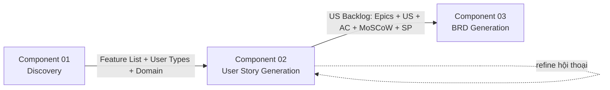

<!--
  Document ID: BRD-USTORY-1.0
  Date: 2026-06-02
  Version: 1.0
  Status: Draft
  Source: BRD per-component cho Component 02 — User Story Generation của sản phẩm BA Super App.
          Chuẩn AIPlat (per-component, BRD↔SRS 1:1). Nguồn năng lực: 01-framework/modules/M2-user-story.md.
          ID dùng REQ-USTORY-## / BR-USTORY-## để KHÔNG lẫn với US-[MODULE]-### mà công cụ SINH RA cho dự án khách.
-->

# BRD — Component 02: User Story Generation

> **Business Requirements** cho **một** component của BA Super App: năng lực **sinh User Story Backlog**. Đặc tả **vì sao & cái gì** ở mức nghiệp vụ; chi tiết chức năng/kỹ thuật ở [SRS 02-user-story](../../02-requirements/srs/02-user-story.md). Khung tổng: [BRD overview](../brd.md). Nguồn năng lực: [`modules/M2-user-story.md`](../../../01-framework/modules/M2-user-story.md).
>
> **Lưu ý meta:** đây là BRD **CỦA** BA Super App (công cụ *làm* User Story). `REQ-USTORY-##` đặc tả yêu cầu *của công cụ*; còn `US-[MODULE]-###` / `EP-[MODULE]-###` là ID mà công cụ **sinh ra** cho dự án khách — hai lớp ID khác nhau, không trộn.

---

## 1. Bối cảnh & mục tiêu nghiệp vụ

Sau Discovery (Component 01) ta có **Feature List + User Types + Domain**, nhưng đó chưa phải thứ dev/QA tiêu thụ được: thiếu ranh giới story, thiếu tiêu chí nghiệm thu, thiếu ưu tiên và ước lượng. Viết user story thủ công thì **chậm, lệch format** (lúc có "So that" lúc không), **AC mơ hồ** (không Given/When/Then nên không test được), **ưu tiên cảm tính** và **vi phạm INVEST** (story quá to, phụ thuộc chéo, không estimate nổi).

Component 02 giải nỗi đau đó: từ feature/Discovery, BA Super App **phân rã Epic → viết User Story chuẩn `As a / I want / So that` → AC dạng Given/When/Then → gán MoSCoW + Story Points (Fibonacci) → tự kiểm INVEST**, xuất ra **User Story Backlog** sạch, có ID và Module, sẵn sàng làm input cho Component 03 (BRD). Mục tiêu: **mỗi feature Must trong Discovery đều có ≥ 1 story phủ; mỗi story đều test được, estimate được, và truy vết được** — không tạo story "mồ côi", không bịa requirement.

## 2. Phạm vi

| In scope | Out of scope |
|---|---|
| Epic Decomposition: feature/module lớn → `EP-[MODULE]-###` | Tự quyết feature nào "đáng làm" thay con người |
| Viết User Story `As a / I want / So that` theo output-standard | Viết test script/automation (chỉ tới mức AC GWT) |
| Acceptance Criteria dạng **Given / When / Then** (happy + validation + edge) | Đặc tả kỹ thuật chi tiết (đó là Component 04 — SRS) |
| Ưu tiên **MoSCoW** + **Story Points** (Fibonacci 1·2·3·5·8·13) | Lập lịch sprint / phân bổ capacity (Component 06) |
| Story Mapping theo user journey (khi journey ≥ 3 bước) | Vẽ diagram nghiệp vụ (Component 05) |
| Quality Gate **INVEST** + gán Module/Epic để về sau map BRD-REQ | Đẩy backlog sang Jira/Azure DevOps (ngoài scope MVP) |
| Discovery rút gọn khi thiếu context (mượn tối thiểu từ M1) | Thay thế việc con người **chốt** backlog |

## 3. Vị trí trong pipeline

> Component 02 là **gốc của chuỗi traceability** `US-[MODULE]-### → BRD-REQ-### → SRS-FR-### → TC-###`. Liên kết US → BRD-REQ chỉ **hình thành ở Component 03**; tại đây chỉ cần story sạch, có ID + Module để về sau map được.

## 4. Business Requirements (REQ-USTORY-##)

| ID | Requirement | Ưu tiên | Nguồn (M2) |
|----|-------------|:------:|-----------|
| REQ-USTORY-01 | Từ Feature List / Discovery Report, công cụ **phân rã Epic**: mỗi module/feature lớn → 1 Epic `EP-[MODULE]-###` → nhiều User Story | 🔴 Must | M2 §Process Step 1 |
| REQ-USTORY-02 | Mỗi User Story viết đúng format **`As a [user] · I want [chức năng] · So that [giá trị]`** và có ID `US-[MODULE]-###` (`[MODULE]` viết HOA) | 🔴 Must | M2 §Output Contract |
| REQ-USTORY-03 | Mỗi User Story có **≥ 1 Acceptance Criteria** dạng **Given / When / Then**, đánh số `AC1`, `AC2`…; tối thiểu phủ happy path + validation/lỗi, thêm edge case khi context có rule rõ | 🔴 Must | M2 §Process Step 3 |
| REQ-USTORY-04 | Mỗi User Story được gán **Priority MoSCoW** (Must/Should/Could/Won't) — kế thừa ưu tiên sơ bộ từ Discovery; lệch thì nêu lý do | 🔴 Must | M2 §Process Step 4 |
| REQ-USTORY-05 | Mỗi User Story được gán **Story Points** theo Fibonacci (1·2·3·5·8·13); story > 8 SP (đặc biệt 13) phải **tách nhỏ** trước khi đưa vào backlog | 🔴 Must | M2 §Process Step 4 |
| REQ-USTORY-06 | Công cụ **tự chạy Quality Gate INVEST** (Independent/Negotiable/Valuable/Estimable/Small/Testable); story đạt < ngưỡng → KHÔNG đưa vào backlog "ready", nêu rõ thiếu gì + đề xuất sửa | 🔴 Must | M2 §Quality Gate + Gate 2 |
| REQ-USTORY-07 | Xuất **User Story Backlog**: khối từng US + **bảng backlog tổng** (`ID \| Tiêu đề \| Epic \| Priority \| SP \| Sprint`) + **bảng overview** (tổng Epic/US/SP, số Must-have) | 🔴 Must | M2 §Output Contract |
| REQ-USTORY-08 | **Story Mapping** theo user journey để lộ story còn thiếu và tách lớp MVP vs nâng cao; dùng Mermaid khi journey ≥ 3 bước | 🟡 Should | M2 §Process Step 2 |
| REQ-USTORY-09 | Khi context thiếu (chưa có Feature List/actor/MVP cut), công cụ **hỏi Socratic** (options + default, tối đa 3–5 câu) hoặc chạy **Discovery rút gọn** — KHÔNG bịa feature | 🔴 Must | M2 §Socratic + §Stop Conditions |
| REQ-USTORY-10 | Mọi business rule rút từ context phải **gắn nguồn**; rule chưa có nguồn → đánh dấu `⚠️ Assumption` và xin xác nhận, KHÔNG nhúng vào AC như sự thật | 🔴 Must | M2 §Process Step 3 + §Stop Conditions |
| REQ-USTORY-11 | Mỗi US gắn **Module/Epic** nhất quán xuyên suốt; KHÔNG tạo US "mồ côi" — mọi US truy được về một feature/Epic trong Discovery, mọi feature Must có ≥ 1 US phủ | 🔴 Must | M2 §Traceability |
| REQ-USTORY-12 | Cuối phase: **tóm tắt backlog** (tổng Epic/US/SP) và **xin xác nhận con người** trước khi chuyển Component 03; refine cùng một story ≤ 3 vòng rồi chốt/escalate | 🔴 Must | M2 §Stop Conditions |

> REQ-USTORY-## ở đây là yêu cầu *của công cụ*. Mỗi REQ map 1:1 tới một FR-USTORY-## trong [SRS](../../02-requirements/srs/02-user-story.md) (xem §9).

## 5. Business Rules (BR-USTORY-##)

- **BR-USTORY-01 — INVEST là luật:** một US chỉ "ready" khi đạt **≥ 5/6** tiêu chí INVEST **và** có đủ: ID đúng convention · format As-a/I-want/So-that · ≥ 1 AC GWT · Priority · Story Points. (kế thừa [BR-CORE-01](../brd.md#5-cross-cutting-business-rules), đồng bộ Gate 2.)
- **BR-USTORY-02 — Trần Story Points = 8:** không story nào vào backlog "ready" với SP = 13; gặp 13 → bắt buộc tách. Mục tiêu mỗi story **1–8 SP**, gọn trong 1 sprint.
- **BR-USTORY-03 — AC luôn Given/When/Then:** không chấp nhận AC dạng tự do; mỗi US ≥ 1 AC GWT, tối thiểu happy path + một AC validation/lỗi.
- **BR-USTORY-04 — Kế thừa ưu tiên:** MoSCoW của US **mặc định kế thừa** từ MoSCoW sơ bộ ở Discovery; mọi sai lệch phải kèm lý do (không đổi ưu tiên tuỳ tiện).
- **BR-USTORY-05 — Không bịa (kế thừa [BR-CORE-02](../brd.md#5-cross-cutting-business-rules)):** thiếu context → hỏi/Discovery rút gọn; giả định → `⚠️ Assumption`, không coi là thật.
- **BR-USTORY-06 — Không mồ côi:** mọi US phải truy về một feature/Epic của Discovery; `[MODULE]` giữ **nguyên** xuyên pipeline để link US→BRD-REQ→SRS-FR không đứt.
- **BR-USTORY-07 — Con người chốt (kế thừa [BR-CORE-04](../brd.md#5-cross-cutting-business-rules)):** công cụ đề xuất backlog; con người xác nhận trước khi sang phase kế.

## 6. Stakeholders

| Stakeholder | Quan tâm ở Component 02 |
|-------------|--------------------------|
| Business Analyst / PO (người dùng chính) | Sinh backlog nhanh, đúng format, đủ AC, ưu tiên rõ — đỡ viết tay & đỡ lệch chuẩn |
| Dev team (tiêu thụ backlog) | US độc lập, có AC GWT để code; SP để biết khối lượng |
| QA team | AC Given/When/Then đủ happy + validation + edge để viết test case |
| Project Manager / Scrum Master | MoSCoW + Story Points để chuẩn bị sprint planning (Component 06) |

## 7. KPIs / Success Metrics

| KPI | Mục tiêu |
|-----|----------|
| Feature Must → có ≥ 1 US phủ | 100% |
| US đúng format As-a/I-want/So-that + có ID | 100% |
| US có ≥ 1 AC dạng Given/When/Then | 100% |
| US đạt INVEST ≥ 5/6 khi đưa vào backlog "ready" | 100% |
| US có Priority (MoSCoW) + Story Points | 100% |
| Story vi phạm trần SP (=13) còn sót trong backlog "ready" | 0 |
| Quy mô backlog tối ưu/dự án | 15–60 user story |

## 8. Assumptions & Dependencies

> ⚠️ **Assumption:** ngưỡng INVEST "≥ 5/6" và trần Story Points "= 8 (không 13)" lấy theo M2 §Quality Gate + §Stop Conditions; nếu một dự án khách muốn ngưỡng khác, phải khai ở project-context, không sửa cứng trong module.

> ⚠️ **Assumption:** thang quy đổi MoSCoW ↔ Story Points (Must≈1–2, Should≈3, Could≈5, Won't≈8) ở M2 là **tham chiếu rút gọn** để gợi ý, KHÔNG phải ràng buộc cứng — Story Points vẫn ước theo độ phức tạp thực của từng story.

- **Phụ thuộc Component 01 (Discovery):** cần Feature List + User Types + Domain. Thiếu → REQ-USTORY-09 (hỏi Socratic / Discovery rút gọn).
- **Phụ thuộc Core:** [output-standard](../../../01-framework/core/output-standard.md) (format US/AC/ID), [quality-gates Gate 2](../../../01-framework/core/quality-gates.md) (INVEST).
- **Bị phụ thuộc bởi Component 03 (BRD):** backlog ở đây là input để gom thành `BRD-REQ`.

## 9. Traceability & Revision

| REQ (BRD) | → FR (SRS) | Năng lực |
|-----------|-----------|----------|
| REQ-USTORY-01 | FR-USTORY-01 | Epic decomposition |
| REQ-USTORY-02 | FR-USTORY-02 | Viết US As-a/I-want/So-that + ID |
| REQ-USTORY-03 | FR-USTORY-03 | AC Given/When/Then |
| REQ-USTORY-04 | FR-USTORY-04 | Priority MoSCoW |
| REQ-USTORY-05 | FR-USTORY-05 | Story Points (Fibonacci) |
| REQ-USTORY-06 | FR-USTORY-06 | Quality Gate INVEST |
| REQ-USTORY-07 | FR-USTORY-07 | Xuất backlog + bảng tổng/overview |
| REQ-USTORY-08 | FR-USTORY-08 | Story Mapping (Mermaid) |
| REQ-USTORY-09 | FR-USTORY-09 | Socratic / Discovery rút gọn khi thiếu |
| REQ-USTORY-10 | FR-USTORY-10 | Grounding rule + `⚠️ Assumption` |
| REQ-USTORY-11 | FR-USTORY-02, FR-USTORY-07 | Module/Epic, không mồ côi |
| REQ-USTORY-12 | FR-USTORY-06 (NFR-USTORY-02) | Tóm tắt + human-in-the-loop |

- **Map lên overview:** Component 02 hiện thực [REQ-002](../brd.md#4-business-requirements-mức-tổng--req-) (pipeline + output chuẩn), [REQ-003](../brd.md#4-business-requirements-mức-tổng--req-) (traceability), [REQ-004](../brd.md#4-business-requirements-mức-tổng--req-) (quality gate), [REQ-006](../brd.md#4-business-requirements-mức-tổng--req-) (domain-adaptive), [REQ-010](../brd.md#4-business-requirements-mức-tổng--req-) (human-in-the-loop).
- **Revision:** v1.0 (2026-06-02) — bản đầu, theo chuẩn AIPlat.

---

*BRD Component 02 (User Story Generation) v1.0 — 12 REQ-USTORY + 7 BR-USTORY; 1:1 với [SRS 02-user-story](../../02-requirements/srs/02-user-story.md); nguồn năng lực [M2-user-story](../../../01-framework/modules/M2-user-story.md).*
