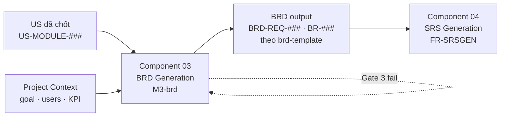

<!--
  Document ID: BRD-BRDGEN-1.0
  Date: 2026-06-02
  Version: 1.0
  Status: Draft
  Source: BRD per-component cho Component 03 — BRD Generation của sản phẩm BA Super App.
          Capability = khả năng SINH BRD (objectives/scope/stakeholders/BRD-REQ/business rules/KPIs) từ User Stories + context.
          Framework source: 01-framework/modules/M3-brd.md (+ templates/brd-template.md). Chuẩn AIPlat, BRD↔SRS 1:1.
-->

# Component 03: BRD Generation — BRD (Business Requirements Document)

> BRD **per-component** cho năng lực **BRD Generation** của BA Super App. Đặc tả **vì sao & cái gì** ở mức nghiệp vụ cho riêng component này; chi tiết chức năng/kỹ thuật ở [SRS 03](../../02-requirements/srs/03-brd-generation.md). Bối cảnh tổng: [BRD overview](../brd.md) · năng lực gốc: [`modules/M3-brd.md`](../../../01-framework/modules/M3-brd.md).
>
> **Lưu ý meta (đọc kỹ).** Đây là BRD **CỦA công cụ** — đặc tả *khả năng sinh BRD* của BA Super App, KHÔNG phải một BRD do công cụ sinh ra cho dự án khách. Vì vậy có hai lớp ID tách bạch:
> - `REQ-BRDGEN-##` / `BR-BRDGEN-##` — yêu cầu & rule nghiệp vụ **của component này** (tài liệu bạn đang đọc).
> - `BRD-REQ-###` / `BR-###` — artefact mà công cụ **sinh ra** trong BRD đầu ra cho dự án khách (chỉ là *dữ liệu output*, không phải yêu cầu của tool).

---

## 1. Bối cảnh & mục tiêu nghiệp vụ

Trong pipeline BA (`Discovery → User Story → BRD → SRS → Diagram → Sprint`), **BRD là tầng business nối giữa US và SRS**: US nói *người dùng cần gì*, SRS nói *hệ thống xây ra sao*, còn BRD trả lời *tại sao dự án tồn tại, làm gì / không làm, ai liên quan, ràng buộc nào chi phối, đo thành công bằng gì*. Khi làm thủ công, bước này tốn thời gian, hay sao chép US 1-1 (không trừu tượng hoá), dễ đứt traceability `US → BRD-REQ` và thiếu KPI đo được.

**Component 03 — BRD Generation** là prompt-fragment (hiện thực bởi [`M3-brd.md`](../../../01-framework/modules/M3-brd.md)) đảm nhận: nhận **User Stories đã chốt** (`US-[MODULE]-###`) + project context → **sinh một Business Requirements Document chuẩn doanh nghiệp** theo [`brd-template.md`](../../../01-framework/templates/brd-template.md), gồm Executive Summary, Business Objectives + KPIs, Scope (in/out), Stakeholders (RACI) + User Personas, **Business Requirements (`BRD-REQ-###`)**, **Business Rules (`BR-###`)**, Assumptions/Constraints và **bảng Traceability `US → BRD-REQ`**.

**Mục tiêu nghiệp vụ:** biến backlog US đã chốt thành tài liệu nghiệp vụ *trừu tượng hoá, có rationale nối về objective, có rule dùng chung và traceability đầy đủ* — nhanh, nhất quán, không bịa — để làm input tin cậy cho Component 04 (SRS Generation).

> Component này hiện thực các yêu cầu tổng **REQ-002** (pipeline + output chuẩn), **REQ-003** (traceability), **REQ-004** (quality gate), **REQ-006** (domain-adaptive), **REQ-010** (human-in-the-loop) của [BRD overview](../brd.md) ở phạm vi phase BRD.

## 2. Phạm vi (Scope)

| In scope (component này LÀM) | Out of scope (component này KHÔNG làm) |
|---|---|
| Gom nhóm US theo Epic/module thành cụm ứng viên cho `BRD-REQ` | Sinh User Story (việc của Component 02 / M2) |
| Rút **Objectives + KPIs** đo được từ `business_goal` + `success_metrics` của context | Sinh `SRS-FR-###` / đặc tả chức năng hệ thống (Component 04 / M4) |
| Chốt **Scope** In/Out (suy từ feature có/không có US) | Vẽ sơ đồ As-Is/To-Be, ERD, sequence chi tiết (Component 05 / M5) |
| Lập **Stakeholders + RACI** và **User Personas** khớp user types của US | Sprint plan / estimate (Component 06 / M6) |
| Sinh **Business Requirements** `BRD-REQ-###` (mô tả · rationale · priority · Source · BR) | Tự "chốt"/phê duyệt BRD thay con người |
| Nâng AC lặp lại thành **Business Rules** `BR-###` dùng chung | Tạo yêu cầu mới ngoài US/context (no-fabrication) |
| Lập bảng **Traceability `US → BRD-REQ`** (cột SRS-FR để trống cho M4) | Lưu trữ/ănload/export file (việc của Component 07 — Web Workspace) |
| Tự chạy **Quality Gate 3 — Business Completeness** | Render Mermaid / UI (Web Workspace) |
| Xuất theo `brd-template.md` + YAML header `document_type: "BRD"` | — |

## 3. Stakeholders & Users (của component)

| Stakeholder | Vai trò với BRD Generation | RACI | Mối quan tâm chính |
|-------------|----------------------------|:----:|--------------------|
| Business Analyst / PO (người dùng chính) | Cung cấp US + context, refine BRD, xác nhận để sang M4 | **A** | Sinh BRD nhanh, đúng chuẩn, không phải copy US thủ công |
| Master Controller (điều phối pipeline) | Route vào phase BRD, kiểm precondition, load M3 | **R** | Đủ context + ≥1 US trước khi sinh; gate đạt mới sang M4 |
| Component 02 — User Story (upstream) | Cung cấp `US-[MODULE]-###` đã qua INVEST gate | C | US sạch, có ID + Module để gom nhóm |
| Component 04 — SRS Generation (downstream) | Tiêu thụ `BRD-REQ-###` để derive `SRS-FR-###` | C | BRD-REQ rõ, có Source + BR, traceability không đứt |
| Dev/QA team (người tiêu thụ cuối) | Đọc BRD hiểu bối cảnh nghiệp vụ & rule | I | Business rules & scope rõ ràng |
| Business Sponsor / Dept Head | Người **Accountable** phê duyệt BRD đầu ra (trường `approved_by`) | I | KPI & scope phản ánh đúng mục tiêu kinh doanh |

> Bảng RACI ở trên là cho *bản thân component*. RACI mà công cụ **sinh ra** trong §4 của BRD output cho dự án khách là dữ liệu riêng (theo stakeholder của dự án đó).

## 4. Capability ↔ BRD ↔ SRS (định vị trong trục 7 component)

| Thuộc tính | Giá trị |
|---|---|
| Component # | 03 |
| Tên | BRD Generation |
| Prefix ID | `BRDGEN` |
| Pipeline phase | 3 — BRD (giữa **02 User Story** và **04 SRS**) |
| Bản chất | prompt-fragment (LLM load theo phase) |
| Framework source | [`modules/M3-brd.md`](../../../01-framework/modules/M3-brd.md) + [`templates/brd-template.md`](../../../01-framework/templates/brd-template.md) |
| Input | User Stories đã chốt (`US-[MODULE]-###`) + project context |
| Output | Business Requirements Document (theo `brd-template.md`) |
| BRD (file này) | `brd/03-brd-generation.md` |
| SRS (1:1) | [`srs/03-brd-generation.md`](../../02-requirements/srs/03-brd-generation.md) |
| Quality Gate | Gate 3 — Business Completeness |

## 5. Business Requirements (REQ-BRDGEN-##)

> Yêu cầu nghiệp vụ **của component này**. Mỗi REQ: mô tả · rationale (nối mục tiêu §1) · priority (MoSCoW) · Source (mục M3 / yêu cầu tổng làm căn cứ) · Business Rules liên quan. Hiện thực chi tiết → `FR-BRDGEN-##` trong [SRS 03](../../02-requirements/srs/03-brd-generation.md).

### REQ-BRDGEN-01: Kiểm tra precondition trước khi sinh BRD
- **Mô tả:** Trước khi sinh BRD, component phải xác nhận đủ **project context** *và* **≥1 User Story đã chốt** có ID `US-[MODULE]-###`. Thiếu precondition cứng → KHÔNG sinh BRD; chạy Discovery rút gọn hoặc quay lại M2 (Component 02).
- **Rationale:** Chặn việc bịa yêu cầu khi không có nguồn — nền tảng của no-fabrication (BR-BRDGEN-01).
- **Priority:** 🔴 Must
- **Source:** M3 §Inputs/Preconditions, §Stop Conditions(1); REQ-002, REQ-010 (overview)
- **Business Rules:** BR-BRDGEN-01, BR-BRDGEN-02

### REQ-BRDGEN-02: Gom nhóm US → ứng viên BRD-REQ (B1)
- **Mô tả:** Component gom các US cùng module/epic thành cụm; mỗi cụm là ứng viên cho **một** `BRD-REQ`. Ưu tiên gộp nhiều US liên quan vào 1 BRD-REQ để giảm trùng lặp, thay vì ánh xạ 1-1.
- **Rationale:** Trừu tượng hoá US thành yêu cầu nghiệp vụ là giá trị cốt lõi của tầng BRD; tránh "copy US".
- **Priority:** 🔴 Must
- **Source:** M3 §Process(B1), §Conversion Rules; REQ-002
- **Business Rules:** BR-BRDGEN-03, BR-BRDGEN-04

### REQ-BRDGEN-03: Rút Objectives + KPIs đo được (B2)
- **Mô tả:** Từ `business_goal` + `success_metrics` của context → **2–5 Business Objectives** (`BO-###`), mỗi objective có **metric + target + timeline**. Không có target trong nguồn → đề xuất nháp và gắn `⚠️ Assumption`.
- **Rationale:** BRD phải đo được thành công; objective là mỏ neo cho rationale của mọi BRD-REQ.
- **Priority:** 🔴 Must
- **Source:** M3 §Process(B2), §Output Contract; REQ-002
- **Business Rules:** BR-BRDGEN-02, BR-BRDGEN-06

### REQ-BRDGEN-04: Chốt Scope In/Out (B3)
- **Mô tả:** Liệt kê **In-Scope** (suy từ epic/feature có US) và **Out-of-Scope** (feature không có US hoặc user đã loại — kèm lý do). Phân biệt rõ để chặn scope creep ở M4.
- **Rationale:** Ranh giới scope rõ ràng là tiêu chí Gate 3 #1 và bảo vệ downstream khỏi phình yêu cầu.
- **Priority:** 🔴 Must
- **Source:** M3 §Process(B3), §Quality Gate(#1)
- **Business Rules:** BR-BRDGEN-04, BR-BRDGEN-02

### REQ-BRDGEN-05: Map Stakeholders + RACI và User Personas (B4)
- **Mô tả:** Từ user types + stakeholder map → bảng **Stakeholders kèm RACI** (bắt buộc ≥1 **Accountable**) và bảng **User Personas**. User types phải **nhất quán** với `As a ...` trong US.
- **Rationale:** Xác định ai chịu trách nhiệm/phê duyệt; consistency user types giữ traceability không gãy.
- **Priority:** 🔴 Must
- **Source:** M3 §Process(B4), §Quality Gate(#2,#7)
- **Business Rules:** BR-BRDGEN-05, BR-BRDGEN-07

### REQ-BRDGEN-06: Sinh Business Requirements BRD-REQ-### (B5)
- **Mô tả:** Mỗi cụm US → một `BRD-REQ-[###]` (3 chữ số, từ `001`, tăng dần không nhảy số) với **bắt buộc**: mô tả nghiệp vụ · **rationale** (nối Objective) · **priority** (MoSCoW, lấy cao nhất trong cụm) · **Source** (liệt kê đầy đủ US-ID đã gộp) · liên kết **Business Rules**.
- **Rationale:** Đây là sản phẩm trung tâm của BRD; cấu trúc tối thiểu đảm bảo chất lượng & truy vết.
- **Priority:** 🔴 Must
- **Source:** M3 §Process(B5), §Output Contract, §Conversion Rules; REQ-002, REQ-003
- **Business Rules:** BR-BRDGEN-03, BR-BRDGEN-06, BR-BRDGEN-08

### REQ-BRDGEN-07: Nâng AC lặp lại thành Business Rules BR-### (B5)
- **Mô tả:** Trích các điều kiện/ngưỡng trong Acceptance Criteria (Given/When/Then) **lặp lại ở nhiều US** thành **Business Rules dùng chung** `BR-[###]`, mỗi rule có mô tả + impact; liên kết ngược về các BRD-REQ dùng nó.
- **Rationale:** Hợp nhất rule giảm trùng lặp, làm rõ ràng buộc chi phối; là tiêu chí Gate 3 #3.
- **Priority:** 🟡 Should
- **Source:** M3 §Conversion Rules (AC → BR), §Quality Gate(#3); REQ-003
- **Business Rules:** BR-BRDGEN-03, BR-BRDGEN-06

### REQ-BRDGEN-08: Lập bảng Traceability US → BRD-REQ (B6)
- **Mô tả:** Lập bảng traceability `US → BRD-REQ`: **mọi US xuất hiện ≥1 lần**, **mọi BRD-REQ dẫn về ≥1 US** (không có yêu cầu "mồ côi"). Cột `SRS-FR` để trống/đánh `→ M4` cho Component 04 điền sau.
- **Rationale:** Traceability là yêu cầu tổng REQ-003 và tiêu chí Gate 3 #6; là cầu nối sang M4.
- **Priority:** 🔴 Must
- **Source:** M3 §Process(B6), §Traceability, §Quality Gate(#6); REQ-003
- **Business Rules:** BR-BRDGEN-08

### REQ-BRDGEN-09: Xuất đúng brd-template + YAML header
- **Mô tả:** Output phải theo đúng [`brd-template.md`](../../../01-framework/templates/brd-template.md) (giữ nguyên thứ tự & heading §1..§9, mục trống → `[Chưa xác định]`, không bỏ section) và mang **YAML frontmatter** theo `output-standard` (`document_type: "BRD"`, version, date, `author: "BA Super App"`, status). Priority dùng nhãn 🔴/🟡/🟢/⚪. Mermaid render-ready khi có sơ đồ.
- **Rationale:** Một chuẩn output nhất quán (REQ-002) — điều kiện để downstream & web tiêu thụ.
- **Priority:** 🔴 Must
- **Source:** M3 §Output Contract; `core/output-standard.md`; REQ-002
- **Business Rules:** BR-BRDGEN-06, BR-BRDGEN-09

### REQ-BRDGEN-10: Tự chạy Quality Gate 3 (Business Completeness)
- **Mô tả:** Sau khi sinh BRD, component tự chạy **Gate 3** với 7 check (Scope · Stakeholders+RACI · Business Rules · Objectives/KPIs · Assumptions · Traceability · Consistency), báo cáo bảng ✅/⚠️/❌. **Chưa đạt → KHÔNG sang M4**; nêu check fail + đề xuất sửa, quay lại B5/B6.
- **Rationale:** Fail-closed gate đảm bảo BRD đủ chất lượng làm input cho SRS (REQ-004).
- **Priority:** 🔴 Must
- **Source:** M3 §Quality Gate(Gate 3), §Stop Conditions; REQ-004
- **Business Rules:** BR-BRDGEN-09, BR-BRDGEN-10

### REQ-BRDGEN-11: Domain-adaptive qua biến
- **Mô tả:** Mọi suy luận theo ngành dùng biến `[DOMAIN]/[USER_TYPE]/[SYSTEM]/[COMPLIANCE]` lấy từ context — KHÔNG hardcode một ngành. Đặc biệt: nếu `[DOMAIN]` ∈ {banking, insurance, fintech, healthcare} thì chủ động cảnh báo ràng buộc compliance (PDPA/PCI-DSS/HIPAA/SOC2) ở mục Assumptions/Constraints.
- **Rationale:** Tái sử dụng đa ngành là yêu cầu nền tảng (REQ-006); domain nhạy cảm cần nhắc tuân thủ.
- **Priority:** 🔴 Must
- **Source:** M3 §Socratic(Q5), §Inputs(compliance); REQ-006
- **Business Rules:** BR-BRDGEN-11

### REQ-BRDGEN-12: Refine hội thoại & human-in-the-loop
- **Mô tả:** Cho phép refine scope/priority/BRD-REQ qua hội thoại mà **không phá traceability**; cuối phase **tóm tắt BRD + xin xác nhận con người** trước khi sang M4. Component **không tự đóng** yêu cầu. Refine cùng một mục > 3 vòng → đề xuất chốt mặc định / escalate.
- **Rationale:** AI đề xuất, con người quyết (REQ-005, REQ-010); chống lặp vô hạn.
- **Priority:** 🟡 Should
- **Source:** M3 §Stop Conditions(3,4), §Output Contract (1 câu hỏi refine); REQ-005, REQ-010
- **Business Rules:** BR-BRDGEN-10, BR-BRDGEN-12

## 6. Business Rules (BR-BRDGEN-##)

> Ràng buộc nghiệp vụ chi phối cách component vận hành (rule **của tool**, không phải `BR-###` mà tool sinh ra).

| # | Rule | Mô tả | Impact |
|---|------|-------|--------|
| BR-BRDGEN-01 | Precondition cứng | Phải có context **và** ≥1 US mới sinh BRD | REQ-BRDGEN-01: thiếu → dừng, không bịa |
| BR-BRDGEN-02 | No-fabrication | Không tạo yêu cầu/objective/rule ngoài US+context; thiếu → hỏi, giả định → `⚠️ Assumption` | Toàn bộ B2–B5; Gate #5 |
| BR-BRDGEN-03 | Không copy US 1-1 | BRD-REQ là **trừu tượng hoá** cụm US, không chép nguyên văn | REQ-BRDGEN-02/06/07 |
| BR-BRDGEN-04 | Feature không có US | Feature thiếu US → đưa **Out-of-Scope** hoặc gắn `⚠️ Assumption` + hỏi; KHÔNG tự tạo yêu cầu | REQ-BRDGEN-02/04 |
| BR-BRDGEN-05 | RACI ≥1 Accountable | Bảng stakeholder bắt buộc có đúng nguồn 1 **Accountable** cho phê duyệt | REQ-BRDGEN-05; Gate #2 |
| BR-BRDGEN-06 | ID & priority convention | `BRD-REQ-[###]` 3 số tăng dần không nhảy; `BR-[###]`; priority 🔴/🟡/🟢/⚪; BRD-REQ lấy priority cao nhất trong cụm US | REQ-BRDGEN-03/06/07/09 |
| BR-BRDGEN-07 | Consistency user types | User type trong persona/stakeholder phải khớp `As a ...` của US | REQ-BRDGEN-05; Gate #7 |
| BR-BRDGEN-08 | Traceability hai chiều | Mọi US phủ ≥1 BRD-REQ; mọi BRD-REQ dẫn ≥1 US (Source); không "mồ côi" | REQ-BRDGEN-06/08; Gate #6 |
| BR-BRDGEN-09 | Output theo template + gate fail-closed | Xuất đúng `brd-template.md` + YAML header; Gate 3 chưa đạt → không sang M4 | REQ-BRDGEN-09/10 |
| BR-BRDGEN-10 | Human-in-the-loop | Con người chốt cuối phase; AI không tự "đóng" BRD; refine >3 vòng → escalate | REQ-BRDGEN-10/12 |
| BR-BRDGEN-11 | Domain qua biến | `[DOMAIN]/[USER_TYPE]/[SYSTEM]/[COMPLIANCE]` từ context; cảnh báo compliance khi domain nhạy cảm | REQ-BRDGEN-11 |
| BR-BRDGEN-12 | Scope guard | Yêu cầu ngoài scope/domain đã khai → báo giới hạn, quay lại Discovery/US, không tự thêm vào BRD | REQ-BRDGEN-12 |

## 7. KPIs / Success Metrics (của component)

| KPI | Mô tả | Baseline | Target | Cách đo |
|-----|-------|----------|--------|---------|
| Traceability coverage | % US được phủ trong bảng `US → BRD-REQ` | thủ công hay đứt | **100%** | Đếm US không map / tổng US (Gate #6) |
| BRD-REQ không mồ côi | % BRD-REQ có ≥1 US ở Source | — | **100%** | Đếm BRD-REQ rỗng Source |
| Objective đo được | % objective có metric + target + timeline | thường thiếu target | **100%** | Soát bảng §2 (Gate #4) |
| Tỷ lệ gộp (abstraction) | Trung bình US / BRD-REQ (giảm copy 1-1) | ~1.0 (copy) | **> 1.0** | tổng US / tổng BRD-REQ |
| Gate 3 pass-rate trước M4 | % lần BRD qua đủ 7 check trước khi sang M4 | — | **100%** | Báo cáo Gate 3 |
| Assumption đánh dấu | % giả định có nhãn `⚠️ Assumption` | dễ lẫn vào fact | **100%** | Soát text (Gate #5) |

## 8. Assumptions & Constraints

### 8.1 Assumptions
- ⚠️ **Assumption:** US đầu vào đã qua **INVEST gate** ở Component 02 (sạch, có ID `US-[MODULE]-###` + Module) — M3 không tự kiểm lại chất lượng US, chỉ gom nhóm.
- ⚠️ **Assumption:** `business_goal` / `success_metrics` trong project context đủ để rút ≥2 objective; nếu thiếu, component đề xuất KPI nháp theo `[DOMAIN]` và gắn `⚠️ Assumption` (không coi là chốt).
- ⚠️ **Assumption:** Việc lưu/đọc/export file BRD do **Component 07 (Web Workspace)** đảm nhận; component này chỉ *sinh nội dung*, không quản lý vòng đời file.

### 8.2 Constraints
- Hoạt động như **prompt-fragment** load theo phase (LLM), bám `master_prompt` + `core/output-standard` — không phải dịch vụ độc lập.
- Output **bắt buộc** đúng `brd-template.md` (§1..§9) + YAML `document_type: "BRD"`; không tự ý đổi khung.
- **Không** vẽ As-Is/To-Be, ERD, sequence (để Component 05) và **không** sinh `SRS-FR-###` (để Component 04).
- `[COMPLIANCE]`: nếu `[DOMAIN]` ∈ {banking, insurance, fintech, healthcare} phải nêu ràng buộc tuân thủ tương ứng ở §8.2 của BRD output.

## 9. Traceability

> `REQ-BRDGEN-## → FR-BRDGEN-##` (sang [SRS 03](../../02-requirements/srs/03-brd-generation.md)). Mỗi REQ map ≥1 FR; không REQ nào mồ côi.

| REQ-BRDGEN (BRD) | Mô tả ngắn | FR-BRDGEN (SRS) |
|------------------|-----------|-----------------|
| REQ-BRDGEN-01 | Kiểm precondition (context + ≥1 US) | FR-BRDGEN-01 |
| REQ-BRDGEN-02 | Gom nhóm US → ứng viên BRD-REQ (B1) | FR-BRDGEN-02 |
| REQ-BRDGEN-03 | Rút Objectives + KPIs (B2) | FR-BRDGEN-03 |
| REQ-BRDGEN-04 | Chốt Scope In/Out (B3) | FR-BRDGEN-04 |
| REQ-BRDGEN-05 | Stakeholders + RACI + Personas (B4) | FR-BRDGEN-05 |
| REQ-BRDGEN-06 | Sinh BRD-REQ-### (B5) | FR-BRDGEN-06 |
| REQ-BRDGEN-07 | Nâng AC → BR-### (B5) | FR-BRDGEN-06, FR-BRDGEN-07 |
| REQ-BRDGEN-08 | Traceability US → BRD-REQ (B6) | FR-BRDGEN-07 |
| REQ-BRDGEN-09 | Xuất theo brd-template + YAML | FR-BRDGEN-08 |
| REQ-BRDGEN-10 | Quality Gate 3 fail-closed | FR-BRDGEN-09 |
| REQ-BRDGEN-11 | Domain-adaptive qua biến | FR-BRDGEN-06, FR-BRDGEN-10 |
| REQ-BRDGEN-12 | Refine + human-in-the-loop | FR-BRDGEN-10 |

---

## Lịch sử thay đổi

| Version | Ngày | Thay đổi | Người |
|---------|------|----------|-------|
| 1.0 | 2026-06-02 | Khởi tạo BRD per-component cho Component 03 — BRD Generation (12 REQ-BRDGEN, 12 BR-BRDGEN) | BA Super App |
