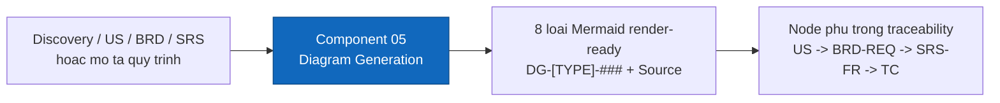

<!--
  Document ID: BRD-DIAG-1.0
  Date: 2026-06-02
  Version: 1.0
  Status: Draft
  Source: BRD per-component cho Component 05 (Diagram Generation) của sản phẩm BA Super App. Grounding: 01-framework/modules/M5-diagram.md + 01-framework/templates/diagram-catalog.md. Chuẩn AIPlat (per-component, BRD↔SRS 1:1).
-->

# BRD — Component 05: Diagram Generation (`DIAG`)

> **Business view** của năng lực **sinh sơ đồ** trong BA Super App. Đặc tả **vì sao & cái gì** ở mức nghiệp vụ cho component này; chi tiết chức năng/kỹ thuật ở [SRS 05-diagram](../../02-requirements/srs/05-diagram.md). Bối cảnh sản phẩm: [BRD overview](../brd.md).
>
> **Phạm vi meta:** đây là BRD **CỦA** một năng lực trong BA Super App (công cụ làm tài liệu BA). ID dùng `REQ-DIAG-##` / `BR-DIAG-##` để không lẫn với `DG-[TYPE]-###` mà công cụ *sinh ra* cho dự án khách.
>
> **Framework source:** [`modules/M5-diagram.md`](../../../01-framework/modules/M5-diagram.md) (+ [`templates/diagram-catalog.md`](../../../01-framework/templates/diagram-catalog.md)).

---

## 1. Bối cảnh & mục tiêu nghiệp vụ

Tài liệu BA (BRD/SRS/User Story/Discovery) phần lớn là **văn bản**: stakeholder phi kỹ thuật khó nắm nhanh một quy trình nhiều bên, một vòng đời trạng thái, hay một mô hình dữ liệu chỉ qua chữ. Vẽ sơ đồ thủ công thì chậm, không nhất quán ký hiệu, và dễ "trôi" khỏi nguồn (sơ đồ mô tả thứ tài liệu không hề nói).

Component 05 biến **một artifact nghiệp vụ hoặc một mô tả quy trình bằng lời → sơ đồ Mermaid hợp lệ, đúng loại, đọc được**, kèm giải thích ngắn cho stakeholder. Sơ đồ là phương tiện *truyền đạt* phân tích, không phải để trang trí — mỗi sơ đồ phải trả lời **một câu hỏi cụ thể** của người đọc.

Mục tiêu nghiệp vụ:
- **Trực quan hoá nhanh** bất kỳ tài liệu nào thành sơ đồ render-ready, dán-là-chạy.
- **Đúng loại cho đúng câu hỏi** — chọn loại sơ đồ dựa trên câu hỏi người đọc cần trả lời (Selection Guide), không vẽ bừa.
- **Bám nguồn (grounding)** — mọi node/lifeline/state/entity truy được về một dòng trong nguồn, hoặc đánh dấu `⚠️ Assumption`; không có node "mồ côi".
- **Nhúng được vào chuỗi traceability** — mỗi sơ đồ có ID `DG-[TYPE]-###` và **Source**, là node phụ trong `US → BRD-REQ → SRS-FR → TC (+ DG-[TYPE]-###)`.

## 2. Phạm vi

| In scope | Out of scope |
|---|---|
| Sinh **8 loại sơ đồ** Mermaid: BPMN/Swimlane, Flowchart/Activity, Sequence, State machine, ERD, C4 Context, User Journey, Mindmap | Loại sơ đồ ngoài 8 loại của catalog (UML class đầy đủ, Gantt, network…) |
| **Selection Guide** chọn loại theo câu hỏi cần trả lời (+ Socratic Q1 khi chưa rõ loại) | Tự nghĩ ra quy trình/entity/trạng thái không có trong nguồn |
| Output Mermaid **render-ready** (quote nhãn đặc biệt, cú pháp hợp lệ theo từng loại) | Sửa văn bản tài liệu đã có (→ tools/chatbot-edit) |
| ID `DG-[TYPE]-###` + **Source** + giải thích ngắn cho mỗi sơ đồ | Viết yêu cầu (→ M2/M3/M4), lập sprint (→ M6) |
| **diagram-catalog** làm thư viện mẫu (8 mẫu chuẩn) | Render ảnh/PNG phía hệ thống (việc của trình xem Mermaid / web app) |

## 3. Định vị trong pipeline

Component 05 là **phase 5** của pipeline (`01 → 02 → 03 → 04 → 05 → 06`). Đây là **module load on-demand**: Master Controller route vào khi intent người dùng là "vẽ / tạo sơ đồ / diagram / BPMN / sequence / ERD…" hoặc "sơ đồ hoá BRD/SRS này". Sơ đồ là *dẫn xuất* — nó tiêu thụ artifact của các phase trước (Discovery/US/BRD/SRS) hoặc một mô tả quy trình bằng lời.

> **Liên kết:** không phải bước tuần tự bắt buộc — có thể gọi bất kỳ lúc nào để minh hoạ một artifact đã có. Web (Component 07) là vỏ chạy/hiển thị sơ đồ.

## 4. Business Requirements (REQ-DIAG-##)

| ID | Requirement | Priority |
|----|-------------|:--------:|
| REQ-DIAG-01 | Từ **bất kỳ tài liệu** (BRD/SRS/US/Discovery) hoặc mô tả quy trình bằng lời, sinh được sơ đồ Mermaid tương ứng | 🔴 Must |
| REQ-DIAG-02 | Hỗ trợ **đủ 8 loại sơ đồ**: BPMN/Swimlane, Flowchart/Activity, Sequence, State machine, ERD, C4 Context, User Journey, Mindmap | 🔴 Must |
| REQ-DIAG-03 | Mọi sơ đồ **render-ready** — dán vào trình xem Mermaid là chạy ngay, không lỗi cú pháp | 🔴 Must |
| REQ-DIAG-04 | **Chọn đúng loại** theo câu hỏi người đọc cần trả lời (Selection Guide); chưa rõ loại → hỏi Socratic Q1 kèm options | 🔴 Must |
| REQ-DIAG-05 | Mỗi sơ đồ có **ID `DG-[TYPE]-###` + Source** để truy vết về nguồn | 🔴 Must |
| REQ-DIAG-06 | **Bám nguồn**: mọi node/lifeline/state/entity truy được về nguồn, hoặc đánh dấu `⚠️ Assumption`; không bịa quy trình/thực thể | 🔴 Must |
| REQ-DIAG-07 | Mỗi sơ đồ kèm **giải thích ngắn** (1–3 câu, ngôn ngữ stakeholder) "sơ đồ này nói gì" | 🟡 Should |
| REQ-DIAG-08 | **Catalog 8 mẫu** chuẩn (dán-là-chạy) làm nguồn cú pháp; không sáng tạo cú pháp Mermaid ngoài catalog | 🟡 Should |
| REQ-DIAG-09 | Tránh **quá tải**: sơ đồ > ~15 node → đề xuất tách nhiều sơ đồ theo phạm vi | 🟢 Could |
| REQ-DIAG-10 | Hỗ trợ **refine hội thoại** một sơ đồ (≤ 3 vòng) rồi chốt/escalate | 🟢 Could |

> REQ ở đây map 1:1 sang FR trong [SRS 05-diagram](../../02-requirements/srs/05-diagram.md) (xem §9).

## 5. Business Rules (BR-DIAG-##)

- **BR-DIAG-01 (Grounding / no-fabrication):** sơ đồ là *dẫn xuất*; mọi thành phần phải truy về nguồn HOẶC gắn `⚠️ Assumption`. Thiếu nguồn → hỏi, **không** tự bịa quy trình/entity rồi vẽ.
- **BR-DIAG-02 (Render-ready là điều kiện cứng):** Mermaid lỗi cú pháp = deliverable hỏng. Phải qua Quality Gate trước khi xuất.
- **BR-DIAG-03 (Quote nhãn đặc biệt):** mọi nhãn chứa `/ : ( ) { } > , " ' #` hoặc dấu cách + ký tự lạ phải **quote**: `A["Tao don (moi)"]`, `B{"Hop le?"}`.
- **BR-DIAG-04 (erDiagram type token không ngoặc):** trong `erDiagram`, token *type* và *tên cột* KHÔNG ngoặc kép; chỉ *comment* sau tên cột mới quote — `string email "Email khach hang"`.
- **BR-DIAG-05 (Journey không quote step):** sơ đồ `journey` KHÔNG hỗ trợ ngoặc kép trong tên bước → giữ nhãn đơn giản, tránh `: ( ) ,` trong *tên bước*.
- **BR-DIAG-06 (Đúng loại cho câu hỏi):** chọn loại theo Selection Guide; nếu user yêu cầu loại không khớp câu hỏi (vd "ERD cho quy trình duyệt") → hỏi lại, không vẽ sai loại trong im lặng.
- **BR-DIAG-07 (Human-in-the-loop):** AI đề xuất sơ đồ + 1 câu hỏi refine; con người chốt. Refine quá 3 vòng cùng một sơ đồ → chốt bản tốt nhất hoặc escalate.
- **Kế thừa cross-cut:** [BR-CORE-01..04](../brd.md#5-cross-cutting-business-rules) (output-standard, no-fabrication, một-phase-một-lần, con người chốt).

## 6. Stakeholders

| Stakeholder | Quan tâm với Component 05 |
|-------------|---------------------------|
| Business Analyst / PO (người dùng chính) | Trực quan hoá tài liệu nhanh, đúng loại, không phải vẽ tay |
| Dev/QA team (người tiêu thụ) | Sequence/ERD/State chính xác, render-ready, có Source để truy về SRS-FR |
| Stakeholder phi kỹ thuật | BPMN/Journey/C4 dễ đọc, có giải thích ngắn để hiểu mà không cần đọc cả tài liệu |
| Project Manager | Mindmap phân rã phạm vi, BPMN quy trình để thống nhất scope |

## 7. KPIs / Success Metrics

| KPI | Mục tiêu |
|-----|----------|
| Tỉ lệ sơ đồ render-ready (không lỗi cú pháp) | 100% sơ đồ xuất ra qua Quality Gate |
| Độ phủ loại sơ đồ | Đủ 8 loại khả dụng theo Selection Guide |
| Grounding | 100% node truy về nguồn hoặc gắn `⚠️ Assumption` |
| Quy mô tối ưu mỗi sơ đồ | ≤ ~15 node; lớn hơn → tách |
| Thời gian từ artifact → sơ đồ | Tức thì trong phiên (so với vẽ tay thủ công) |

## 8. Assumptions & Dependencies

> ⚠️ **Assumption:** trình hiển thị phía người đọc (Markdown viewer / web app Component 07) hỗ trợ cú pháp Mermaid của 8 loại trong catalog; component này chịu trách nhiệm sinh **mã** render-ready, không tự render ra ảnh.

> ⚠️ **Assumption:** khi nguồn là artifact của phase trước trong cùng phiên, hệ thống dùng lại artifact đó và **nói rõ đang lấy từ đâu** (Source); không yêu cầu người dùng dán lại.

- **Phụ thuộc nguồn:** cần ít nhất một nguồn (artifact BRD/SRS/US/Discovery hoặc mô tả quy trình bằng lời) — thiếu nguồn thì không vẽ (BR-DIAG-01).
- **Phụ thuộc framework:** cú pháp & mẫu lấy từ [`templates/diagram-catalog.md`](../../../01-framework/templates/diagram-catalog.md); ID convention từ [`core/output-standard.md`](../../../01-framework/core/output-standard.md).
- **Phụ thuộc Master Controller:** route vào M5 đúng intent ("vẽ diagram / BPMN / sequence / ERD…").

## 9. Traceability & Revision

- **REQ → FR:** mỗi `REQ-DIAG-##` map sang `FR-DIAG-##` trong [SRS 05-diagram](../../02-requirements/srs/05-diagram.md):

| REQ (BRD) | → FR (SRS) | Nội dung |
|-----------|-----------|----------|
| REQ-DIAG-01 | FR-DIAG-01 | Tài liệu/mô tả → Mermaid |
| REQ-DIAG-02 | FR-DIAG-02 | 8 loại diagram |
| REQ-DIAG-03 | FR-DIAG-03 | Render-ready (Quality Gate) |
| REQ-DIAG-04 | FR-DIAG-04 | Selection guide + Socratic Q1 |
| REQ-DIAG-05 | FR-DIAG-05 | ID `DG-[TYPE]-###` + Source |
| REQ-DIAG-06 | FR-DIAG-06 | Grounding / Assumption |
| REQ-DIAG-07 | FR-DIAG-07 | Giải thích ngắn (Output Contract) |
| REQ-DIAG-08 | FR-DIAG-08 | Catalog 8 mẫu |
| REQ-DIAG-09 | FR-DIAG-09 | Chống quá tải (tách sơ đồ) |
| REQ-DIAG-10 | FR-DIAG-10 | Refine ≤ 3 vòng |

- **Lên trên:** Component 05 hiện thực phần "Mermaid render-ready" của [REQ-002](../brd.md#4-business-requirements-mức-tổng--req) (output chuẩn) trong BRD overview.
- **Revision:** v1.0 (2026-06-02) — bản đầu, bám `M5-diagram.md`, chuẩn AIPlat.

---

*BRD Component 05 (Diagram Generation) v1.0 — 10 REQ-DIAG + 7 BR-DIAG; 1:1 với [SRS 05-diagram](../../02-requirements/srs/05-diagram.md); framework source `M5-diagram.md`.*
