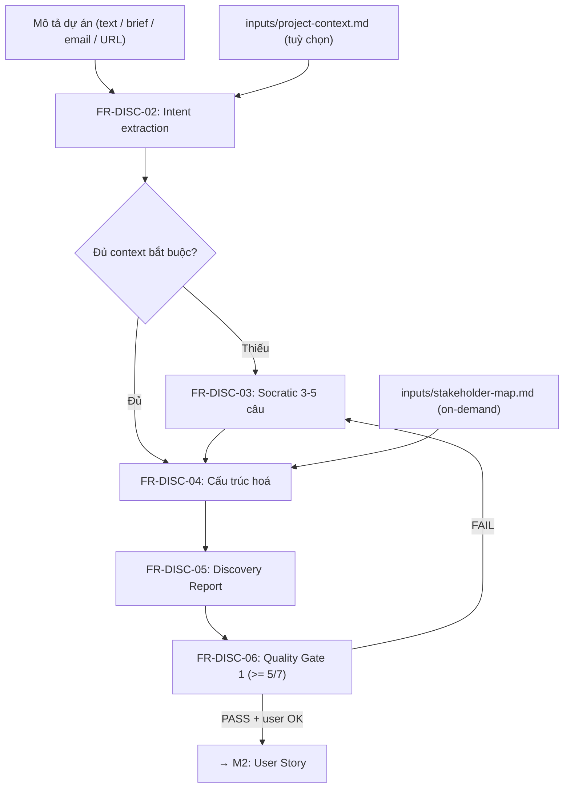

<!--
  Document ID: SRS-DISC-1.0
  Component: 01 — Discovery & Context Intake
  Prefix: DISC
  Date: 2026-06-02
  Version: 1.0
  Status: Draft
  Source: SRS per-component của sản phẩm BA Super App, chuẩn AIPlat (BRD↔SRS 1:1).
          Năng lực gốc: 01-framework/modules/M1-discovery.md (+ inputs/, templates/discovery-template.md).
  Meta: Đặc tả chức năng/kỹ thuật của NĂNG LỰC Discovery trong BA Super App.
        ID dùng FR-DISC-## / NFR-DISC-## — KHÔNG lẫn với SRS-FR-### mà công cụ *sinh ra* cho dự án khách.
-->

# SRS — Component 01: Discovery & Context Intake

> **Component:** 01 — Discovery & Context Intake · **Prefix:** `DISC` · ID: `FR-DISC-##` (functional) / `NFR-DISC-##` (non-functional)
> **BRD (1:1):** [`../../01-business/brd/01-discovery.md`](../../01-business/brd/01-discovery.md)
> **Framework source:** [`../../01-framework/modules/M1-discovery.md`](../../01-framework/modules/M1-discovery.md) (+ [`inputs/project-context.md`](../../01-framework/inputs/project-context.md), [`inputs/stakeholder-map.md`](../../01-framework/inputs/stakeholder-map.md), [`templates/discovery-template.md`](../../01-framework/templates/discovery-template.md))
> **Overview:** [`../srs.md`](../srs.md)
>
> Đặc tả **chức năng & kỹ thuật** của năng lực Discovery. Mức nghiệp vụ ("vì sao/cái gì") ở [BRD](../../01-business/brd/01-discovery.md).

---

## 1. Purpose & Scope

**Purpose.** Đặc tả cách năng lực **Discovery & Context Intake** của BA Super App hoạt động: nhận mô tả dự án sơ bộ ở dạng tự do → **hỏi Socratic** làm rõ → trích & cấu trúc hoá context (goal / users / scope / features) → sinh **Discovery Report**, dưới sự **xác nhận của con người**. Đây là **phase 1** của pipeline, là input bắt buộc của M2 (User Story) và nguồn context cho M3/M4.

**Scope.** Component này là một **prompt-fragment** (`modules/M1-discovery.md`) được LLM load theo phase, **cộng** với hai input template (`inputs/project-context.md`, `inputs/stakeholder-map.md`) và một output template (`templates/discovery-template.md`). SRS này đặc tả:

- Các **FR-DISC-##**: tiếp nhận input, intent extraction, Socratic, cấu trúc hoá, sinh Discovery Report, Quality Gate 1, confirm, refine, template, scope-guard, Discovery rút gọn.
- **NFR-DISC-##** scoped cho component.
- Data/I-O, Interfaces (routing + lệnh `/discovery`), Traceability, Open Questions.

**Ngoài scope:** sinh US/BRD/SRS/Diagram/Sprint (M2–M6); persist/lưu trữ (Component 07); domain ngoài 7 domain khai báo.

**Biến domain (dùng xuyên suốt):** `[DOMAIN]` · `[USER_TYPE]` · `[SYSTEM]` · `[COMPLIANCE]` — gán/ hỏi tại Discovery, không hardcode.

---

## 2. Functional Requirements (`FR-DISC-##`)

### FR-DISC-01 — Tiếp nhận mô tả dự án (đa định dạng)

- **Description.** Nhận **raw project description** ở dạng tự do làm điểm vào pipeline: text gõ thẳng, brief, email, meeting-notes, hoặc URL/đoạn dán.
- **Inputs / Preconditions.** Người dùng gửi nội dung mô tả, hoặc gõ `/discovery` (chat) / `/ba discovery` (IDE), hoặc báo "dự án mới". Controller (master_prompt ①) đã route vào M1.
- **Process / Flow.**
  1. Tiếp nhận nội dung; coi là dữ liệu thô chưa tin cậy hoàn toàn.
  2. Nếu nội dung **trống/không có gì để trích** → mở đầu **B1 Conversation Protocol**: xin mô tả ("Mô tả dự án của bạn — càng chi tiết càng tốt.").
  3. Nếu có nội dung → chuyển FR-DISC-02 (intent extraction).
- **Acceptance Criteria.**
  - **Given** người dùng paste một brief/email/meeting-notes, **When** vào Discovery, **Then** công cụ tiếp nhận và chuyển sang intent extraction mà không bắt người dùng điền form cứng.
  - **Given** input rỗng hoặc chỉ là lời chào, **When** Discovery khởi động, **Then** công cụ phản hồi B1 (xin mô tả), **And** KHÔNG tự bịa một dự án.
- **Outputs.** Trạng thái sẵn sàng extract, hoặc lời mời cung cấp mô tả.
- **Errors / Edge.** Input rỗng → B1. Input là URL không truy cập được nội dung → ghi `⚠️ Assumption` và hỏi người dùng dán nội dung chính. *(xem Open Questions OQ-1)*

### FR-DISC-02 — Intent extraction (phân biệt explicit vs inferred)

- **Description.** Trích **thầm** từ mô tả: tên dự án (explicit/inferred), `[DOMAIN]`, mục tiêu/pain point, `[USER_TYPE]`, features sơ bộ, `[SYSTEM]`, constraints, compliance — đánh dấu rõ cái nào user **nói thẳng** (explicit) vs cái nào **suy ra** (inferred).
- **Inputs / Preconditions.** Có nội dung mô tả (FR-DISC-01).
- **Process / Flow.**
  1. Đọc input, lập danh sách trường đã trích kèm cờ `explicit | inferred`.
  2. Mọi trường **inferred** → gắn nhãn `⚠️ Assumption` (BR-DISC-02).
  3. Đối chiếu với danh sách **mục bắt buộc** (Project Name, `[DOMAIN]`, Goal, `[USER_TYPE]`, Scope, Constraints) → xác định cái nào thiếu/mơ hồ → chuyển FR-DISC-03.
- **Acceptance Criteria.**
  - **Given** mô tả nêu rõ domain và user, **When** extraction chạy, **Then** các trường đó được đánh `explicit` và **không** bị hỏi lại ở Socratic.
  - **Given** một giá trị **không** do user nói thẳng (vd compliance suy theo domain), **When** đưa vào Discovery Report, **Then** giá trị đó mang nhãn `⚠️ Assumption`.
  - **Given** thiếu một mục bắt buộc, **When** extraction kết thúc, **Then** mục đó được đẩy vào hàng đợi Socratic, **And** công cụ **không** tự điền giá trị giả (BR-DISC-01).
- **Outputs.** Bảng trường đã trích (explicit/inferred) + danh sách mục bắt buộc còn thiếu.
- **Errors / Edge.** Mâu thuẫn trong input (vd hai domain) → đưa thành câu hỏi Socratic thay vì tự chọn.

### FR-DISC-03 — Socratic clarify (3–5 câu, options + default)

- **Description.** Với mỗi mục bắt buộc còn thiếu/mơ hồ, hỏi **3–5 câu**; mỗi câu gắn **một quyết định**, có **options** rõ và **default** khi user không chắc; adapt từ ngữ theo `[DOMAIN]`; bỏ câu nào input đã trả lời.
- **Inputs / Preconditions.** Có ≥ 1 mục bắt buộc thiếu/mơ hồ (FR-DISC-02).
- **Process / Flow.** Phát các câu theo ngân hàng Socratic của M1 (rút gọn theo nhu cầu):

  | # | Quyết định | Options (rút gọn) | Default |
  |---|------------|-------------------|---------|
  | Q1 | Scope / MVP | (a) chỉ định MVP · (b) tất cả must · (c) đề xuất giúp | MoSCoW: feature lõi = 🔴 Must, còn lại 🟡 Should — chờ chốt |
  | Q2 | Users / Stakeholders | (a) admin · (b) manager · (c) đối tác ngoài · (d) một loại | thêm 1 vai trò **admin** (`⚠️ Assumption`) |
  | Q3 | Integration / `[SYSTEM]` | (a) payment · (b) CRM/ERP · (c) API 3rd-party · (d) độc lập; nền tảng web/mobile/api | `[SYSTEM]` độc lập, chưa tích hợp (chờ xác nhận) |
  | Q4 | Constraints | timeline (tháng/quý/năm) · team (nhỏ/vừa/lớn) · budget (thấp/TB/cao) | scale **medium** (15–60 US), chờ xác nhận |
  | Q5 | Current state & Compliance | greenfield / replace-legacy / extend; compliance PDPA\|PCI-DSS\|HIPAA\|SOC2\|none | **greenfield**; compliance suy theo `[DOMAIN]` (`⚠️ Assumption`) |

- **Acceptance Criteria.**
  - **Given** N mục bắt buộc còn thiếu, **When** Socratic chạy, **Then** số câu hỏi nằm trong **[3, 5]** và mỗi câu có (1 quyết định + options + default).
  - **Given** một mục đã rõ trong input, **When** Socratic soạn câu hỏi, **Then** mục đó **không** bị hỏi lại.
  - **Given** `[DOMAIN]` đã biết, **When** đặt câu hỏi, **Then** từ ngữ/ví dụ được adapt theo domain.
  - **Given** người dùng chọn "không chắc / để mặc định", **When** trả lời, **Then** công cụ áp **default** và đánh dấu giá trị suy ra là `⚠️ Assumption`.
- **Outputs.** Bộ câu hỏi Socratic; sau khi trả lời → context đủ để cấu trúc hoá.
- **Errors / Edge.** Người dùng bỏ qua/không trả lời → giữ `⚠️ Assumption` cho mục đó và đưa vào Open Questions của Discovery Report (không tự "đóng").

### FR-DISC-04 — Phân tích & cấu trúc hoá context

- **Description.** Sau khi đủ thông tin, biến mô tả rời rạc thành cấu trúc: **Goals→Metrics**, **Stakeholders & Users**, **Feature decomposition** (Epic/Module + MoSCoW), **Scope in/out**, **Constraints & Assumptions**.
- **Inputs / Preconditions.** Context bắt buộc đã đủ (sau FR-DISC-03) hoặc đã đạt ngưỡng tối thiểu.
- **Process / Flow.**
  1. **Goals → metrics:** mỗi mục tiêu gắn ≥ 1 KPI (metric + target).
  2. **Stakeholders/users:** ai quyết định / bị ảnh hưởng / dùng; ước lượng số lượng nếu có.
  3. **Feature decomposition:** gom feature theo **Epic/Module**, đặt tên sao cho M2 sinh được `US-[MODULE]-###`; gán priority MoSCoW (🔴/🟡/🟢/⚪).
  4. **Scope:** tách in-scope vs out-of-scope.
  5. **Constraints & assumptions:** liệt kê ràng buộc; mọi suy diễn ghi `⚠️ Assumption`.
- **Acceptance Criteria.**
  - **Given** một mục tiêu business, **When** cấu trúc hoá, **Then** mục tiêu đó có **ít nhất một** KPI đo được (metric + target).
  - **Given** danh sách feature, **When** decompose, **Then** mỗi feature thuộc về một **Epic/Module có tên** và có nhãn MoSCoW, **And** truy được về ≥ 1 mục tiêu hoặc stakeholder (không "mồ côi" — BR-DISC-07).
  - **Given** phạm vi đã bàn, **When** lập scope, **Then** có **cả** in-scope và out-of-scope phân biệt rõ.
- **Outputs.** Khối nội dung đã cấu trúc cho từng section của Discovery Report.
- **Errors / Edge.** Feature không gắn được mục tiêu/stakeholder → đánh dấu để hỏi lại, không đưa vào Report như đã chốt.

### FR-DISC-05 — Sinh Discovery Report (theo output-standard)

- **Description.** Đổ nội dung đã cấu trúc vào `templates/discovery-template.md`, tuân `output-standard.md`; kết thúc bằng **đúng 1** câu hỏi refine.
- **Inputs / Preconditions.** Đã có nội dung cấu trúc (FR-DISC-04).
- **Process / Flow.**
  1. Tạo **YAML frontmatter** bắt buộc: `project`, `document_type: "DISCOVERY"`, `version`, `date`, `author: "BA Super App"`, `status`.
  2. Điền các section: **Project Context · Goals & Success Metrics · Users & Stakeholders · Scope (in/out) · Assumptions & Constraints · Feature List · Open Questions**.
  3. Format: prose tiếng Việt, heading/ID English; bảng cho so sánh; bullet cho feature; priority 🔴/🟡/🟢/⚪; Mermaid hợp lệ nếu vẽ.
  4. Đính kèm Next Steps + Lịch sử thay đổi theo template.
  5. Kết bằng **một** câu hỏi refine (Output Lock).
- **Acceptance Criteria.**
  - **Given** context đã cấu trúc, **When** sinh Report, **Then** output có **đủ** YAML frontmatter với `document_type: "DISCOVERY"` và `author: "BA Super App"`.
  - **Given** Report hoàn tất, **When** kiểm cấu trúc, **Then** có **đủ 7 section** chuẩn template, **And** kết thúc bằng **đúng một** câu hỏi refine (không rào đón thừa).
  - **Given** có giá trị suy diễn, **When** render, **Then** mọi giá trị đó hiển thị nhãn `⚠️ Assumption`.
- **Outputs.** **Discovery Report** (`document_type: DISCOVERY`).
- **Errors / Edge.** Nếu vẽ Mermaid, nhãn chứa ký tự đặc biệt phải được quote để diagram hợp lệ.

### FR-DISC-06 — Quality Gate 1: Context Completeness

- **Description.** Tự chạy **Gate 1** trước khi cho qua phase; **pass khi ≥ 5/7** check.
- **Inputs / Preconditions.** Discovery Report đã sinh (FR-DISC-05).
- **Process / Flow.** Kiểm 7 mục: (1) Project Name · (2) `[DOMAIN]` · (3) ≥ 2 Stakeholders · (4) Business Goal + metric · (5) ≥ 1 `[USER_TYPE]` · (6) Scope in/out · (7) Constraints (hoặc `⚠️ Assumption`). Đếm pass.
- **Acceptance Criteria.**
  - **Given** Report đạt **≥ 5/7**, **When** chạy Gate 1, **Then** Gate **PASS** và công cụ được phép đề xuất sang M2 (sau khi người dùng xác nhận — FR-DISC-07).
  - **Given** Report đạt **< 5/7**, **When** chạy Gate 1, **Then** Gate **FAIL**, **And** công cụ nêu **rõ thiếu mục nào** + đề xuất bổ sung, **And** **không** sang M2 (BR-DISC-05).
- **Outputs.** Kết quả Gate (pass/fail) + danh sách thiếu (nếu fail); tuỳ chọn Quality Gate Report theo `quality-gates.md`.
- **Errors / Edge.** Đúng ranh giới (vd 4/7) → FAIL (ngưỡng là ≥ 5).

### FR-DISC-07 — Tóm tắt + xác nhận (human-in-the-loop)

- **Description.** Cuối phase, tóm tắt và **xin xác nhận**; chỉ chuyển phase khi người dùng OK **và** Gate 1 đã pass. Không tự "đóng" Discovery.
- **Inputs / Preconditions.** Gate 1 PASS (FR-DISC-06).
- **Process / Flow.**
  1. Tóm tắt: **Tên · Domain · Mục tiêu · Users · Scope**.
  2. Hỏi: "✅ Đúng chưa? Tôi sẽ sang **M2: User Story**."
  3. Người dùng **OK** → handoff M2; **Sửa** → vào refine (FR-DISC-08).
- **Acceptance Criteria.**
  - **Given** Gate 1 PASS, **When** kết phase, **Then** công cụ phát bản tóm tắt 5 điểm + câu hỏi xác nhận, **And** **không** tự chuyển sang M2 khi chưa có "OK".
  - **Given** người dùng trả lời "OK / đúng", **When** xác nhận, **Then** công cụ chuyển handoff sang M2.
  - **Given** người dùng yêu cầu sửa, **When** xác nhận, **Then** công cụ vào refine (FR-DISC-08) thay vì chuyển phase.
- **Outputs.** Bản tóm tắt xác nhận; tín hiệu handoff M2 (nếu OK).
- **Errors / Edge.** Người dùng im lặng → giữ ở trạng thái chờ xác nhận, không auto-advance.

### FR-DISC-08 — Refine có giới hạn (≤ 3 vòng/mục)

- **Description.** Cho phép tinh chỉnh Discovery Report qua hội thoại; **giới hạn ≤ 3 vòng** cùng một mục; quá hạn → đề xuất chốt hoặc escalate.
- **Inputs / Preconditions.** Người dùng yêu cầu sửa (từ FR-DISC-07) hoặc gõ lệnh refine.
- **Process / Flow.**
  1. Áp thay đổi vào đúng section liên quan, sinh lại phần đó.
  2. Đếm số vòng refine cho **cùng một** mục.
  3. Khi vượt **3 vòng** cùng mục → đề xuất chốt phương án hiện tại hoặc escalate (không lặp vô hạn).
- **Acceptance Criteria.**
  - **Given** một mục đã refine **3 lần**, **When** người dùng yêu cầu refine lần 4 cùng mục, **Then** công cụ **đề xuất chốt hoặc escalate** thay vì tiếp tục sửa vô hạn (BR-DISC-06).
  - **Given** một refine hợp lệ (≤ 3), **When** áp dụng, **Then** chỉ phần liên quan được cập nhật, **And** phần còn lại của Report giữ nguyên (consistency).
- **Outputs.** Discovery Report đã cập nhật.
- **Errors / Edge.** Refine làm hỏng traceability seed (đổi tên Epic/Module đã dùng) → cảnh báo ảnh hưởng tới `US-[MODULE]-###`.

### FR-DISC-09 — Template thu thập (project-context + stakeholder-map)

- **Description.** Cung cấp hai template làm khung thu thập đầu vào, hỗ trợ cả luồng "điền form" lẫn "conversational extract".
- **Inputs / Preconditions.** Người dùng muốn điền trực tiếp, hoặc công cụ cần khung để map dữ liệu đã trích.
- **Process / Flow.**
  1. **project-context** (universal): Thông tin cơ bản · Mục tiêu business · Users & Stakeholders · Scope · Compliance · Existing Systems — người dùng điền trực tiếp **hoặc** AI tự extract rồi confirm.
  2. **stakeholder-map** (on-demand): **RACI Matrix** · **Influence/Interest Grid** (Mermaid quadrantChart) · **Communication Plan**.
- **Acceptance Criteria.**
  - **Given** người dùng chọn điền form, **When** yêu cầu template, **Then** công cụ cung cấp `project-context` đúng cấu trúc để điền.
  - **Given** cần phân tích stakeholder, **When** dựng stakeholder-map, **Then** xuất RACI + Influence/Interest + Communication Plan theo template, **And** Mermaid (nếu vẽ) hợp lệ.
- **Outputs.** Filled project-context và/hoặc stakeholder-map.
- **Errors / Edge.** Thiếu dữ liệu stakeholder → ô để trống/`⚠️ Assumption`, không bịa tên.

### FR-DISC-10 — Scope guard (ngoài 7 domain)

- **Description.** Khi `[DOMAIN]`/scope nằm ngoài 7 domain controller hỗ trợ → **báo rõ giới hạn** thay vì cố sinh Discovery Report.
- **Inputs / Preconditions.** Domain trích/hỏi không thuộc {banking, insurance, fintech, ecommerce, saas, healthcare, game}.
- **Process / Flow.** Nhận diện domain ngoài danh sách → thông báo giới hạn năng lực, đề nghị người dùng xác nhận domain gần nhất hoặc điều chỉnh kỳ vọng.
- **Acceptance Criteria.**
  - **Given** domain ngoài 7 domain khai báo, **When** Discovery chạy, **Then** công cụ **nêu rõ giới hạn** và **không** giả vờ sinh Report đầy đủ như domain được hỗ trợ.
- **Outputs.** Thông báo giới hạn + hướng xử lý.
- **Errors / Edge.** Domain mơ hồ (có thể map vào danh sách) → hỏi Socratic xác nhận thay vì từ chối ngay.

### FR-DISC-11 — Discovery rút gọn (khi nhảy thẳng phase sau)

- **Description.** Khi người dùng nhảy thẳng phase sau ("viết BRD") mà **chưa có context**, chạy Discovery rút gọn: hỏi đủ tối thiểu rồi mới cho qua.
- **Inputs / Preconditions.** Controller phát hiện phase sau nhưng thiếu context (master_prompt ① ghi chú).
- **Process / Flow.** Hỏi **tập con** Socratic đủ để đạt ngưỡng tối thiểu của Gate 1 → sinh Discovery Report rút gọn → mới chuyển phase đích.
- **Acceptance Criteria.**
  - **Given** user gõ "viết BRD" mà chưa qua Discovery, **When** controller xử lý, **Then** Discovery rút gọn chạy trước, **And** chỉ sang BRD sau khi đạt context tối thiểu.
- **Outputs.** Discovery Report (rút gọn) đủ làm nền cho phase đích.
- **Errors / Edge.** Người dùng từ chối cung cấp context tối thiểu → công cụ nêu rủi ro "đoán" và không bịa thay.

---

## 3. Non-Functional Requirements (`NFR-DISC-##`)

| ID | Loại | Yêu cầu (scoped cho Discovery) |
|----|------|--------------------------------|
| **NFR-DISC-01** | Reliability / Trust | **No-hallucination fail-closed**: thiếu mục bắt buộc → hỏi, không tự điền; mọi suy diễn mang `⚠️ Assumption`. Đây là bất biến của component. |
| **NFR-DISC-02** | Usability | Socratic UX: **3–5** câu, mỗi câu có options + default; không hỏi chung chung; từ ngữ adapt theo `[DOMAIN]`. |
| **NFR-DISC-03** | Consistency | Discovery Report **luôn** theo `output-standard` + `discovery-template` (YAML header, 7 section, 1 câu hỏi refine); thuật ngữ & tên user type giữ ổn định để chain phase sau không đứt. |
| **NFR-DISC-04** | Maintainability | Component là **prompt-fragment độc lập** (module-as-prompt); chỉnh hành vi Discovery = sửa `M1-discovery.md` + template, không đụng controller lõi (R-02). |
| **NFR-DISC-05** | Portability | Chạy được trên mọi AI tool (ChatGPT/Claude/Gemini) standalone **và** trong IDE/Antigravity; không phụ thuộc backend (MVP). |
| **NFR-DISC-06** | Compatibility | Output Markdown + Mermaid **render-ready**; nhãn Mermaid có ký tự đặc biệt phải quote. |
| **NFR-DISC-07** | Domain-adaptivity | Hành vi điều chỉnh qua biến `[DOMAIN]/[USER_TYPE]/[SYSTEM]/[COMPLIANCE]`, **không hardcode** ngành trong module (R-05). |
| **NFR-DISC-08** | Process integrity | **Gate-before-next** (≥ 5/7) và **refine cap** (≤ 3 vòng/mục) được tôn trọng; không auto-advance khi chưa có xác nhận người dùng. |

---

## 4. Data / Input-Output

**Consume (input)**
- **Mô tả dự án** dạng tự do: text / brief / email / meeting-notes / URL-or-pasted (FR-DISC-01).
- (Tuỳ chọn) **`project-context.md`** đã điền — khung universal: Thông tin cơ bản, Mục tiêu business + success_metrics, user_types, key_stakeholders, scope (in/out, assumptions, constraints), compliance, current_systems.
- (Tuỳ chọn) **`stakeholder-map.md`** — RACI / Influence-Interest / Communication Plan.

**Produce (output)**
- **Discovery Report** (`document_type: "DISCOVERY"`, `author: "BA Super App"`) theo `templates/discovery-template.md`, gồm 7 section: Project Context · Goals & Success Metrics · Users & Stakeholders · Scope (in/out) · Assumptions & Constraints · Feature List · Open Questions (+ Next Steps, Lịch sử thay đổi).
- (Tuỳ chọn) **Filled project-context** và/hoặc **stakeholder-map**; **Quality Gate 1 Report**.

**Data flow (mức component)**

**Traceability seed (xuống hạ nguồn):** Feature List → `US-[MODULE]-###` (M2); Goals/Metrics → BRD KPIs (M3); Constraints → NFR (M4). Discovery **chưa tạo ID truy vết riêng**.

---

## 5. Interfaces

**Routing (vào component).** `master_prompt.md` mục **① Intent Extraction → Phase Detection** route vào `modules/M1-discovery.md` khi:
- User báo **"dự án mới"**, hoặc **paste brief / email / meeting-notes / mô tả sơ bộ**.
- User gõ **`/discovery`** (chat standalone) hoặc **`/ba discovery`** (Antigravity/IDE).
- User nhảy thẳng phase sau **nhưng chưa có context** → controller chạy **Discovery rút gọn** (FR-DISC-11) trước khi cho qua.

**Commands.**

| Lệnh | Ngữ cảnh | Tác dụng |
|------|----------|----------|
| `/discovery` | chat standalone | Khởi động/đi vào phase Discovery (M1) |
| `/ba discovery` | Antigravity / IDE | Như trên, theo tiền tố `/ba` |
| `/validate` | bất kỳ | Chạy Quality Gates (gồm Gate 1 — FR-DISC-06) |
| `/rewrite [section]` | trong Discovery | Refine một section (FR-DISC-08) |
| `/status` | bất kỳ | Xem tiến độ pipeline (đang ở Discovery?) |

**File loading (khi ở Discovery).** `master_prompt → core/ba-role → core/output-standard → inputs/project-context (nếu có) → modules/M1-discovery → templates/discovery-template → core/quality-gates (cuối phase / /validate)`.

**Handoff (ra component).** Khi người dùng xác nhận (FR-DISC-07) và Gate 1 PASS → chuyển sang **M2 (User Story)**, truyền Discovery Report làm input.

---

## 6. Traceability

**FR-DISC → REQ-DISC (chiều ngược BRD)**

| FR-DISC | REQ-DISC (BRD) |
|---------|----------------|
| FR-DISC-01 | REQ-DISC-01 |
| FR-DISC-02 | REQ-DISC-02, REQ-DISC-04 |
| FR-DISC-03 | REQ-DISC-03, REQ-DISC-04 |
| FR-DISC-04 | REQ-DISC-05, REQ-DISC-07 |
| FR-DISC-05 | REQ-DISC-06, REQ-DISC-07 |
| FR-DISC-06 | REQ-DISC-08 |
| FR-DISC-07 | REQ-DISC-09 |
| FR-DISC-08 | REQ-DISC-10 |
| FR-DISC-09 | REQ-DISC-11 |
| FR-DISC-10 | REQ-DISC-12 |
| FR-DISC-11 | REQ-DISC-13 |

**FR-DISC → framework (M1-discovery & cộng tác)**

| FR-DISC | Nguồn framework |
|---------|-----------------|
| FR-DISC-01 | M1 §Inputs/Preconditions; §Conversation Protocol B1; master_prompt ② |
| FR-DISC-02 | M1 §Process bước 1 (Intent extraction) |
| FR-DISC-03 | M1 §Socratic Questions (Q1–Q5); master_prompt ② B2 |
| FR-DISC-04 | M1 §Process bước 3 (Phân tích & cấu trúc hoá) |
| FR-DISC-05 | M1 §Output Contract; `templates/discovery-template.md`; `core/output-standard.md` |
| FR-DISC-06 | M1 §Quality Gate (Gate 1, ≥ 5/7); `core/quality-gates.md` |
| FR-DISC-07 | M1 §Process bước 5; §Stop Conditions #2; master_prompt hard rule #2 |
| FR-DISC-08 | M1 §Stop Conditions #3; master_prompt hard rule #5; `tools/chatbot-edit.md` |
| FR-DISC-09 | `inputs/project-context.md`; `inputs/stakeholder-map.md` |
| FR-DISC-10 | M1 §Stop Conditions #5; master_prompt ⑥ (7 domain) |
| FR-DISC-11 | master_prompt ① (Discovery rút gọn); M1 §Purpose |

---

## 7. Open Questions

| # | Câu hỏi | Liên quan | Trạng thái |
|---|---------|-----------|:----------:|
| OQ-1 | Khi input là **URL**, công cụ tự fetch nội dung hay yêu cầu người dùng dán? M1 nêu "brief/email/meeting-notes/mô tả sơ bộ" nhưng không khẳng định khả năng fetch URL. | FR-DISC-01 | ⏳ Chờ chốt |
| OQ-2 | "Mục tiêu/pain point" và "`[USER_TYPE]` chính" được đánh **bắt buộc ✅** trong M1, nhưng **không** nằm trong 7 check Gate 1 → có nên thêm vào Gate hay giữ tách bạch (bắt buộc-để-hỏi vs bắt buộc-để-pass)? | FR-DISC-06 | ⏳ Chờ chốt |
| OQ-3 | Bộ đếm "**3 vòng refine/mục**" định nghĩa "một mục" ở cấp nào (section vs field)? Ảnh hưởng cách áp BR-DISC-06. | FR-DISC-08 | ⏳ Chờ chốt |

> ⚠️ Assumption: trừ các điểm Open Questions trên, mọi FR-DISC/NFR-DISC ở đây **bám trực tiếp** nội dung `M1-discovery.md` + `inputs/` + `master_prompt.md`; không thêm năng lực ngoài framework.

---

*SRS Component 01 — `DISC` · 11 FR-DISC + 8 NFR-DISC · 1:1 với [BRD 01-discovery](../../01-business/brd/01-discovery.md) · bám [M1-discovery](../../01-framework/modules/M1-discovery.md).*
