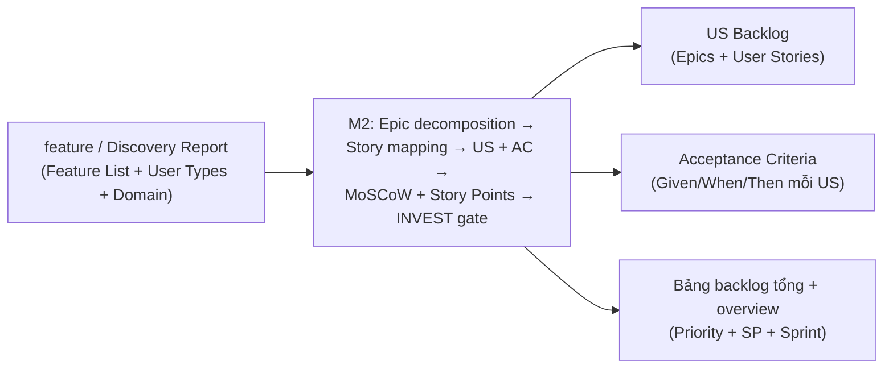

<!--
  Document ID: SRS-USTORY-1.0
  Date: 2026-06-02
  Version: 1.0
  Status: Draft
  Source: SRS per-component cho Component 02 — User Story Generation của sản phẩm BA Super App.
          Chuẩn AIPlat (per-component, BRD↔SRS 1:1). Nguồn năng lực: 01-framework/modules/M2-user-story.md.
          FR-USTORY-## / NFR-USTORY-## = yêu cầu CỦA công cụ; KHÔNG lẫn với US-[MODULE]-### công cụ SINH RA.
-->

# SRS — Component 02: User Story Generation

> Đặc tả **chức năng & kỹ thuật** cho năng lực **sinh User Story Backlog** của BA Super App. Mức nghiệp vụ ở [BRD 02-user-story](../../01-business/brd/02-user-story.md); khung tổng: [SRS overview](../srs.md); phi chức năng nền: [NFR](../nfr.md). Nguồn năng lực: [`modules/M2-user-story.md`](../../../01-framework/modules/M2-user-story.md).
>
> **Bản chất:** Component 02 là **prompt-fragment (M2)** được Master Controller load khi `phase = User Story`. "Chức năng" ở đây = hành vi LLM **phải** thực thi khi đóng vai BA Super App. **ID:** `FR-USTORY-##` (functional), `NFR-USTORY-##` (non-functional) — yêu cầu *của công cụ*, khác lớp `US-[MODULE]-###` mà công cụ *sinh ra*.

---

## 1. Phạm vi & cách đọc

Component 02 nhận **Feature List / Discovery Report** (output Component 01) và sinh **User Story Backlog**. Mỗi FR-USTORY-## mô tả một hành vi của module M2 với: **Inputs → Process → Acceptance Criteria (Given/When/Then) → Outputs → Errors**. AC ở đây là tiêu chí nghiệm thu *của chính công cụ* (khác AC mà công cụ viết trong từng user story).

**I-O tổng (Input → Output) của component:**

## 2. Trục FR ↔ BRD

| FR (SRS) | ← REQ (BRD) | Tóm tắt năng lực |
|----------|------------|------------------|
| FR-USTORY-01 | REQ-USTORY-01 | Epic Decomposition |
| FR-USTORY-02 | REQ-USTORY-02, REQ-USTORY-11 | Viết US As-a/I-want/So-that + ID + Module |
| FR-USTORY-03 | REQ-USTORY-03 | Acceptance Criteria Given/When/Then |
| FR-USTORY-04 | REQ-USTORY-04 | Priority MoSCoW |
| FR-USTORY-05 | REQ-USTORY-05 | Story Points (Fibonacci) + trần tách story |
| FR-USTORY-06 | REQ-USTORY-06, REQ-USTORY-12 | Quality Gate INVEST + tóm tắt/xác nhận |
| FR-USTORY-07 | REQ-USTORY-07, REQ-USTORY-11 | Xuất backlog + bảng tổng/overview |
| FR-USTORY-08 | REQ-USTORY-08 | Story Mapping (Mermaid) |
| FR-USTORY-09 | REQ-USTORY-09 | Socratic / Discovery rút gọn khi thiếu context |
| FR-USTORY-10 | REQ-USTORY-10 | Grounding rule + `⚠️ Assumption` |

## 3. Functional Requirements

### FR-USTORY-01 — Epic Decomposition
- **Inputs:** Feature List / Discovery Report (module + feature lớn), Domain.
- **Process:** mỗi module/feature lớn → **1 Epic** `EP-[MODULE]-###` → nhóm các User Story con. Đảm bảo mỗi US sắp sinh là độc lập / deliver value / test được / estimate được (mục tiêu 1–8 SP); feature dự kiến > 8 SP → đánh dấu cần tách ở FR-USTORY-05.
- **AC:**
  - **AC1:** Given có Feature List với ≥ 1 module, When chạy decomposition, Then mỗi module lớn sinh đúng 1 Epic `EP-[MODULE]-###` và liệt kê các US dự kiến thuộc Epic đó.
  - **AC2:** Given một feature mơ hồ không rõ thuộc module nào, When decomposition, Then công cụ KHÔNG tự gán Epic mà hỏi Socratic (chuyển FR-USTORY-09), không bịa Epic.
- **Outputs:** danh sách Epic + ánh xạ Epic → US dự kiến.
- **Errors:** thiếu Feature List → FR-USTORY-09.

### FR-USTORY-02 — Viết User Story (As-a / I-want / So-that) + ID + Module
- **Inputs:** Epic + feature, User Type (actor) từ Discovery.
- **Process:** sinh khối US đúng output-standard: `### US-[MODULE]-###: [Tiêu đề]`, `**As a** [user] · **I want** [chức năng] · **So that** [giá trị]`, kèm `**Epic:**`, `**Module:**`. `[MODULE]` viết HOA, giữ nguyên xuyên pipeline. Không tạo US "mồ côi" — mỗi US truy về một feature/Epic của Discovery.
- **AC:**
  - **AC1:** Given một Epic và actor đã xác định, When viết US, Then mỗi US có đủ 3 mệnh đề As-a/I-want/So-that, ID `US-[MODULE]-###` (3 chữ số) và trường Module.
  - **AC2:** Given actor của feature chưa rõ, When viết US, Then công cụ hỏi Socratic Q1 (actor, có options + default) thay vì điền bừa user type.
  - **AC3:** Given một feature Must trong Discovery, When sinh backlog, Then tồn tại ≥ 1 US phủ feature đó (không bỏ sót Must).
- **Outputs:** các khối User Story có ID + Module + Epic.
- **Errors:** actor/Module không suy được → FR-USTORY-09.

### FR-USTORY-03 — Acceptance Criteria (Given / When / Then)
- **Inputs:** từng User Story + business rule từ context (nếu có).
- **Process:** mỗi US sinh **≥ 1 AC** dạng **Given / When / Then**, đánh số `AC1`, `AC2`…; tối thiểu **AC1 happy path** + **AC2 validation/lỗi**, thêm **AC3 edge case** khi context có rule rõ. Rule không nguồn → `⚠️ Assumption` (FR-USTORY-10), không nhúng vào AC như sự thật.
- **AC:**
  - **AC1:** Given một US, When sinh AC, Then mỗi AC có đủ 3 mệnh đề Given/When/Then và US có tối thiểu 1 AC happy path + 1 AC validation/lỗi.
  - **AC2:** Given context cung cấp business rule (vd giới hạn tuổi/giá trị), When sinh AC, Then rule được phản ánh trong AC kèm trích nguồn; nếu rule không có nguồn, Then đánh `⚠️ Assumption` và hỏi xác nhận thay vì khẳng định.
- **Outputs:** danh sách AC GWT cho mỗi US.
- **Errors:** không đủ thông tin viết AC validation → ghi rõ thiếu gì, không bịa nhánh lỗi.

### FR-USTORY-04 — Priority (MoSCoW)
- **Inputs:** User Story + MoSCoW sơ bộ từ Discovery (nếu có).
- **Process:** gán **Priority** ∈ {🔴 Must, 🟡 Should, 🟢 Could, ⚪ Won't}, **kế thừa** ưu tiên sơ bộ ở Discovery; mọi sai lệch kèm lý do.
- **AC:**
  - **AC1:** Given Discovery có MoSCoW sơ bộ cho feature, When gán Priority cho US dẫn xuất, Then Priority mặc định khớp MoSCoW sơ bộ.
  - **AC2:** Given công cụ đặt Priority lệch MoSCoW sơ bộ, When xuất US, Then kèm một câu lý do cho sai lệch (không đổi ưu tiên im lặng).
- **Outputs:** trường `**Priority:**` cho mỗi US + cột Priority trong bảng backlog.
- **Errors:** không có MoSCoW sơ bộ → tự suy luận và đánh `⚠️ Assumption`.

### FR-USTORY-05 — Story Points (Fibonacci) + trần tách story
- **Inputs:** User Story (độ phức tạp ước lượng).
- **Process:** gán **Story Points** ∈ {1,2,3,5,8,13} (Fibonacci). Story = 13 (hoặc > 8) → **bắt buộc đề xuất tách** thành story con ≤ 8 SP trước khi đưa vào backlog "ready".
- **AC:**
  - **AC1:** Given một US, When ước lượng, Then US có Story Points là số Fibonacci hợp lệ.
  - **AC2:** Given một US ước lượng = 13, When chuẩn bị backlog, Then công cụ đề xuất tách nhỏ và KHÔNG đánh dấu story 13 là "ready".
- **Outputs:** trường `**Story Points:**` cho mỗi US + cột SP trong bảng.
- **Errors:** không đủ thông tin để ước lượng → hỏi Socratic Q4 (granularity) thay vì gán bừa.

### FR-USTORY-06 — Quality Gate INVEST + tóm tắt & xác nhận
- **Inputs:** backlog nháp (toàn bộ US).
- **Process:** tự chạy **Gate 2 (INVEST)** trên từng US (Independent/Negotiable/Valuable/Estimable/Small/Testable). US đạt **< 5/6** hoặc thiếu (ID / format As-a / ≥ 1 AC GWT / Priority / SP) → KHÔNG đưa vào "ready", nêu rõ thiếu gì + đề xuất sửa. Cuối phase: **tóm tắt** (tổng Epic/US/SP) và **xin xác nhận con người** trước khi sang Component 03; refine cùng một story ≤ 3 vòng rồi chốt/escalate.
- **AC:**
  - **AC1:** Given backlog nháp, When chạy Gate INVEST, Then mỗi US được chấm 6 tiêu chí và chỉ US đạt ≥ 5/6 + đủ trường bắt buộc mới vào danh sách "ready".
  - **AC2:** Given có US chưa đạt, When báo cáo gate, Then liệt kê rõ US nào thiếu tiêu chí nào + đề xuất sửa, KHÔNG tự ý "đóng" story.
  - **AC3:** Given backlog đã "ready", When kết thúc phase, Then công cụ tóm tắt tổng Epic/US/SP và hỏi xác nhận trước khi chuyển phase.
- **Outputs:** Quality Gate report (theo quality-gates §Output Format) + danh sách "ready".
- **Errors:** refine vượt 3 vòng/story → đề xuất chốt hoặc escalate (NFR-USTORY-03).

### FR-USTORY-07 — Xuất User Story Backlog (khối + bảng tổng + overview)
- **Inputs:** các US đã qua INVEST.
- **Process:** sinh deliverable có **YAML frontmatter** (`document_type: "US"`), các **khối US**, **bảng backlog tổng** (`ID | Tiêu đề | Epic | Priority | SP | Sprint`) và **bảng overview** (tổng Epic / tổng US / tổng SP / số Must-have). (Tùy chọn) `Business Rules`, `Dependencies`, `UI Notes` khi context có.
- **AC:**
  - **AC1:** Given backlog "ready", When xuất tài liệu, Then có YAML header đúng output-standard + bảng backlog tổng đủ 6 cột + bảng overview với các tổng.
  - **AC2:** Given backlog có N US, When dựng bảng tổng, Then mọi US "ready" đều xuất hiện đúng một dòng (không thiếu, không trùng).
- **Outputs:** file User Story Backlog (`.md`) render-ready.
- **Errors:** chưa có US "ready" nào → không xuất backlog rỗng; quay lại FR-USTORY-06.

### FR-USTORY-08 — Story Mapping (theo user journey)
- **Inputs:** tập US + user journey (các bước user đi qua).
- **Process:** sắp US theo trục ngang = bước journey, trục dọc = ưu tiên/release; lộ story còn thiếu, tách lớp MVP vs nâng cao. Dùng **Mermaid** khi journey ≥ 3 bước.
- **AC:**
  - **AC1:** Given journey ≥ 3 bước, When story mapping, Then xuất một sơ đồ Mermaid hợp lệ thể hiện các bước journey và US tương ứng.
  - **AC2:** Given mapping lộ một bước journey không có US, When báo cáo, Then nêu gap đó và đề xuất story bổ sung (không tự lặng lẽ bỏ qua).
- **Outputs:** story map (Mermaid) + danh sách gap (nếu có).
- **Errors:** journey < 3 bước → bỏ qua sơ đồ, mô tả ngắn bằng bảng/bullet.

### FR-USTORY-09 — Socratic / Discovery rút gọn khi thiếu context
- **Inputs:** trạng thái context (Feature List? actor? domain? MVP cut?).
- **Process:** thiếu **context** (chưa có Feature List/Discovery) → chạy **Discovery rút gọn** (hỏi tối thiểu theo M1) hoặc xin paste Feature List. Thiếu **thông tin chặn** (actor/domain/MVP cut) → hỏi **Socratic 3–5 câu**, mỗi câu gắn một quyết định, có **options + default**. KHÔNG bịa feature.
- **AC:**
  - **AC1:** Given chưa có Feature List/Discovery, When user yêu cầu viết user story, Then công cụ KHÔNG sinh story mà chạy Discovery rút gọn hoặc xin paste Feature List.
  - **AC2:** Given thiếu actor hoặc MVP cut, When chuẩn bị viết US, Then công cụ hỏi tối đa 3–5 câu Socratic, mỗi câu có options + default.
- **Outputs:** bộ câu hỏi Socratic (options + default) hoặc khung Discovery rút gọn.
- **Errors:** user vẫn không cung cấp → dừng ở câu hỏi, không tự điền giả định coi là thật.

### FR-USTORY-10 — Grounding rule + đánh dấu Assumption
- **Inputs:** business rule / dữ kiện rút từ context.
- **Process:** mọi rule có nguồn → trích nguồn trong `Business Rules`/AC; rule **không** nguồn → đánh `> ⚠️ Assumption:` và xin xác nhận, không nhúng vào AC như sự thật.
- **AC:**
  - **AC1:** Given một rule không có trong context, When đưa vào US/AC, Then nó được đánh dấu `⚠️ Assumption` kèm câu hỏi xác nhận.
  - **AC2:** Given một rule có nguồn trong Discovery, When dùng trong AC, Then AC dẫn chiếu nguồn rule đó.
- **Outputs:** US/AC có ranh giới rõ giữa **fact** (có nguồn) và **assumption** (đánh dấu).
- **Errors:** không phân biệt được nguồn → mặc định coi là assumption (an toàn), không coi là fact.

## 4. Non-Functional Requirements

| ID | Requirement | Target / Cách kiểm | Nền (NFR sản phẩm) |
|----|-------------|--------------------|---------------------|
| NFR-USTORY-01 | **Output chuẩn**: backlog luôn qua output-standard (YAML header `document_type: "US"`, ID convention, AC GWT, Mermaid render-ready) | Mở bằng Markdown viewer; lint header/ID | [NFR-U02](../nfr.md#1-usability), [NFR-M03](../nfr.md#3-maintainability) |
| NFR-USTORY-02 | **No-hallucination / human-in-the-loop**: thiếu context → hỏi, không bịa; giả định đánh `⚠️`; cuối phase xác nhận người dùng | Spot-check output không có feature/rule bịa | [NFR-R01](../nfr.md#2-reliability--correctness) |
| NFR-USTORY-03 | **Fail-closed + chống loop**: US chưa đạt INVEST không vào "ready"; refine ≤ 3 vòng/story rồi escalate | Test kịch bản US thiếu AC; review stop-conditions | [NFR-R02](../nfr.md#2-reliability--correctness), [NFR-R03](../nfr.md#2-reliability--correctness) |
| NFR-USTORY-04 | **Socratic UX**: mỗi câu hỏi có options + default; tối đa 3–5 câu | Review module; user không "bí" khi không chắc | [NFR-U01](../nfr.md#1-usability) |
| NFR-USTORY-05 | **Domain-adaptive**: actor/giá trị/rule lấy qua biến `[DOMAIN]/[USER_TYPE]`, không hardcode một ngành | Grep module không thấy domain cứng | [NFR-M02](../nfr.md#3-maintainability), [NFR-P01](../nfr.md#4-portability--compatibility) |
| NFR-USTORY-06 | **Mermaid hợp lệ**: story map render được, quote nhãn đặc biệt | Render thử story map | [NFR-P04](../nfr.md#4-portability--compatibility) |
| NFR-USTORY-07 | **Module-as-prompt**: năng lực này là prompt-fragment độc lập (M2), không sửa controller lõi | Doc review | [NFR-M01](../nfr.md#3-maintainability) |

## 5. Interfaces

| Interface | Mô tả |
|-----------|-------|
| **Command** `/us [feature]` | Kích hoạt Component 02 (User Story) — chat standalone dùng lệnh trần `/us`, Antigravity/IDE dùng `/ba us`. `[feature]` (tùy chọn) = feature/cụm cần viết story; thiếu thì lấy từ Feature List của Discovery. (Nguồn: [master_prompt §⑦](../../../01-framework/master_prompt.md), [conventions §5]) |
| **Input** | `feature` / Discovery Report (Feature List + User Types + Domain) — từ Component 01. |
| **Output** | User Story Backlog: Epics + User Stories + AC (Given/When/Then) + Priority + Story Points + bảng tổng/overview. |
| **Refine** | `/rewrite [US-id\|section]` — viết lại một story/mục (tools/chatbot-edit), tối đa 3 vòng/mục. `/validate` chạy Gate 2 (INVEST). `/trace` xem ma trận truy vết. |
| **Downstream** | Backlog làm input cho `/brd` (Component 03) để gom thành `BRD-REQ`. |

## 6. Data / ID Contract

> Đây là **ID mà công cụ SINH RA** cho dự án khách (output của Component 02), khác `FR-USTORY-##` (yêu cầu của chính công cụ).

| Thực thể | Format | Ví dụ |
|----------|--------|-------|
| Epic | `EP-[MODULE]-[###]` | `EP-SALES-001` |
| User Story | `US-[MODULE]-[###]` | `US-SALES-001` |
| Acceptance Criteria | `AC[n]` trong khối US | `AC1`, `AC2` |

- **Cấu trúc khối US** (output-standard §User Story Format): tiêu đề + As-a/I-want/So-that + AC (GWT) + Priority + Story Points + Module (+ tùy chọn Business Rules / Dependencies).
- **`[MODULE]` viết HOA**, giữ nguyên xuyên pipeline để chuỗi `US-[MODULE]-### → BRD-REQ-### → SRS-FR-### → TC-###` không đứt.
- **Bảng backlog tổng:** `ID | Tiêu đề | Epic | Priority | SP | Sprint`.

## 7. Traceability

`REQ-USTORY-## (BRD) → FR-USTORY-## (SRS) → M2-user-story (framework module)`. Ánh xạ chi tiết ở [BRD §9](../../01-business/brd/02-user-story.md#9-traceability--revision) và §2 trên.

| FR | Hiện thực bởi (M2) | Gate |
|----|--------------------|------|
| FR-USTORY-01..02 | M2 §Process Step 1–2 + §Output Contract | Gate 2 |
| FR-USTORY-03 | M2 §Process Step 3 + output-standard §AC | Gate 2 |
| FR-USTORY-04..05 | M2 §Process Step 4 (MoSCoW + Fibonacci) | Gate 2 |
| FR-USTORY-06 | M2 §Quality Gate (INVEST) + quality-gates Gate 2 | Gate 2 |
| FR-USTORY-07 | M2 §Output Contract (backlog + bảng) | Gate 2 |
| FR-USTORY-08 | M2 §Process Step 2 (Story Mapping) | Gate 5 (Mermaid) |
| FR-USTORY-09..10 | M2 §Socratic + §Stop Conditions | — |

- **Lên overview:** map [SRS §3](../srs.md#3-functional-requirements-mức-tổng--map-reqfr) — Component 02 nằm trong REQ-002/003/004/006/010.
- **Architecture invariants liên quan:** R-01 (framework là nguồn chân lý), R-02 (module = prompt-fragment độc lập), R-03 (output luôn qua output-standard), R-05 (domain qua biến) — [ARCHITECTURE](../../03-architecture/ARCHITECTURE.md).
- **Revision:** v1.0 (2026-06-02) — bản đầu, theo chuẩn AIPlat.

---

*SRS Component 02 (User Story Generation) v1.0 — 10 FR-USTORY + 7 NFR-USTORY; 1:1 với [BRD 02-user-story](../../01-business/brd/02-user-story.md); bám [M2-user-story](../../../01-framework/modules/M2-user-story.md).*
