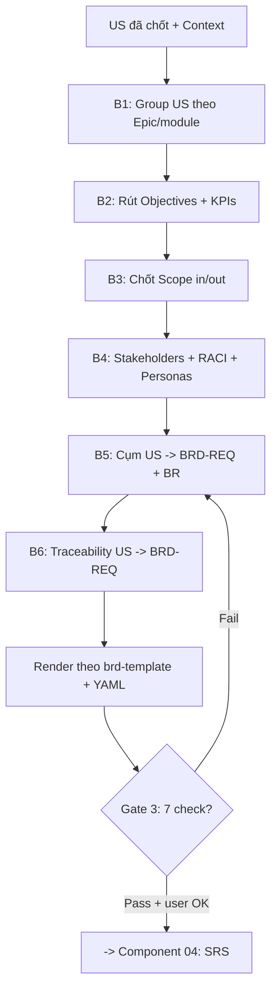

<!--
  Document ID: SRS-BRDGEN-1.0
  Date: 2026-06-02
  Version: 1.0
  Status: Draft
  Source: SRS per-component cho Component 03 — BRD Generation của BA Super App. 1:1 với brd/03-brd-generation.md.
          Framework source: 01-framework/modules/M3-brd.md (+ templates/brd-template.md). Chuẩn AIPlat.
-->

# Component 03: BRD Generation — SRS (Software Requirements Specification)

> Đặc tả **chức năng & kỹ thuật** của năng lực **BRD Generation** (prompt-fragment M3). Mức nghiệp vụ ở [BRD 03](../../01-business/brd/03-brd-generation.md); bối cảnh tổng ở [SRS overview](../srs.md); năng lực gốc [`modules/M3-brd.md`](../../../01-framework/modules/M3-brd.md).
>
> **ID:** `FR-BRDGEN-##` (functional). **Lưu ý meta:** đây là FR *của công cụ* (khả năng sinh BRD), không lẫn với `BRD-REQ-###` / `BR-###` mà công cụ **sinh ra** trong BRD đầu ra cho dự án khách.

---

## 1. Phạm vi & cách đọc

Component 03 là **prompt-fragment** ([`M3-brd.md`](../../../01-framework/modules/M3-brd.md)) được Master Controller load khi pipeline vào **phase BRD** (phase 3, giữa **02 User Story** và **04 SRS**). Chức năng: nhận **User Stories đã chốt** + **project context**, chạy quy trình 6 bước (B1–B6) để sinh một **Business Requirements Document** theo [`brd-template.md`](../../../01-framework/templates/brd-template.md), rồi tự chạy **Quality Gate 3** trước khi đề xuất sang M4.

SRS này đặc tả từng `FR-BRDGEN-##` với **Inputs · Process · Acceptance Criteria (Given/When/Then) · Outputs · Errors**, phần **Conversion US → BRD**, **Interfaces** (lệnh `/brd`), và bảng **Traceability** ngược về `REQ-BRDGEN-##`. Mỗi FR hiện thực một hoặc nhiều REQ trong [BRD 03](../../01-business/brd/03-brd-generation.md).

## 2. Interfaces (Inputs / Outputs / Commands)

### 2.1 Trigger / Command

| Interface | Mô tả | Nguồn |
|-----------|-------|-------|
| `/brd` | Lệnh chính: route Master Controller vào phase BRD, load M3, sinh BRD từ US+context hiện có | master_prompt routing |
| `/brd [scope]` | Sinh/refine BRD giới hạn theo scope (vd module cụ thể) | M3 |
| "tạo BRD" / "tài liệu nghiệp vụ" | Trigger ngôn ngữ tự nhiên tương đương `/brd` | M3 §When Loaded |
| (auto) | Master Controller tự route khi M2 (Component 02) qua Quality Gate 2 + user OK | pipeline |

### 2.2 Inputs

| Input | Bắt buộc | Nguồn | Nếu thiếu |
|-------|:--------:|-------|-----------|
| Project context (tên, `[DOMAIN]`, `business_goal`, user types, `success_metrics`) | ✅ | Component 01 (Discovery) / `inputs/project-context.md` | Discovery rút gọn (Stop) |
| User Stories đã chốt (`US-[MODULE]-###` + AC + Module + priority) | ✅ | Component 02 output | Quay lại M2 (Stop) |
| Stakeholder map | ⚪ nên có | `inputs/stakeholder-map.md` | Hỏi Socratic Q stakeholders |
| Success metrics / KPI sơ bộ | ⚪ nên có | Discovery | Đề xuất KPI nháp + `⚠️ Assumption` |
| `[COMPLIANCE]` | ⚪ tuỳ domain | context | Hỏi nếu domain nhạy cảm |

### 2.3 Output (artefacts component SINH RA)

| Output | Format | ID convention |
|--------|--------|---------------|
| BRD document | Markdown theo `brd-template.md` (§1..§9) + YAML `document_type: "BRD"` | — |
| Business Requirements | mục §5 của BRD | `BRD-REQ-[###]` (3 số, từ 001) |
| Business Rules | bảng §6 của BRD | `BR-[###]` |
| Traceability table | bảng §9 của BRD | `US → BRD-REQ` (cột SRS-FR → M4) |
| Quality Gate 3 report | bảng ✅/⚠️/❌ (7 check) | — |

## 3. Functional Requirements (FR-BRDGEN-##)

> Mỗi FR: **Inputs · Process · AC (Given/When/Then) · Outputs · Errors**. AC theo `output-standard`.

### FR-BRDGEN-01: Precondition check & routing
- **Inputs:** project context, danh sách US đã chốt.
- **Process:** Khi nhận `/brd`, kiểm tra có context **và** ≥1 US (`US-[MODULE]-###`). Đủ → vào B1. Thiếu context → đề xuất Discovery rút gọn; thiếu US → quay lại M2. Không bịa.
- **AC:**
  - **AC1:** Given có context và ≥1 US hợp lệ, When user gõ `/brd`, Then component bắt đầu quy trình B1 (gom nhóm US).
  - **AC2:** Given thiếu US hoặc thiếu context, When user gõ `/brd`, Then component KHÔNG sinh BRD mà thông báo precondition thiếu + đề xuất Discovery rút gọn / quay lại M2.
- **Outputs:** trạng thái "bắt đầu BRD" hoặc thông báo dừng + hướng xử lý.
- **Errors:** `E-PRECOND` — thiếu context/US → dừng theo Stop Condition (1), không đoán.
- **Traceability:** REQ-BRDGEN-01.

### FR-BRDGEN-02: Group User Stories (B1)
- **Inputs:** US đã chốt (kèm Module/Epic).
- **Process:** Gom US cùng module/epic thành cụm; mỗi cụm = ứng viên 1 `BRD-REQ`. Ưu tiên gộp nhiều US liên quan (giảm 1-1).
- **AC:**
  - **AC1:** Given danh sách US nhiều module, When chạy B1, Then mỗi US được gán vào đúng một cụm theo Module/Epic và không US nào bị bỏ sót.
  - **AC2:** Given nhiều US cùng epic, When gom nhóm, Then chúng vào cùng một cụm (ứng viên 1 BRD-REQ) thay vì tách rời 1-1.
- **Outputs:** tập cụm US (candidate BRD-REQ).
- **Errors:** `E-ORPHAN-US` — US không thuộc Module/Epic nào → đánh dấu để hỏi, không tự bỏ.
- **Traceability:** REQ-BRDGEN-02.

### FR-BRDGEN-03: Derive Objectives + KPIs (B2)
- **Inputs:** `business_goal`, `success_metrics` từ context.
- **Process:** Rút **2–5 Objectives** (`BO-###`), mỗi cái có **metric + target + timeline** (mục §2 BRD). Không có target trong nguồn → đề xuất nháp + `⚠️ Assumption`.
- **AC:**
  - **AC1:** Given context có `business_goal`, When chạy B2, Then sinh 2–5 objective, mỗi objective có metric + target + timeline.
  - **AC2:** Given context thiếu target cho một objective, When sinh objective, Then giá trị target được đề xuất kèm nhãn `⚠️ Assumption` (không coi là chốt).
- **Outputs:** bảng Business Objectives + KPIs (§2 BRD).
- **Errors:** `E-NO-GOAL` — không có business goal khả dụng → hỏi Socratic Q1 (objective ưu tiên).
- **Traceability:** REQ-BRDGEN-03.

### FR-BRDGEN-04: Define Scope In/Out (B3)
- **Inputs:** danh sách feature/epic từ US; feature đã bị user loại (nếu có).
- **Process:** Liệt kê **In-Scope** (feature có US) và **Out-of-Scope** (feature không có US hoặc bị loại — kèm lý do). Feature không US → Out-of-Scope hoặc `⚠️ Assumption`.
- **AC:**
  - **AC1:** Given các feature có US tương ứng, When chạy B3, Then chúng nằm trong bảng In-Scope với priority.
  - **AC2:** Given một feature không có US nào, When chạy B3, Then nó được đưa vào Out-of-Scope kèm lý do (hoặc gắn `⚠️ Assumption` để hỏi) — KHÔNG tự tạo yêu cầu mới.
- **Outputs:** mục §3 BRD (In-Scope table + Out-of-Scope list có lý do).
- **Errors:** `E-SCOPE-AMBIG` — không rõ một feature in hay out → Socratic Q2 (ranh giới Out-of-Scope).
- **Traceability:** REQ-BRDGEN-04.

### FR-BRDGEN-05: Map Stakeholders (RACI) + User Personas (B4)
- **Inputs:** user types từ US, stakeholder map (nếu có).
- **Process:** Lập bảng **Stakeholders + RACI** (bắt buộc ≥1 **Accountable**) và **User Personas**. User types khớp `As a ...` của US.
- **AC:**
  - **AC1:** Given user types và stakeholder map, When chạy B4, Then sinh bảng stakeholder có cột RACI và có đúng nguồn ≥1 Accountable.
  - **AC2:** Given user type X xuất hiện trong US, When lập personas, Then X xuất hiện trong bảng persona với tên **trùng khớp** US (consistency).
  - **AC3:** Given không xác định được ai Accountable, When chạy B4, Then ghi `approved_by: TBD` + nhắc cần chốt (Socratic Q3), không tự gán.
- **Outputs:** mục §4 BRD (Stakeholders RACI + User Personas).
- **Errors:** `E-NO-ACCOUNTABLE` — thiếu Accountable → cảnh báo + hỏi; `E-PERSONA-MISMATCH` — user type lệch US → sửa cho khớp.
- **Traceability:** REQ-BRDGEN-05.

### FR-BRDGEN-06: Generate Business Requirements BRD-REQ-### (B5)
- **Inputs:** các cụm US (B1), objectives (B2), `[DOMAIN]`.
- **Process:** Mỗi cụm → một `BRD-REQ-[###]` (3 số, từ 001, tăng dần không nhảy) gồm **mô tả · rationale (nối BO-###) · priority (MoSCoW, cao nhất trong cụm) · Source (đủ US-ID) · Business Rules**. Trừu tượng hoá, không copy US. Suy luận theo ngành dùng biến (REQ-BRDGEN-11).
- **AC:**
  - **AC1:** Given một cụm US, When sinh BRD-REQ, Then BRD-REQ có đủ 5 trường (mô tả, rationale, priority, Source, Business Rules) và Source liệt kê **mọi** US-ID trong cụm.
  - **AC2:** Given cụm có US priority lẫn lộn (Must/Should), When gán priority cho BRD-REQ, Then lấy priority **cao nhất** trong cụm.
  - **AC3:** Given đánh số nhiều BRD-REQ, When sinh ID, Then ID là 3 chữ số bắt đầu `001`, tăng dần liên tục, **không nhảy số**.
  - **AC4:** Given nội dung BRD-REQ, When đối chiếu US nguồn, Then mô tả là **trừu tượng hoá nghiệp vụ** (không sao chép nguyên văn câu US).
- **Outputs:** mục §5 BRD (danh sách BRD-REQ).
- **Errors:** `E-REQ-INCOMPLETE` — thiếu trường bắt buộc → không đưa vào BRD "ready"; `E-NO-SOURCE` — BRD-REQ rỗng Source → vi phạm BR-BRDGEN-08.
- **Traceability:** REQ-BRDGEN-06, REQ-BRDGEN-07, REQ-BRDGEN-11.

### FR-BRDGEN-07: Extract Business Rules + Traceability table (B5–B6)
- **Inputs:** Acceptance Criteria của US; danh sách BRD-REQ (B5).
- **Process:** Trích điều kiện/ngưỡng AC lặp lại ở nhiều US thành **Business Rules** `BR-[###]` (mô tả + impact), liên kết về BRD-REQ dùng nó. Lập bảng **Traceability `US → BRD-REQ`**: mọi US phủ ≥1 lần, mọi BRD-REQ dẫn ≥1 US; cột `SRS-FR` để `→ M4`.
- **AC:**
  - **AC1:** Given AC "tuổi 18–65" lặp ở nhiều US, When chạy B5, Then sinh một `BR-###` dùng chung và liên kết tới các BRD-REQ liên quan.
  - **AC2:** Given tập BRD-REQ + US, When lập bảng traceability, Then **mọi US** xuất hiện ≥1 lần và **mọi BRD-REQ** có ≥1 US ở Source (không "mồ côi").
  - **AC3:** Given bảng traceability, When sinh cột SRS-FR, Then để trống / đánh `→ M4` cho Component 04 điền sau.
- **Outputs:** mục §6 (Business Rules) + §9 (Traceability) của BRD.
- **Errors:** `E-TRACE-GAP` — có US không map hoặc BRD-REQ mồ côi → fail Gate #6, quay lại B5/B6.
- **Traceability:** REQ-BRDGEN-07, REQ-BRDGEN-08.

### FR-BRDGEN-08: Render output theo brd-template + YAML header
- **Inputs:** kết quả B2–B6.
- **Process:** Lắp ráp vào đúng [`brd-template.md`](../../../01-framework/templates/brd-template.md) (§1..§9, giữ thứ tự/heading, mục trống → `[Chưa xác định]`, không bỏ section); chèn **YAML frontmatter** (`document_type: "BRD"`, version, date, `author: "BA Super App"`, status); priority nhãn 🔴/🟡/🟢/⚪; Mermaid render-ready nếu có sơ đồ.
- **AC:**
  - **AC1:** Given BRD đã sinh xong nội dung, When render output, Then document có đủ §1..§9 theo brd-template, không thiếu section.
  - **AC2:** Given một section không có dữ liệu, When render, Then ghi `[Chưa xác định]` (kèm `⚠️ Assumption` nếu là giả định) thay vì xoá section.
  - **AC3:** Given output cuối, When kiểm header, Then có YAML frontmatter với `document_type: "BRD"` và `author: "BA Super App"`.
- **Outputs:** BRD document hoàn chỉnh.
- **Errors:** `E-TEMPLATE-DRIFT` — sai khung/thiếu header → không hợp lệ, sửa trước khi xuất.
- **Traceability:** REQ-BRDGEN-09.

### FR-BRDGEN-09: Quality Gate 3 — Business Completeness (fail-closed)
- **Inputs:** BRD vừa render.
- **Process:** Tự chạy 7 check Gate 3 (1-Scope · 2-Stakeholders/RACI · 3-Business Rules · 4-Objectives/KPIs · 5-Assumptions · 6-Traceability · 7-Consistency), báo cáo bảng ✅/⚠️/❌. **Bất kỳ check ❌ → KHÔNG sang M4**, nêu check fail + đề xuất sửa, quay B5/B6.
- **AC:**
  - **AC1:** Given BRD hoàn chỉnh, When chạy Gate 3, Then xuất bảng 7 check với trạng thái ✅/⚠️/❌ từng dòng.
  - **AC2:** Given ít nhất một check ❌ (vd traceability gap), When kết thúc gate, Then component **không** đề xuất sang M4 và chỉ ra check fail + cách sửa.
  - **AC3:** Given tất cả 7 check ✅, When kết thúc gate, Then component tóm tắt BRD và xin xác nhận con người trước khi sang M4.
- **Outputs:** Quality Gate 3 report + đề xuất bước kế.
- **Errors:** `E-GATE-FAIL` — gate chưa đạt → trạng thái blocked (fail-closed).
- **Traceability:** REQ-BRDGEN-10.

### FR-BRDGEN-10: Domain-adaptive, refine & human-in-the-loop
- **Inputs:** biến `[DOMAIN]/[USER_TYPE]/[SYSTEM]/[COMPLIANCE]`; lệnh refine của user.
- **Process:** Suy luận theo ngành dùng biến (không hardcode); domain ∈ {banking, insurance, fintech, healthcare} → cảnh báo compliance ở §8.2 BRD. Cho phép refine scope/priority/BRD-REQ không phá traceability; kết thúc bằng **đúng 1 câu hỏi refine**; cuối phase xin xác nhận con người; refine cùng mục > 3 vòng → đề xuất chốt mặc định / escalate.
- **AC:**
  - **AC1:** Given `[DOMAIN]` = insurance, When sinh BRD, Then thuật ngữ/ràng buộc theo ngành lấy từ biến và §8.2 nêu cảnh báo compliance liên quan.
  - **AC2:** Given user yêu cầu đổi priority một BRD-REQ, When refine, Then cập nhật priority mà **không** làm hỏng bảng Source/Traceability.
  - **AC3:** Given cùng một mục bị refine lần thứ 4, When user tiếp tục, Then component đề xuất chốt phương án mặc định hoặc escalate thay vì lặp tiếp.
  - **AC4:** Given BRD đã đạt gate, When kết thúc output, Then component không tự "đóng" mà xin xác nhận con người trước khi sang M4.
- **Outputs:** BRD đã refine + 1 câu hỏi refine + lời mời xác nhận.
- **Errors:** `E-OUT-OF-SCOPE` — yêu cầu ngoài domain/scope đã khai → báo giới hạn, quay lại Discovery/US (BR-BRDGEN-12).
- **Traceability:** REQ-BRDGEN-11, REQ-BRDGEN-12.

## 4. Conversion (US → BRD)

> Quy tắc ánh xạ chuẩn từ User Story sang phần tử BRD (theo M3 §Conversion Rules). Đây là **lõi nghiệp vụ** của component.

| Thành phần US | → | Phần tử BRD sinh ra | Quy tắc | FR |
|---------------|---|----------------------|---------|----|
| Nhóm US cùng epic/module | → | 1 `BRD-REQ-###` | Trừu tượng hoá thành 1 yêu cầu nghiệp vụ; KHÔNG copy 1-1 | FR-BRDGEN-02, FR-BRDGEN-06 |
| `So that ...` (giá trị) | → | **Rationale** của BRD-REQ + Objective `BO-###` | Lý do nghiệp vụ; link tới objective tương ứng | FR-BRDGEN-03, FR-BRDGEN-06 |
| Acceptance Criteria (G/W/T) | → | **Business Rules** `BR-###` | Trích điều kiện/ngưỡng lặp ở nhiều US thành rule dùng chung | FR-BRDGEN-07 |
| Priority US (MoSCoW) | → | **Priority** BRD-REQ | Lấy priority **cao nhất** trong nhóm US | FR-BRDGEN-06 (AC2) |
| US-ID | → | Trường **Source** của BRD-REQ | Liệt kê đầy đủ mọi US-ID đã gộp | FR-BRDGEN-06 (AC1) |
| User type trong `As a ...` | → | **Stakeholder / Persona** | Giữ đúng tên user type (consistency) | FR-BRDGEN-05 |
| Feature **không** có US | → | **Out-of-Scope** hoặc `⚠️ Assumption` | Không tự tạo yêu cầu mới; loại hoặc hỏi | FR-BRDGEN-04 |

## 5. Non-Functional Requirements (tham chiếu)

Áp dụng NFR tổng (xem [nfr.md](../nfr.md)) ở phạm vi component:

| Khía cạnh | Áp dụng cho BRD Generation |
|-----------|----------------------------|
| Reliability | No-hallucination (BR-BRDGEN-02); Gate 3 **fail-closed** (FR-BRDGEN-09) |
| Maintainability | Năng lực = prompt-fragment `M3-brd.md`; output khung tách rời ở `brd-template.md` (config-over-code) |
| Portability | Chạy trên mọi LLM tool (standalone) hoặc qua Web Workspace; output Markdown/Mermaid render-ready |
| Usability | Socratic ≤3–5 câu khi thiếu; kết thúc bằng đúng 1 câu hỏi refine |
| Compatibility | Tuân `output-standard` (YAML header, ID convention, priority labels) |

## 6. Architecture Invariants (áp cho component)

- **R-01:** `M3-brd.md` (framework) là **nguồn chân lý** cho năng lực này; SRS/BRD chỉ *đặc tả*, không định nghĩa lại pipeline.
- **R-02:** Component là **prompt-fragment độc lập** load ở phase BRD; thêm/sửa hành vi = sửa module + template, không đụng controller lõi.
- **R-03:** Output **luôn** qua `output-standard` + `brd-template.md`; deliverable mang YAML header + ID `BRD-REQ-###`/`BR-###`.
- **R-05:** Domain qua biến `[DOMAIN]/[USER_TYPE]/[SYSTEM]/[COMPLIANCE]`, không hardcode trong module.

## 7. Traceability

> `REQ-BRDGEN-## (BRD) → FR-BRDGEN-## (SRS) → M3-brd.md / brd-template.md`. Mọi FR dẫn về ≥1 REQ; mọi REQ được phủ ≥1 FR.

| FR-BRDGEN (SRS) | Hiện thực REQ (BRD 03) | Framework source |
|-----------------|------------------------|------------------|
| FR-BRDGEN-01 | REQ-BRDGEN-01 | M3 §Inputs/Preconditions, §Stop Conditions |
| FR-BRDGEN-02 | REQ-BRDGEN-02 | M3 §Process(B1) |
| FR-BRDGEN-03 | REQ-BRDGEN-03 | M3 §Process(B2) |
| FR-BRDGEN-04 | REQ-BRDGEN-04 | M3 §Process(B3) |
| FR-BRDGEN-05 | REQ-BRDGEN-05 | M3 §Process(B4) |
| FR-BRDGEN-06 | REQ-BRDGEN-06, REQ-BRDGEN-07, REQ-BRDGEN-11 | M3 §Process(B5), §Conversion Rules, §Output Contract |
| FR-BRDGEN-07 | REQ-BRDGEN-07, REQ-BRDGEN-08 | M3 §Process(B5–B6), §Traceability |
| FR-BRDGEN-08 | REQ-BRDGEN-09 | M3 §Output Contract; `brd-template.md`; `output-standard.md` |
| FR-BRDGEN-09 | REQ-BRDGEN-10 | M3 §Quality Gate (Gate 3) |
| FR-BRDGEN-10 | REQ-BRDGEN-11, REQ-BRDGEN-12 | M3 §Socratic(Q5), §Stop Conditions(3,4), §Output Contract |

---

## Lịch sử thay đổi

| Version | Ngày | Thay đổi | Người |
|---------|------|----------|-------|
| 1.0 | 2026-06-02 | Khởi tạo SRS per-component cho Component 03 — BRD Generation (10 FR-BRDGEN; 1:1 với BRD) | BA Super App |
