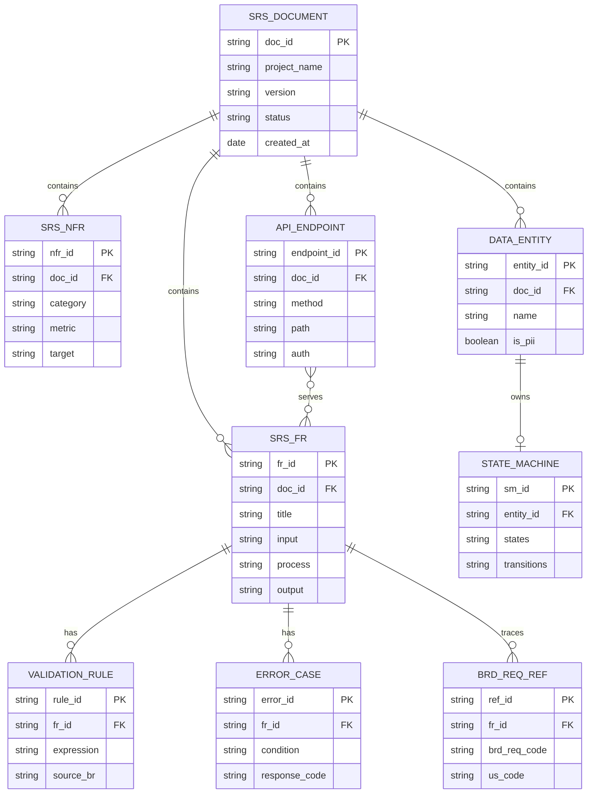
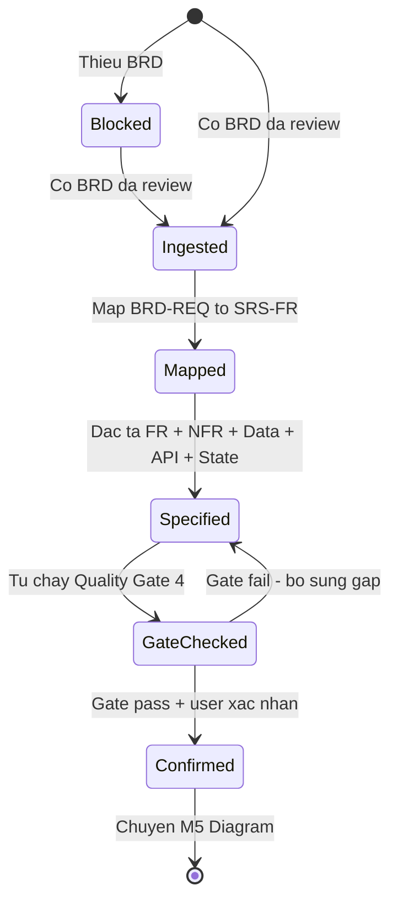

# SRS — Component 04: SRS Generation

> Đặc tả **chức năng & kỹ thuật** của năng lực **SRS Generation** (phase M4) thuộc BA Super App: nhận **BRD** làm input và sinh ra một **SRS** kỹ thuật theo [`srs-template`](../../../01-framework/templates/srs-template.md). Mức nghiệp vụ ở [BRD Component 04](../../01-business/brd/04-srs-generation.md). Hiện thực bởi framework module [`M4-srs`](../../../01-framework/modules/M4-srs.md).
>
> **ID:** `FR-SRSGEN-##` (functional), `NFR-SRSGEN-##` (non-functional) — yêu cầu của **chính công cụ**. Phân biệt với `SRS-FR-###` / `SRS-NFR-###` / `BRD-REQ-###` là **artefact công cụ sinh ra cho dự án khách**.

---

## 1. Giới thiệu

### 1.1 Mục đích
Đặc tả kỹ thuật cho **năng lực sinh SRS** của BA Super App: hành vi Input → Process → Output khi công cụ chuyển một **BRD đã review** thành một **SRS** chuẩn (Functional Requirements, NFR có con số, Data Model + ERD, API spec, State Machine, Traceability). Tài liệu này để người bảo trì framework (M4) và đội web (Component 07) triển khai/kiểm thử *chính capability này* mà không phải đoán.

### 1.2 Phạm vi
Bao phủ các FR của capability: ingest & validate BRD (precondition), map `BRD-REQ → SRS-FR`, đặc tả từng FR (I/P/O + validation + error), sinh NFR đo được, trích Data Model + ERD, sinh API spec (khi `[SYSTEM]` cần), sinh State Machine, áp **Conversion BRD→SRS**, lập Traceability + tự chạy **Quality Gate 4**. Bám in-scope của [BRD Component 04 §2](../../01-business/brd/04-srs-generation.md). Không bao gồm: business case (Component 03), test case chi tiết (Component 06), diagram đầy đủ ngoài ERD/state (Component 05).

### 1.3 Thuật ngữ (Glossary)

| Thuật ngữ | Giải nghĩa |
|-----------|------------|
| SRS | Software Requirements Specification — deliverable đầu ra của capability này. |
| BRD-REQ | Business Requirement ID trong BRD khách (`BRD-REQ-###`) — **nguồn** của mỗi `SRS-FR`. |
| SRS-FR / SRS-NFR | Functional / Non-functional Requirement trong **SRS sinh ra cho khách** (`SRS-FR-###`, `SRS-NFR-###`). |
| FR-SRSGEN / NFR-SRSGEN | Yêu cầu chức năng / phi chức năng của **chính công cụ** (tài liệu này). |
| Conversion BRD→SRS | Bảng ánh xạ chuẩn từng phần tử BRD sang phần tử SRS (M4 §⑥). |
| ERD | Entity-Relationship Diagram (Mermaid `erDiagram`) trong Data Model của SRS. |
| State Machine | `stateDiagram-v2` mô tả vòng đời một entity có nhiều trạng thái. |
| Quality Gate 4 | Cổng "Technical Completeness" tự chạy cuối phase SRS (M4 §⑦). |
| `⚠️ Assumption` | Nhãn cho default kỹ thuật chưa được khách chốt (M4 §④, §⑧). |

### 1.4 Tài liệu tham chiếu

| Tài liệu | Phiên bản | Liên quan |
|----------|-----------|-----------|
| [BRD Component 04 — SRS Generation](../../01-business/brd/04-srs-generation.md) | 1.0 | Nguồn `REQ-SRSGEN-##`, `BR-SRSGEN-##` |
| [Framework module `M4-srs`](../../../01-framework/modules/M4-srs.md) | v2.0 | Hành vi chuẩn của capability (process, conversion, gate) |
| [`srs-template`](../../../01-framework/templates/srs-template.md) | v2.0 | Khung output mà capability phải sinh đúng |
| [SRS overview](../srs.md) · [BRD overview](../../01-business/brd.md) | 1.0 | Trục 7 component, ID scheme |

---

## 2. Functional Requirements

> ID: `FR-SRSGEN-[###]`. Mỗi FR mô tả một hành vi của **công cụ sinh SRS**. "I-O" tổng: **BRD (input) → SRS doc theo srs-template (output)**.

### FR-SRSGEN-001: Ingest & validate BRD (precondition)
- **Mô tả:** Kiểm tra điều kiện đầu vào trước khi sinh SRS; nếu thiếu BRD đã chốt thì dừng và đề xuất phương án, không dựng SRS bịa.
- **Source:** REQ-SRSGEN-01, REQ-SRSGEN-10, BR-SRSGEN-04
- **Input:** BRD đã review (`BRD-REQ-###`, Business Rules, Data Requirements, Process Flows); tuỳ chọn: User Stories (kèm AC), project context (`[DOMAIN]/[SYSTEM]/[COMPLIANCE]`).
- **Process:** xác nhận tồn tại ≥1 `BRD-REQ` → nếu đủ, nạp BRD + US + context làm nguồn grounding → nếu thiếu BRD, kích hoạt stop-precondition.
- **Output:** trạng thái `Ready` (đủ input, chuyển B1) hoặc `Blocked` (thiếu input, kèm câu hỏi đề xuất chạy M3 rút gọn).
- **Validation Rules:**
  - Bắt buộc có ≥1 `BRD-REQ`; thiếu → không sang Mapping.
  - Context thiếu `[SYSTEM]` → đánh dấu để hỏi Socratic ở FR-SRSGEN-005 (API) thay vì đoán.
- **Error Handling:**
  - Không có BRD → `Blocked`: *"Chưa có BRD đã chốt — SRS sẽ thiếu nguồn truy vết. (a) chạy M3 rút gọn để có BRD-REQ, hay (b) tạm map FR thẳng từ US (traceability yếu)?"* (mặc định (a)).
  - Chỉ có US rời rạc, không có BRD-REQ → cảnh báo traceability yếu trước khi tiếp.

### FR-SRSGEN-002: Map BRD-REQ → SRS-FR
- **Mô tả:** Ánh xạ mỗi `BRD-REQ` thành một hoặc nhiều `SRS-FR`, gắn **Source** rõ ràng; không tạo FR mồ côi.
- **Source:** REQ-SRSGEN-02, BR-SRSGEN-01, BR-SRSGEN-02
- **Input:** danh sách `BRD-REQ-###` (+ US tương ứng) từ FR-SRSGEN-001.
- **Process:** với mỗi `BRD-REQ`, tách thành ≥1 `SRS-FR` (REQ "to" tách nhiều FR) → cấp ID `SRS-FR-###` tuần tự → ghi `Source: BRD-REQ-###[, US-...]` trên từng FR.
- **Output:** tập `SRS-FR` (mới ở mức tiêu đề + Source), sẵn sàng đặc tả chi tiết (FR-SRSGEN-003).
- **Validation Rules:**
  - Mỗi `SRS-FR` có **đúng** trường Source trỏ về `BRD-REQ`/`US` thật.
  - Mỗi `BRD-REQ` được phủ bởi **≥1** `SRS-FR` (kiểm ở Gate 4).
- **Error Handling:**
  - Phát sinh FR không có nguồn → chặn, yêu cầu gắn Source hoặc loại bỏ (no scope creep).
  - `BRD-REQ` chưa được phủ → đánh dấu "uncovered", liệt kê ở kết quả Gate.

### FR-SRSGEN-003: Đặc tả từng FR (Input/Process/Output + Validation + Error)
- **Mô tả:** Với mỗi `SRS-FR`, sinh đầy đủ khung **Mô tả · Source · Input · Process · Output · Validation Rules · Error Handling**; chuyển **Business Rule (BRD) → Validation Rule (FR)**.
- **Source:** REQ-SRSGEN-02, REQ-SRSGEN-07, BR-SRSGEN-01
- **Input:** `SRS-FR` (tiêu đề + Source) + Business Rules liên quan + AC của US.
- **Process:** điền Input (data/action) → Process (các bước + rule áp dụng) → Output (kết quả/trạng thái) → ánh xạ Business Rule thành Validation Rule → liệt kê ≥1 Error scenario.
- **Output:** `SRS-FR` hoàn chỉnh theo khung srs-template §2.
- **Validation Rules:**
  - Mỗi FR có **≥1 Error Handling** (yêu cầu Gate 4 #6).
  - Business Rule trong BRD không được "rơi" — phải xuất hiện như Validation Rule ở FR phù hợp.
- **Error Handling:**
  - FR thiếu Error scenario → Gate 4 fail, đánh dấu FR cần bổ sung.
  - Rule mơ hồ (không đo/không kiểm được) → hỏi Socratic hoặc `⚠️ Assumption`.

### FR-SRSGEN-004: Sinh NFR đo được
- **Mô tả:** Sinh Non-functional Requirements đủ 4 nhóm — Performance / Security / Availability / Scalability — **mỗi mục có con số**; KPI/SLA trong BRD → Performance/Availability target; Compliance → Security.
- **Source:** REQ-SRSGEN-03, BR-SRSGEN-03, REQ-SRSGEN-07
- **Input:** KPI/Metrics + Compliance + user_count (BRD); default M4 §④ khi BRD im lặng.
- **Process:** chuyển KPI → Performance/Availability target → suy Security từ `[COMPLIANCE]` → đặt Scalability theo growth → gán mỗi NFR một con số; default nào dùng → gắn `⚠️ Assumption`.
- **Output:** `SRS-NFR-###` (Performance, Security, Availability, Scalability) theo srs-template §3, mỗi mục có giá trị số.
- **Validation Rules:**
  - **Không** NFR định tính ("nhanh", "an toàn") — phải có metric (vd p95 < 500ms, uptime 99.9%).
  - Đủ cả 4 nhóm; thiếu nhóm → Gate 4 fail.
- **Error Handling:**
  - Thiếu KPI nguồn để đặt số → hỏi Socratic (options + default); nếu chưa chốt → `⚠️ Assumption + default`, không khẳng định.

### FR-SRSGEN-005: Đặc tả Data Model + ERD
- **Mô tả:** Từ Data Requirements (BRD) sinh entity list (attribute chính + PK/FK + quan hệ) và vẽ **ERD Mermaid** render-ready; đánh dấu thuộc tính **PII/nhạy cảm**.
- **Source:** REQ-SRSGEN-04, BR-SRSGEN-06
- **Input:** Data Requirements / thực thể nghiệp vụ nêu trong BRD + entity ngầm định trong FR.
- **Process:** liệt kê entity → gán attribute chính (PK/FK) → xác định quan hệ → vẽ `erDiagram` (token quan hệ không ngoặc; block thuộc tính `type name PK/FK`; nhãn quan hệ một từ) → gắn nhãn PII.
- **Output:** bảng Entity List + khối **ERD Mermaid** hợp lệ (srs-template §4).
- **Validation Rules:**
  - Mỗi entity có PK; quan hệ FK khớp giữa hai entity.
  - ERD render không lỗi cú pháp Mermaid (type token `int/string/...` không bọc ngoặc).
- **Error Handling:**
  - Data Requirements thiếu → suy entity tối thiểu từ FR + gắn `⚠️ Assumption`; không bịa attribute không có nguồn.

### FR-SRSGEN-006: Sinh API spec (conditional theo `[SYSTEM]`)
- **Mô tả:** Khi `[SYSTEM]` là web/mobile/api-platform/crm/erp, đặc tả endpoint (Method · Path · Mô tả · Auth) kèm ví dụ Request/Response/Error JSON; nếu là **data-pipeline thuần** → thay bằng mục **Interface/Contract dữ liệu**.
- **Source:** REQ-SRSGEN-05, REQ-SRSGEN-09
- **Input:** danh sách `SRS-FR` + loại `[SYSTEM]` từ context + auth default (M4 §④).
- **Process:** với FR cần API, ánh xạ thành endpoint REST (prefix `/api/v1/`) → gán Auth → viết ví dụ Request/Response (201) + Error (4xx/5xx) → nếu pipeline thuần, mô tả contract dữ liệu (schema In/Out) thay endpoint.
- **Output:** bảng API Endpoints + ví dụ JSON (srs-template §5) **hoặc** mục Interface/Contract dữ liệu.
- **Validation Rules:**
  - Chỉ sinh API khi `[SYSTEM]` thực sự expose API; không "đắp" API cho hệ không cần.
  - Mỗi endpoint có Auth rõ; ví dụ JSON khớp Input/Output của FR nguồn.
- **Error Handling:**
  - `[SYSTEM]` chưa rõ → hỏi Socratic; chưa chốt → `⚠️ Assumption` (mặc định có API) + ghi rõ điều kiện.

### FR-SRSGEN-007: Sinh State Machine cho entity có vòng đời
- **Mô tả:** Cho mọi entity có **vòng đời nhiều trạng thái** (đơn/hồ sơ/ticket/policy…), vẽ `stateDiagram-v2` và nêu điều kiện chuyển trạng thái.
- **Source:** REQ-SRSGEN-06, BR-SRSGEN-06
- **Input:** Process Flow (BRD) + entity từ Data Model có thuộc tính `status`.
- **Process:** nhận diện entity có nhiều state → liệt kê state + transition → đặt nhãn điều kiện sau dấu `:` → vẽ `stateDiagram-v2` (bắt đầu `[*]`, kết thúc `[*]`).
- **Output:** một hoặc nhiều khối **state diagram Mermaid** hợp lệ (srs-template §6).
- **Validation Rules:**
  - Mỗi entity có `status` trong Data Model nên có state machine tương ứng.
  - Nhãn transition đặt sau `:`, tránh ký tự phá cú pháp.
- **Error Handling:**
  - Vòng đời mơ hồ (transition không rõ điều kiện) → hỏi hoặc `⚠️ Assumption`; không tự bịa nhánh trạng thái.

### FR-SRSGEN-008: Conversion BRD→SRS + Traceability + Quality Gate 4
- **Mô tả:** Áp **bảng Conversion BRD→SRS** chuẩn, lập bảng **Traceability** `SRS-FR → BRD-REQ → US → TC`, rồi **tự chạy Quality Gate 4**; chưa đạt → không sang M5.
- **Source:** REQ-SRSGEN-07, REQ-SRSGEN-08, BR-SRSGEN-02, BR-SRSGEN-07
- **Input:** toàn bộ FR/NFR/Data Model/API/State đã sinh + bảng Conversion (M4 §⑥).
- **Process:** đối chiếu từng phần tử BRD đã chuyển đúng theo Conversion → dựng bảng Traceability → chạy 7 check của Gate 4 (FR coverage, NFR có số, Data Model, API, State, Error Handling, Integration) + cross-doc consistency → kết: Pass hoặc liệt kê hạng mục thiếu.
- **Output:** bảng Conversion (tham chiếu), bảng Traceability (srs-template §8), báo cáo Gate 4 (pass/fail + gap).
- **Validation Rules:**
  - Chain `US → BRD-REQ → SRS-FR` không đứt; thuật ngữ/actor khớp BRD & US.
  - **Không** FR nào nằm ngoài BRD (no scope creep).
- **Error Handling:**
  - Gate fail (vd có `BRD-REQ` chưa phủ, NFR thiếu số) → **fail-closed**: chặn chuyển M5, in danh sách gap + đề xuất sửa.
  - Cuối phase đạt Gate nhưng còn `⚠️ Assumption` → liệt kê, **xin xác nhận người dùng** trước khi sang M5.

---

## 3. Non-Functional Requirements

> ID: `NFR-SRSGEN-[###]`. Đây là NFR của **chính công cụ sinh SRS** (không phải `SRS-NFR-###` của khách). Mỗi mục có tiêu chí đo được.

### 3.1 Performance (NFR-SRSGEN-001)

| Metric | Target |
|--------|--------|
| Thời gian sinh một SRS đầy đủ (BRD trung bình) | tiết kiệm ≥ **50%** so với viết tay (KPI BRD §7) |
| Quy mô xử lý ổn định | **15–60** SRS-FR / dự án (khớp 15–60 US, [BRD overview §7](../../01-business/brd.md)) |
| Phản hồi tương tác (web, Component 07) | streaming, client cảm nhận < **1s** tới token đầu |

> ⚠️ Assumption: ngưỡng thời gian phụ thuộc LLM/nền tảng chạy; chỉ số đo ở mức năng suất người dùng, không phải latency hệ thống backend (MVP web là client-side, [SRS overview R-04](../srs.md)).

### 3.2 Security (NFR-SRSGEN-002)
- **No data exfiltration:** capability chỉ xử lý nội dung BRD/US người dùng cung cấp; bản thân prompt-fragment không nhúng dữ liệu khách. Web MVP lưu **localStorage**, không gửi backend ([SRS overview R-04](../srs.md)).
- **PII awareness:** ERD/Data Model **phải đánh dấu** thuộc tính PII (FR-SRSGEN-005); SRS sinh ra phải đặt Security requirement từ `[COMPLIANCE]` (Conversion: Compliance → Security §3.2).
- **Compliance-driven default:** `[COMPLIANCE]` trống → mặc định **PDPA + hỏi xác nhận** (không tự áp chuẩn khác).

### 3.3 Reliability / Correctness (NFR-SRSGEN-003)
- **No-fabrication rate:** **0** FR/entity/endpoint không truy được nguồn (BR-SRSGEN-01); vi phạm là lỗi nghiêm trọng.
- **Gate fail-closed:** **100%** SRS bàn giao đã qua Quality Gate 4; chưa đạt → không sang M5.
- **Mermaid validity:** **100%** ERD + state diagram render không lỗi cú pháp.
- **Refine có giới hạn:** lặp refine cùng một mục **≤ 3 vòng** → đề xuất chốt/escalate (M4 §⑨), không lặp vô hạn.

### 3.4 Maintainability & Portability (NFR-SRSGEN-004)
- **Module-as-prompt:** capability là **một prompt-fragment** [`M4-srs`](../../../01-framework/modules/M4-srs.md) độc lập, load theo phase; sửa hành vi SRS = sửa M4, **không** đụng controller lõi ([SRS overview R-02](../srs.md)).
- **Config-over-code:** `[DOMAIN]/[SYSTEM]/[COMPLIANCE]` là biến; **không hardcode** tên khách (BR-SRSGEN cf. REQ-SRSGEN-09).
- **Portability:** chạy trên mọi LLM tool đọc được prompt-fragment; output Markdown + Mermaid render-ready, không phụ thuộc nền riêng.

---

## 4. Data Model

> Data Model **của capability** = cấu trúc một **SRS document mà công cụ sinh ra**. Đây là meta-model (artefact), không phải dữ liệu nghiệp vụ của khách.

### 4.1 Entity List

| Entity | Mô tả | Attributes chính | Relationships | Sensitivity |
|--------|-------|------------------|---------------|-------------|
| SRS_DOCUMENT | SRS đầu ra cho một dự án | doc_id (PK), project_name, version, status, created_at | gồm nhiều FR/NFR/ENTITY/API/STATE | Normal |
| SRS_FR | Functional Requirement trong SRS | fr_id (PK), doc_id (FK), title, input, process, output | thuộc 1 SRS_DOCUMENT; trace tới ≥1 BRD_REQ_REF | Normal |
| SRS_NFR | Non-functional Requirement | nfr_id (PK), doc_id (FK), category, metric, target | thuộc 1 SRS_DOCUMENT | Normal |
| VALIDATION_RULE | Quy tắc kiểm/hợp lệ của một FR | rule_id (PK), fr_id (FK), expression, source_br | thuộc 1 SRS_FR | Normal |
| ERROR_CASE | Kịch bản lỗi của một FR | error_id (PK), fr_id (FK), condition, response_code | thuộc 1 SRS_FR | Normal |
| DATA_ENTITY | Entity trong Data Model của SRS khách | entity_id (PK), doc_id (FK), name, is_pii | thuộc 1 SRS_DOCUMENT | PII flag |
| API_ENDPOINT | Endpoint trong API spec của SRS khách | endpoint_id (PK), doc_id (FK), method, path, auth | thuộc 1 SRS_DOCUMENT; phục vụ ≥1 SRS_FR | Normal |
| STATE_MACHINE | Vòng đời một DATA_ENTITY | sm_id (PK), entity_id (FK), states, transitions | thuộc 1 DATA_ENTITY | Normal |
| BRD_REQ_REF | Con trỏ truy vết tới BRD-REQ nguồn | ref_id (PK), fr_id (FK), brd_req_code, us_code | nối SRS_FR ↔ nguồn BRD/US | Normal |

### 4.2 ERD



> Đây là meta-model của **một SRS** (sản phẩm đầu ra). `BRD_REQ_REF` là cơ chế hiện thực Traceability `SRS-FR → BRD-REQ → US`.

---

## 5. API Specification

> Capability M4 ở dạng **prompt-fragment**, không tự expose REST API ở MVP. Khi chạy trong Web Workspace (Component 07), nó được gọi như một **lệnh nội bộ** `/srs`. Phần dưới đặc tả **interface gọi capability**, không phải API hạ tầng.

### 5.1 Invocation Interface

| Kênh | Lời gọi | Mô tả | Auth |
|------|---------|-------|------|
| Standalone (LLM) | `/srs` | Kích hoạt phase SRS sau khi BRD đã qua gate | n/a (phiên chat) |
| Web Workspace (07) | action `generate-srs` | Chạy M4 trên BRD của dự án đang mở | localStorage session (MVP) |

### 5.2 Logical Input / Output (Contract)

**Input — logical request `generate-srs`**
```json
{
  "command": "/srs",
  "brd": { "brd_reqs": ["BRD-REQ-001", "BRD-REQ-002"], "business_rules": ["..."], "data_requirements": ["..."], "process_flows": ["..."] },
  "user_stories": ["US-SALES-001"],
  "context": { "domain": "[DOMAIN]", "system": "[SYSTEM]", "compliance": "[COMPLIANCE]" }
}
```

**Output — logical response (SRS theo srs-template)**
```json
{
  "document_type": "SRS",
  "status": "draft",
  "functional_requirements": [ { "id": "SRS-FR-001", "source": "BRD-REQ-001" } ],
  "non_functional_requirements": [ { "id": "SRS-NFR-001", "category": "Performance", "target": "p95 < 500ms" } ],
  "data_model": { "entities": ["..."], "erd_mermaid": "erDiagram ..." },
  "state_machines": ["stateDiagram-v2 ..."],
  "traceability": [ { "srs_fr": "SRS-FR-001", "brd_req": "BRD-REQ-001", "us": "US-SALES-001" } ],
  "quality_gate_4": { "passed": true, "gaps": [] },
  "assumptions": ["⚠️ architecture = modular-monolith (default)"]
}
```

**Error — gate fail / precondition blocked**
```json
{
  "error": "BRD_MISSING",
  "message": "Chưa có BRD đã chốt — đề xuất chạy M3 rút gọn trước khi sinh SRS."
}
```

> ⚠️ Assumption: REST endpoint thực (vd `POST /api/v1/srs`) chỉ áp dụng nếu sau này có backend; ở MVP đây là contract logic giữa controller và module M4.

---

## 6. State Machines

> Vòng đời của **một SRS document trong quá trình công cụ sinh ra** (từ lúc nhận BRD đến lúc qua Gate 4 và được người dùng chốt).

### SRS_DOCUMENT States



> Điều kiện chuyển chính: `Blocked→Ingested` cần ≥1 `BRD-REQ`; `GateChecked→Confirmed` cần Gate 4 pass **và** mọi `⚠️ Assumption` được người dùng xác nhận (human-in-the-loop).

---

## 7. Traceability

> `FR-SRSGEN-## → REQ-SRSGEN-## (BRD Component 04) → REQ-### (BRD overview) → M4-srs`.

| FR-SRSGEN | REQ-SRSGEN (BRD-04) | REQ tổng (BRD overview) | Hiện thực (framework) |
|-----------|---------------------|-------------------------|------------------------|
| FR-SRSGEN-001 (Ingest & validate BRD) | REQ-SRSGEN-01, 10 | REQ-002, REQ-010 | M4 §② Inputs/Preconditions, §⑨ Stop |
| FR-SRSGEN-002 (Map BRD-REQ→SRS-FR) | REQ-SRSGEN-02 | REQ-002, REQ-003 | M4 §③ B1 |
| FR-SRSGEN-003 (Đặc tả FR I/P/O + Validation + Error) | REQ-SRSGEN-02, 07 | REQ-002 | M4 §③ B2, §⑥ |
| FR-SRSGEN-004 (NFR đo được) | REQ-SRSGEN-03 | REQ-002 | M4 §③ B6, §④ |
| FR-SRSGEN-005 (Data Model + ERD) | REQ-SRSGEN-04 | REQ-002 | M4 §③ B3, §⑧ |
| FR-SRSGEN-006 (API spec conditional) | REQ-SRSGEN-05, 09 | REQ-006 | M4 §③ B4 |
| FR-SRSGEN-007 (State Machine) | REQ-SRSGEN-06 | REQ-002 | M4 §③ B5 |
| FR-SRSGEN-008 (Conversion + Traceability + Gate 4) | REQ-SRSGEN-07, 08 | REQ-003, REQ-004 | M4 §③ B8, §⑥, §⑦ |
| NFR-SRSGEN-001..004 | REQ-SRSGEN-03, 09, 10 | REQ-002, REQ-006, REQ-010 | M4 §④, §⑧, §⑨ |

> Cross-doc: chain `US → BRD-REQ → SRS-FR` áp cho **deliverable khách**; ở đây chain `REQ-SRSGEN → FR-SRSGEN → M4` áp cho **chính sản phẩm**. Tổng hợp: [SRS overview §6](../srs.md).

---

## Lịch sử thay đổi

| Version | Ngày | Thay đổi | Người |
|---------|------|----------|-------|
| 1.0 | 2026-06-02 | Khởi tạo SRS Component 04 (SRS Generation) — 8 FR-SRSGEN + 4 NFR-SRSGEN, ERD meta-model, state machine, traceability | BA Super App |
