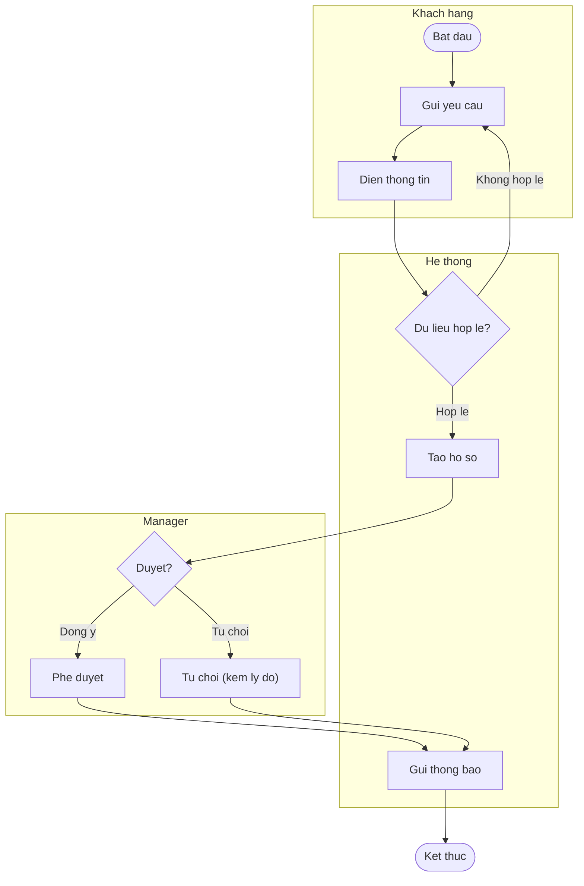
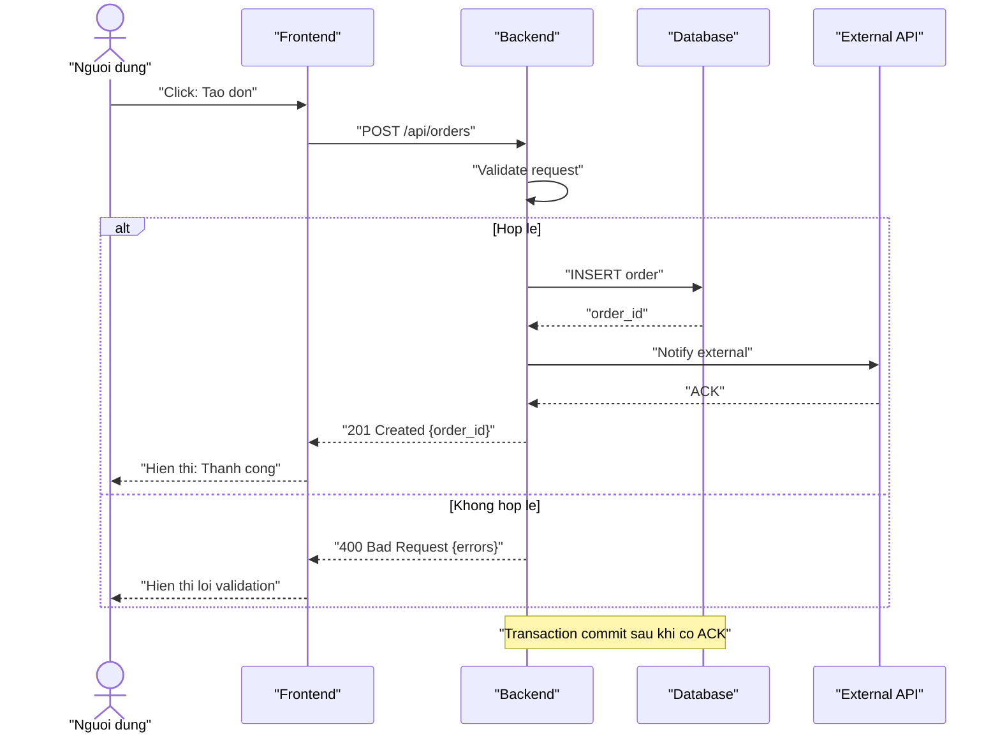
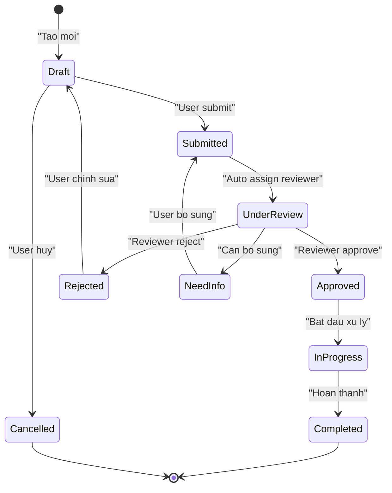
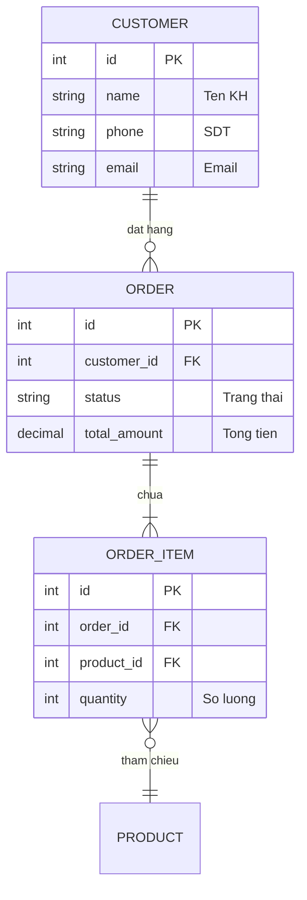
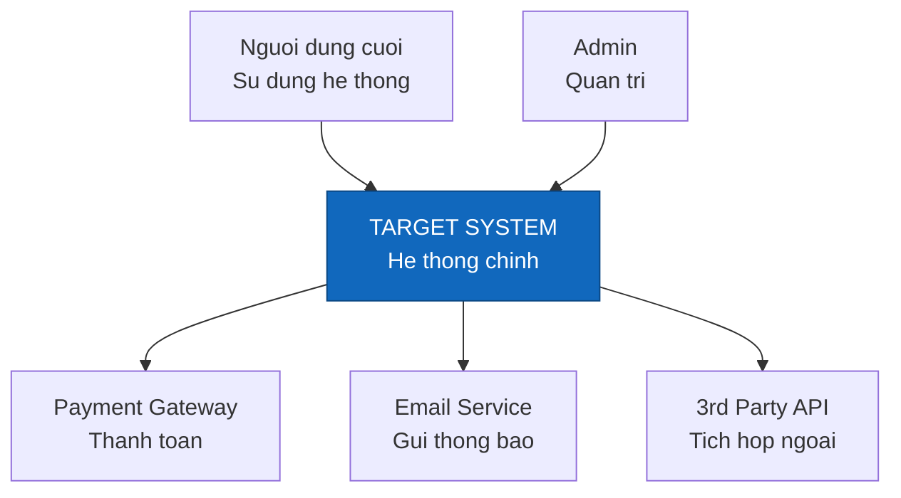
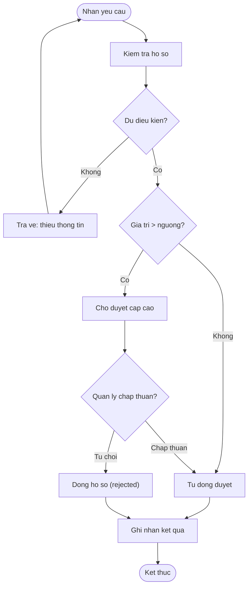
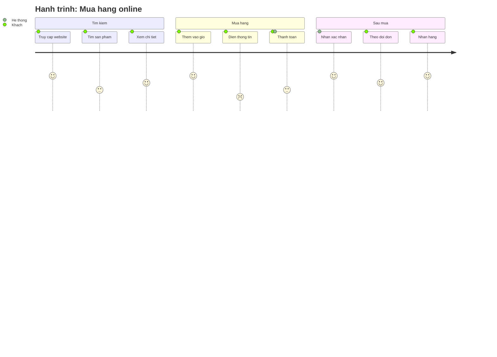
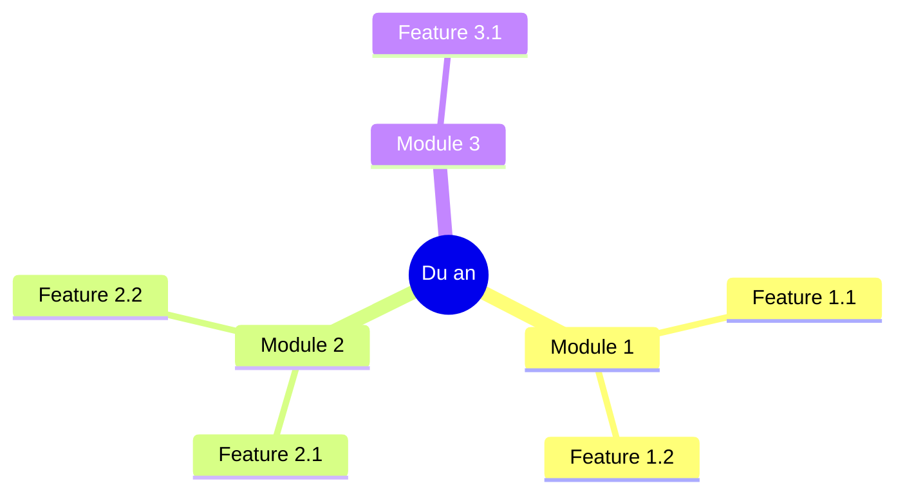

<!--
  Document ID: SRS-DIAG-1.0
  Date: 2026-06-02
  Version: 1.0
  Status: Draft
  Source: SRS per-component cho Component 05 (Diagram Generation) của BA Super App. 1:1 với BRD 05-diagram. Grounding: 01-framework/modules/M5-diagram.md + 01-framework/templates/diagram-catalog.md. Chuẩn AIPlat.
-->

# SRS — Component 05: Diagram Generation (`DIAG`)

> Đặc tả **chức năng & kỹ thuật** của năng lực sinh sơ đồ. Mức nghiệp vụ ở [BRD 05-diagram](../../01-business/brd/05-diagram.md); chuẩn output ở [output-standard](../../../01-framework/core/output-standard.md); phi chức năng ở [NFR](../nfr.md).
>
> **ID:** `FR-DIAG-##` (functional). Không lẫn với `DG-[TYPE]-###` mà công cụ *sinh ra* cho dự án khách.
>
> **Framework source:** [`modules/M5-diagram.md`](../../../01-framework/modules/M5-diagram.md) (+ [`templates/diagram-catalog.md`](../../../01-framework/templates/diagram-catalog.md)).

---

## 1. Phạm vi & cách đọc

Component 05 là **prompt-fragment (M5)** được Master Controller load on-demand khi intent người dùng là "vẽ / tạo sơ đồ". Bản chất: nhận một **nguồn** (artifact BA hoặc mô tả quy trình bằng lời) + **loại sơ đồ** (hoặc câu hỏi cần trả lời) → sinh **Mermaid render-ready** đúng loại, có ID + Source + giải thích.

SRS này đặc tả 10 yêu cầu chức năng `FR-DIAG-01..10`, khớp 1:1 với `REQ-DIAG-01..10` của BRD. Trọng tâm cứng: **8 loại diagram**, **render-ready**, **selection guide**.

## 2. Input / Output & Interfaces

### 2.1 Input → Output (bản chất component)

| Input | → | Output |
|-------|---|--------|
| **Tài liệu** (BRD/SRS/US/Discovery) hoặc **mô tả quy trình bằng lời** + loại sơ đồ (hoặc câu hỏi) + scope (tuỳ chọn) | → | **Mermaid render-ready** (1 trong 8 loại) + ID `DG-[TYPE]-###` + Source + giải thích 1–3 câu |

Tức là: **tài liệu → Mermaid**. Sơ đồ là *dẫn xuất*, mọi thành phần truy về nguồn hoặc gắn `⚠️ Assumption`.

### 2.2 Interfaces (lệnh)

| Interface | Cú pháp | Hành vi |
|-----------|---------|---------|
| Gọi module | `/diagram [type]` | Vào M5, vẽ loại `[type]` từ nguồn hiện có. `type` ∈ `bpmn \| flow \| activity \| sequence \| state \| erd \| c4 \| journey \| mindmap` |
| Không kèm type | `/diagram` | Hỏi **Socratic Q1** (Selection Guide) để chọn loại theo câu hỏi cần trả lời |
| Chỉ định nguồn | `/diagram [type] from [SRS-FR-### \| US-… \| "mô tả"]` | Lấy `Source` tường minh; nếu thiếu → Socratic Q2 (xin artifact/mô tả) |
| Refine | hội thoại tự nhiên ("đổi …", "thêm bước …") | Sửa sơ đồ vừa sinh, ≤ 3 vòng/sơ đồ |

> ⚠️ **Assumption:** cú pháp lệnh `/diagram [type]` là quy ước interface của component này (M5 mô tả intent route, không cố định chuỗi lệnh); giữ nhất quán với các module khác của BA Super App.

### 2.3 Output Contract (mỗi sơ đồ)

```
### DG-[TYPE]-[###]: [Tên sơ đồ ngắn]
**Type:** [BPMN | FLOW | SEQ | STATE | ERD | C4 | JOURNEY | MIND]
**Source:** [BRD-REQ-### | SRS-FR-### | US-… | "mô tả khẩu ngữ"]
**Scope:** [phạm vi]
```mermaid
[... Mermaid render-ready ...]
```
**Sơ đồ này nói gì:** [1–3 câu]   [⚠️ Assumption: … nếu có node suy ra]
```

## 3. Diagram Selection Guide (8 loại)

Chọn loại theo **câu hỏi người đọc cần trả lời** (nguồn: M5 Selection Guide). Đây là input cho `FR-DIAG-04`.

| Loại | TYPE id | Trả lời câu hỏi | Khi nào dùng |
|------|---------|-----------------|--------------|
| BPMN / Swimlane | `BPMN` | *Ai* làm *bước nào*, theo thứ tự nào? | Quy trình nhiều vai trò, có bàn giao |
| Flowchart / Activity | `FLOW` / `ACT` | Logic rẽ nhánh ra sao? | Luồng nhiều điểm quyết định, ít quan tâm "ai làm" |
| Sequence | `SEQ` | Các thành phần *trao đổi gì* theo thời gian? | API flow, tích hợp FE↔BE↔DB↔3rd-party |
| State machine | `STATE` | Một entity có *trạng thái* nào, chuyển khi nào? | Vòng đời đơn/ticket/order/tài khoản |
| ERD | `ERD` | Dữ liệu gồm *thực thể* gì, *quan hệ* ra sao? | Mô hình dữ liệu, cardinality |
| C4 Context | `C4` | Hệ thống trong *bối cảnh* nào, nói chuyện với *ai/cái gì*? | Tổng quan kiến trúc cấp cao |
| User Journey | `JOURNEY` | Trải nghiệm user *từng giai đoạn* tốt/xấu ở đâu? | Phân tích UX, tìm điểm đau |
| Mindmap | `MIND` | Một concept *phân rã* thành gì? | Brainstorm, feature/scope breakdown |

> Phân biệt: **Activity vs BPMN** (logic vs ai/swimlane) · **Sequence vs BPMN** (thời gian/thông điệp vs bước/vai trò) · **State vs Flowchart** (trạng thái của một vật vs dòng công việc).

## 4. Functional Requirements (FR-DIAG-##)

### FR-DIAG-01 — Sinh sơ đồ từ tài liệu/mô tả

- **Inputs:** một nguồn = artifact (BRD/SRS/US/Discovery) HOẶC mô tả quy trình bằng lời; loại sơ đồ (hoặc câu hỏi).
- **Process:** B1 trích actors/steps/states/entities từ nguồn → B2 map vào mẫu catalog → B3 sinh Mermaid → B4 Quality Gate → B5 đóng gói (ID+Source+giải thích).
- **Outputs:** một khối Output Contract (§2.3) với Mermaid render-ready.
- **AC:**
  - **AC1:** Given người dùng đã cung cấp một artifact và nêu loại sơ đồ, When gọi component, Then sinh sơ đồ Mermaid đúng loại bám nội dung artifact.
  - **AC2:** Given chỉ có mô tả quy trình bằng lời (không artifact), When yêu cầu vẽ, Then vẫn sinh được sơ đồ từ mô tả đó, ghi `Source: "(mô tả khẩu ngữ)"`.
- **Errors:** thiếu cả nguồn → kích hoạt Socratic Q2, KHÔNG tự bịa (xem FR-DIAG-06).

### FR-DIAG-02 — Hỗ trợ đủ 8 loại diagram

- **Inputs:** `type` ∈ {BPMN/Swimlane, Flowchart/Activity, Sequence, State, ERD, C4 Context, Journey, Mindmap}.
- **Process:** chọn mẫu tương ứng trong [`diagram-catalog.md`](../../../01-framework/templates/diagram-catalog.md); không sáng tạo cú pháp ngoài catalog.
- **Outputs:** sơ đồ đúng khai báo type ở dòng đầu (`graph TD` | `sequenceDiagram` | `stateDiagram-v2` | `erDiagram` | `journey` | `mindmap`).
- **AC:**
  - **AC1:** Given người dùng chọn bất kỳ 1 trong 8 loại, When vẽ, Then hệ thống sinh đúng loại đó với cú pháp Mermaid của loại đó.
  - **AC2:** Given người dùng yêu cầu loại ngoài 8 loại, When xử lý, Then từ chối lịch sự và đề xuất loại gần nhất trong 8 loại.
- **Errors:** type không hợp lệ → liệt kê 8 loại + Selection Guide.

**Ví dụ render-ready cho 8 loại (mẫu chuẩn từ catalog):**

#### (1) BPMN / Swimlane — `DG-BPMN-001`



#### (2) Sequence — `DG-SEQ-001`



#### (3) State machine — `DG-STATE-001`



#### (4) ERD — `DG-ERD-001`



#### (5) C4 Context — `DG-C4-001`



#### (6) Activity — `DG-ACT-001`



#### (7) User Journey — `DG-JOURNEY-001`



#### (8) Mindmap — `DG-MIND-001`



### FR-DIAG-03 — Render-ready (Quality Gate)

- **Inputs:** sơ đồ vừa sinh (B3).
- **Process:** chạy checklist Quality Gate (cú pháp + grounding) trước khi xuất; Fail → quay lại sửa B3.
- **Outputs:** chỉ xuất sơ đồ đã **Pass** — dán vào trình xem Mermaid là chạy ngay.
- **AC:**
  - **AC1:** Given một sơ đồ chứa nhãn có ký tự đặc biệt `/ : ( ) { } > , #`, When sinh ra, Then nhãn đó được **quote** (vd `A["Tao don (moi)"]`, `B{"Hop le?"}`).
  - **AC2:** Given một sơ đồ flowchart/state, When sinh ra, Then có start & end rõ; mỗi nhánh quyết định `{...}` có ≥ 2 lối ra, mỗi lối ra có nhãn điều kiện.
  - **AC3:** Given một sơ đồ chưa qua được Quality Gate, When kiểm, Then KHÔNG xuất ra cho người dùng (fail-closed).
- **Errors:** phát hiện lỗi cú pháp khi tự-nhẩm-parse → sửa ngay, không xuất bản lỗi.

### FR-DIAG-04 — Selection guide + Socratic Q1

- **Inputs:** loại sơ đồ (nếu có) hoặc câu hỏi cần trả lời.
- **Process:** nếu thiếu loại → hỏi **Socratic Q1** kèm options (a)–(g) và default theo nguồn (BRD→BPMN; SRS→Sequence+ERD; Discovery→C4/Mindmap); đối chiếu Selection Guide (§3).
- **Outputs:** loại sơ đồ đã chốt + lý do chọn.
- **AC:**
  - **AC1:** Given người dùng chưa nói loại, When gọi `/diagram`, Then đặt Socratic Q1 với options + default, không tự đoán loại.
  - **AC2:** Given người dùng chỉ nêu câu hỏi ("muốn thấy ai làm bước nào"), When xử lý, Then ánh xạ sang loại đúng (BPMN) theo Selection Guide rồi vẽ.
  - **AC3:** Given yêu cầu loại không khớp câu hỏi (vd "ERD cho quy trình duyệt"), When xử lý, Then hỏi lại để phân biệt (State machine vs ERD), không vẽ sai loại.
- **Errors:** câu hỏi mơ hồ & không rõ loại → hỏi Q1, không đoán bừa.

### FR-DIAG-05 — ID `DG-[TYPE]-###` + Source

- **Inputs:** sơ đồ đã sinh + nguồn.
- **Process:** cấp ID `DG-[TYPE]-[###]` (TYPE lấy từ cột TYPE id của Selection Guide, ### chạy 001, 002… trong phạm vi dự án) + ghi **Source** (ID artifact hoặc mô tả khẩu ngữ).
- **Outputs:** khối Output Contract có dòng `### DG-[TYPE]-###`, `**Source:**`, `**Scope:**`.
- **AC:**
  - **AC1:** Given vẽ một sequence từ `SRS-FR-014`, When xuất, Then ID là `DG-SEQ-001` (định dạng đúng) và `Source: SRS-FR-014`.
  - **AC2:** Given nguồn chưa có ID, When xuất, Then ghi `Source: "(mô tả khẩu ngữ)"` thay vì để trống.
- **Errors:** thiếu Source → không xuất; quay lại xác định nguồn.

### FR-DIAG-06 — Grounding / no-fabrication

- **Inputs:** nguồn + danh sách node/lifeline/state/entity dự kiến.
- **Process:** đối chiếu từng thành phần với nguồn; thành phần suy ra (không có tường minh trong nguồn) phải gắn `⚠️ Assumption`.
- **Outputs:** sơ đồ không có node "mồ côi"; phần suy ra có chú thích Assumption.
- **AC:**
  - **AC1:** Given một actor/bước không có trong nguồn nhưng cần để sơ đồ trọn vẹn, When đưa vào, Then đánh dấu `⚠️ Assumption: …` ở phần "Sơ đồ này nói gì".
  - **AC2:** Given không có nguồn nào (không artifact, không mô tả), When yêu cầu vẽ, Then KHÔNG tự bịa quy trình/entity; thay vào đó hỏi Socratic Q2.
- **Errors:** nguồn mâu thuẫn (hai chỗ mô tả khác nhau) → nêu mâu thuẫn, hỏi chốt, không tự chọn im lặng.

### FR-DIAG-07 — Giải thích ngắn (Output Contract)

- **Inputs:** sơ đồ đã sinh.
- **Process:** viết 1–3 câu "Sơ đồ này nói gì" bằng ngôn ngữ stakeholder + 1 câu hỏi refine.
- **Outputs:** đoạn giải thích + (tuỳ chọn) Assumption + câu hỏi refine.
- **AC:**
  - **AC1:** Given một sơ đồ bất kỳ, When xuất, Then luôn kèm đoạn "Sơ đồ này nói gì" ≤ 3 câu, không dùng thuật ngữ Mermaid nội bộ.
  - **AC2:** Given sơ đồ đã xuất, When kết thúc khối, Then có **đúng một** câu hỏi refine để người dùng tinh chỉnh.
- **Errors:** giải thích quá dài/lan man → rút gọn về ≤ 3 câu.

### FR-DIAG-08 — Catalog 8 mẫu (nguồn cú pháp)

- **Inputs:** loại sơ đồ đã chọn.
- **Process:** copy mẫu tương ứng từ [`diagram-catalog.md`](../../../01-framework/templates/diagram-catalog.md) → thay nội dung thật → **giữ nguyên quy tắc quote nhãn** và conventions của mẫu.
- **Outputs:** sơ đồ tuân conventions của mẫu (subgraph=swimlane; `->>`/`-->>` cho sequence; `[*]` cho state; `type name PK "comment"` cho ERD…).
- **AC:**
  - **AC1:** Given vẽ ERD, When sinh block thuộc tính, Then dùng cú pháp `type name PK|FK "comment"` với **type/name không ngoặc**, chỉ comment quote.
  - **AC2:** Given vẽ journey, When sinh bước, Then KHÔNG quote tên bước và tránh `: ( ) ,` trong tên bước (cú pháp `Ten buoc: <score>: <actor>`).
- **Errors:** dùng cú pháp ngoài catalog → thay bằng mẫu chuẩn.

### FR-DIAG-09 — Chống quá tải (tách sơ đồ)

- **Inputs:** sơ đồ dự kiến + số node ước lượng.
- **Process:** nếu > ~15 node hoặc nhiều domain → đề xuất **tách nhiều sơ đồ** theo phạm vi (hoặc gom subgraph), không nhồi một sơ đồ rối.
- **Outputs:** một hoặc nhiều sơ đồ, mỗi cái ≤ ~15 node.
- **AC:**
  - **AC1:** Given nguồn lớn cho ~25 node, When vẽ, Then đề xuất tách ≥ 2 sơ đồ theo phạm vi thay vì một sơ đồ quá tải.
  - **AC2:** Given scope chưa rõ và nguồn lớn, When xử lý, Then hỏi Socratic Q3 (toàn bộ hay một phần) với default = phạm vi hẹp nhất đủ trả lời câu hỏi.
- **Errors:** không thể tách hợp lý → nêu rõ và để người dùng chọn phạm vi.

### FR-DIAG-10 — Refine ≤ 3 vòng

- **Inputs:** sơ đồ đã xuất + yêu cầu chỉnh của người dùng.
- **Process:** sửa sơ đồ theo yêu cầu, chạy lại Quality Gate; đếm số vòng refine cùng một sơ đồ.
- **Outputs:** sơ đồ cập nhật (vẫn render-ready) hoặc thông báo escalate.
- **AC:**
  - **AC1:** Given người dùng yêu cầu chỉnh (thêm/bớt bước), When refine, Then sơ đồ cập nhật vẫn qua Quality Gate.
  - **AC2:** Given đã refine 3 vòng cùng một sơ đồ mà chưa chốt, When tới vòng kế, Then chốt bản tốt nhất hoặc escalate cho người dùng quyết, không lặp vô hạn.
- **Errors:** vòng lặp refine không hội tụ → áp Stop Condition, escalate.

## 5. Quality Gate (điều kiện xuất — render-ready)

KHÔNG xuất sơ đồ nếu chưa qua hết checklist (nguồn: M5 Quality Gate). Mermaid lỗi cú pháp = **fail**.

**A. Render-ready (cú pháp):**
- Khai báo đúng diagram type ở dòng đầu (`graph TD` | `sequenceDiagram` | `stateDiagram-v2` | `erDiagram` | `journey` | `mindmap`).
- **Quote mọi nhãn** chứa `/ : ( ) { } > , " ' #` hoặc dấu cách + ký tự lạ.
- Trong `erDiagram`: **type token + tên cột KHÔNG ngoặc**; chỉ comment sau tên cột mới quote.
- Mũi tên đúng loại: flowchart `-->` / `-->|nhan|`; sequence `->>` (req) & `-->>` (resp); ERD `||--o{`, `}o--||`, `||--|{`.
- Mỗi nhánh `{...}` có ≥ 2 lối ra, mỗi lối ra có nhãn điều kiện.
- State: dùng `[*]` cho start/end; tên state không dấu cách (CamelCase/snake_case); nhãn chuyển sau `:`.
- **Journey:** KHÔNG quote tên bước; tránh `: ( ) ,` trong tên bước.
- Emoji chỉ đặt *trong* nhãn đã quote, không ở ID node.

**B. Nội dung & grounding:**
- Mọi node/lifeline/state/entity truy về nguồn HOẶC gắn `⚠️ Assumption`.
- Đúng loại cho câu hỏi cần trả lời (đối chiếu Selection Guide §3).
- Flow/state có start & end; sequence đủ chiều req↔resp; ERD có cardinality cho mọi quan hệ.
- Không quá tải (> ~15 node → tách/gom subgraph).
- Có **ID + Source + giải thích**.

## 6. Non-Functional (liên quan)

Áp [NFR](../nfr.md): **NFR-P04** (Mermaid hợp lệ — quote nhãn đặc biệt; erDiagram type không ngoặc), **NFR-U02** (output render-ready, mở bằng mọi Markdown viewer), **NFR-R01** (no-hallucination — bám nguồn/Assumption), **NFR-R03** (refine ≤ 3 vòng), **NFR-M02** (mẫu tách khỏi module qua catalog).

## 7. Traceability

| FR (SRS) | ← REQ (BRD) | Framework source |
|----------|-------------|------------------|
| FR-DIAG-01 | REQ-DIAG-01 | M5 §Process B1–B5 |
| FR-DIAG-02 | REQ-DIAG-02 | diagram-catalog (8 mẫu) |
| FR-DIAG-03 | REQ-DIAG-03 | M5 §Quality Gate (A) |
| FR-DIAG-04 | REQ-DIAG-04 | M5 §Selection Guide + Q1 |
| FR-DIAG-05 | REQ-DIAG-05 | M5 §Output Contract + output-standard §ID |
| FR-DIAG-06 | REQ-DIAG-06 | M5 §Inputs (precondition) + Quality Gate (B) |
| FR-DIAG-07 | REQ-DIAG-07 | M5 §Output Contract (B5) |
| FR-DIAG-08 | REQ-DIAG-08 | templates/diagram-catalog.md |
| FR-DIAG-09 | REQ-DIAG-09 | M5 §Stop Conditions #3 + Q3 |
| FR-DIAG-10 | REQ-DIAG-10 | M5 §Stop Conditions #4 |

- **Lên trên:** `REQ-DIAG-## (BRD) → FR-DIAG-## (SRS) → modules/M5-diagram.md`. Map tổng với BRD overview: hiện thực phần "Mermaid render-ready" của REQ-002.
- **Xuống dưới:** sơ đồ sinh ra (`DG-[TYPE]-###`) là node phụ trong traceability `US → BRD-REQ → SRS-FR → TC (+ DG-[TYPE]-###)`.

---

*SRS Component 05 (Diagram Generation) v1.0 — 10 FR-DIAG (8 loại diagram · render-ready · selection guide); 1:1 với [BRD 05-diagram](../../01-business/brd/05-diagram.md); framework source `M5-diagram.md`.*
