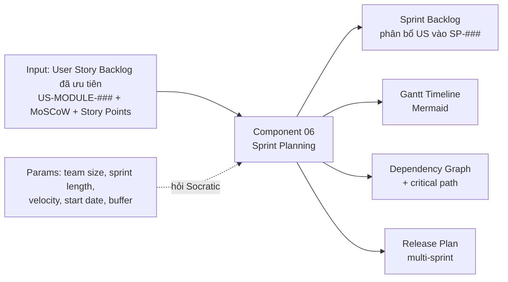

<!--
  Document ID: SRS-BASUPER-SPRINT-1.0
  Date: 2026-06-02
  Version: 1.0
  Status: Draft
  Source: SRS per-component cho Component 06 — Sprint Planning của sản phẩm BA Super App. Chuẩn AIPlat (per-component, BRD↔SRS 1:1). Framework source: 01-framework/modules/M6-sprint-planning.md. FR prefix = SPRINT.
-->

# SRS — Component 06: Sprint Planning

> Đặc tả **chức năng & kỹ thuật** của năng lực **Sprint Planning** (prompt-fragment M6) trong BA Super App. Mức nghiệp vụ ở [BRD Component 06](../../01-business/brd/06-sprint-planning.md); khung tổng ở [SRS overview](../srs.md) (trục 7 component, dòng `06`).
>
> **ID:** `FR-SPRINT-##` (functional). Không lẫn với `SP-###` mà component này *sinh ra* cho dự án khách.
>
> **Nguồn framework:** [`M6-sprint-planning`](../../../01-framework/modules/M6-sprint-planning.md) (+ template [`sprint-template`](../../../01-framework/templates/sprint-template.md)).

---

## 1. Phạm vi & cách đọc

Component 06 là một **prompt-fragment** mà Master Controller load khi pipeline vào **Sprint Plan phase**. Bản chất: chỉ thị cho LLM đóng vai Senior Agile BA / Delivery Lead, chuyển **User Story Backlog đã ưu tiên** (output M2) thành một **Sprint Plan** thực thi được. SRS này đặc tả Inputs/Outputs, các FR (mỗi FR có Inputs · Process · Acceptance Criteria Given-When-Then · Outputs · Errors), interfaces kích hoạt, và ràng buộc no-fabrication.

Đọc kèm: capability ↔ requirement ở [BRD Component 06](../../01-business/brd/06-sprint-planning.md) (REQ-SPRINT-##); phi chức năng chung ở [NFR](../nfr.md); chuẩn output ở [output-standard](../../../01-framework/core/output-standard.md).

## 2. Inputs / Outputs (I-O)

**Luồng tổng:** `US đã ưu tiên (M2) → [Component 06: Sprint Planning] → Sprint Backlog (SP-###) + Gantt + Release plan`.



| | Mục | Mô tả | Nguồn / Đích |
|---|-----|-------|--------------|
| **In** | US Backlog đã ưu tiên | Mỗi `US-[MODULE]-###` có priority MoSCoW + story points (Fibonacci 1–13) + `Dependencies:` | M2 / [traceability-matrix](../../../01-framework/tools/traceability-matrix.md) |
| **In** | Sprint params | `[TEAM_SIZE]`, `[SPRINT_LENGTH]`, `[VELOCITY]`, `[START_DATE]`, buffer % | Hỏi user (Socratic); thiếu → biến + `⚠️ Assumption` |
| **Out** | Sprint Backlog | Bảng phân bổ US→`SP-###` (US ID, SP, dependencies, owner, status) | Sprint Plan (template) |
| **Out** | Gantt timeline | Mermaid `gantt` theo `[START_DATE]`/`after` | Sprint Plan (template) |
| **Out** | Dependency graph | Mermaid `graph LR` + tô màu critical path | Sprint Plan (template) |
| **Out** | Release plan | Bảng release multi-sprint (scope theo MoSCoW, target date) | Sprint Plan (template) |

> Output đổ vào [`sprint-template.md`](../../../01-framework/templates/sprint-template.md) với YAML `document_type: "SPRINT"`.

## 3. Functional Requirements (FR-SPRINT-##)

> Mỗi FR: **Inputs · Process · AC (Given-When-Then) · Outputs · Errors**. Bám 4 bước M6 (Velocity → Dependency → Allocate → Validate) và Stop Conditions.

### FR-SPRINT-01 — Precondition check (backlog đã ưu tiên)
- **Inputs:** US Backlog từ M2 (kỳ vọng có priority + story points).
- **Process:** Xác nhận tồn tại backlog US đã ưu tiên + SP cho mỗi US. Thiếu backlog hoặc thiếu SP toàn cục → KHÔNG chạy Sprint Planning.
- **AC:**
  - Given chưa có backlog US (hoặc US không có priority), When user gọi component, Then hệ thống từ chối chạy và báo *"Cần backlog US đã ưu tiên + story points (M2) trước khi lập sprint."*
  - Given backlog có US nhưng vài US thiếu story points, When chạy, Then đánh dấu `⚠️ Assumption` cho từng US thiếu SP và hỏi, KHÔNG tự gán số.
- **Outputs:** Xác nhận đủ điều kiện, hoặc thông báo dừng + hướng dẫn quay lại M2.
- **Errors:** `E-NO-BACKLOG` (thiếu backlog/priority) → stop; `E-MISSING-SP` (US thiếu SP) → hỏi/đánh dấu.
- **Map:** REQ-SPRINT-01.

### FR-SPRINT-02 — Socratic intake (thông số team/lịch)
- **Inputs:** Tương tác user; biến context.
- **Process:** Trước khi ước lượng, hỏi tối đa 3–5 câu Socratic có options + default: sprint length, team size, velocity (đã biết / dùng dải / từ sprint 0), start date, buffer. KHÔNG hỏi chung chung.
- **AC:**
  - Given user chưa cấp sprint length, When intake, Then hỏi với options `1/2/3/4 tuần` và default `2 tuần` → map `[SPRINT_LENGTH]`.
  - Given user bỏ qua team size, When intake, Then dùng default `4–6 dev` kèm `⚠️ Assumption` và vẫn ghi rõ là giả định.
  - Given user không cấp start date, When intake, Then dùng biến `[START_DATE]`, KHÔNG tự điền ngày hôm nay.
- **Outputs:** Bộ thông số đã chốt hoặc đánh dấu giả định: `[TEAM_SIZE]`, `[SPRINT_LENGTH]`, `[VELOCITY]`, `[START_DATE]`, buffer.
- **Errors:** `E-PARAM-MISSING` → dùng biến/dải + `⚠️ Assumption` (không coi là số thật).
- **Map:** REQ-SPRINT-03, REQ-SPRINT-10.

### FR-SPRINT-03 — Velocity estimate (KHÔNG bịa)
- **Inputs:** Team size, sprint length (FR-SPRINT-02); lịch sử velocity nếu có.
- **Process:** Nếu team có lịch sử velocity → dùng số thật (ưu tiên tuyệt đối). Nếu không → đề xuất **dải tham khảo** theo team size như `⚠️ Assumption` rõ ràng (2–3 dev: 15–25 SP; 4–6 dev: 30–50 SP; 7–9 dev: 50–80 SP / sprint 2 tuần), giảm **20–30%** cho Sprint 1 (ramp-up). Chốt `capacity = velocity × (1 − buffer)`, buffer mặc định 10–15%.
- **AC:**
  - Given user cấp velocity thật, When estimate, Then dùng đúng số đó, KHÔNG ghi đè bằng dải tham khảo.
  - Given user không biết velocity, When estimate, Then trình bày dải tham khảo dưới dạng `⚠️ Assumption` và giảm 20–30% cho Sprint 1, ghi chú lý do ramp-up.
  - Given buffer chưa được chốt, When tính capacity, Then dùng 10–15% kèm `⚠️ Assumption`.
- **Outputs:** `[VELOCITY]` / sprint + capacity sau buffer; ghi chú giảm velocity Sprint 1.
- **Errors:** `E-VELOCITY-UNKNOWN` → dải tham khảo + `⚠️ Assumption` (Stop Condition: không coi là số thật).
- **Map:** REQ-SPRINT-02, REQ-SPRINT-09.

### FR-SPRINT-04 — Dependency management & critical path
- **Inputs:** `Dependencies:` của từng US (M2); user journey để suy luận khi thiếu.
- **Process:** Dựng đồ thị phụ thuộc US→US. Áp luật: US phụ thuộc ở sprint **trước/cùng**; phát hiện **circular** → dừng + đề xuất tách/đảo; đánh dấu **critical path** (chuỗi US dài nhất chặn MVP). Vẽ Mermaid `graph LR` để user xác nhận trước khi phân bổ.
- **AC:**
  - Given US-B phụ thuộc US-A, When phân bổ, Then US-A ở sprint trước hoặc cùng sprint với US-B (không bao giờ sau).
  - Given tồn tại vòng lặp A→B→A, When dựng đồ thị, Then dừng phân bổ, báo user và đề xuất tách US.
  - Given chuỗi phụ thuộc dài nhất chặn release, When vẽ graph, Then tô màu critical path nổi bật.
- **Outputs:** Dependency graph (Mermaid) + danh sách critical path.
- **Errors:** `E-CIRCULAR-DEP` → stop phân bổ; `E-DEP-UNKNOWN` → suy từ journey + xác nhận user.
- **Map:** REQ-SPRINT-04.

### FR-SPRINT-05 — Allocate US vào sprint (`SP-###`, MVP-first)
- **Inputs:** US đã ưu tiên + SP; capacity/sprint (FR-SPRINT-03); đồ thị phụ thuộc (FR-SPRINT-04).
- **Process:** Xếp US theo `Must` trước, tôn trọng dependency, **không vượt capacity** từng sprint. Mọi `Must` rơi vào sprint đầu (mặc định SP-001 → SP-002); mỗi sprint **demo-able**. Gán `[OWNER]` nếu user chưa cấp tên. Cấp ID `SP-###` tuần tự.
- **AC:**
  - Given tổng SP của các US ứng viên > capacity sprint, When phân bổ, Then KHÔNG nhồi; chuyển US dư sang sprint sau (hoặc đề xuất theo FR-SPRINT-07).
  - Given một US `Must`, When phân bổ, Then nó nằm trong các sprint MVP đầu, không bị đẩy về sprint cuối.
  - Given user chưa cấp owner, When điền bảng, Then để `[OWNER]`, KHÔNG bịa tên người.
- **Outputs:** Bảng phân bổ từng sprint (`SP-###`): US ID, tiêu đề, SP, dependencies, owner, status; tổng SP/sprint.
- **Errors:** `E-CAPACITY-OVERFLOW` → không nhồi, kích hoạt FR-SPRINT-07.
- **Map:** REQ-SPRINT-05, REQ-SPRINT-09.

### FR-SPRINT-06 — Sinh Gantt + Release plan
- **Inputs:** Bảng phân bổ (FR-SPRINT-05); `[START_DATE]`, `[SPRINT_LENGTH]`.
- **Process:** Sinh Mermaid `gantt` hợp lệ (section theo sprint, dùng `[START_DATE]` và `after` cho dependency, đơn vị ngày). Sinh release plan multi-sprint (v1.0 MVP = các sprint Must; bản kế = Should/Could). Ngày chưa chốt → dùng biến, không hardcode.
- **AC:**
  - Given start date chưa chốt, When sinh Gantt, Then dùng `[START_DATE]` làm mốc đầu, KHÔNG hardcode ngày tuỳ tiện.
  - Given plan có nhiều sprint, When sinh release plan, Then nhóm sprint theo release với scope MoSCoW + target date (target date là biến nếu chưa có ngày thật).
  - Given Gantt được sinh, When render, Then khối ```mermaid gantt``` hợp lệ cú pháp (dateFormat/axisFormat/section).
- **Outputs:** Gantt (Mermaid) + bảng Release Plan.
- **Errors:** `E-DATE-UNKNOWN` → biến `[START_DATE]` + `⚠️ Assumption`.
- **Map:** REQ-SPRINT-06, REQ-SPRINT-10.

### FR-SPRINT-07 — Capacity overflow handling
- **Inputs:** Kết quả phân bổ; capacity/sprint.
- **Process:** Khi tổng SP > capacity và không thể dời trong số sprint hiện có: KHÔNG nhồi; đề xuất 1 trong 3 — dời US sang sprint sau / tăng số sprint / cắt scope (`Could`→`Won't`). Trình bày để user chọn.
- **AC:**
  - Given vỡ capacity ở sprint cuối, When xử lý, Then đề xuất tăng số sprint hoặc cắt `Could`→`Won't`, không tự ý nhồi quá capacity.
  - Given user chọn cắt scope, When áp dụng, Then cập nhật bảng phân bổ + release plan tương ứng và giữ traceability.
- **Outputs:** Phương án điều chỉnh + plan đã cân bằng lại.
- **Errors:** `E-CAPACITY-OVERFLOW` (gốc) → đề xuất, chờ user quyết (human-in-the-loop).
- **Map:** REQ-SPRINT-12.

### FR-SPRINT-08 — Validate (Gate 6 — Plan Feasibility)
- **Inputs:** Sprint Plan nháp (sau FR-SPRINT-05/06/07).
- **Process:** Tự chạy checklist Gate 6: (1) tổng SP/sprint ≤ capacity sau buffer; (2) dependency đúng thứ tự + không circular; (3) MVP-first; (4) có buffer 10–15%; (5) mỗi sprint demo-able; (6) coverage mọi US Must/Should; (7) no-fabrication (mọi số có nguồn hoặc `⚠️ Assumption`). Chưa đạt → quay lại Step 2/3, KHÔNG xuất bản.
- **AC:**
  - Given một check Gate 6 fail, When validate, Then KHÔNG xuất bản plan; nêu rõ check nào fail + đề xuất sửa.
  - Given mọi check pass và user OK, When kết thúc, Then đổ output vào template và trình bày.
- **Outputs:** Kết quả Gate 6 (pass/fail từng mục) + plan đã được phép xuất bản.
- **Errors:** `E-GATE-FAIL` → fail-closed, không sang bước kế.
- **Map:** REQ-SPRINT-08, REQ-SPRINT-09.

### FR-SPRINT-09 — Traceability (US → SP) & confirm
- **Inputs:** Bảng phân bổ; ma trận truy vết.
- **Process:** Mỗi dòng phân bổ bắt buộc ghi `US ID`; không dòng "mồ côi"; không US `Must`/`Should` nào thiếu `SP-###`. Cập nhật cột Sprint trong [traceability-matrix](../../../01-framework/tools/traceability-matrix.md). Cuối phase: tóm tắt + xin xác nhận user, kèm 1 câu hỏi refine.
- **AC:**
  - Given một dòng phân bổ không có US ID, When kiểm tra, Then đánh dấu lỗi và yêu cầu gắn US, KHÔNG xuất bản dòng mồ côi.
  - Given một US `Must` chưa có `SP-###`, When kiểm tra coverage, Then báo thiếu và phân bổ trước khi done.
  - Given plan hoàn tất, When kết thúc, Then trình bày tóm tắt + 1 câu hỏi refine và chờ user xác nhận (không tự coi là done).
- **Outputs:** Ma trận truy vết cập nhật (US-[MODULE]-### → SP-###) + tóm tắt + câu refine.
- **Errors:** `E-ORPHAN-ALLOC` (dòng thiếu US) / `E-MISSING-COVERAGE` (US Must/Should chưa phân bổ) → chặn done.
- **Map:** REQ-SPRINT-07.

## 4. Non-Functional Requirements

Áp [NFR chung](../nfr.md): **reliability** (no-hallucination — không bịa velocity/ngày/owner; Gate 6 fail-closed), **usability** (Socratic UX có options+default, streaming hội thoại), **maintainability** (module-as-prompt: M6 độc lập, khung output ở template — không hardcode), **portability** (chạy mọi AI tool: chat `/sprint`, IDE `/ba sprint`, hoặc standalone), **compatibility** (Markdown + Mermaid `gantt`/`graph LR` render-ready). Không có NFR riêng phát sinh cho component này ngoài bộ chung.

## 5. Interfaces & Activation

| Loại | Chi tiết |
|------|----------|
| **Lệnh chính** | `/sprint` (chat) · `/ba sprint` (Antigravity/IDE) |
| **Trigger ngôn ngữ** | *"lập sprint", "chia sprint", "estimate sprint", "release plan", "roadmap theo sprint"* |
| **Tiền đề kích hoạt** | Đã có backlog US từ M2 (priority + story points). Chưa có → KHÔNG chạy (xem FR-SPRINT-01) |
| **Input interface** | US Backlog (M2 / traceability-matrix) + trả lời Socratic (params) |
| **Output interface** | Sprint Plan theo [`sprint-template.md`](../../../01-framework/templates/sprint-template.md), YAML `document_type: "SPRINT"` |
| **Quality gate** | Gate 6 — Plan Feasibility ([quality-gates](../../../01-framework/core/quality-gates.md)) |
| **Upstream / Downstream** | Upstream: [Component 02 — User Story](../../01-business/brd/02-user-story.md) (backlog ưu tiên). Downstream: phase cuối pipeline; feed traceability-matrix |

**Ví dụ Gantt output (template, dùng biến cho ngày — render-ready):**

```mermaid
gantt
    title Sprint Plan — [PROJECT_NAME]
    dateFormat  YYYY-MM-DD
    axisFormat  %d/%m

    section SP-001 Foundation
    US-MODULE-001 Title A   :sp1_1, [START_DATE], 5d
    US-MODULE-002 Title B   :sp1_2, after sp1_1, 5d

    section SP-002 Core
    US-MODULE-003 Title C   :sp2_1, after sp1_2, 5d
    US-MODULE-004 Title D   :sp2_2, after sp2_1, 5d
```

> ⚠️ Assumption: Gantt trên là khung mẫu — `[START_DATE]` và độ dài (5d/sprint) là placeholder; thay bằng giá trị user cấp trước khi khoá lịch. Không hardcode ngày thật khi chưa có xác nhận.

## 6. Traceability (REQ ↔ FR)

| REQ-SPRINT (BRD) | FR-SPRINT (SRS) | Bước M6 |
|------------------|-----------------|---------|
| REQ-SPRINT-01 | FR-SPRINT-01 | Precondition |
| REQ-SPRINT-02 | FR-SPRINT-03 | Step 1 Velocity |
| REQ-SPRINT-03 | FR-SPRINT-02 | Socratic intake |
| REQ-SPRINT-04 | FR-SPRINT-04 | Step 2 Dependency |
| REQ-SPRINT-05 | FR-SPRINT-05 | Step 3 Allocate |
| REQ-SPRINT-06 | FR-SPRINT-06 | Step 3 Gantt/Release |
| REQ-SPRINT-07 | FR-SPRINT-09 | Traceability |
| REQ-SPRINT-08 | FR-SPRINT-08 | Step 4 Validate (Gate 6) |
| REQ-SPRINT-09 | FR-SPRINT-03/05/08 | No-fabrication (xuyên suốt) |
| REQ-SPRINT-10 | FR-SPRINT-02/06 | Domain variables |
| REQ-SPRINT-11 | FR-SPRINT-06 (+ §5) | Output template |
| REQ-SPRINT-12 | FR-SPRINT-07 | Capacity overflow |

> Chuỗi đầy đủ: `US-[MODULE]-### → BRD-REQ-### → SRS-FR-### → TC-###  (+ SP-###)`. Tổng hợp ở [traceability-matrix](../../../01-framework/tools/traceability-matrix.md); ở đây áp cho chính component.

## 7. Errors & Stop Conditions (tóm tắt)

| Mã | Tình huống | Hành vi |
|----|-----------|---------|
| `E-NO-BACKLOG` | Thiếu backlog US / priority | Stop, yêu cầu quay lại M2 |
| `E-MISSING-SP` | US thiếu story points | Hỏi / `⚠️ Assumption` từng US, không tự gán |
| `E-PARAM-MISSING` | Thiếu team/length/start/buffer | Hỏi Socratic → biến/dải + `⚠️ Assumption` |
| `E-VELOCITY-UNKNOWN` | Không biết velocity | Dải tham khảo + `⚠️ Assumption`, giảm 20–30% Sprint 1 |
| `E-DATE-UNKNOWN` | Chưa có start date | Dùng biến `[START_DATE]`, không hardcode |
| `E-CIRCULAR-DEP` | Vòng lặp phụ thuộc | Dừng phân bổ, đề xuất tách/đảo US |
| `E-CAPACITY-OVERFLOW` | Tổng SP > capacity | Không nhồi; dời / tăng sprint / cắt scope |
| `E-ORPHAN-ALLOC` | Dòng phân bổ thiếu US ID | Chặn xuất bản dòng mồ côi |
| `E-MISSING-COVERAGE` | US Must/Should chưa có SP | Báo thiếu, phân bổ trước khi done |
| `E-GATE-FAIL` | Gate 6 chưa pass | Fail-closed, không sang bước kế / không xuất bản |

---

*SRS Component 06 — Sprint Planning · prefix `FR-SPRINT` · 9 FR-SPRINT · 1:1 với [BRD Component 06](../../01-business/brd/06-sprint-planning.md) · bám framework [`M6`](../../../01-framework/modules/M6-sprint-planning.md) v2.0.*

## Lịch sử thay đổi

| Version | Ngày | Thay đổi | Người |
|---------|------|----------|-------|
| 1.0 | 2026-06-02 | Khởi tạo SRS Component 06 — Sprint Planning (per-component, chuẩn AIPlat) | BA Super App |
