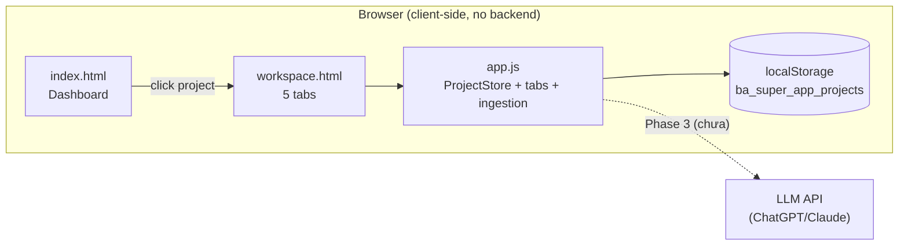

<!--
  Document ID: SRS-WEBAPP-BASUPER-1.0
  Date: 2026-06-02
  Version: 1.0
  Status: Draft
  Source: SRS per-component cho Component 07 (Web Workspace) của sản phẩm BA Super App. Chuẩn AIPlat (FR↔REQ 1:1). Framework source: ../../02-web-app/README.md.
-->

# Component 07: Web Workspace — SRS

> Đặc tả **chức năng & kỹ thuật** của **Web Workspace** — SPA vanilla JS + localStorage hiện thực hoá pipeline BA. Mức nghiệp vụ ở [BRD 07](../../01-business/brd/07-web-app.md); phi chức năng chung ở [NFR](../nfr.md); kiến trúc ở [ARCHITECTURE](../../03-architecture/ARCHITECTURE.md).
>
> **ID:** `FR-WEBAPP-##` (functional), `NFR-WEBAPP-##` (non-functional). Không lẫn với `SRS-FR-###` mà công cụ *sinh ra* cho dự án khách.
>
> **Nguồn hiện thực (ground truth):** [`../../02-web-app/README.md`](../../02-web-app/README.md), `02-web-app/app.js` (class `ProjectStore`, tab switching, ingestion modal), `02-web-app/index.html` (dashboard), `02-web-app/workspace.html` (workspace 5 tab). Trạng thái: **Phase 1 xong**, **Phase 2 dở**, **Phase 3+ chưa** — cột Status mỗi FR ghi rõ.

---

## 1. Phạm vi & cách đọc

Web Workspace là một **single-page-app tĩnh** (HTML + CSS + một file `app.js`, không framework, không build) chạy trọn trên trình duyệt. Nó là **lớp vỏ trình bày** cho framework prompt-kit: hiện thực hoá dashboard đa dự án và workspace nạp dữ liệu, **không** định nghĩa lại pipeline (bám invariant R-01/R-04 ở [SRS overview §5](../srs.md)).

SRS này đặc tả 6 nhóm FR: **dashboard · workspace · ingestion · domain-model · quality-gate · persistence**. Mỗi FR ghi Inputs / Process / Acceptance Criteria (Given-When-Then) / Outputs / Errors + **Status** (🟢 Done Phase 1 · 🟡 Partial · ⏳ Pending Phase 2/3). Quy ước: **không mô tả tính năng chưa có như đã có** — phần mô phỏng/placeholder được đánh dấu rõ.

## 2. Functional Requirements (FR-WEBAPP-##)

> **Status legend:** 🟢 Done (Phase 1, hiện thực thật trong code) · 🟡 Partial (mô phỏng / mock / placeholder) · ⏳ Pending (Phase 2/3+, chưa code).

### FR-WEBAPP-01 — Dashboard đa dự án · 🟢 Done

- **Maps:** REQ-WEBAPP-01.
- **Inputs:** danh sách dự án từ `ProjectStore.getProjects()` (đọc localStorage); nếu trống → seed 2 dự án mẫu (BIDV Home GĐ3, MBL Insurance Platform).
- **Process:** `index.html` render: (a) welcome banner, (b) hàng **stats** (Tổng dự án / User Stories / BRD-SRS / Quality Score), (c) lưới "Dự án gần đây" (mỗi thẻ: tên, domain badge, thanh tiến độ 6 đoạn = 6 phase, meta cập nhật + phase), (d) "Bắt đầu nhanh" (template / import / URL). Click thẻ dự án điều hướng `workspace.html`.
- **AC:**
  - *Given* lần đầu mở app (localStorage trống), *When* tải `index.html`, *Then* `ProjectStore.init()` seed 2 dự án và dashboard hiển thị chúng.
  - *Given* dashboard, *When* click thẻ "BIDV Home GĐ3", *Then* chuyển sang `workspace.html`.
- **Outputs:** màn dashboard với danh sách dự án + stats.
- **Errors:** localStorage không khả dụng → app dùng mảng rỗng (`getProjects()` trả `[]`).
- **Note:** stats hiện là **giá trị hiển thị tĩnh** trong HTML (2 / 12 / 4 / 85%), thanh tiến độ thẻ cũng tĩnh — chưa tính động từ store. → ⚠️ Assumption.

### FR-WEBAPP-02 — Workspace 5 tab · 🟢 Done (Pipeline/Báo cáo = placeholder)

- **Maps:** REQ-WEBAPP-02.
- **Inputs:** dự án đang chọn (hiện `workspace.html` cố định ngữ cảnh "BIDV Home GĐ3").
- **Process:** thanh tab gồm **Thông tin dự án · Nguồn dữ liệu · Tri thức dự án · Pipeline · Báo cáo**. `app.js` gắn listener click: tab "Nguồn dữ liệu" → `showSourceTab()`, tab "Tri thức" → `showKnowledgeTab()`, các tab còn lại → render empty-state "Đang xây dựng" (icon `construction`).
- **AC:**
  - *Given* workspace mở ở tab "Nguồn dữ liệu" (mặc định active), *When* click tab "Tri thức dự án", *Then* vùng nội dung thay bằng view domain model (FR-WEBAPP-04).
  - *Given* workspace, *When* click tab "Pipeline" hoặc "Báo cáo", *Then* hiển thị khối "Đang xây dựng" với mô tả tính năng đang phát triển (không bịa nội dung).
- **Outputs:** nội dung tab tương ứng trong `.main-canvas`.
- **Errors:** không tìm thấy container nội dung → no-op (guard `if (!container) return`).
- **Note:** tab "Thông tin dự án", "Pipeline", "Báo cáo" hiện là **placeholder** (chưa có nội dung thật). Đúng trạng thái README ("Pipeline/Báo cáo còn placeholder").

### FR-WEBAPP-03 — Nạp dữ liệu đa kênh (Ingestion) · 🟢 Done

- **Maps:** REQ-WEBAPP-03, REQ-WEBAPP-04.
- **Inputs:** lựa chọn kênh qua "channel-card" `data-type` ∈ {`text`, `file`, `url`, `email`, `template`}; trong modal: loại tài liệu (BRD/SRS/RFP/Meeting Notes/User Story/Reference), template phân tích (BIDV-Standard / Agile-Scrum / Free-text), mô tả, và payload (file / URL / text tuỳ kênh).
- **Process:** click channel-card → `openIngestionModal(type)` dựng modal động (URL → input link; text → textarea; còn lại → file drop). `submitIngestion()` đọc form, tạo một `.source-item` mới (tên/loại/template/ghi chú, trạng thái `pending`), chèn vào danh sách nguồn, tăng bộ đếm "Tài liệu đã nạp (n)", đóng modal + `alert` xác nhận.
- **AC:**
  - *Given* tab "Nguồn dữ liệu", *When* click card "URL Fetch" và nhập link rồi "Bắt đầu nạp", *Then* một nguồn mới (icon `link`, trạng thái "Chờ xử lý") xuất hiện đầu danh sách và bộ đếm tăng 1.
  - *Given* card "Paste Text", *When* submit với nội dung dán, *Then* nguồn "Pasted Text Document" được thêm.
  - *Given* modal đang mở, *When* click "Hủy" hoặc nút close, *Then* `closeIngestionModal()` ẩn modal, không thêm nguồn.
- **Outputs:** một mục nguồn mới trong DOM + cập nhật bộ đếm.
- **Errors:** không submit gì → tên mặc định "Tài liệu mới nạp".
- **Note:** nguồn nạp được thêm vào **DOM tại runtime**, **chưa** ghi ngược vào `ProjectStore`/localStorage (mất khi reload). → ⚠️ Assumption. Kênh `email`/`template` dùng chung luồng upload (chưa có xử lý riêng).

### FR-WEBAPP-04 — Domain model: Parse AI + view Entities/Rules/Glossary · 🟡 Partial (mô phỏng + mock)

- **Maps:** REQ-WEBAPP-05, REQ-WEBAPP-06.
- **Inputs:** click nút "Parse AI"/"Parse tất cả" trên một nguồn; hoặc mở tab "Tri thức dự án".
- **Process (Parse — mô phỏng):** nút Parse hiện spinner "Đang phân tích...", `setTimeout` ~1.5s, rồi đổi trạng thái nguồn `pending → parsed` ("Đã xử lý"), đổi title nút thành "Parse lại", và hiện `alert` báo đã trích xuất rules/entities. **Không** gọi LLM thật.
- **Process (View — mock):** `showKnowledgeTab()` render 3 nhóm con: **Entities (12)** · **Business Rules (45)** · **Glossary (8)** với nội dung **hardcode** (ví dụ entities: Customer/Loan/Collateral; rules: BR-LOAN-01 Hạn mức vay, BR-CUST-05 Độ tuổi; glossary: LTV/CIC/Disbursement) — mỗi mục kèm "Nguồn" để minh hoạ truy vết về tài liệu gốc.
- **AC:**
  - *Given* nguồn trạng thái "Chờ xử lý", *When* click "Parse AI", *Then* sau ~1.5s trạng thái thành "Đã xử lý" và hiện thông báo hoàn tất.
  - *Given* tab "Tri thức dự án", *When* mở tab, *Then* mặc định hiển thị nhóm Entities; *When* click "Business Rules"/"Glossary", *Then* đổi nội dung tương ứng.
- **Outputs:** trạng thái nguồn cập nhật; view entities/rules/glossary.
- **Errors:** double-click Parse khi đang chạy → nút `disabled` chặn.
- **Note:** đây là điểm **Partial** rõ nhất — Parse là mô phỏng thời gian, domain model là dữ liệu mẫu, **chưa** sinh từ AI thật và **chưa** lưu vào store (`knowledge` của dự án trong `app.js` để rỗng/`{}`). Hiện thực đầy đủ thuộc Phase 3 (xem §7 Open Questions).

### FR-WEBAPP-05 — Quality Gate / Consistency Check (UI) · ⏳ Pending (Phase 2 dở)

- **Maps:** REQ-WEBAPP-08.
- **Mục tiêu:** trong workspace, người dùng chạy kiểm completeness/consistency/traceability trên dự án và nhận báo cáo PASS/FAIL + danh sách gap (đối ứng [quality-gates](../../01-framework/core/quality-gates.md) của framework, lệnh `/validate` ở [use-cases UC-04](../use-cases.md)).
- **Trạng thái hiện tại:** **chưa hiện thực**. README ghi Phase 2 "Quality Gates & Consistency Check (validation engine, `/validate` report)" = 🟡 dở. Trong code chưa có engine validate; tab/khối quality-gate chưa tồn tại trên UI (chỉ có "Quality Score 85%" là số tĩnh trên dashboard).
- **AC (mục tiêu, chưa nghiệm thu):**
  - *Given* dự án có domain model, *When* chạy Quality Gate, *Then* hệ thống trả PASS/FAIL kèm danh sách gap (mục thiếu / mâu thuẫn / orphan) và đề xuất sửa; fail-closed (kế thừa NFR-R02).
- **Note:** liệt kê ở đây để giữ traceability REQ↔FR; **không** mô tả như đã chạy.

### FR-WEBAPP-06 — Persistence (localStorage) · 🟢 Done

- **Maps:** REQ-WEBAPP-07.
- **Inputs:** thao tác đọc/ghi dự án qua `ProjectStore`.
- **Process:** `ProjectStore` đóng gói truy cập localStorage key **`ba_super_app_projects`**: `init()` seed nếu trống; `getProjects()` / `getProject(id)` đọc-parse JSON; `updateProject(id, updates)` merge nông (`{...p, ...updates}`) rồi ghi lại. Một instance global `store` khởi tạo khi load `app.js`.
- **AC:**
  - *Given* đã có dự án trong store, *When* reload trang, *Then* `getProjects()` trả lại đúng danh sách (không mất dữ liệu) — kế thừa NFR-R04.
  - *Given* gọi `updateProject('p_1', {phase:'BRD (3/6)'})`, *When* đọc lại `getProject('p_1')`, *Then* phase đã cập nhật.
- **Outputs:** state bền trong localStorage.
- **Errors:** JSON hỏng / key thiếu → `getProjects()` fallback `[]`.
- **Note:** chỉ `ProjectStore` mới ghi store; các thao tác ingestion/parse ở FR-03/04 hiện **chỉ đổi DOM**, chưa qua `updateProject` (nợ kỹ thuật). → ⚠️ Assumption.

> **Bảng tóm tắt trạng thái FR**

| FR | Tên | Status |
|----|-----|:---:|
| FR-WEBAPP-01 | Dashboard đa dự án | 🟢 Done |
| FR-WEBAPP-02 | Workspace 5 tab | 🟢 Done (2 tab placeholder) |
| FR-WEBAPP-03 | Ingestion đa kênh | 🟢 Done |
| FR-WEBAPP-04 | Domain model (Parse + view) | 🟡 Partial (mô phỏng + mock) |
| FR-WEBAPP-05 | Quality Gate UI | ⏳ Pending (Phase 2 dở) |
| FR-WEBAPP-06 | Persistence localStorage | 🟢 Done |

## 3. Non-Functional Requirements (client-side)

| ID | Requirement | Target / Cách kiểm | Kế thừa |
|----|-------------|--------------------|:---:|
| NFR-WEBAPP-01 | **Client-side, no backend**: state ở localStorage trên máy người dùng | Không có lời gọi server khi standalone | R-04 · NFR-S02 |
| NFR-WEBAPP-02 | **Static, no-build**: mở trực tiếp bằng trình duyệt (khuyên local server cho `fetch`) | Mở `index.html` chạy ngay | NFR-P03 |
| NFR-WEBAPP-03 | **Hiệu năng tải**: dashboard mở nhanh (không bundle nặng, một `app.js`) | < 2s mở dashboard | NFR-PF01 |
| NFR-WEBAPP-04 | **Bền dữ liệu**: dự án còn nguyên sau reload | Reload test | NFR-R04 |
| NFR-WEBAPP-05 | **3-state UX**: loading/empty/error rõ ràng cho nạp & parse | Spinner Parse, empty-state "Đang xây dựng", trạng thái nguồn | NFR-U03 |
| NFR-WEBAPP-06 | **No-fabrication trên UI**: tính năng chưa có → "Đang xây dựng", không giả lập kết quả thật như đã có | Review UI | NFR-R01 · BR-CORE-02 |
| NFR-WEBAPP-07 | **Maintainability**: tách `data/` khỏi logic; gom mock (lộ trình P3) | Review cấu trúc | NFR-M04 |

> ⚠️ Assumption: prototype **chưa có test tự động** (README: "Chưa có test"). Việc nghiệm thu AC hiện làm thủ công trong trình duyệt.

## 4. Data

- **Storage chính:** localStorage, key **`ba_super_app_projects`** — một mảng JSON các đối tượng `project`.
- **Schema `project` (theo seed trong `app.js`):**

| Field | Kiểu | Ví dụ / Ghi chú |
|-------|------|-----------------|
| `id` | string | `p_1`, `p_2` |
| `name` | string | "BIDV Home GĐ3" |
| `domain` | string | "Banking" / "Insurance" |
| `phase` | string | "Discovery (1/6)" / "BRD (3/6)" |
| `progress` | number | 16 / 50 (%) |
| `readiness` | number | 65 / 85 (%) |
| `updatedAt` | string | "2 giờ trước" (chuỗi hiển thị, không phải timestamp) |
| `sources[]` | array | mỗi nguồn: `{id, name, type, size, date, status, icon}`; `status` ∈ `parsed`/`pending` |
| `knowledge` | object | `{entities[], rules[], glossary[]}` — **hiện rỗng** trong seed |

- **Mock data (3 nguồn — nợ kỹ thuật P3):**
  1. **Seed hardcode trong `app.js`** (2 dự án) — nguồn **đang được dùng** bởi store.
  2. **`02-web-app/data/mock_project.json`** (~138KB) — một dự án MBL đầy đủ (`uploadedDocs`, `pipelinePhase`, ...). Schema **khác** seed; **không** được `app.js` hiện tại nạp.
  3. **`02-web-app/data/budget_data.js`** (~59KB) — dữ liệu cho `budget_dashboard.html` (phân tích budget, dark theme), độc lập với store dự án.
- **Nội dung domain model hiển thị** (entities/rules/glossary ở FR-WEBAPP-04) là **hardcode trong `app.js`** (không đọc từ `knowledge` của project).

> ⚠️ Assumption: hợp nhất 3 nguồn mock và để UI đọc domain model từ `project.knowledge` (thay vì hardcode) là việc lộ trình P3 (README §"Nợ kỹ thuật"). Hiện trạng được mô tả đúng như vậy, không tô hồng.

## 5. Interfaces

- **Loại:** static HTML/CSS/JS — không API server, không endpoint.
- **Trang (pages):**

| Page | Vai trò | FR chính |
|------|---------|----------|
| `index.html` | Dashboard đa dự án (sidebar + stats + danh sách + quick-start) | FR-WEBAPP-01 |
| `workspace.html` | Workspace 1 dự án, 5 tab | FR-WEBAPP-02..04 |
| `budget_dashboard.html` | Phân tích budget (dark theme) — phụ trợ, ngoài luồng pipeline chính | — |
| `app.js` | Logic: `ProjectStore`, tab switching, ingestion modal, parse mô phỏng, knowledge view | FR-WEBAPP-01..06 |
| `styles.css` | Design system (Google Stitch) | — |

- **Assets ngoài:** Google Fonts + Material Symbols Rounded (qua CDN `fonts.googleapis.com`) — cần mạng để hiển thị icon/font.
- **API JS nội bộ (window-level, gọi từ inline `onclick`):** `openIngestionModal(type)`, `closeIngestionModal()`, `submitIngestion()`.
- **Điều hướng:** click thẻ dự án / brand → `window.location.href` giữa `index.html` ↔ `workspace.html` (multi-page bằng link, không router SPA thực thụ).

> ⚠️ Assumption: gọi "SPA" theo nghĩa app một-trang nhẹ; thực chất là vài trang HTML tĩnh liên kết qua `window.location`, không có client router. Import URL thật (fetch chéo domain) sẽ vướng CORS — production cần backend/proxy (kế thừa NFR-S03).

## 6. Traceability

`REQ-WEBAPP-## (BRD) → FR-WEBAPP-## (SRS) → web feature (file/hàm)`:

| REQ-WEBAPP | FR-WEBAPP | Hiện thực (file · hàm) | Status |
|---|---|---|:---:|
| REQ-WEBAPP-01 | FR-WEBAPP-01 | `index.html` · render dashboard; `app.js` `ProjectStore.init/getProjects` | 🟢 |
| REQ-WEBAPP-02 | FR-WEBAPP-02 | `workspace.html` tab-bar; `app.js` tab listener + empty-state | 🟢 |
| REQ-WEBAPP-03/04 | FR-WEBAPP-03 | `app.js` `initIngestionModal/openIngestionModal/submitIngestion` | 🟢 |
| REQ-WEBAPP-05 | FR-WEBAPP-04 | `app.js` parse btn `setTimeout` (mô phỏng) | 🟡 |
| REQ-WEBAPP-06 | FR-WEBAPP-04 | `app.js` `showKnowledgeTab` (mock entities/rules/glossary) | 🟡 |
| REQ-WEBAPP-07 | FR-WEBAPP-06 | `app.js` `ProjectStore` (localStorage `ba_super_app_projects`) | 🟢 |
| REQ-WEBAPP-08 | FR-WEBAPP-05 | (chưa có — Phase 2 dở) | ⏳ |
| REQ-WEBAPP-09/10 | (Open Questions §7) | (chưa có — Phase 3) | ⏳ |

- **Cross-link:** BRD đối ứng → [`../../01-business/brd/07-web-app.md`](../../01-business/brd/07-web-app.md). Overview → [SRS](../srs.md) · [BRD](../../01-business/brd.md). Framework source → [`../../02-web-app/README.md`](../../02-web-app/README.md).

## 7. Open Questions

| # | Câu hỏi | Ảnh hưởng | Hướng (lộ trình) |
|---|---------|-----------|------------------|
| OQ-01 | Parse AI nối LLM thật (ChatGPT/Claude API) ra sao? Quản API key client-side thế nào? | FR-WEBAPP-04, REQ-WEBAPP-09 | Phase 3; cần backend/proxy để giữ key an toàn |
| OQ-02 | Ingestion & parse có ghi ngược vào `ProjectStore`/localStorage không (hiện chỉ đổi DOM)? | FR-WEBAPP-03/04/06 | Cần khi rời prototype — nếu không reload sẽ mất dữ liệu nạp |
| OQ-03 | Validation engine (Quality Gate) hiện thực client-side hay đẩy về framework/LLM? | FR-WEBAPP-05, REQ-WEBAPP-08 | Phase 2 đang dở — chốt phạm vi kiểm (completeness/consistency/traceability) |
| OQ-04 | Render Mermaid trong web (Pipeline/Báo cáo) — dùng thư viện nào, khi nào? | FR-WEBAPP-02, REQ-WEBAPP-10 | Phase 3 (README: "chưa render Mermaid") |
| OQ-05 | Hợp nhất 3 nguồn mock (`app.js` seed / `mock_project.json` / `budget_data.js`) về một schema chuẩn? | §4 Data | Nợ kỹ thuật P3 |
| OQ-06 | Import URL vượt CORS — sanitize/proxy ở đâu cho production? | §5 Interfaces, NFR-S03 | Cần backend (ngoài MVP client-side) |
| OQ-07 | Lưu deliverable ra `04-outputs` + export (định dạng nào: .md/.docx/.pdf)? | REQ-WEBAPP-10 | Phase 3 |

---

*SRS Component 07 (Web Workspace) v1.0 — 6 FR-WEBAPP (3 Done · 1 Partial · 1 Pending · + 1 Done persistence) + 7 NFR-WEBAPP client-side; 1:1 với [BRD 07](../../01-business/brd/07-web-app.md); bám trạng thái thật của `02-web-app` (Phase 1 xong / Phase 2 dở).*
