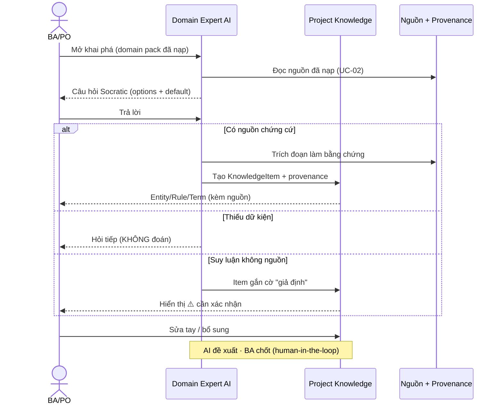
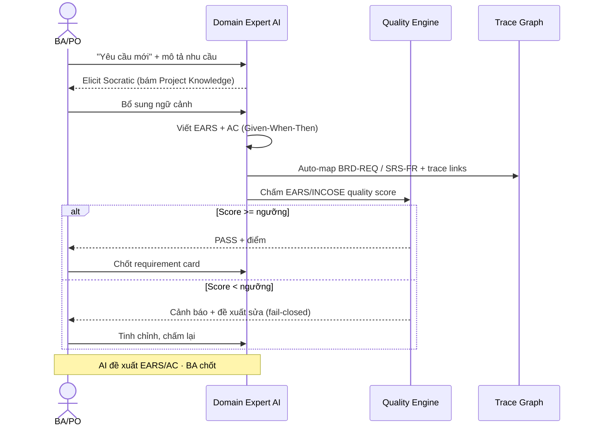
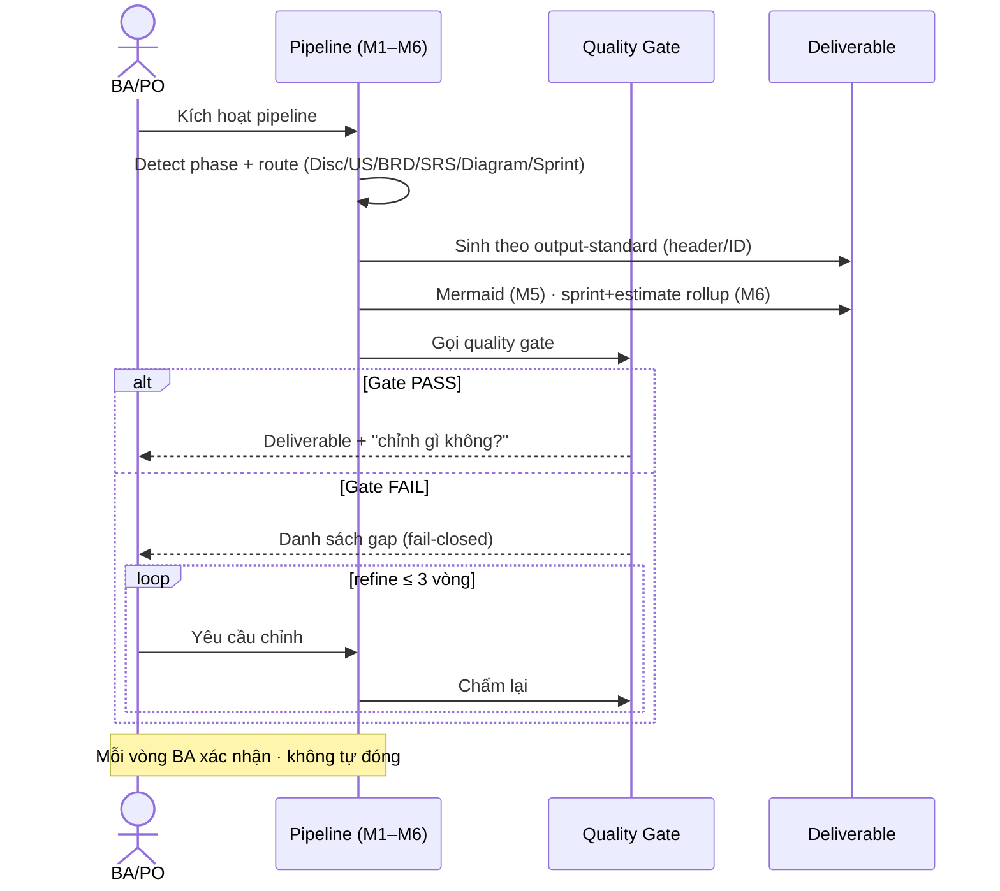
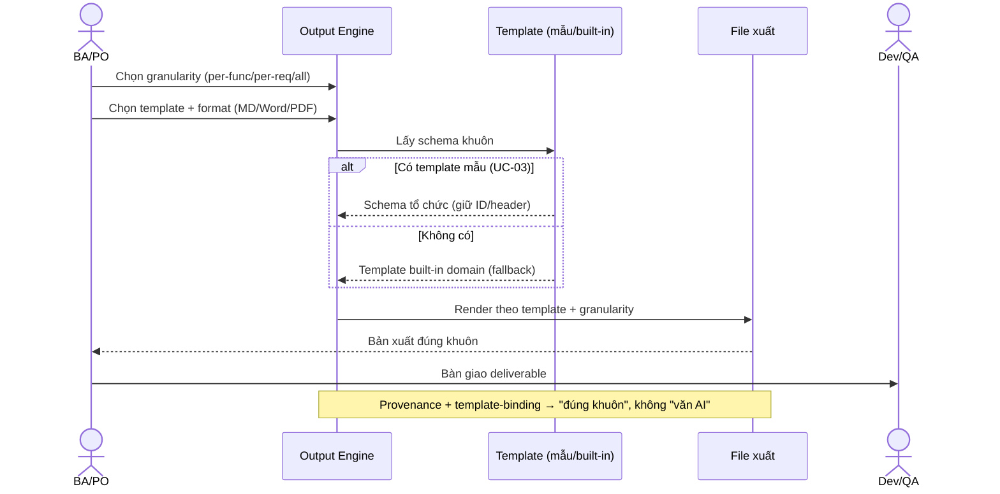

<!--
  Document ID: UC-BASUPER-2.0
  Date: 2026-06-03
  Version: 2.0
  Status: Draft — for approval
  Source: chắt lọc BACKBONE-BASUPER-V2-1.0 (§4 UC, §7 cross-map = nguồn ID CHUẨN, dùng verbatim)
          + IMPLPLAN-BASUPER-1.0 + PSCOPE-BASUPER-P1-1.0; nâng cấp từ UC-BASUPER-1.0.
  Template: Use-Cases.
  GHI CHÚ: UC mô tả việc DÙNG BA Super App (sản phẩm "biến AI thành Senior BA").
           ID sản phẩm (UC-/FR-/REQ-) — KHÔNG lẫn ID công cụ sinh cho khách (BRD-REQ-###, SRS-FR-###, TC-###).
-->

# Use Cases — BA Super App v2

> Tài liệu mô tả **cách người dùng vận hành BA Super App v2** theo trục **4 lớp**: **Input → Khai phá cùng AI chuyên gia domain → Chọn loại tác vụ → Output theo template**. ID UC bám **verbatim** [_v2-backbone.md §4](../04-planning/_v2-backbone.md); FR/REQ liên quan lấy từ **cross-map §7**.
>
> **Nguyên tắc xuyên suốt (phản ánh trong mọi luồng bên dưới):**
> - **AI hỏi khi thiếu — không đoán bừa.** Discovery copilot Socratic (option + default); thiếu dữ kiện → hỏi lại, không tự bịa.
> - **Provenance / anti-fabrication ⚠️.** Mọi entity/rule/term/requirement **trỏ về nguồn** (tài liệu + vị trí). Không có nguồn → gắn cờ *"giả định — cần xác nhận"*.
> - **Human-in-the-loop.** AI **đề xuất**, con người **chốt**. Hệ thống không tự đóng phase/tác vụ; quality gate **fail-closed**.
>
> Cross-link: luồng trực quan ở [user-flows.md](user-flows.md); FR chi tiết ở [srs.md](srs.md); REQ nghiệp vụ ở [brd.md](../01-business/brd.md).

---

## 1. Actors

| Actor | Vai trò | Mô tả |
|---|---|---|
| **BA / PO** | Người dùng chính | Lái dự án: tạo project, nạp nguồn, khai phá, chọn tác vụ, chốt deliverable. Là người **ra quyết định cuối** (human-in-the-loop). |
| **Domain Expert AI** | Hệ thống — copilot ngành | "Chuyên gia ngành" do Domain Expert Pack + LLM overlay tạo thành. Dẫn dắt Socratic, gợi ý entity/rule, **trỏ nguồn**, chấm chất lượng — **đề xuất, không tự chốt**. |
| **Dev / QA** | Người tiêu thụ | Nhận deliverable (requirement EARS, function list, estimate, test-case) qua export/push để triển khai & kiểm thử. Không thao tác lõi khai phá. |
| **PM** | Người tiêu thụ / giám sát | Dùng estimate, sprint plan, traceability & impact để lập kế hoạch; theo dõi tiến độ qua dashboard. |
| **Admin (cấu hình LLM)** | Quản trị nền tảng | Cấu hình LLM adapter (cloud Claude / on-prem), BYO-key/proxy, token budget/dự án; không tham gia nội dung nghiệp vụ. |

> System được tách thành **Domain Expert AI** (lớp khai phá/sinh) và **Platform** (storage/LLM adapter/quality engine) để làm rõ trách nhiệm trong từng luồng.

---

## 2. Index — UC-01..UC-15 (backbone §4)

| UC | Tên | Actor chính | Lớp | FR liên quan (§7) | REQ |
|----|-----|-------------|-----|-------------------|-----|
| UC-01 | Tạo dự án & chọn domain | BA/PO | L1 Input | INGEST-01, DOMAIN-01..04 | REQ-001, REQ-004 |
| UC-02 | Nạp nguồn (paste/file/URL) | BA/PO | L1 Input | INGEST-02..05 | REQ-002 |
| UC-03 | Đính template mẫu (optional) | BA/PO | L1 Input | TPL-01..03 | REQ-003 |
| UC-04 | Khai phá cùng chuyên gia → build Project Knowledge | BA/PO · Domain Expert AI | L2 Khai phá | DISC-01..05 | REQ-005 |
| UC-05 | Review/confirm knowledge (provenance/assumption) | BA/PO | L2 Khai phá | DISC-04, QUAL-06 | REQ-006, REQ-019 |
| UC-06 | Tạo yêu cầu mới (EARS) | BA/PO · Domain Expert AI | L3 Tác vụ | NEWREQ-01..04 | REQ-007 |
| UC-07 | Lập function list | BA/PO | L3 Tác vụ | FUNC-01..03 | REQ-008 |
| UC-08 | Sinh estimate | BA/PO · PM | L3 Tác vụ | EST-01..05 | REQ-009 |
| UC-09 | Yêu cầu enhance (impact) | BA/PO | L3 Tác vụ | ENH-01..04, QUAL-03..04 | REQ-010, REQ-014 |
| UC-10 | Chạy pipeline sinh deliverable | BA/PO | cross | PIPE-01..05 | REQ-011 |
| UC-11 | Validate qua quality gate | BA/PO | cross | QUAL-01..03 | REQ-012, REQ-013, REQ-019 |
| UC-12 | Export deliverable (granularity×template×format) | BA/PO · Dev/QA | L4 Output | OUTPUT-01..03, OUTPUT-05 | REQ-015, REQ-016, REQ-017, REQ-018 |
| UC-13 | Push Jira/Confluence | BA/PO · PM | L4 Output | OUTPUT-03..04 | REQ-017 |
| UC-14 | Cấu hình LLM/key & token budget | Admin | cross | PLAT-02..04 | REQ-021 |
| UC-15 | Quản lý dự án (dashboard) | BA/PO · PM | cross | PLAT-01, PLAT-05..06 | REQ-020, REQ-022 |

---

## UC-01: Tạo dự án & chọn domain

- **Actor chính:** BA/PO.
- **Tiền điều kiện:** App đã mở; có ý tưởng dự án (tên, mục tiêu sơ bộ).
- **Luồng chính:**
  1. BA chọn "Tạo dự án" trên Dashboard.
  2. Nhập tên · mục tiêu · phạm vi compliance · scale dự kiến.
  3. **Chọn domain ngay khi tạo** (P1: Banking / Insurance).
  4. Hệ thống nạp **Domain Expert Pack** tương ứng làm overlay (entities/rules/compliance/glossary/persona).
  5. Lưu project vào local store (IndexedDB); mở Workspace tab "Thông tin".
- **Luồng phụ/ngoại lệ:** Chưa chọn domain → hệ thống **hỏi lại**, không gán mặc định (không đoán). Domain ngoài 2 ngành P1 → hiển thị "sắp có".
- **Hậu điều kiện:** Project tồn tại + domain pack đã nạp; sẵn sàng nạp nguồn.
- **FR liên quan:** FR-INGEST-01, FR-DOMAIN-01..04.
- **REQ liên quan:** REQ-001, REQ-004.

## UC-02: Nạp nguồn (paste / file / URL)

- **Actor chính:** BA/PO.
- **Tiền điều kiện:** Project đã tạo (UC-01).
- **Luồng chính:**
  1. BA mở tab "Nguồn dữ liệu".
  2. Chọn kênh: **Paste Text** · **Upload File** (.docx/.pdf/.md → text) · **URL Fetch**.
  3. Cung cấp nội dung; hệ thống parse → text + **lưu provenance** (nguồn + vị trí).
  4. Hiển thị danh sách nguồn + **trạng thái parse** (ok/lỗi) + tham chiếu provenance.
- **Luồng phụ/ngoại lệ:** Parse lỗi (PDF scan ảnh, URL chặn) → đánh dấu trạng thái lỗi, gợi ý kênh khác; **sanitize URL** chống injection. Email Forward + Template-as-source = **P2/P3** (ngoài phạm vi).
- **Hậu điều kiện:** ≥1 nguồn có text + provenance, sẵn sàng cho khai phá.
- **FR liên quan:** FR-INGEST-02..05.
- **REQ liên quan:** REQ-002.

## UC-03: Đính template mẫu (optional)

- **Actor chính:** BA/PO.
- **Tiền điều kiện:** Project đã tạo.
- **Luồng chính:**
  1. BA chọn "Đính template mẫu" (SRS / BRD / kỹ thuật / guide của tổ chức).
  2. Upload file template → hệ thống **lưu + cho xem** template; gắn vào dự án làm "khuôn output" mặc định.
  3. (P3) Hệ thống **trích schema** heading/section/field từ template để bám khuôn khi export.
- **Luồng phụ/ngoại lệ:** Không đính template → dùng template built-in của Domain Pack (fallback). File mẫu lộn xộn → P1 chỉ lưu/xem, trích schema để P3.
- **Hậu điều kiện:** Template mẫu (nếu có) sẵn sàng làm khuôn cho UC-12.
- **FR liên quan:** FR-TPL-01..03.
- **REQ liên quan:** REQ-003.

## UC-04: Khai phá cùng chuyên gia → build Project Knowledge

- **Actor chính:** BA/PO · Domain Expert AI.
- **Tiền điều kiện:** Project có domain pack (UC-01) + ≥1 nguồn (UC-02).
- **Luồng chính:**
  1. BA mở tab "Khai phá (Expert)".
  2. Domain Expert AI mở hội thoại **Socratic**: đặt câu hỏi kèm **options + default**, bám entity/rule của pack ngành.
  3. Mỗi câu trả lời / mỗi nguồn → AI trích **KnowledgeItem** (entity / rule / term) **grounded trên nguồn** + đính **provenance**.
  4. AI bồi đắp **Project Knowledge** hiển thị dần (cây entities/rules/glossary).
  5. BA **sửa tay** item; conversation memory lưu theo dự án.
- **Luồng phụ/ngoại lệ:** Thiếu dữ kiện → AI **hỏi tiếp, không đoán**. Suy luận không có nguồn → AI **gắn cờ "giả định"** (xử lý ở UC-05). Vượt token budget → cảnh báo (UC-14).
- **Hậu điều kiện:** Project Knowledge có ≥1 entity + ≥1 rule + ≥1 term, mỗi mục **trỏ nguồn**.
- **FR liên quan:** FR-DISC-01..05.
- **REQ liên quan:** REQ-005.

## UC-05: Review / confirm knowledge (provenance / assumption)

- **Actor chính:** BA/PO.
- **Tiền điều kiện:** Project Knowledge đã sinh (UC-04).
- **Luồng chính:**
  1. BA mở review Project Knowledge.
  2. Mỗi item hiển thị **provenance** (nguồn + trích đoạn) hoặc cờ **"giả định"** nếu thiếu nguồn.
  3. BA xác nhận / sửa / xoá từng item; gỡ cờ "giả định" sau khi bổ sung nguồn.
  4. Hệ thống **enforce provenance**: item chưa có nguồn và chưa xác nhận → không được coi là "đã chốt".
- **Luồng phụ/ngoại lệ:** Item mâu thuẫn nguồn → cảnh báo consistency. BA từ chối item → loại khỏi knowledge.
- **Hậu điều kiện:** Knowledge đã được người chốt; cờ "giả định" đã xử lý → đầu vào tin cậy cho tác vụ L3.
- **FR liên quan:** FR-DISC-04, FR-QUAL-06.
- **REQ liên quan:** REQ-006, REQ-019.

## UC-06: Tạo yêu cầu mới (EARS)

- **Actor chính:** BA/PO · Domain Expert AI.
- **Tiền điều kiện:** Project Knowledge đã chốt (UC-05).
- **Luồng chính:**
  1. BA chọn tác vụ "Yêu cầu mới" + mô tả nhu cầu.
  2. AI **elicit** thêm (Socratic) dựa trên Project Knowledge.
  3. AI viết requirement theo **EARS** (Ubiquitous/Event/State/Unwanted/Optional).
  4. AI sinh **Acceptance Criteria Given-When-Then** phủ edge-case.
  5. Auto-map vào **BRD-REQ / SRS-FR** + tạo trace links.
  6. Gọi **quality score** (EARS/INCOSE) → hiển thị điểm + cảnh báo.
  7. BA review → chốt requirement card.
- **Luồng phụ/ngoại lệ:** Thiếu ngữ cảnh → AI hỏi, không đoán. Quality score dưới ngưỡng → đề xuất sửa, **không tự đóng**.
- **Hậu điều kiện:** Requirement EARS + AC + trace links + quality score, do người chốt.
- **FR liên quan:** FR-NEWREQ-01..04.
- **REQ liên quan:** REQ-007.

## UC-07: Lập function list

- **Actor chính:** BA/PO.
- **Tiền điều kiện:** Có scope/epic hoặc Project Knowledge.
- **Luồng chính:**
  1. BA chọn tác vụ "Function list" + cung cấp scope.
  2. AI phân rã cây **Module → Feature → Function** (mã FUNC-xx).
  3. Mỗi function được gắn **≥1 requirement** liên quan (no orphan).
  4. BA **sửa / sắp xếp** cây function.
- **Luồng phụ/ngoại lệ:** Function không gắn được requirement → đánh dấu orphan, cảnh báo (gate UC-11). Scope mơ hồ → AI hỏi làm rõ.
- **Hậu điều kiện:** Function tree + bảng FUNC-xx, mỗi function có ≥1 requirement.
- **FR liên quan:** FR-FUNC-01..03.
- **REQ liên quan:** REQ-008.

## UC-08: Sinh estimate

- **Actor chính:** BA/PO · PM.
- **Tiền điều kiện:** Có function list (UC-07) hoặc requirement set.
- **Luồng chính:**
  1. BA/PM chọn tác vụ "Estimate".
  2. AI gán **complexity 1–10** cho mỗi function.
  3. Tính **story point** (chính) + **function point** IFPUG/COSMIC (tuỳ chọn).
  4. Quy đổi **man-day** + **dải tin cậy** theo cơ cấu nỗ lực mẫu.
  5. **Gắn cờ** function "mơ hồ"/thiếu AC = *"estimate rủi ro cao"*; ghi rõ giả định.
- **Luồng phụ/ngoại lệ:** Thiếu AC → estimate kèm cảnh báo độ tin cậy thấp. (P4) calibrate theo lịch sử dự án đã đóng.
- **Hậu điều kiện:** Bảng estimate + tổng MD + dải tin cậy + giả định minh bạch.
- **FR liên quan:** FR-EST-01..05.
- **REQ liên quan:** REQ-009.

## UC-09: Yêu cầu enhance (impact)

- **Actor chính:** BA/PO.
- **Tiền điều kiện:** Có requirement/function hiện hữu + trace graph.
- **Luồng chính:**
  1. BA chọn tác vụ "Enhance" + nhập **change request**.
  2. AI chạy **impact analysis** trên trace graph → liệt kê **mọi item downstream bị ảnh hưởng**.
  3. AI sinh **delta spec** (add/modify/remove) + **version bump**.
  4. Cập nhật AC của item bị đổi.
  5. BA review impact **trước khi** chốt thay đổi.
- **Luồng phụ/ngoại lệ:** Impact lan rộng bất ngờ → BA có thể huỷ/thu hẹp change. Live traceability **bắt buộc liệt kê ảnh hưởng trước khi chốt** (fail-closed).
- **Hậu điều kiện:** Change set + impact report + AC mới + version mới, do người chốt.
- **FR liên quan:** FR-ENH-01..04, FR-QUAL-03..04.
- **REQ liên quan:** REQ-010, REQ-014.

## UC-10: Chạy pipeline sinh deliverable

- **Actor chính:** BA/PO.
- **Tiền điều kiện:** Có đầu vào hợp lệ (knowledge/requirement/function tuỳ phase).
- **Luồng chính:**
  1. BA kích hoạt pipeline.
  2. Hệ thống **detect phase / route** (Discovery / US / BRD / SRS / Diagram / Sprint).
  3. Sinh **deliverable theo output-standard** (header/ID tất định).
  4. Sinh **Mermaid** (M5) khi cần; **sprint plan + estimate rollup** (M6).
  5. Cho phép **refine ≤ 3 vòng** (chống loop); mỗi vòng BA xác nhận.
- **Luồng phụ/ngoại lệ:** Thiếu tiền đề phase → chạy bước trước rút gọn / hỏi bổ sung. Quá 3 vòng refine → đề xuất chốt hoặc escalate.
- **Hậu điều kiện:** Deliverable theo chuẩn output, sẵn sàng cho quality gate (UC-11) & export (UC-12).
- **FR liên quan:** FR-PIPE-01..05.
- **REQ liên quan:** REQ-011.

## UC-11: Validate qua quality gate

- **Actor chính:** BA/PO.
- **Tiền điều kiện:** Có deliverable/phase cần kiểm.
- **Luồng chính:**
  1. BA chạy "Validate".
  2. Gate kiểm **completeness · consistency · traceability · feasibility**.
  3. Tính **EARS/INCOSE quality score** cho requirement.
  4. Dựng / kiểm **live trace graph** (Function → US → BRD-REQ → SRS-FR → TC), đánh dấu `⚠️ GAP`/orphan.
  5. Báo cáo **PASS/FAIL** + danh sách gap + đề xuất sửa.
- **Luồng phụ/ngoại lệ:** **Fail-closed** — chưa PASS thì phase/tác vụ **chưa "xong"**, không cho đóng. Provenance thiếu → fail (anti-fabrication).
- **Hậu điều kiện:** Trạng thái chất lượng rõ ràng; chỉ phase PASS mới được người chốt đóng.
- **FR liên quan:** FR-QUAL-01..03.
- **REQ liên quan:** REQ-012, REQ-013, REQ-019.

## UC-12: Export deliverable (granularity × template × format)

- **Actor chính:** BA/PO · Dev/QA.
- **Tiền điều kiện:** Có deliverable đã PASS gate (UC-11).
- **Luồng chính:**
  1. BA mở "Báo cáo / Xuất".
  2. Chọn **granularity**: per-function / per-requirement / all.
  3. Chọn **template** (template mẫu đã đính UC-03, hoặc built-in domain).
  4. Chọn **format**: Markdown / Word / PDF.
  5. Hệ thống **render theo template** (giữ ID/header convention) → file xuất.
  6. (P3) Tuỳ chọn **spec → prototype** (nối Claude Design).
- **Luồng phụ/ngoại lệ:** Không có template mẫu → fallback built-in. Render Mermaid/Word lỗi → cảnh báo, cho tải bản MD.
- **Hậu điều kiện:** Bản xuất **đúng khuôn doanh nghiệp** ở granularity & format đã chọn.
- **FR liên quan:** FR-OUTPUT-01..03, FR-OUTPUT-05.
- **REQ liên quan:** REQ-015, REQ-016, REQ-017, REQ-018.

## UC-13: Push Jira / Confluence

- **Actor chính:** BA/PO · PM.
- **Tiền điều kiện:** Có deliverable đã chốt; đã cấu hình connector.
- **Luồng chính:**
  1. BA chọn "Push" + đích (**Confluence** xuất / **Jira** push issue).
  2. Chọn granularity ánh xạ: 1 issue/function · 1 issue/req · epic + children.
  3. Hệ thống đẩy qua connector; trả về link đối tượng đã tạo.
- **Luồng phụ/ngoại lệ:** Connector lỗi/credential sai → báo lỗi, không đẩy một phần dở. Linear = sau (ngoài P3 đầu).
- **Hậu điều kiện:** Deliverable hiện diện trên Jira/Confluence + link tham chiếu ngược.
- **FR liên quan:** FR-OUTPUT-03..04.
- **REQ liên quan:** REQ-017.

## UC-14: Cấu hình LLM/key & token budget

- **Actor chính:** Admin (cấu hình LLM).
- **Tiền điều kiện:** Quyền truy cập màn Cài đặt.
- **Luồng chính:**
  1. Admin mở "Cài đặt".
  2. Chọn provider qua **LLM adapter** (cloud Claude; on-prem tuỳ chọn).
  3. Nhập **BYO-key** hoặc trỏ **thin proxy**.
  4. Đặt **token budget / dự án** + bật metering/guard.
- **Luồng phụ/ngoại lệ:** Key sai → cảnh báo, chặn gọi LLM. Vượt budget → guard chặn/cảnh báo (ảnh hưởng UC-04/06/10). Secret **không lưu trong repo**, qua env/vault.
- **Hậu điều kiện:** LLM sẵn sàng phục vụ; budget được giám sát.
- **FR liên quan:** FR-PLAT-02..04.
- **REQ liên quan:** REQ-021.

## UC-15: Quản lý dự án (dashboard)

- **Actor chính:** BA/PO · PM.
- **Tiền điều kiện:** App đã mở.
- **Luồng chính:**
  1. Mở Dashboard → danh sách dự án + stats.
  2. Tạo / chọn / mở dự án; dữ liệu **lưu local (IndexedDB)**, sống qua reload.
  3. (P4) Đa người dùng + **RBAC**; cloud sync.
- **Luồng phụ/ngoại lệ:** Local store hỏng → cảnh báo, đề xuất khôi phục. Đa người dùng = P4 (ngoài P1–P3).
- **Hậu điều kiện:** Người dùng điều hướng & quản lý vòng đời dự án.
- **FR liên quan:** FR-PLAT-01, FR-PLAT-05..06.
- **REQ liên quan:** REQ-020, REQ-022.

---

## ⚠️ Anti-fabrication

Mọi UC sinh nội dung (UC-04, UC-06..UC-10) **bắt buộc**: (1) thiếu dữ kiện → **AI hỏi, không đoán**; (2) mỗi knowledge/requirement **trỏ nguồn** (provenance), không nguồn → cờ *"giả định"*; (3) **human chốt** — hệ thống không tự đóng phase/tác vụ; quality gate **fail-closed**. Tài liệu này KHÔNG bịa FR/REQ: mọi mã đối chiếu **verbatim** với [_v2-backbone.md §4 & §7](../04-planning/_v2-backbone.md).

## ⚠️ Open Questions & Assumptions

1. **Phân quyền Admin LLM (UC-14):** P1 local-first single-user — Admin và BA có thể là cùng người. RBAC tách vai trò chỉ xuất hiện ở P4 — cần xác nhận có cần tách màn Cài đặt sớm không.
2. **Ranh giới UC-10 ↔ UC-06..09:** pipeline (UC-10) và 4 tác vụ L3 có phần chồng lấn (tác vụ cũng "sinh deliverable"). Giả định: UC-06..09 là **pipeline con chuyên biệt**, UC-10 là **orchestrator phase-detect**; cần chốt khi viết SRS để tránh trùng FR.
3. **UC-13 trạng thái release:** Push Jira/Confluence là **P3** — ở P1/P2 chỉ là placeholder "sắp có". Đưa vào index để traceability đủ, không hàm ý sẵn sàng.
4. **Quyền chỉnh trace graph (UC-09/UC-11):** ai được phép gỡ cờ GAP/impact — chỉ BA/PO hay cả PM? Giả định hiện tại: chỉ BA/PO (người chốt).
5. **Token budget guard (UC-14) chặn cứng hay mềm:** chặn cứng có thể làm gãy phiên khai phá đang dở (UC-04). Cần quyết định hành vi khi chạm trần.
6. **Domain ngoài 2 ngành seed:** UC-01 cho chọn domain nhưng P1 chỉ Banking/Insurance — các ngành khác hiển thị "sắp có"; chưa rõ có cho tạo dự án "generic/no-pack" không.

*use-cases.md v2.0 (UC-BASUPER-2.0) — 15 use case (UC-01..UC-15, tên verbatim backbone §4) theo trục 4 lớp; 4 sequenceDiagram lõi (UC-04 khai phá evidence-grounded, UC-06 EARS, UC-10 pipeline, UC-12 export granularity×template×format); nhấn anti-fabrication + provenance + human-in-the-loop. Trạng thái: Draft chờ duyệt.*
