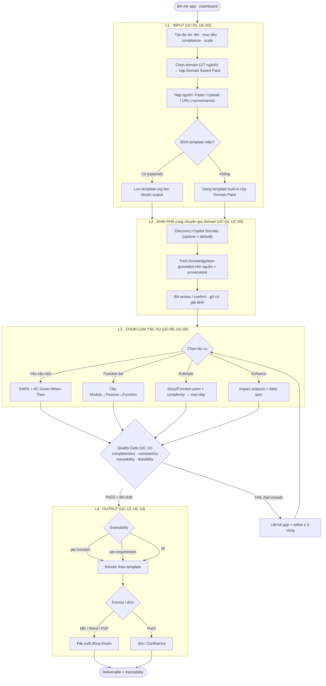
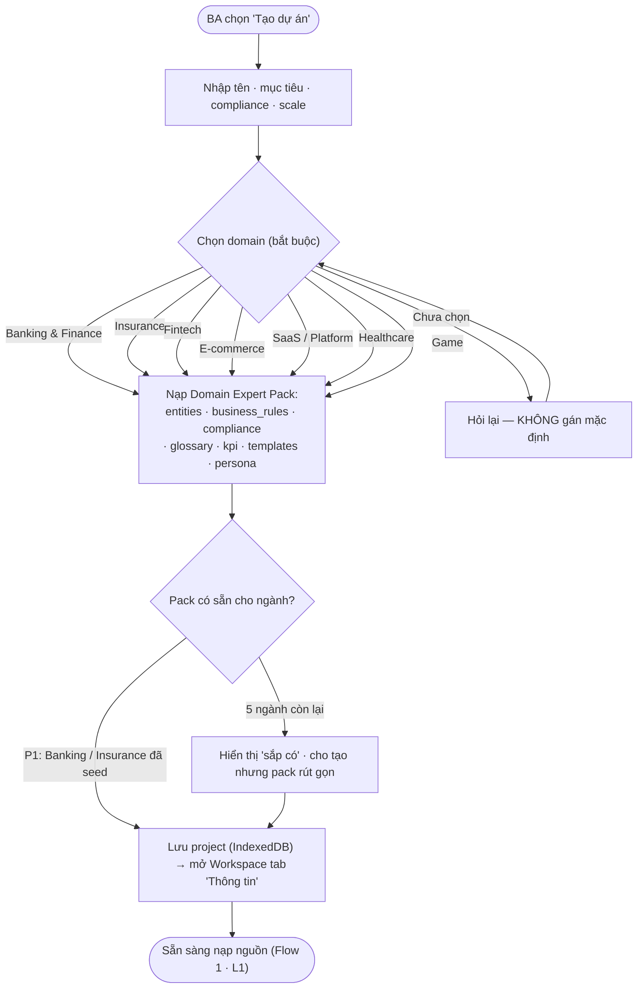
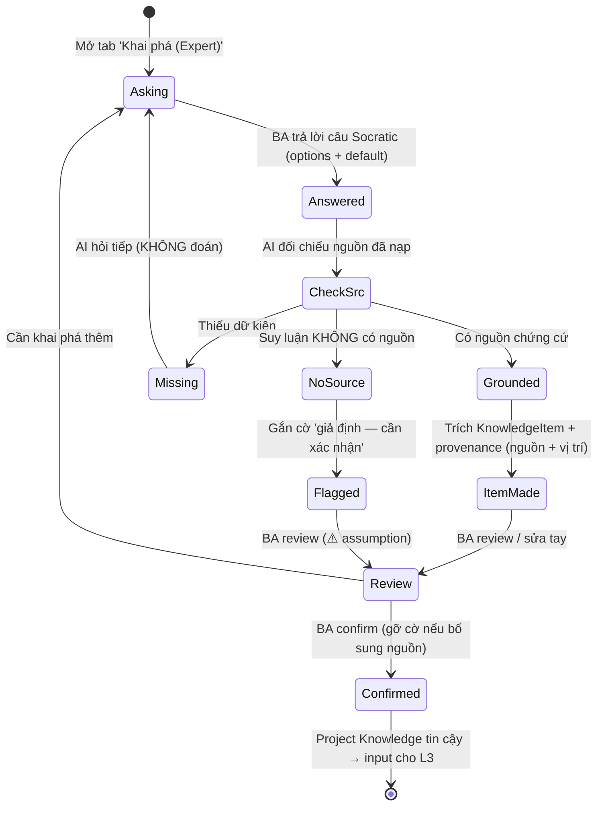
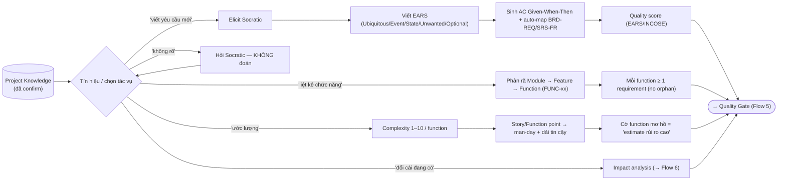
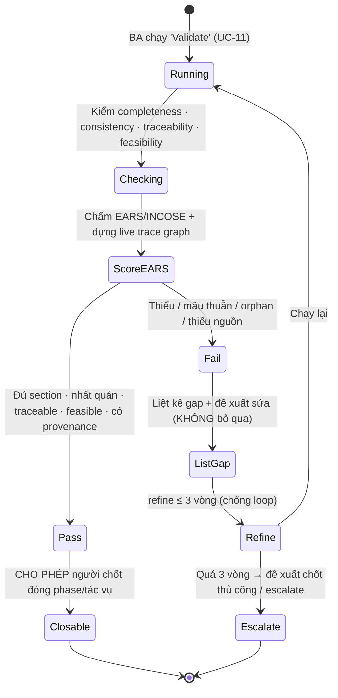
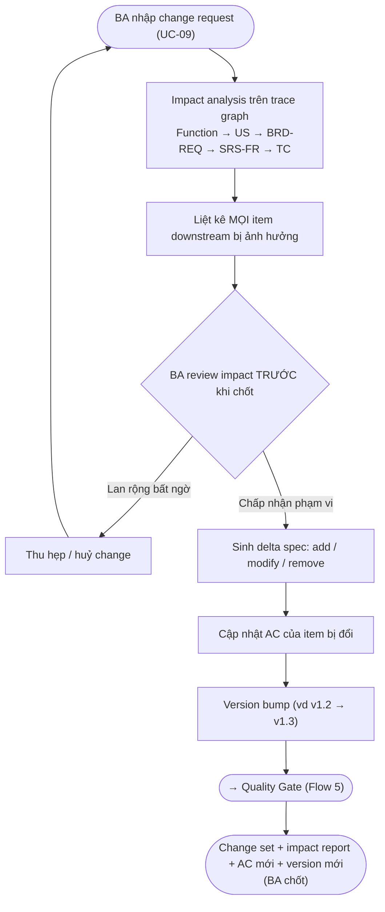
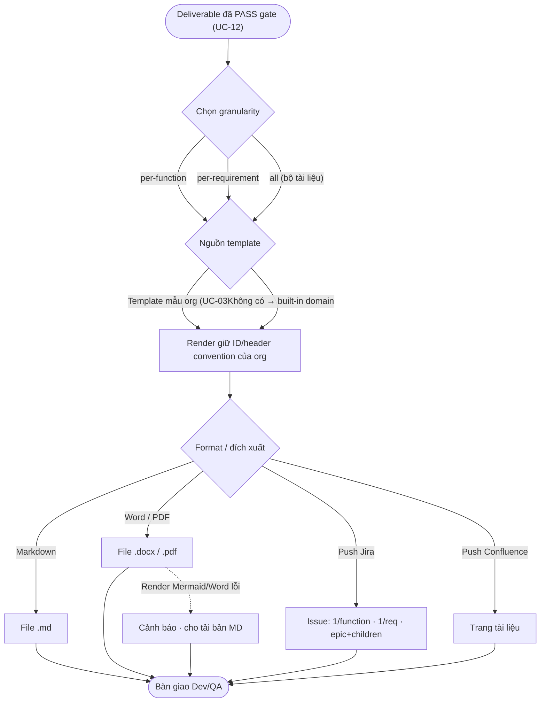

<!--
  Document ID: UF-BASUPER-2.0
  Date: 2026-06-03
  Version: 2.0
  Status: Draft — for approval
  Source: chắt lọc _v2-backbone.md (BACKBONE-BASUPER-V2-1.0 §4 UC, §7 cross-map = ID CHUẨN)
          + implementation-plan.md (IMPLPLAN-BASUPER-1.0 §3 sơ đồ 4 lớp)
          + use-cases.md (UC-BASUPER-2.0, flow này BỔ TRỢ — không mâu thuẫn).
          Nâng cấp từ UF-BASUPER-1.0 (ghi đè).
  Template: User-Flows.
  GHI CHÚ: Flow mô tả việc DÙNG BA Super App v2 ("biến AI thành Senior BA").
           ID sản phẩm (UC-/FR-/REQ-) — KHÔNG lẫn ID công cụ sinh cho khách (BRD-REQ-###, SRS-FR-###, TC-###).
-->

# User Flows — BA Super App v2

> Sơ đồ **hành trình & nhánh quyết định** (flowchart / state) theo trục **4 lớp**:
> **Input → Khai phá cùng AI chuyên gia domain → Chọn loại tác vụ → Output theo template**.
> Tài liệu này **bổ trợ** [use-cases.md](use-cases.md) (mỗi UC có sequenceDiagram chi tiết riêng);
> ở đây ta vẽ luồng **end-to-end** và các **nhánh quyết định** xuyên use-case.
>
> **Ba nguyên tắc in đậm trong mọi flow:**
> - **Không bịa** — thiếu dữ kiện thì AI **hỏi lại**, không đoán; mỗi mục tri thức **trỏ nguồn** (provenance), thiếu nguồn → cờ *"giả định"*.
> - **Gate fail-closed** — chưa PASS thì phase / tác vụ **chưa "xong"**, không cho đóng.
> - **Human chốt** — AI **đề xuất**, con người **ra quyết định cuối** (human-in-the-loop).
>
> Cross-link: use-case chi tiết → [use-cases.md](use-cases.md); REQ nghiệp vụ → [../01-business/brd.md](../01-business/brd.md).
> ID UC/FR/REQ bám **verbatim** [_v2-backbone.md](../04-planning/_v2-backbone.md) §4 & §7.

---

## Bản đồ flow → use-case (đối chiếu nhanh)

| Flow | Tên | Lớp | UC tham chiếu (use-cases.md) | REQ |
|------|-----|-----|------------------------------|-----|
| Flow 1 | Hành trình end-to-end 4 lớp | L1→L4 | UC-01..UC-13 | REQ-001..REQ-017 |
| Flow 2 | Tạo dự án & chọn domain | L1 Input | UC-01 | REQ-001, REQ-004 |
| Flow 3 | Discovery loop (evidence-grounded) | L2 Khai phá | UC-04, UC-05 | REQ-005, REQ-006, REQ-019 |
| Flow 4 | Nhánh 4 loại tác vụ | L3 Tác vụ | UC-06, UC-07, UC-08, UC-09 | REQ-007..REQ-010 |
| Flow 5 | Quality Gate fail-closed | cross | UC-11 (· UC-10) | REQ-012, REQ-013, REQ-019 |
| Flow 6 | Enhance impact | L3 Tác vụ | UC-09 | REQ-010, REQ-014 |
| Flow 7 | Export granularity | L4 Output | UC-12, UC-13 | REQ-015, REQ-016, REQ-017 |

---

## Flow 1 — Hành trình end-to-end 4 lớp

**Giải thích.** Bốn lớp chảy tuyến tính nhưng L3 có thể lặp nhiều tác vụ trên cùng một dự án (Project Knowledge nuôi mọi tác vụ). Giữa L3 và L4 **luôn** có Quality Gate **fail-closed** (UC-11): chưa PASS thì không xuất được. AI **không tự chốt** — mỗi vòng refine và bước đóng phase đều do **BA quyết định**. Template (mẫu org hoặc built-in domain) là "khuôn" áp ở L4 để bản xuất **đúng chuẩn doanh nghiệp**, không phải "văn AI".

---

## Flow 2 — Tạo dự án & chọn domain (L1)

**Giải thích.** Domain được chọn **ngay khi tạo** (REQ-001/REQ-004) để nạp Domain Expert Pack làm overlay LLM — đây là "linh hồn" v2. Hệ thống **không đoán** domain: chưa chọn thì **hỏi lại**. P1 seed thật 2 ngành (Banking/Insurance có dữ liệu BIDV/MBL); 5 ngành còn lại hiển thị "sắp có". Tham chiếu **UC-01**.

---

## Flow 3 — Discovery loop (evidence-grounded) (L2)

**Giải thích.** Vòng khai phá là trái tim chống-bịa: mỗi câu trả lời rẽ 3 nhánh — **có nguồn** → tạo KnowledgeItem kèm **provenance**; **thiếu dữ kiện** → AI **hỏi tiếp**, không bịa; **suy luận không nguồn** → **gắn cờ "giả định"** chờ người xác nhận (UC-05). Không item nào được coi là "đã chốt" nếu chưa có nguồn **và** chưa được BA confirm — **human chốt**. Tham chiếu **UC-04, UC-05** (REQ-005/006/019).

---

## Flow 4 — Nhánh 4 loại tác vụ (L3)

**Giải thích.** Người dùng thật hiếm khi cần "cả bộ tài liệu" — họ cần một trong **4 tác vụ**: viết 1 requirement (EARS), liệt kê chức năng, ước lượng, hoặc enhance. Mỗi nhánh là một pipeline con nhưng đều đổ về **cùng một Quality Gate** và **cùng một trace graph**. Tín hiệu **"không rõ"** → AI **hỏi**, không tự chọn tác vụ. Tham chiếu **UC-06..UC-09** (REQ-007..REQ-010).

---

## Flow 5 — Quality Gate fail-closed (cross)

**Giải thích.** Gate **fail-closed**: chưa PASS thì phase/tác vụ **chưa "xong"**, hệ thống **không cho đóng**. Thiếu **provenance** cũng bị fail (anti-fabrication). Mọi gap được **nêu rõ + đề xuất sửa**, không "bỏ qua". Refine giới hạn **≤ 3 vòng** để chống loop vô tận; quá ngưỡng thì escalate cho người quyết. Việc **đóng** phase luôn là hành động của **BA** (human-in-the-loop). Tham chiếu **UC-11** (· UC-10) (REQ-012/013/019).

---

## Flow 6 — Enhance impact (L3)

**Giải thích.** Enhance **bắt buộc** chạy impact analysis trên trace graph và **liệt kê đầy đủ ảnh hưởng downstream TRƯỚC khi chốt** (live traceability, fail-closed) — đây là điểm khác biệt với "sửa tay mù". BA có thể **thu hẹp/huỷ** nếu impact lan rộng bất ngờ. Mỗi thay đổi đi kèm **delta spec** + **version bump** để giữ lịch sử truy vết. Tham chiếu **UC-09** (REQ-010/014).

---

## Flow 7 — Export granularity (L4)

**Giải thích.** Xuất linh hoạt theo **3 granularity** (per-function / per-requirement / all) × **template** (mẫu org đã đính ở UC-03, hoặc built-in domain) × **format** (MD/Word/PDF) — phục vụ cả người cần 1 mẩu dán vào ticket lẫn người cần bộ tài liệu trình duyệt. Push Jira/Confluence ánh xạ granularity sang issue/epic. **Provenance + template-binding** đảm bảo bản xuất **đúng khuôn doanh nghiệp**. Render Word/Mermaid lỗi → **fallback** bản MD, không chặn bàn giao. Tham chiếu **UC-12, UC-13** (REQ-015/016/017).

---

## ⚠️ Open Questions & Assumptions

1. **Ranh giới Flow 1 (L3) ↔ Flow 5 (Gate) ↔ Flow 7 (Export):** flow vẽ Gate là chốt chặn duy nhất giữa L3 và L4. Giả định: pipeline UC-10 và 4 tác vụ L3 dùng **chung một Gate**, không có "đường tắt" xuất khi FAIL. Cần chốt khi viết SRS để không sinh 2 đường gate khác nhau.
2. **Đa tác vụ song song (Flow 4):** L3 cho lặp nhiều tác vụ trên cùng dự án; chưa rõ có cho **chạy song song nhiều tác vụ** (vd Function list + Estimate cùng lúc) hay tuần tự. Giả định hiện tại: tuần tự theo lựa chọn của BA.
3. **Refine ≤ 3 vòng (Flow 5):** đếm 3 vòng **per-tác-vụ** hay **per-phiên**? Giả định: per lần chạy Validate của một deliverable. Cần xác nhận để hành vi escalate nhất quán.
4. **Domain "sắp có" (Flow 2):** 5 ngành chưa seed — cho **tạo dự án với pack rút gọn** hay **chặn cứng** tới khi có pack đầy đủ? Flow đang giả định cho tạo (pack rút gọn) để không chặn người dùng; cần product chốt.
5. **Granularity × Push (Flow 7):** ánh xạ "all → epic + children" trên Jira có thể tạo số lượng issue lớn; chưa rõ có cần **xác nhận trước khi đẩy** (preview) để tránh spam project. Giả định: có bước preview trước push.
6. **Quyền gỡ cờ GAP/assumption (Flow 3, Flow 6):** chỉ **BA/PO** hay cả **PM**? Giả định bám use-cases.md: chỉ BA/PO (người chốt). Cần xác nhận khi thêm RBAC ở P4.

---

*user-flows.md v2.0 (UF-BASUPER-2.0) — 7 flow Mermaid (Flow 1 end-to-end 4 lớp · Flow 2 tạo dự án & domain · Flow 3 discovery loop evidence-grounded · Flow 4 nhánh 4 tác vụ · Flow 5 quality gate fail-closed · Flow 6 enhance impact · Flow 7 export granularity) bổ trợ use-cases.md theo trục 4 lớp; nhấn không bịa + provenance + gate fail-closed + human chốt. Trạng thái: Draft chờ duyệt.*
