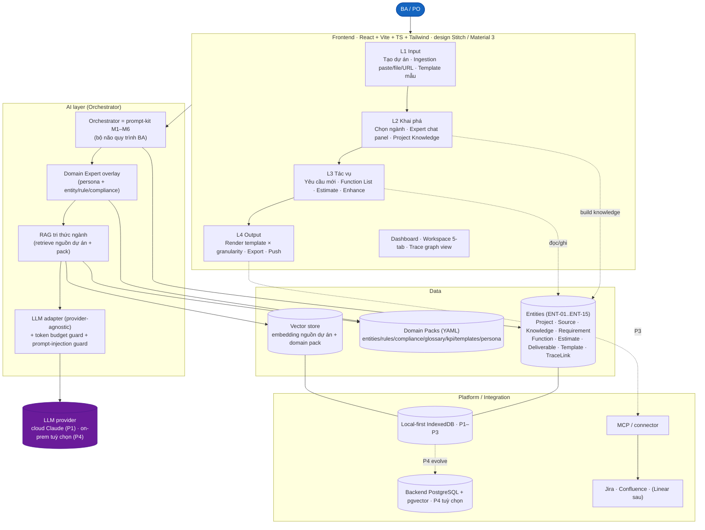
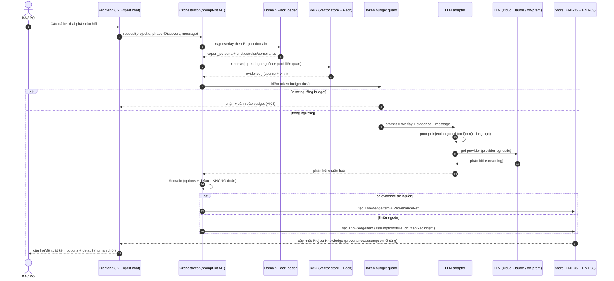
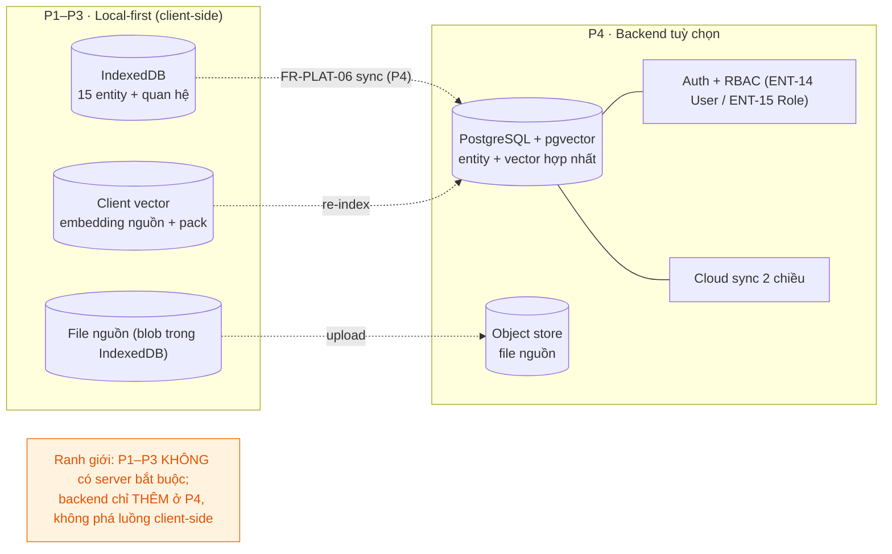

<!--
  Document ID: ARCH-BASUPER-2.0
  Date: 2026-06-03
  Version: 2.0
  Status: Draft — for approval
  Source: ghi đè ARCH-BASUPER-1.0; registry ID = BACKBONE-BASUPER-V2-1.0 (_v2-backbone.md, dùng VERBATIM §0 capability + ENT-##);
          kế thừa IMPLPLAN-BASUPER-1.0 §9 (sơ đồ thành phần, stack, data model, MCP) + SRS-BASUPER-2.0 §5 (Architecture Invariants R-01..R-08, COPY VERBATIM);
          giữ phần còn đúng của v1 (module-as-prompt, output-standard, human-in-the-loop).
  Template: Architecture
  QUY ƯỚC ID: ENT-## / C## / R-## = định danh kiến trúc CHÍNH BA Super App (sản phẩm).
             KHÔNG lẫn với ID công cụ SINH RA cho khách (BRD-REQ-###, SRS-FR-###, TC-###).
-->

# ARCHITECTURE — BA Super App v2

> **Tagline:** *"Bốn lớp ăn khớp một lõi quy trình: Input → Khai phá cùng chuyên gia ngành → Tác vụ → Output — chạy local-first, sinh đúng khuôn, có nguồn để tin."*

Tài liệu này đặc tả **kiến trúc kỹ thuật** của **BA Super App v2** — công cụ biến AI thành **Senior BA theo ngành**. Mức chức năng ở [SRS](../02-requirements/srs.md); phi chức năng ở [NFR](../02-requirements/nfr.md); mô hình dữ liệu ở [data-model](./data-model.md) *(sibling v2 — dự kiến)*; hợp đồng API ở [api-contract](./api-contract.md) *(sibling v2 — dự kiến)*; phương án triển khai ở [implementation-plan](../04-planning/implementation-plan.md).

> ⚠️ **Anti-fabrication.** Kiến trúc này KHÔNG thêm thành phần ngoài registry. Mọi capability (C01–C12) và entity (ENT-01..ENT-15) bám VERBATIM `_v2-backbone.md`; 8 Architecture Invariants (R-01..R-08) COPY VERBATIM từ `SRS-BASUPER-2.0 §5` để nhất quán tuyệt đối. Chỗ chưa chốt gắn cờ ở cuối *Open Questions & Assumptions*, không che giấu.

---

## 1. Tổng quan & nguyên tắc kiến trúc v2

BA Super App v2 là **một hệ thống 4 thành phần** ăn khớp nhau quanh **trục 4 lớp trải nghiệm** (L1 Input → L2 Khai phá → L3 Tác vụ → L4 Output), với **prompt-kit M1–M6** làm "bộ não quy trình" (orchestrator) và **Domain Pack** làm lớp tri thức ngành tách rời. Triết lý cốt lõi: **tách *tri thức ngành* (data, pack) khỏi *quy trình BA* (prompt-kit, code)**, **tách *lõi* khỏi *provider LLM*** (adapter), và **ship dần local-first (P1–P3) rồi mới gắn backend (P4)**.

**Nguyên tắc kiến trúc (rút gọn từ R-01..R-08, §7):**
1. **Framework là nguồn chân lý** — Web App tiêu thụ prompt-kit, không định nghĩa lại quy trình (R-01).
2. **Module-as-prompt** — mỗi phase là một prompt-fragment độc lập (R-02).
3. **Output-standard bắt buộc** — mọi deliverable mang YAML header + ID, render tất định (R-03).
4. **Domain Pack = data tách lõi** — thêm ngành = thêm 1 file pack, không sửa lõi (R-04, *linh hồn v2*).
5. **LLM qua adapter** — đổi provider không sửa code nghiệp vụ (R-05).
6. **Provenance bắt buộc** — thiếu nguồn → gắn cờ "giả định", human chốt (R-06).
7. **Local-first → backend tuỳ chọn** — state ở IndexedDB P1–P3, backend chỉ thêm P4 (R-07).
8. **Tách ID sản phẩm vs ID sinh-cho-khách** (R-08).

### 1.1 Bảng nâng cấp so với v1

| Trục kiến trúc | v1 (ARCH-BASUPER-1.0) | v2 (ARCH-BASUPER-2.0) |
|---|---|---|
| Hình thái Web App | **Client-side prototype** (vanilla JS + localStorage, mở-là-chạy) | **4 lớp** rõ ràng (L1 Input · L2 Khai phá · L3 Tác vụ · L4 Output) trên React+Vite+TS+Tailwind |
| Tri thức ngành | Domain-adaptive **qua biến `[DOMAIN]`** chung | **Domain Pack** (entities/rules/compliance/glossary/kpi/templates/persona) nạp overlay + RAG |
| Vai trò AI | Người dùng tự lái, paste master_prompt vào LLM | **AI Orchestrator** = prompt-kit M1–M6 *bộ não quy trình* + Domain Expert overlay dẫn dắt Socratic |
| Lưu trữ | localStorage (key-value phẳng) | **Local-first IndexedDB** (P1–P3) → **backend PostgreSQL+pgvector** tuỳ chọn (P4) |
| Gọi LLM | (P3) gọi thẳng ChatGPT/Claude/Gemini API | **LLM adapter** provider-agnostic (cloud Claude P1; on-prem tuỳ chọn P4) + token budget guard |
| Tri thức nguồn | Đọc text thô trong prompt | **RAG** — embedding nguồn dự án & pack vào **Vector store** |
| Tích hợp ngoài | — (xuất file thủ công) | **MCP/connector** push Jira/Confluence (P3) |
| Tin cậy | Quality Gate completeness/consistency | + **EARS quality score · provenance bắt buộc · live impact** (fail-closed) |

**[WHY]** v1 chứng minh ý tưởng (prompt-kit chạy được pipeline M1–M6). v2 giữ nguyên *lõi đúng* đó (R-01/R-02/R-03 nâng cấp) nhưng bọc thêm 3 lớp kiến trúc — Domain Pack, AI Orchestrator, Data/Platform — để biến "trình tạo tài liệu tuyến tính" thành **vertical AI agent có kỷ luật**, mà vẫn ship được từng phase.

---

## 2. Sơ đồ thành phần

> 4 nhóm: **Frontend** · **AI layer** · **Data** · **Platform/Integration**. Mũi tên liền = luồng chính; nét đứt = tuỳ chọn/về sau.

**Đọc sơ đồ.** Người dùng thao tác trên **Frontend 4 lớp**; mọi yêu cầu AI đi xuống **AI layer**, ở đó **Orchestrator (prompt-kit M1–M6)** chọn module theo phase, **Domain Expert overlay** nạp persona+rule ngành, **RAG** kéo bằng chứng từ Vector store + Pack, rồi **LLM adapter** gọi provider (cô lập cloud↔on-prem) dưới sự canh giữ của token budget + prompt-injection guard. **Data** lưu 15 entity + vector + pack; **Platform** đặt chúng trên IndexedDB (P1–P3), tiến hoá lên PostgreSQL+pgvector (P4), và đẩy ra ngoài qua MCP/connector.

---

## 3. Ánh xạ 12 capability (C01–C12) → module / thành phần

> Capability axis VERBATIM từ `_v2-backbone.md §0`. Cột "Thành phần kiến trúc" = nơi capability sống trong sơ đồ §2.

| Cap | Tên | Lớp | FR prefix | Thành phần kiến trúc (nhóm §2) | Entity chính |
|---|---|---|---|---|---|
| **C01** | Project & Ingestion | L1 Input | `INGEST` | FE L1 · Source parser (client-side) · Store | ENT-01 Project, ENT-02 Source, ENT-03 ProvenanceRef |
| **C02** | Template Intake | L1 Input | `TPL` | FE L1 · Template service · Store | ENT-11 TemplateAsset |
| **C03** | Domain Expert Packs | L2 Khai phá | `DOMAIN` | AI · Domain Expert overlay · Pack loader · RAG index | ENT-04 DomainPack |
| **C04** | Discovery Copilot | L2 Khai phá | `DISC` | FE L2 Expert chat · AI Orchestrator (M1) + overlay + RAG | ENT-05 KnowledgeItem, ENT-03 ProvenanceRef |
| **C05** | Task · Yêu cầu mới | L3 Tác vụ | `NEWREQ` | FE L3 · AI Orchestrator (M2/M3/M4) · Trace service | ENT-06 Requirement, ENT-07 AcceptanceCriterion, ENT-12 TraceLink |
| **C06** | Task · Function List | L3 Tác vụ | `FUNC` | FE L3 · AI Orchestrator · Function service | ENT-08 Function |
| **C07** | Task · Estimate | L3 Tác vụ | `EST` | FE L3 · Estimate engine (complexity/FP/SP→MD) | ENT-09 Estimate |
| **C08** | Task · Enhance | L3 Tác vụ | `ENH` | FE L3 · Impact engine trên Trace graph | ENT-12 TraceLink, ENT-06 Requirement |
| **C09** | Generation Pipeline (M1–M6) | cross | `PIPE` | **AI Orchestrator (lõi)** · output-standard renderer | ENT-10 Deliverable |
| **C10** | Traceability & Quality | cross | `QUAL` | Trace service · Quality gate · EARS scorer · Provenance enforcer | ENT-12 TraceLink, ENT-07 AC |
| **C11** | Template & Output/Export | L4 Output | `OUTPUT` | FE L4 · Template engine · Export (MD/Word/PDF) · MCP connector | ENT-10 Deliverable, ENT-11 TemplateAsset |
| **C12** | Platform (Storage/LLM/Security) | cross | `PLAT` | **Platform** · IndexedDB→backend · LLM adapter · token budget · RBAC (P4) | ENT-13 TokenBudget, ENT-14 User, ENT-15 Role |

**[WHY]** Mỗi capability có **một chủ thành phần rõ ràng** → khi sửa, biết đụng đâu; cross-capability (C09/C10/C12) nằm ở lõi dùng chung để tránh trùng lặp logic giữa 4 tác vụ.

---

## 4. Tech stack đề xuất

| Lớp | Lựa chọn | [WHY] |
|---|---|---|
| **Frontend** | **React + Vite + TS + Tailwind**; design **Stitch / Material 3**; state Zustand/Context | Kế thừa prototype FE đã có (giảm rủi ro, sớm có giá trị); TS bắt lỗi sớm trên data model 15 entity; Vite build nhanh; Tailwind+Material 3 đồng bộ design system sẵn. **P1–P3 chạy thuần client-side** (R-07). |
| **Render** | **Mermaid** (M5) · **markdown-it** · export **docx/pdf** (thư viện) | Mermaid là chuẩn sơ đồ máy-đọc (P04); render tất định trong web không cần server; export Word/PDF hợp lệ (P05). |
| **AI Orchestrator** | **prompt-kit M1–M6** (markdown prompt-fragment) làm bộ não quy trình + **Domain Expert overlay** | Giữ R-01/R-02: framework là nguồn chân lý, module độc lập; thêm phase/ngành = thêm file, không sửa controller. **[WHY]** quy trình BA ổn định hơn code — đóng nó thành prompt cho dễ kiểm soát & versioned. |
| **LLM adapter** | Interface **provider-agnostic**; cloud **Claude** (P1); **on-prem** tuỳ chọn (P4) | R-05: cô lập provider sau một interface → đổi cloud↔on-prem chỉ đổi cấu hình; phục vụ khách nhạy cảm dữ liệu (Banking/Health, S07). |
| **RAG / Vector** | Embedding nguồn dự án + pack; **client-side vector** (P1–P3) → **pgvector** (P4) | Grounding/provenance (AI01, R-06): copilot trả lời bám bằng chứng thật, không "văn AI"; pgvector hợp nhất với PostgreSQL ở P4 (1 hệ, ít vận hành). |
| **Data (local)** | **IndexedDB** qua wrapper (idb/Dexie) | R-07: 15 entity + quan hệ cần truy vấn cấu trúc (không chỉ key-value như v1 localStorage); sống qua reload (R04); quota lớn cho file nguồn. |
| **Backend (P4)** | **Node (NestJS)** *hoặc* **Java/Spring** (đồng bộ hệ Evo) · **PostgreSQL + pgvector** · object store cho file nguồn | Chỉ thêm khi cần **đa người dùng + RBAC** (REQ-022); PostgreSQL+pgvector gộp quan hệ + vector một chỗ. **[WHY]** trì hoãn backend tới P4 = giảm rủi ro, MVP không gánh hạ tầng. |
| **Integration** | **MCP / connector** Jira · Confluence (Linear sau) | R-04 tinh thần: tích hợp là plugin ngoài lõi; MCP chuẩn hoá kết nối để (về sau) agent đọc spec/đẩy issue. |
| **Security** | secrets qua **env/vault**; BYO-key/thin proxy; PII redaction; prompt-injection guard | Xem §8; bám S01/S04/S05/S06/S07. |

**[WHY] (lớn nhất).** Phân tầng FE / AI / Data / Platform cho phép **ship dần client-side (P1–P3) rồi mới gắn backend (P4)** — đúng R-07, giảm rủi ro và sớm có giá trị demo từng chặng.

---

## 5. Tích hợp LLM + Domain Expert

Cơ chế gồm 4 mảnh ghép, mọi lời gọi LLM **bắt buộc** đi qua adapter (R-05) và mọi tri thức nạp ra **bắt buộc** có provenance (R-06):

1. **Domain Expert overlay (pack).** Chọn `Project.domain` → loader nạp `ENT-04 DomainPack` → ghép `expert_persona` + `entities`/`business_rules`/`compliance`/`glossary` vào **system-overlay** cho LLM. Pack là **data tách lõi** (R-04): thêm ngành = thả 1 file YAML vào `/domain-packs/`, loader tự nhận.
2. **RAG tri thức ngành.** Index **nguồn dự án** (ENT-02 Source) **+** nội dung pack vào **Vector store** → mỗi lượt khai phá/sinh, retrieve top-k đoạn liên quan làm bằng chứng → trích `ENT-05 KnowledgeItem` kèm `ENT-03 ProvenanceRef` (source + vị trí). Không có nguồn → gắn cờ *"giả định — cần xác nhận"* (R-06, fail-closed grounding).
3. **LLM adapter (provider-agnostic).** Một interface cô lập provider: cloud **Claude** (P1), **on-prem** tuỳ chọn (P4). Đổi provider = đổi cấu hình adapter, **không sửa code nghiệp vụ** (R-05). Adapter cũng là nơi chèn **prompt-injection guard** (nội dung nạp từ URL/file được cô lập, không đưa thẳng vào system prompt — S06).
4. **Token budget guard.** Mỗi lời gọi đếm token → cộng dồn vào `ENT-13 TokenBudget` theo dự án → **chặn/cảnh báo khi chạm ngưỡng** (AI03). Đặt **trước** adapter để cắt lời gọi vượt budget.

> **Orchestrator (prompt-kit M1–M6) là "bộ não quy trình"** điều phối 4 mảnh trên: detect phase → load đúng module (R-02) → overlay + RAG → adapter → render qua output-standard (R-03). Domain Pack **chỉ overlay**, không thay quy trình (R-01).

### 5.1 Luồng 1 request khai phá (sequence)

**[WHY]** Luồng đặt **budget guard trước adapter** (cắt sớm chi phí), **prompt-injection guard trong adapter** (mọi provider đều được bảo vệ), và **phân nhánh provenance** (có nguồn → chốt; thiếu nguồn → giả định) — hiện thực hoá R-05 + R-06 ngay ở đường đi nóng nhất của hệ thống.

---

## 6. Tiến hoá lưu trữ

> R-07 — **Local-first → backend tuỳ chọn.** Ranh giới rõ ràng giữa P1–P3 (client-side) và P4 (backend).

| Khía cạnh | P1–P3 (Local-first) | P4 (Backend tuỳ chọn) |
|---|---|---|
| Lưu entity | IndexedDB (idb/Dexie) | PostgreSQL |
| Vector/RAG | Client-side vector | pgvector (cùng DB) |
| File nguồn | Blob trong IndexedDB | Object store |
| Người dùng | Single-user/máy | Multi-user + **RBAC** (REQ-022, FR-PLAT-05) |
| Đồng bộ | — (local) | **Cloud sync 2 chiều** (FR-PLAT-06) |
| Khôi phục | Sống qua reload (R04) | + đa thiết bị |

**Ranh giới (binding).** P1–P3 **không yêu cầu server**; toàn bộ luồng 4 lớp chạy client-side. Backend ở P4 **chỉ thêm** (auth/RBAC/sync/pgvector), **không phá vỡ** luồng client-side hiện có — adapter LLM và data-access đã trừu tượng để hoán đổi nguồn lưu trữ mà không sửa FE/AI. **[WHY]** giữ đúng R-07: giá trị đến sớm (P1 đã dùng được), hạ tầng đến muộn (chỉ khi cần scale).

---

## 7. Architecture Invariants (R-01..R-08)

> **COPY VERBATIM** từ `SRS-BASUPER-2.0 §5` (lines 606–613) để bảo đảm nhất quán tuyệt đối giữa SRS và Architecture. Mọi quyết định ở §1–§6 và ADR §9 phải tuân thủ các invariant này.

- **R-01 — Framework là nguồn chân lý.** Prompt-kit M1–M6 định nghĩa pipeline; Web App **tiêu thụ** framework, không định nghĩa lại quy trình. (Nâng cấp v2: orchestrator = prompt-kit, Domain Pack chỉ overlay, không thay quy trình.)
- **R-02 — Module-as-prompt.** Mỗi phase là một prompt-fragment độc lập load theo phase; thêm phase = thêm module + template, không sửa controller lõi.
- **R-03 — Output-standard bắt buộc.** Mọi deliverable đi qua output-standard, mang YAML header + ID có cấu trúc; render tất định (AI04).
- **R-04 — Domain Pack = data tách lõi.** Tri thức ngành nằm trong pack (YAML + overlay), **tách khỏi** lõi quy trình; thêm ngành = thêm 1 file pack (config-over-code). *(Mới — linh hồn v2.)*
- **R-05 — LLM qua adapter.** Mọi lời gọi LLM đi qua lớp adapter provider-agnostic; đổi provider (cloud↔on-prem) không sửa code nghiệp vụ. *(Mới.)*
- **R-06 — Provenance bắt buộc (anti-fabrication).** Mọi knowledge/requirement phải trỏ nguồn; thiếu nguồn → gắn cờ "giả định", AI không tự chốt; human-in-the-loop ở mọi quyết định. *(Mới.)*
- **R-07 — Local-first → backend tuỳ chọn.** State sống ở IndexedDB (P1–P3); backend chỉ thêm ở P4, không phá vỡ luồng client-side. (Nâng cấp R-04 v1: "client-side, không backend MVP" → "local-first, backend tuỳ chọn P4".)
- **R-08 — Tách ID sản phẩm vs ID sinh-cho-khách.** `FR-{PREFIX}-##`/`REQ-###`/`UC-##` là của sản phẩm; `BRD-REQ-###`/`SRS-FR-###`/`TC-###` là output công cụ sinh cho khách — không trộn lẫn.

---

## 8. Bảo mật & compliance

> Bám NFR Security/Privacy **S01–S07** + AI-quality **AI03** (xem [nfr.md](../02-requirements/nfr.md)). Kiến trúc 4 lớp đặt các kiểm soát ở **đúng tầng** thay vì rải rác.

| Kiểm soát | Tầng đặt | NFR | Cách làm |
|---|---|---|---|
| **Secrets qua env/vault** | Platform / adapter | S01, S04 | API key/LLM secret lấy từ **env/vault**, không commit vào repo, không hardcode; BYO-key hoặc thin proxy (FR-PLAT-04). |
| **Không log PII** | AI adapter · logging | S05 | **PII redaction** trước khi log; không bao giờ in API key/nội dung nhạy cảm ra log. |
| **Prompt-injection guard** | LLM adapter | S06 | Nội dung nạp (URL/file) bị **cô lập**, không ghép thẳng vào system prompt; phát hiện chỉ thị độc → tách riêng, không thực thi. |
| **Sanitize URL import** | FE L1 ingestion | S03 | Sanitize URL trước fetch; trích nội dung chính (readability) rồi mới đưa vào RAG. |
| **Data residency / on-prem** | LLM adapter + Platform | S07, AI03 | Tuỳ chọn **on-prem LLM** + lưu local cho **Banking/Health**; token budget guard giới hạn rò rỉ qua API. |
| **Provenance / anti-fabrication** | AI Orchestrator · Quality | R-06 | Mọi knowledge/requirement trỏ nguồn; thiếu → cờ giả định, human chốt (kiểm soát "tin được"). |
| **RBAC (P4)** | Backend | REQ-022 | Phân quyền theo `ENT-15 Role`; chỉ bật khi multi-user (FR-PLAT-05). |

**[WHY]** Đặt **adapter** làm điểm nghẽn an ninh cho LLM (injection guard + redaction + residency + budget tại một chỗ) → một lần làm đúng, mọi provider & mọi tác vụ thừa hưởng; đúng tinh thần R-05 (cô lập provider).

---

## 9. Quyết định kiến trúc (ADR-style)

> Năm quyết định nền tảng của v2. Mỗi ADR: **Context / Decision / Consequence**. (ADR rút gọn của v1 — module-as-prompt, output-standard, human-in-the-loop — vẫn còn hiệu lực dưới dạng R-01/R-02/R-03/R-06.)

### ADR-01 — Local-first trước, backend sau
- **Context.** v1 là client-side prototype; câu hỏi mở: cần backend ngay (SaaS) hay giữ local? (implementation-plan §12 Q1).
- **Decision.** **Local-first IndexedDB cho P1–P3**, backend (PostgreSQL+pgvector + RBAC + sync) **chỉ thêm ở P4** và không phá luồng client-side (R-07).
- **Consequence.** (+) Ship sớm, không gánh hạ tầng, demo từng phase; (−) single-user tới P4, phải trừu tượng data-access để sau hoán đổi sang backend; cloud sync hoãn P4.

### ADR-02 — Domain Pack = data tách lõi
- **Context.** v1 domain-adaptive qua biến `[DOMAIN]` chung — không đủ "chuyên gia ngành"; mở rộng ngành phải sửa prompt.
- **Decision.** Tri thức ngành đóng thành **Domain Pack YAML** (entities/rules/compliance/glossary/kpi/templates/persona), nạp **overlay + RAG**, **tách khỏi lõi quy trình** (R-04).
- **Consequence.** (+) Thêm ngành = thêm 1 file (config-over-code), lõi bất biến; (−) **chất lượng pack quyết định tất cả** → cần BA ngành rà soát (P1 chỉ seed Banking/Insurance có dữ liệu thật).

### ADR-03 — LLM qua adapter provider-agnostic
- **Context.** Khách nhạy cảm dữ liệu (Banking/Health) có thể cần on-prem; cloud (Claude) tiện cho P1 (implementation-plan §12 Q2).
- **Decision.** Mọi lời gọi LLM qua **một interface adapter**; cloud Claude (P1), on-prem tuỳ chọn (P4); đổi provider = đổi cấu hình (R-05).
- **Consequence.** (+) Không khoá nhà cung cấp, là điểm nghẽn an ninh tập trung (injection guard/redaction/budget); (−) thêm một lớp trừu tượng + cần test đa provider.

### ADR-04 — Prompt-kit M1–M6 làm Orchestrator
- **Context.** Quy trình BA (Discovery→US→BRD→SRS→Diagram→Sprint) ổn định và đã chứng minh ở v1; nên đặt nó ở code hay prompt?
- **Decision.** Giữ **prompt-kit M1–M6 làm "bộ não quy trình" (orchestrator)**; Web App tiêu thụ, không định nghĩa lại (R-01); mỗi phase là prompt-fragment độc lập (R-02).
- **Consequence.** (+) Sửa/thêm phase = sửa prompt (nhanh, versioned, không build); chạy được nhiều LLM (P01); (−) phụ thuộc năng lực LLM; cần controller route đúng phase + token budget vì prompt-kit tốn context.

### ADR-05 — Provenance bắt buộc (anti-fabrication)
- **Context.** Rủi ro lớn nhất của AI-BA: **bịa/trôi spec** ("vibe-spec"). Thị trường 2026 dịch sang evidence-grounded.
- **Decision.** **Mọi** knowledge/requirement phải trỏ nguồn (ProvenanceRef); thiếu nguồn → cờ *"giả định — cần xác nhận"*, **AI không tự chốt**, human-in-the-loop mọi quyết định; quality gate **fail-closed** (R-06).
- **Consequence.** (+) "Tin được" — khác biệt cốt lõi với đối thủ generic; (−) thêm bước xác nhận, cần đo grounding ratio (AI01) và lưu provenance cho mọi item (chi phí lưu trữ/UX).

---

## Cross-link

- [SRS — Functional Requirements & Invariants](../02-requirements/srs.md) *(R-01..R-08 nguồn VERBATIM)*
- [NFR — Non-Functional Requirements](../02-requirements/nfr.md) *(S01–S07, AI01–AI04, U/R/M/P/PF/SC)*
- [Data Model](./data-model.md) *(sibling v2 — dự kiến; ENT-01..ENT-15)*
- [API Contract](./api-contract.md) *(sibling v2 — dự kiến; hợp đồng adapter/connector)*
- [Implementation Plan](../04-planning/implementation-plan.md) *(§9 kiến trúc & kỹ thuật, roadmap P1–P4)*

---

## ⚠️ Open Questions & Assumptions (Red-Team)

> Self-critic: nêu rõ điểm chưa chốt thay vì giả vờ đã đủ. Đồng bộ với implementation-plan §12 và SRS §7.

**Open Questions (cần chốt trước khi build):**
1. **Backend ở P1?** ADR-01 chốt local-first, nhưng nếu khách cần multi-user sớm → có thể phải kéo backend lên P2/P3 (implementation-plan §12 Q1). Ảnh hưởng trừu tượng data-access.
2. **Client-side vector vs sớm pgvector.** RAG ở P1–P3 dùng client vector; ngưỡng dữ liệu/perf nào buộc chuyển pgvector sớm hơn P4 chưa định.
3. **Provider LLM chốt cứng.** Cloud Claude cho P1 đã rõ; danh sách on-prem được hỗ trợ (và chuẩn embedding tương thích) chưa chốt (implementation-plan §12 Q2).
4. **MCP vs REST connector.** Jira/Confluence push (P3) đi qua MCP hay REST trực tiếp? Ưu tiên Jira hay Confluence trước (implementation-plan §12 Q6) — ảnh hưởng api-contract.
5. **Token budget mặc định/dự án (FR-PLAT-03, AI03).** Ngưỡng khởi tạo bao nhiêu chưa có guard cụ thể (đồng bộ SRS §7 Q5).
6. **BYO-key vs thin proxy (FR-PLAT-04, S04).** Chọn cơ chế nào cho P1 ảnh hưởng nơi đặt secret (client vs proxy server).
7. **Vị trí PII redaction.** Redaction ở adapter (trước log) đủ chưa, hay cần thêm ở tầng ingestion trước khi index RAG?

**Assumptions (đang dùng, có thể đảo):**
- Kế thừa **FE prototype** React+Vite+TS+Tailwind (Stitch/Material 3) — coi là điểm khởi đầu, không viết lại.
- **Parse `.docx/.pdf/.md` client-side** đủ chất lượng cho P1; **PDF scan ảnh ngoài P1**.
- **Client-side vector** đủ cho khối lượng nguồn P1–P3; pgvector chỉ cần ở P4.
- **PostgreSQL + pgvector** là lựa chọn backend P4 (gộp quan hệ + vector); NestJS *hoặc* Spring chưa chốt cứng (đồng bộ hệ Evo).
- **Nội dung 2 pack Banking/Insurance là mẫu minh hoạ** — phải BA ngành rà trước khi dùng thật.
- Cross-link `data-model.md` và `api-contract.md` là **sibling v2 dự kiến** — link sẽ valid khi bộ v2 hoàn tất.

**Sai lệch nguồn:** Không có. 12 capability (C01–C12) và 15 entity (ENT-01..ENT-15) bám VERBATIM `_v2-backbone.md`; **8 Architecture Invariants (R-01..R-08) COPY VERBATIM từ `SRS-BASUPER-2.0 §5`** — khớp tuyệt đối (đã đối chiếu từng chữ). Stack/sơ đồ bám `implementation-plan.md §9`, mở rộng hợp lý không thêm capability mới.

---

*ARCHITECTURE v2.0 (ARCH-BASUPER-2.0) — 4 lớp + Domain Pack + AI Orchestrator (prompt-kit M1–M6) + local-first→backend; 4 sơ đồ Mermaid (thành phần · sequence khai phá · tiến hoá lưu trữ); 12 capability ánh xạ thành phần; 8 Architecture Invariants R-01..R-08 (copy verbatim từ SRS); 5 ADR. Bám keystone ID BACKBONE-BASUPER-V2-1.0. Trạng thái: Draft — for approval.*
