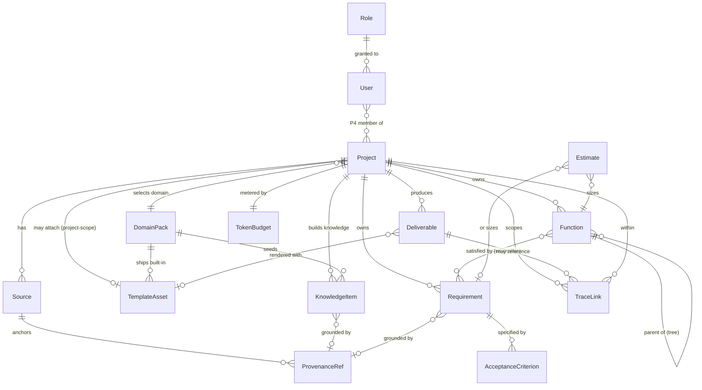

<!--
  Document ID: DATA-BASUPER-2.0
  Date: 2026-06-03
  Version: 2.0
  Status: Draft — for approval
  Source: chắt lọc BACKBONE-BASUPER-V2-1.0 (_v2-backbone.md §6 entities ENT-01..15 + §2 FR là nguồn CHUẨN);
          kế thừa IMPLPLAN-BASUPER-1.0 (§9 data model rút gọn) + SRS-BASUPER-2.0 (FR đặc tả).
  Template: Data-Model
  QUY ƯỚC ID: ENT-## = thực thể dữ liệu CHÍNH của BA Super App (sản phẩm).
             KHÔNG lẫn với ID công cụ SINH RA cho khách (BRD-REQ-###, SRS-FR-###, TC-###).
-->

# Data Model — BA Super App v2

> Mô hình dữ liệu **chuẩn hoá** của **BA Super App v2**, đặc tả 15 thực thể (ENT-01..ENT-15) theo `_v2-backbone.md §6`. Đây là hợp đồng dữ liệu giữa **store local-first IndexedDB** (P1–P3) và **backend tuỳ chọn** (P4). Mức chức năng ở [SRS](../02-requirements/srs.md); kiến trúc lớp ở [ARCHITECTURE](./ARCHITECTURE.md); hợp đồng API tiêu thụ mô hình này ở [api-contract](./api-contract.md).
>
> ⚠️ **Anti-fabrication & nguồn chân lý.** Mọi thực thể, tên, ENT-id ở đây bắt nguồn VERBATIM từ `_v2-backbone.md §6`. Không thêm thực thể ngoài registry. Các trường (field) là **chi tiết hoá hợp lý** của backbone + SRS (đặc biệt: Source mang provenance · KnowledgeItem trỏ ProvenanceRef · Requirement có EARS + quality_score + status · Function↔Requirement no-orphan · TraceLink nối from→to). Chỗ chưa chốt gắn cờ ở §cuối *Open Questions*.

---

## 1. Quy ước mô hình

| Hạng mục | Quy ước |
|---|---|
| **PK** | `id` kiểu `string` (UUID/ULID), sinh client-side (local-first). |
| **FK** | Hậu tố `*Id` (vd `projectId`, `sourceId`). Mọi FK trỏ về `id` của thực thể đích. |
| **Tenant root** | `ENT-01 Project` là gốc; gần như mọi thực thể mang `projectId` để cô lập theo dự án. |
| **Timestamp** | `createdAt` / `updatedAt` kiểu `ISO-8601 string` (ngầm định ở mọi thực thể, không lặp lại trong bảng trừ khi có nghĩa nghiệp vụ). |
| **Enum** | Liệt kê giá trị hợp lệ ngay tại cột "mô tả". |
| **Lưu trữ** | P1–P3: IndexedDB object store / thực thể (FR-PLAT-01). P4: bảng quan hệ PostgreSQL + pgvector (IMPLPLAN §9). |
| **ID sản phẩm vs khách** | `ENT-##` là dữ liệu **sản phẩm**. ID sinh cho khách (`BRD-REQ-###`/`SRS-FR-###`/`TC-###`) chỉ là **giá trị chuỗi** lưu trong trường (vd `TraceLink.fromRef`), KHÔNG phải bảng riêng (R-08). |

---

## 2. ER Diagram (toàn cảnh ENT-01..ENT-15)

> Lưu ý Mermaid `erDiagram`: kiểu thuộc tính KHÔNG để trong ngoặc (dùng `string list` chứ không `string[]`; `json` cho cấu trúc lồng).

**Đọc nhanh quan hệ lõi:**
- `Project (ENT-01)` là gốc tenant — sở hữu Source, KnowledgeItem, Requirement, Function, Deliverable, TraceLink, và 1 TokenBudget.
- `Source (ENT-02)` neo nhiều `ProvenanceRef (ENT-03)`; `KnowledgeItem (ENT-05)` và `Requirement (ENT-06)` đều **trỏ** ProvenanceRef (grounding — nếu thiếu thì gắn cờ giả định, R-06).
- `Function (ENT-08)` là cây tự tham chiếu **và** nối nhiều-nhiều với `Requirement` (no orphan, FR-FUNC-02).
- `Estimate (ENT-09)` size theo Function (hoặc Requirement set).
- `TraceLink (ENT-12)` nối `from → to` qua tham chiếu chuỗi đa loại (US/REQ/FR/TC/Function).
- `User (ENT-14)` / `Role (ENT-15)` chỉ kích hoạt ở **P4**.

---

## 3. Ranh giới phase (phasing boundary)

> Mô hình đầy đủ ở đây, nhưng **kích hoạt theo phase** đúng roadmap P1→P4 (IMPLPLAN §11, SRS §3).

| Phase | Thực thể kích hoạt | Capability nguồn |
|---|---|---|
| **P1 — Nền tảng & Khai phá** | ENT-01 Project · ENT-02 Source · ENT-03 ProvenanceRef · ENT-04 DomainPack · ENT-05 KnowledgeItem · ENT-11 TemplateAsset (chỉ lưu/xem) · ENT-13 TokenBudget | C01,C02,C03,C04,C12 |
| **P2 — Bốn tác vụ & Chất lượng** | ENT-06 Requirement · ENT-07 AcceptanceCriterion · ENT-08 Function · ENT-09 Estimate · ENT-12 TraceLink · ENT-10 Deliverable (khởi tạo qua pipeline) | C05,C06,C07,C08,C09,C10 |
| **P3 — Template & Xuất** | ENT-10 Deliverable (render/export) · ENT-11 TemplateAsset (trích schema, binding) | C11 |
| **P4 — Scale & AI-trong-web** | ENT-14 User · ENT-15 Role · (cloud sync trên mọi thực thể) | C12 (REQ-022) |

**Bất biến phase:** P1–P3 single-user, không có `User/Role` → mọi thực thể coi như thuộc một chủ sở hữu local. Khi bật P4, `Project` gắn thêm membership qua `User`↔`Project`, mọi thao tác đi qua RBAC (FR-PLAT-05).

---

## 4. Đặc tả từng thực thể

### 4.1 ENT-01 — Project (gốc tenant) · P1 · C01

| field | type | mô tả |
|---|---|---|
| `id` | string | **PK**. UUID dự án. |
| `name` | string | Tên dự án (bắt buộc, FR-INGEST-01). |
| `domain` | string | **FK→DomainPack.industry**. Ngành đã chọn (Banking/Insurance/…). |
| `goal` | string | Mục tiêu dự án. |
| `compliance` | string list | Khung tuân thủ gợi ý từ pack (NHNN/PCI-DSS/IFRS17…). |
| `scale` | string | Quy mô (`small`/`medium`/`large` hoặc số người dùng dự kiến). |
| `tokenBudgetId` | string | **FK→TokenBudget.id** (1-1). |
| `defaultTemplateAssetId` | string | **FK→TemplateAsset.id** (nullable; template ưu tiên cho L4). |
| `status` | string | `active` / `archived`. |
| `createdAt` / `updatedAt` | string | Mốc thời gian. |

**Quan hệ:** 1 Project → N Source/KnowledgeItem/Requirement/Function/Deliverable/TraceLink; 1-1 TokenBudget; 0..1 DomainPack (qua `domain`). **ENT-01.**

### 4.2 ENT-02 — Source (mang provenance) · P1 · C01

| field | type | mô tả |
|---|---|---|
| `id` | string | **PK**. |
| `projectId` | string | **FK→Project.id**. |
| `type` | string | `paste` / `upload` / `url` / `email`(P2). FR-INGEST-02..06. |
| `label` | string | Nhãn nguồn (optional). |
| `rawText` | string | Text gốc/đã trích (.docx/.pdf/.md → text). |
| `originRef` | string | URI/filename/URL gốc (cho provenance cấp nguồn). |
| `parseStatus` | string | `queued` / `parsing` / `parsed` / `failed`. |
| `parseError` | string | Lý do failed (vd PDF scan ảnh không text layer). |
| `sizeBytes` | number | Kích thước hiển thị ở source list. |

**Quan hệ:** 1 Source → N ProvenanceRef (neo offset/trang/đoạn). **Source là nơi neo provenance** cho mọi tri thức rút ra. **ENT-02.**

### 4.3 ENT-03 — ProvenanceRef (con trỏ nguồn) · P1 · C04/C10

| field | type | mô tả |
|---|---|---|
| `id` | string | **PK**. |
| `sourceId` | string | **FK→Source.id**. Nguồn được trích dẫn. |
| `locator` | json | Vị trí trong nguồn: `{ offsetStart, offsetEnd }` (paste) hoặc `{ page, paragraph }` (file) hoặc `{ url, anchor }` (url). |
| `quote` | string | Đoạn trích dẫn nguyên văn (snippet) để hiển thị truy vết. |
| `kind` | string | `evidence` (có nguồn) / `manual` (người sửa) / `assumption` (thiếu nguồn — gắn cờ). |

**Quan hệ:** thuộc 1 Source; được `KnowledgeItem` / `Requirement` trỏ tới. **Trụ cột anti-fabrication (R-06):** item thiếu ProvenanceRef.kind=evidence → coi là `assumption`. **ENT-03.**

### 4.4 ENT-04 — DomainPack (data tách lõi) · P1 · C03

| field | type | mô tả |
|---|---|---|
| `id` | string | **PK**. |
| `industry` | string | Mã ngành (banking/insurance/fintech/ecommerce/saas/healthcare/game) — **target FK của Project.domain**. |
| `displayName` | string | Tên hiển thị. |
| `entities` | json | Thực thể nghiệp vụ chuẩn ngành (mồi domain model). |
| `businessRules` | json | Thư viện rule mẫu (BR-xx) + ràng buộc. |
| `compliance` | json | Khung tuân thủ ngành. |
| `glossary` | json | Thuật ngữ ↔ định nghĩa. |
| `kpiPatterns` | json | KPI/metric đặc thù. |
| `templates` | json | Template built-in theo ngành (khuôn mặc định cho L4). |
| `expertPersona` | json | Persona + câu hỏi Socratic + checklist review. |
| `seedStatus` | string | `seeded`(Banking/Insurance P1) / `roadmap`(5 ngành sau). |

**Quan hệ:** 1 DomainPack ← N Project (qua domain); seed KnowledgeItem + ship built-in TemplateAsset. **Schema 7 thành phần bắt buộc (FR-DOMAIN-01); thêm ngành = thêm 1 file (R-04).** **ENT-04.**

### 4.5 ENT-05 — KnowledgeItem [Entity/Rule/Term] (trỏ ProvenanceRef) · P1 · C04

| field | type | mô tả |
|---|---|---|
| `id` | string | **PK**. |
| `projectId` | string | **FK→Project.id**. |
| `subtype` | string | `entity` / `rule` / `term` (FR-DISC-03). |
| `name` | string | Tên thực thể / mã rule / thuật ngữ. |
| `body` | string | Mô tả/định nghĩa/nội dung rule. |
| `provenanceRefId` | string | **FK→ProvenanceRef.id** (nullable). |
| `assumption` | boolean | `true` khi thiếu nguồn → badge "giả định — cần xác nhận" (FR-DISC-04). |
| `confirmedBy` | string | Người xác nhận (khi đảo assumption→chốt). |
| `origin` | string | `discovery` / `manual` / `pack-seed`. |

**Quan hệ:** thuộc 1 Project; trỏ 0..1 ProvenanceRef; có thể seed từ DomainPack. **Mỗi item phải grounding hoặc gắn cờ assumption (FR-QUAL-06).** **ENT-05.**

### 4.6 ENT-06 — Requirement [EARS] (quality_score + status) · P2 · C05

| field | type | mô tả |
|---|---|---|
| `id` | string | **PK**. |
| `projectId` | string | **FK→Project.id**. |
| `earsType` | string | `ubiquitous` / `event` / `state` / `unwanted` / `optional` (EARS). |
| `statement` | string | Câu requirement viết chuẩn EARS (FR-NEWREQ-01). |
| `provenanceRefId` | string | **FK→ProvenanceRef.id** (nullable → assumption). |
| `qualityScore` | json | Điểm EARS/INCOSE `{ completeness, atomic, unambiguous, measurable, overall }` (FR-NEWREQ-04/FR-QUAL-02). |
| `status` | string | `draft` / `scored` / `passed` / `assumption` / `superseded`. |
| `version` | number | Tăng khi Enhance bump (FR-ENH-03). |
| `brdReqRef` | string | ID khách `BRD-REQ-###` (chuỗi, không phải bảng — R-08). |
| `srsFrRef` | string | ID khách `SRS-FR-###` (chuỗi). |

**Quan hệ:** 1 Requirement → N AcceptanceCriterion; nhiều-nhiều với Function (no orphan); là `from`/`to` trong TraceLink. **Trường EARS + quality_score + status là bắt buộc theo backbone.** **ENT-06.**

### 4.7 ENT-07 — AcceptanceCriterion (Given-When-Then) · P2 · C05

| field | type | mô tả |
|---|---|---|
| `id` | string | **PK**. |
| `requirementId` | string | **FK→Requirement.id**. |
| `given` | string | Tiền điều kiện. |
| `when` | string | Hành động/sự kiện. |
| `then` | string | Kết quả mong đợi. |
| `isDraft` | boolean | `true` khi thiếu ngữ cảnh edge ("AC nháp", FR-NEWREQ-02). |
| `supersededBy` | string | **FK→AcceptanceCriterion.id** (khi Enhance thay AC, FR-ENH-04). |

**Quan hệ:** thuộc 1 Requirement; nguồn để auto-gen `TC-###` cho khách (FR-QUAL-05, P3). **Mỗi requirement ≥1 AC.** **ENT-07.**

### 4.8 ENT-08 — Function (cây, no orphan) · P2 · C06

| field | type | mô tả |
|---|---|---|
| `id` | string | **PK**. |
| `projectId` | string | **FK→Project.id**. |
| `code` | string | Mã ổn định `FUNC-xx` (FR-FUNC-01). |
| `parentId` | string | **FK→Function.id** (nullable; cây Module→Feature→Function). |
| `level` | string | `module` / `feature` / `function`. |
| `name` | string | Tên node. |
| `order` | number | Thứ tự sắp xếp trong cây (FR-FUNC-03). |
| `requirementIds` | string list | **FK→Requirement.id[]** — ≥1 khi là lá (no orphan, FR-FUNC-02). |
| `orphanFlag` | boolean | `true` khi function lá chưa gắn requirement → chặn "hoàn chỉnh". |

**Quan hệ:** tự tham chiếu (cây) + nhiều-nhiều Requirement; là target của Estimate. **Ràng buộc no-orphan là bất biến nghiệp vụ.** **ENT-08.**

### 4.9 ENT-09 — Estimate · P2 · C07

| field | type | mô tả |
|---|---|---|
| `id` | string | **PK**. |
| `projectId` | string | **FK→Project.id**. |
| `targetType` | string | `function` / `requirement` (đối tượng được size). |
| `targetId` | string | **FK→Function.id** hoặc **Requirement.id**. |
| `complexity` | number | 1–10 (FR-EST-01). |
| `storyPoint` | number | Đơn vị chính (FR-EST-02). |
| `functionPoint` | json | `{ method: IFPUG|COSMIC, value }` (tuỳ chọn nâng cao, nullable). |
| `manDay` | number | Quy đổi man-day theo cơ cấu nỗ lực (FR-EST-03). |
| `confidence` | json | `{ min, max }` dải tin cậy. |
| `riskFlag` | boolean | `true` cho function mơ hồ/thiếu AC ("estimate rủi ro cao", FR-EST-04). |
| `effortBreakdown` | json | Cơ cấu Dev/Test/BA/Design/PM-QA (mặc định BIDV ~53/16/12/10/9). |

**Quan hệ:** trỏ 1 Function (hoặc Requirement); rollup ở sprint plan (FR-PIPE-04). **ENT-09.**

### 4.10 ENT-10 — Deliverable · P2/P3 · C09/C11

| field | type | mô tả |
|---|---|---|
| `id` | string | **PK**. |
| `projectId` | string | **FK→Project.id**. |
| `kind` | string | `discovery` / `user-story` / `brd` / `srs` / `diagram` / `sprint`. |
| `phaseModule` | string | M1–M6 sinh ra (FR-PIPE-01). |
| `templateAssetId` | string | **FK→TemplateAsset.id** (nullable; khuôn render). |
| `granularity` | string | `per-function` / `per-requirement` / `all` (FR-OUTPUT-02). |
| `headerMeta` | json | Output-standard: `{ documentId, version, status, source }` (R-03). |
| `content` | string | Nội dung render (Markdown). |
| `refineRounds` | number | Đếm vòng refine ≤3 (FR-PIPE-05). |
| `gateStatus` | string | `pass` / `fail` (+ lý do) — fail-closed (FR-QUAL-01). |
| `exportFormats` | string list | `md` / `word` / `pdf` đã xuất (FR-OUTPUT-03). |

**Quan hệ:** thuộc 1 Project; render với 0..1 TemplateAsset; tham chiếu TraceLink. **Mọi Deliverable qua output-standard, chặn xuất nếu thiếu header (R-03).** **ENT-10.**

### 4.11 ENT-11 — TemplateAsset · P1(lưu)/P3(schema) · C02/C11

| field | type | mô tả |
|---|---|---|
| `id` | string | **PK**. |
| `scope` | string | `project` (user tải lên) / `built-in` / `domain` (từ pack). |
| `projectId` | string | **FK→Project.id** (nullable khi built-in/domain). |
| `domainPackId` | string | **FK→DomainPack.id** (nullable; khi scope=domain). |
| `deliverableType` | string | `srs` / `brd` / `tech` / `guide`. |
| `rawFile` | string | Nội dung/đường dẫn file gốc (.docx/.md/.pdf). |
| `schema` | json | Cấu trúc trích (heading/section/field/bảng) — P3, FR-TPL-02; có `schemaUncertain` flag. |
| `isDefault` | boolean | Khuôn mặc định khi nhiều template cùng loại. |

**Quan hệ:** thuộc Project (project-scope) hoặc DomainPack (domain-scope); dùng bởi Deliverable. **P1 chỉ lưu/xem; trích schema để bám khuôn là P3.** **ENT-11.**

### 4.12 ENT-12 — TraceLink (from→to, đa loại) · P2 · C10

| field | type | mô tả |
|---|---|---|
| `id` | string | **PK**. |
| `projectId` | string | **FK→Project.id**. |
| `fromType` | string | `function` / `us` / `brd-req` / `srs-fr` / `tc`. |
| `fromRef` | string | ID/khoá node nguồn (vd `FUNC-03`, `BRD-REQ-012`, `Requirement.id`). |
| `toType` | string | như `fromType`. |
| `toRef` | string | ID/khoá node đích. |
| `linkType` | string | `derives` / `satisfies` / `verifies` / `impacts`. |
| `status` | string | `active` / `pending`(thiếu upstream) / `broken`(node mồ côi). |

**Quan hệ:** thuộc 1 Project; dựng live trace graph `Function→US→BRD-REQ→SRS-FR→TC` (FR-QUAL-03) và impact analysis (FR-QUAL-04/FR-ENH-02). **Nối from→to qua tham chiếu chuỗi đa loại (US/REQ/FR/TC).** **ENT-12.**

### 4.13 ENT-13 — TokenBudget · P1 · C12

| field | type | mô tả |
|---|---|---|
| `id` | string | **PK**. |
| `projectId` | string | **FK→Project.id** (1-1). |
| `limitTokens` | number | Ngưỡng token/dự án (AI03, FR-PLAT-03). |
| `usedTokens` | number | Cộng dồn tiêu thụ. |
| `provider` | string | Provider đang đo (claude-cloud/on-prem). |
| `state` | string | `ok` / `warning` / `blocked`(vượt ngưỡng → chặn gọi). |

**Quan hệ:** 1-1 với Project; cập nhật mỗi lời gọi LLM qua adapter (R-05). **ENT-13.**

### 4.14 ENT-14 — User (P4) · C12

| field | type | mô tả |
|---|---|---|
| `id` | string | **PK**. |
| `email` | string | Định danh đăng nhập (unique). |
| `displayName` | string | Tên hiển thị. |
| `roleId` | string | **FK→Role.id**. |
| `projectIds` | string list | **FK→Project.id[]** — dự án được chia sẻ (membership). |

**Quan hệ:** nhiều-nhiều Project (membership P4); thuộc 1 Role. **Chỉ kích hoạt P4 (FR-PLAT-05).** **ENT-14.**

### 4.15 ENT-15 — Role (P4) · C12

| field | type | mô tả |
|---|---|---|
| `id` | string | **PK**. |
| `name` | string | `owner` / `editor` / `viewer` (RBAC). |
| `permissions` | string list | Quyền: `project:crud`, `task:run`, `export:*`, `settings:write`… |

**Quan hệ:** 1 Role → N User. **Nền tảng RBAC P4 (REQ-022).** **ENT-15.**

---

## 5. Ràng buộc toàn vẹn (invariant dữ liệu)

| # | Ràng buộc | Nguồn |
|---|---|---|
| INV-01 | Mọi `KnowledgeItem`/`Requirement` phải có `provenanceRefId` **hoặc** `assumption=true`. | R-06, FR-QUAL-06 |
| INV-02 | Function lá phải có `requirementIds` ≥ 1; nếu không → `orphanFlag=true`, chặn "hoàn chỉnh". | FR-FUNC-02 |
| INV-03 | `Requirement` có ≥1 `AcceptanceCriterion` trước khi qua gate. | FR-NEWREQ-02 |
| INV-04 | `Deliverable.gateStatus=fail` ⇒ không được coi phase "xong" (fail-closed). | FR-QUAL-01 |
| INV-05 | `Deliverable.headerMeta` đủ 4 trường (documentId/version/status/source) trước khi export. | R-03 |
| INV-06 | `Deliverable.refineRounds ≤ 3`. | FR-PIPE-05 |
| INV-07 | `TokenBudget.usedTokens ≤ limitTokens` để gọi LLM tiếp; vượt → `state=blocked`. | FR-PLAT-03 |
| INV-08 | `TraceLink` không trỏ node không tồn tại; gãy → `status=broken` (highlight mồ côi). | FR-QUAL-03 |
| INV-09 | ID khách (`BRD-REQ-###`/`SRS-FR-###`/`TC-###`) chỉ là **giá trị chuỗi** trong trường, không bao giờ là PK thực thể sản phẩm. | R-08 |

---

## 6. Cross-link

- Kiến trúc tổng & ADR: [./ARCHITECTURE.md](./ARCHITECTURE.md)
- Hợp đồng API tiêu thụ mô hình này: [./api-contract.md](./api-contract.md)
- Đặc tả chức năng (FR-{PREFIX}-##): [../02-requirements/srs.md](../02-requirements/srs.md)
- Registry ID (ENT/FR/REQ keystone): `../04-planning/_v2-backbone.md`

---

## ⚠️ Open Questions & Assumptions (Red-Team)

> Self-critic: nêu rõ điểm chưa chốt thay vì giả vờ đã đủ.

**Open Questions (cần chốt trước khi hiện thực store):**
1. **Khoá tự nhiên `Function.code` (FUNC-xx):** đánh số ổn định theo phạm vi dự án hay toàn cục? Khi xoá/gộp node có tái dùng mã không? (ảnh hưởng TraceLink.fromRef).
2. **Lưu `qualityScore`:** snapshot tại thời điểm chấm hay tính lại realtime mỗi lần mở? Backbone chỉ nói "score", chưa định ngưỡng cụ thể (trùng SRS Open Q#1).
3. **`ProvenanceRef.locator` cho PDF:** dùng (page, paragraph) hay toạ độ ký tự? Phụ thuộc thư viện parse client-side (PDF scan ảnh ngoài P1).
4. **Quan hệ `Estimate`↔target:** một function có nhiều Estimate (theo phiên/version) hay luôn 1-1? Cần cho calibrate P4 (FR-EST-05).
5. **`TraceLink` đa hướng:** lưu 1 chiều `from→to` + suy ngược, hay lưu cả 2 chiều? Ảnh hưởng hiệu năng impact analysis trên graph lớn.
6. **Cloud sync P4 (FR-PLAT-06):** đơn vị đồng bộ là cả Project hay từng thực thể? Chính sách xung đột (last-write-win vs merge) chưa chốt.
7. **Index vector (pgvector, P4):** embedding lưu cùng `Source`/`DomainPack` hay bảng `Embedding` riêng? IMPLPLAN §9 nêu vector store nhưng chưa mô hình hoá thực thể.

**Assumptions (đang dùng, có thể đảo):**
- PK kiểu `string` (UUID/ULID) sinh client-side để local-first hoạt động không cần server (P1–P3).
- `ENT-14 User`/`ENT-15 Role` **chưa tồn tại** ở P1–P3 (single-user) — schema khai báo trước cho P4, không cấp phát dữ liệu sớm.
- Cơ cấu nỗ lực estimate (Dev~53%/Test~16%/BA~12%/Design~10%/PM-QA~9%) là **giả định hoạch định** từ dữ liệu BIDV, không cam kết.
- Cross-link `api-contract.md` là tài liệu v2 sibling; link valid khi bộ v2 hoàn tất.

**Sai lệch backbone:** Không có. 15/15 thực thể (ENT-01..ENT-15) trong `_v2-backbone.md §6` được mô hình hoá đầy đủ; tên, ENT-id, subtype (Entity/Rule/Term) và ranh giới P1–P4 giữ VERBATIM.

---

*Data Model v2.0 (DATA-BASUPER-2.0) — 15 thực thể (ENT-01..ENT-15), ER diagram Mermaid, 9 invariant toàn vẹn, ranh giới phase P1–P4; bám keystone ID BACKBONE-BASUPER-V2-1.0. Trạng thái: Draft — for approval.*
