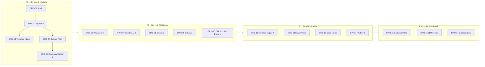

<!--
  Document ID: EPICS-BASUPER-2.0
  Date: 2026-06-03
  Version: 2.0
  Status: Draft — for approval
  Source: registry ID = BACKBONE-BASUPER-V2-1.0 (_v2-backbone.md §5 Epics + §1 REQ + §2 FR + §4 UC, dùng VERBATIM ID);
          tái dùng PSCOPE-BASUPER-P1-1.0 §E backlog (STORY-1.1..5.4, 64 SP) VERBATIM cho P1;
          kế thừa IMPLPLAN-BASUPER-1.0 (FEAT-01..17 + roadmap P1–P4 + estimate §10) + SRS-BASUPER-2.0 (FR + AC).
  Template: Epics-Stories
  QUY ƯỚC ID: EPIC-## / STORY-x.y = backlog SẢN PHẨM BA Super App.
             KHÔNG lẫn với ID công cụ SINH RA cho khách (BRD-REQ-###, SRS-FR-###, TC-###).
-->

# Epics & User Stories — BA Super App v2

> Backlog **sign-off** để team bắt tay code. Mỗi epic bám đúng `_v2-backbone.md §5` (EPIC-01..17), gắn phase P1–P4 + FEAT (implementation-plan §8) + REQ/FR (SRS §3). **P1 (EPIC-01..05)** tái dùng nguyên backlog đã chốt ở [p1-scope.md §E](p1-scope.md) — *không mâu thuẫn*. **P2–P4 (EPIC-06..17)** phân rã 2–4 story tiêu biểu/epic để thấy hình hài, story point là **ước lượng hoạch định** (xem §⚠️).
>
> ⚠️ **Anti-fabrication.** Tài liệu KHÔNG bịa story ngoài backbone. Mọi story ánh xạ về ≥1 FR trong [srs.md](../02-requirements/srs.md). Story point P2–P4 là **giả định để planning, không cam kết** — chốt lại sau mỗi sprint-0 của phase. Điểm chưa rõ gắn cờ ở §⚠️, không che giấu.

**Quy ước story (theo KI `project_management`):**
- Story luôn từ **góc nhìn người dùng cuối** (BA/PO/Dev của khách dùng app), không phải "As a developer".
- AC dạng **Given-When-Then**; mỗi happy-path kèm **≥1 sad-path** khi có rủi ro (chuẩn no-orphan edge-case).
- Story > 13 SP phải chẻ nhỏ; mỗi story ánh xạ FR (traceability Requirement → story → AC = test).
- **Persona** trong story: *BA* (Business Analyst dùng app), *PO* (Product Owner), *Admin* (quản trị cấu hình), *Dev khách* (người nhận deliverable). App là single-user local P1–P3 nên persona chủ yếu là **BA**.

---

## 1. Bảng tổng Epic (EPIC-01..EPIC-17)

| Epic | Tên (backbone §5) | Phase | FEAT | REQ chính | UC | Story (file này) |
|---|---|:--:|---|---|---|---|
| **EPIC-01** | App shell & local store | P1 | FEAT-01 (nền) | REQ-020 | UC-15 | STORY-1.1..1.2 |
| **EPIC-02** | Project & Ingestion | P1 | FEAT-01 | REQ-001, REQ-002 | UC-01, UC-02 | STORY-2.1..2.5 |
| **EPIC-03** | Template intake (rút gọn) | P1 | FEAT-02 | REQ-003 | UC-03 | STORY-3.1 |
| **EPIC-04** | Domain Expert Pack | P1 | FEAT-03 | REQ-004 | UC-01 | STORY-4.1..4.4 |
| **EPIC-05** | Discovery Copilot | P1 | FEAT-04 | REQ-005, REQ-006, REQ-021 | UC-04, UC-05 | STORY-5.1..5.4 |
| **EPIC-06** | Task · Yêu cầu mới | P2 | FEAT-05 | REQ-007 | UC-06 | STORY-6.1..6.3 |
| **EPIC-07** | Task · Function List | P2 | FEAT-06 | REQ-008 | UC-07 | STORY-7.1..7.3 |
| **EPIC-08** | Task · Estimate | P2 | FEAT-07 | REQ-009 | UC-08 | STORY-8.1..8.3 |
| **EPIC-09** | Task · Enhance | P2 | FEAT-08 | REQ-010 | UC-09 | STORY-9.1..9.3 |
| **EPIC-10** | EARS Quality + Live Traceability | P2 | FEAT-09, FEAT-10 | REQ-012, REQ-013, REQ-014, REQ-019 | UC-11 | STORY-10.1..10.4 |
| **EPIC-11** | Template engine + Output granularity | P3 | FEAT-11 | REQ-015, REQ-016 | UC-12 | STORY-11.1..11.3 |
| **EPIC-12** | Export + Push integrations | P3 | FEAT-13 | REQ-017 | UC-12, UC-13 | STORY-12.1..12.3 |
| **EPIC-13** | Spec→prototype | P3 | FEAT-14 | REQ-018 | UC-12 | STORY-13.1..13.2 |
| **EPIC-14** | Auto test-case | P3 | FEAT-12 | REQ-013 (QUAL-05) | UC-11 | STORY-14.1..14.2 |
| **EPIC-15** | Backend + multi-user + RBAC | P4 | FEAT-15 | REQ-022 | UC-15 | STORY-15.1..15.3 |
| **EPIC-16** | LLM-in-web + provider | P4 | FEAT-16 | REQ-021 | UC-14 | STORY-16.1..16.2 |
| **EPIC-17** | Estimate calibration + cloud sync | P4 | FEAT-17 | REQ-009 (EST-05), REQ-020 (PLAT-06) | UC-08, UC-15 | STORY-17.1..17.2 |

> ★ = story **đường găng** (critical path): EPIC-05 Discovery evidence-grounding (P1) · EPIC-10 Live Traceability (P2) · EPIC-11 Template engine (P3). Xem highlight ở §4.

---

## 2. P1 — EPIC-01..EPIC-05 (tái dùng backlog đã chốt, 16 story = 64 SP)

> Story point dưới đây **khớp VERBATIM** [p1-scope.md §E](p1-scope.md). FR theo [srs.md §3](../02-requirements/srs.md).

### EPIC-01 — App shell & local store · P1 · FEAT-01 · REQ-020

#### STORY-1.1 — App shell (sidebar/header/routing state) · 3 SP · FR-PLAT-01 (nền)
- **As a** BA, **I want** một app shell có sidebar + header + điều hướng giữa Dashboard và Workspace, **so that** tôi di chuyển nhanh giữa các màn mà không lạc.
- **AC1 (happy):** **Given** app đã tải **When** tôi bấm một mục trên sidebar **Then** nội dung vùng chính đổi sang màn tương ứng và mục đang chọn được highlight.
- **AC2 (sad):** **Given** một route không tồn tại **When** tôi truy cập **Then** hiển thị màn "không tìm thấy" thay vì vỡ layout.

#### STORY-1.2 — Persistence IndexedDB (Project CRUD) · 5 SP · FR-PLAT-01
- **As a** BA, **I want** dự án được lưu local qua IndexedDB, **so that** dữ liệu còn nguyên sau khi đóng/mở lại trình duyệt (không cần backend).
- **AC1 (happy):** **Given** tôi tạo/sửa/xoá một dự án **When** tôi reload trình duyệt **Then** trạng thái mới nhất được khôi phục đầy đủ từ IndexedDB.
- **AC2 (sad):** **Given** quota IndexedDB đầy **When** lưu thất bại **Then** hệ thống cảnh báo rõ ràng và không mất dữ liệu hiện có một cách âm thầm.

### EPIC-02 — Project & Ingestion · P1 · FEAT-01 · REQ-001, REQ-002

#### STORY-2.1 — Tạo dự án + chọn domain · 3 SP · FR-INGEST-01
- **As a** BA, **I want** tạo dự án và chọn ngành ngay khi tạo (tên/mục tiêu/compliance/scale), **so that** ngữ cảnh chuyên gia ngành sẵn sàng từ đầu.
- **AC1 (happy):** **Given** tôi ở Dashboard **When** tạo dự án với tên + domain "Banking" + mục tiêu **Then** dự án được lưu, hiện trong danh sách, và pack Banking được nạp làm overlay.
- **AC2 (sad):** **Given** form tạo dự án **When** bỏ trống tên hoặc domain **Then** hệ thống chặn lưu và báo lỗi đúng field.

#### STORY-2.2 — Ingestion Paste Text · 2 SP · FR-INGEST-02
- **As a** BA, **I want** dán văn bản thô (HSYC/notes) làm nguồn, **so that** copilot có dữ liệu thật để khai phá.
- **AC1 (happy):** **Given** một dự án đang mở **When** tôi dán văn bản và lưu **Then** một Source type=paste được tạo, trạng thái parsed, trích dẫn provenance được theo vị trí.
- **AC2 (sad):** **Given** ô dán trống **When** tôi bấm lưu **Then** hệ thống chặn và nhắc nhập nội dung.

#### STORY-2.3 — Ingestion Upload File (.docx/.pdf/.md → text) · 5 SP · FR-INGEST-03
- **As a** BA, **I want** tải file .docx/.pdf/.md và trích sang text, **so that** tôi nạp tài liệu nguồn có sẵn mà không phải copy tay.
- **AC1 (happy):** **Given** tôi tải file .docx hợp lệ **When** parse xong **Then** Source hiển thị status=parsed và text trích xuất dùng được cho copilot.
- **AC2 (sad):** **Given** tôi tải PDF scan ảnh (không text layer) **When** không trích được text **Then** status=failed kèm lý do rõ, layout không vỡ. *(PDF scan ngoài P1.)*

#### STORY-2.4 — Ingestion URL Fetch · 3 SP · FR-INGEST-04
- **As a** BA, **I want** nạp nội dung từ một URL công khai, **so that** tôi đưa tài liệu online vào dự án nhanh.
- **AC1 (happy):** **Given** một URL hợp lệ **When** fetch thành công **Then** nội dung chính được trích (readability), lưu thành Source type=url với provenance là URL nguồn.
- **AC2 (sad):** **Given** nội dung URL chứa chỉ thị độc (prompt-injection) **When** hệ thống nạp **Then** nội dung bị cô lập, không đưa vào system prompt (guard S06).

#### STORY-2.5 — Danh sách nguồn + trạng thái + provenance store · 3 SP · FR-INGEST-05
- **As a** BA, **I want** thấy mọi nguồn của dự án kèm trạng thái parse và truy được provenance, **so that** tôi biết nguồn nào sẵn sàng và xuất xứ từng tri thức.
- **AC1 (happy):** **Given** dự án có nhiều nguồn ở các trạng thái khác nhau **When** mở tab Nguồn dữ liệu **Then** mỗi nguồn hiện đúng type + parse status và xem được provenance.
- **AC2 (sad):** **Given** một nguồn ở trạng thái failed **When** tôi xem danh sách **Then** có nút retry và thông báo lý do thất bại.

### EPIC-03 — Template intake (rút gọn) · P1 · FEAT-02 · REQ-003

#### STORY-3.1 — Upload & lưu template mẫu + xem · 3 SP · FR-TPL-01
- **As a** BA, **I want** đính một template mẫu của tổ chức (SRS/BRD/kỹ thuật/guide) và xem trước, **so that** sau này output bám đúng khuôn doanh nghiệp.
- **AC1 (happy):** **Given** một dự án **When** tôi tải template SRS mẫu và lưu **Then** template được lưu cùng dự án, xem trước được, đánh dấu là khuôn ưu tiên cho L4 (binding để P3).
- **AC2 (sad):** **Given** tôi tải file định dạng lạ **When** lưu template **Then** hệ thống từ chối và nêu định dạng được hỗ trợ.

### EPIC-04 — Domain Expert Pack · P1 · FEAT-03 · REQ-004

#### STORY-4.1 — Schema pack + loader · 3 SP · FR-DOMAIN-01
- **As an** Admin, **I want** một schema pack chuẩn 7 thành phần (entities/rules/compliance/glossary/kpi/templates/persona) + loader, **so that** tri thức ngành được nạp nhất quán và validate được.
- **AC1 (happy):** **Given** một file pack YAML đủ 7 thành phần **When** loader nạp **Then** DomainPack hợp lệ và mọi thành phần truy cập được.
- **AC2 (sad):** **Given** pack thiếu field bắt buộc hoặc sai cú pháp YAML **When** loader nạp **Then** reject kèm lỗi schema rõ ràng.

#### STORY-4.2 — Seed Banking pack · 3 SP · FR-DOMAIN-03
- **As a** BA, **I want** pack Banking nạp sẵn (seed BIDV Home GĐ3), **so that** khi chọn ngành Banking tôi có entity/rule/compliance/glossary thật để khai phá.
- **AC1 (happy):** **Given** môi trường P1 **When** tôi liệt kê pack **Then** có pack Banking với ≥1 entity, ≥1 business rule (vd LTV ≤ 70%), ≥1 compliance (NHNN/PCI-DSS), ≥1 glossary term (TSĐB/LTV).
- **AC2 (sad):** **Given** nội dung pack là mẫu minh hoạ **When** hiển thị **Then** kèm ghi chú "cần BA ngành rà trước khi dùng thật".

#### STORY-4.3 — Seed Insurance pack · 3 SP · FR-DOMAIN-03
- **As a** BA, **I want** pack Insurance nạp sẵn (seed MBL nhân thọ), **so that** khi chọn ngành Insurance tôi có tri thức ngành bảo hiểm để khai phá.
- **AC1 (happy):** **Given** môi trường P1 **When** tôi liệt kê pack **Then** có pack Insurance với ≥1 entity (Hợp đồng/Quyền lợi), ≥1 rule (thời gian chờ), ≥1 compliance (Luật KDBH/IFRS 17), ≥1 glossary term (STBH).
- **AC2 (sad):** **Given** dự án chọn Insurance nhưng pack lỗi index **When** mở khai phá **Then** copilot fallback generic + cảnh báo pack chưa sẵn sàng.

#### STORY-4.4 — Gắn pack → overlay prompt cho LLM · 5 SP · FR-DOMAIN-02
- **As a** BA, **I want** pack đã chọn được ghép thành system-overlay cho LLM (+ RAG), **so that** copilot trả lời đúng persona và tri thức ngành chứ không generic.
- **AC1 (happy):** **Given** dự án chọn domain "Insurance" **When** mở tab Khai phá **Then** copilot trả lời với persona + entity/rule ngành bảo hiểm (không phải generic).
- **AC2 (sad):** **Given** pack chưa nạp được **When** copilot chạy **Then** chuyển chế độ generic kèm cảnh báo rõ, không im lặng.

### EPIC-05 — Discovery Copilot · P1 · FEAT-04 · REQ-005, REQ-006, REQ-021 ★ (đường găng)

#### STORY-5.1 — LLM adapter (cloud Claude, BYO-key/proxy) · 5 SP · FR-PLAT-02, FR-PLAT-04
- **As an** Admin, **I want** mọi lời gọi LLM đi qua adapter provider-agnostic + cấu hình BYO-key trong Cài đặt, **so that** đổi provider không phải sửa lõi và key không lộ.
- **AC1 (happy):** **Given** cấu hình cloud Claude với BYO-key hợp lệ **When** copilot gọi LLM **Then** gọi qua adapter; đổi provider chỉ cần đổi cấu hình, không sửa code nghiệp vụ.
- **AC2 (sad):** **Given** key sai hoặc provider timeout **When** gọi LLM **Then** báo lỗi xác thực/timeout rõ ràng và **không bao giờ** in key ra log.

#### STORY-5.2 — Chat Socratic (option+default, không đoán) · 5 SP · FR-DISC-01
- **As a** BA, **I want** copilot dẫn dắt khai phá kiểu Socratic, mỗi câu hỏi kèm options + default, **so that** tôi được gợi mở đúng hướng mà AI không tự bịa dữ kiện.
- **AC1 (happy):** **Given** dự án thiếu một dữ kiện then chốt **When** copilot cần dữ kiện đó **Then** copilot hỏi kèm options + default, chờ tôi chốt (human-in-the-loop).
- **AC2 (sad):** **Given** tôi skip một câu hỏi **When** copilot tiếp tục **Then** dữ kiện đó ghi "chưa xác định", copilot **không** tự suy diễn giá trị.

#### STORY-5.3 — Evidence-grounded: trích entity/rule/term + trỏ nguồn · 8 SP · FR-DISC-02, FR-DISC-04, FR-QUAL-06 ★
- **As a** BA, **I want** mỗi tri thức copilot rút ra đều trỏ về nguồn (provenance), thiếu nguồn thì gắn cờ "giả định", **so that** Project Knowledge tin được, không phải "văn AI".
- **AC1 (happy):** **Given** copilot rút một entity từ nguồn **When** tạo KnowledgeItem **Then** item mang ProvenanceRef trỏ đúng source + vị trí.
- **AC2 (sad):** **Given** một tri thức không truy được nguồn **When** hiển thị trong Project Knowledge **Then** nó mang nhãn "giả định — cần xác nhận" và **không** được coi là sự thật đã chốt.
- **[WHY]** Đây là story rủi ro & giá trị cao nhất P1 — nên làm spike sớm (xem [p1-scope.md §F](p1-scope.md)).

#### STORY-5.4 — Khung "Tri thức dự án" hiển thị + sửa tay · 5 SP · FR-DISC-03
- **As a** BA, **I want** khung "Tri thức dự án" gom entities/rules/terms và cho tôi sửa tay, **so that** tôi chốt kết quả khai phá (human chốt, không để AI tự quyết).
- **AC1 (happy):** **Given** Project Knowledge có sẵn item **When** tôi sửa/thêm một rule thủ công **Then** thay đổi được lưu và item đánh dấu nguồn "manual".
- **AC2 (sad):** **Given** tôi xoá một item có provenance **When** xác nhận xoá **Then** hệ thống hỏi xác nhận trước, tránh mất tri thức ngoài ý muốn.

> **Tổng P1 (cộng từng story) = 64 SP** = 8 (E1: 3+5) + 16 (E2: 3+2+5+3+3) + 3 (E3) + 14 (E4: 3+3+3+5) + 23 (E5: 5+5+8+5), khớp [p1-scope.md §E](p1-scope.md) (đã đính chính tổng về **64 SP**). Quy đổi ~0.7 MD/SP ≈ **45 MD** ([p1-scope §F](p1-scope.md)) nằm trong dải **40–55 MD** ([implementation-plan §10](implementation-plan.md)).

---

## 3. P2–P4 — EPIC-06..EPIC-17 (story tiêu biểu, SP ước lượng)

> Story point P2–P4 là **ước lượng hoạch định** (xem §⚠️). Mỗi epic chẻ 2–4 story tiêu biểu — đủ thấy hình hài, **không vét cạn** mọi story P4.

### EPIC-06 — Task · Yêu cầu mới · P2 · FEAT-05 · REQ-007

#### STORY-6.1 — Elicit + viết requirement EARS · 8 SP · FR-NEWREQ-01
- **As a** BA, **I want** mô tả một nhu cầu rồi copilot viết thành requirement chuẩn EARS, **so that** yêu cầu rõ ràng, máy đọc được, giảm mơ hồ.
- **AC1 (happy):** **Given** một mô tả nhu cầu **When** chạy tác vụ Yêu cầu mới **Then** sinh ≥1 requirement đúng cú pháp EARS, gắn với dự án.
- **AC2 (sad):** **Given** nhu cầu quá mơ hồ **When** copilot không phân loại được EARS **Then** mặc định Ubiquitous + gắn cờ review, không tự chốt.

#### STORY-6.2 — Sinh AC Given-When-Then · 5 SP · FR-NEWREQ-02
- **As a** BA, **I want** mỗi requirement tự sinh AC dạng Given-When-Then phủ edge-case, **so that** QC test được và Dev hiểu đúng.
- **AC1 (happy):** **Given** một requirement EARS **When** sinh AC **Then** requirement có ≥1 AC dạng Given-When-Then.
- **AC2 (sad):** **Given** thiếu ngữ cảnh edge **When** sinh AC **Then** AC được đánh dấu "nháp" để BA bổ sung.

#### STORY-6.3 — Auto-map BRD-REQ/SRS-FR + trace + quality score · 5 SP · FR-NEWREQ-03, FR-NEWREQ-04
- **As a** BA, **I want** requirement tự map vào BRD-REQ/SRS-FR (của khách) + chấm quality score, **so that** nó vào đồ thị truy vết và đạt ngưỡng chất lượng trước khi chốt.
- **AC1 (happy):** **Given** một requirement mới **When** map trace **Then** TraceLink tới BRD-REQ và SRS-FR được tạo và hiện trong trace graph.
- **AC2 (sad):** **Given** quality score dưới ngưỡng EARS **When** chạy chấm điểm **Then** gate cảnh báo (fail-closed) và chặn coi là "đã chốt".

### EPIC-07 — Task · Function List · P2 · FEAT-06 · REQ-008

#### STORY-7.1 — Phân rã cây Module→Feature→Function · 8 SP · FR-FUNC-01
- **As a** BA, **I want** copilot phân rã scope thành cây Module→Feature→Function (FUNC-xx), **so that** tôi có function list có cấu trúc để estimate và truy vết.
- **AC1 (happy):** **Given** một scope/epic **When** chạy tác vụ Function List **Then** sinh cây Module→Feature→Function, mỗi function có mã FUNC-xx ổn định.
- **AC2 (sad):** **Given** scope quá rộng/mơ hồ **When** phân rã **Then** copilot đề nghị chia nhỏ thay vì sinh cây phẳng vô nghĩa.

#### STORY-7.2 — Ràng buộc mỗi function ≥1 requirement (no orphan) · 5 SP · FR-FUNC-02
- **As a** BA, **I want** hệ thống cảnh báo function "mồ côi" (chưa gắn requirement), **so that** không lọt function thiếu cơ sở yêu cầu.
- **AC1 (happy):** **Given** một function tree **When** một function chưa gắn requirement **Then** hệ thống cảnh báo orphan và chặn coi là "hoàn chỉnh".
- **AC2 (sad):** **Given** function không thể gắn requirement **When** BA xem lại **Then** function được gắn cờ "cần làm rõ" thay vì bỏ qua âm thầm.

#### STORY-7.3 — Sửa/sắp xếp cây function · 3 SP · FR-FUNC-03
- **As a** BA, **I want** kéo-thả/đổi tên/xoá node trong cây function, **so that** tôi tinh chỉnh cấu trúc theo ý mình (human chốt).
- **AC1 (happy):** **Given** một cây function **When** tôi di chuyển/đổi tên một node **Then** parent/order cập nhật và liên kết requirement được giữ.
- **AC2 (sad):** **Given** tôi xoá một node có con **When** xác nhận **Then** hệ thống hỏi xác nhận cascade trước khi xoá.

### EPIC-08 — Task · Estimate · P2 · FEAT-07 · REQ-009

#### STORY-8.1 — Complexity 1–10 + story point / function · 8 SP · FR-EST-01, FR-EST-02
- **As a** PO, **I want** mỗi function được gán complexity 1–10 và quy ra story point, **so that** tôi có cơ sở định lượng khối lượng.
- **AC1 (happy):** **Given** một function list đã chốt **When** chạy Estimate **Then** mỗi function có complexity 1–10 và story point; function point IFPUG/COSMIC xuất khi bật tuỳ chọn.
- **AC2 (sad):** **Given** thiếu AC để tính function point **When** ước lượng **Then** chỉ xuất story point + cảnh báo, không bịa function point.

#### STORY-8.2 — Quy đổi man-day + dải tin cậy · 5 SP · FR-EST-03
- **As a** PO, **I want** story point quy đổi sang man-day theo cơ cấu nỗ lực + dải tin cậy, **so that** tôi ước lượng lịch và ngân sách.
- **AC1 (happy):** **Given** một bộ estimate theo story point **When** quy đổi man-day **Then** xuất tổng man-day kèm dải min–max (cơ cấu Dev~53%/Test~16%/BA~12%/Design~10%/PM-QA~9%).
- **AC2 (sad):** **Given** nhiều function mơ hồ **When** quy đổi **Then** dải tin cậy nới rộng + cảnh báo "độ tin cậy thấp".

#### STORY-8.3 — Cờ function mơ hồ (estimate rủi ro cao) · 3 SP · FR-EST-04
- **As a** PO, **I want** function thiếu AC/định nghĩa bị gắn cờ "rủi ro cao", **so that** tôi không cam kết số trên nền mơ hồ.
- **AC1 (happy):** **Given** một function thiếu AC **When** chạy estimate **Then** function được gắn cờ "estimate rủi ro cao" và tác động tới dải tin cậy.
- **AC2 (sad):** **Given** toàn bộ function mơ hồ **When** ước lượng **Then** hệ thống cảnh báo "không nên cam kết số".

### EPIC-09 — Task · Enhance · P2 · FEAT-08 · REQ-010

#### STORY-9.1 — Nhận change request gắn target · 3 SP · FR-ENH-01
- **As a** BA, **I want** nhập yêu cầu thay đổi gắn đúng requirement/function hiện hữu, **so that** thay đổi có ngữ cảnh và truy vết được.
- **AC1 (happy):** **Given** một requirement/function hiện hữu **When** tôi nhập yêu cầu thay đổi **Then** một change request được ghi nhận gắn đúng target.
- **AC2 (sad):** **Given** target không tồn tại **When** tạo change request **Then** hệ thống từ chối và nhắc chọn target hợp lệ.

#### STORY-9.2 — Impact analysis trên trace graph · 8 SP · FR-ENH-02, FR-QUAL-04
- **As a** BA, **I want** thấy mọi item downstream bị ảnh hưởng trước khi chốt thay đổi, **so that** tôi không phá vỡ phần phụ thuộc.
- **AC1 (happy):** **Given** một change request **When** chạy impact analysis **Then** mọi item downstream (US/BRD-REQ/SRS-FR/TC/Function) được liệt kê trước khi tôi chốt.
- **AC2 (sad):** **Given** trace graph rời rạc **When** phân tích **Then** hệ thống báo "không đủ liên kết để phân tích" thay vì kết quả sai.

#### STORY-9.3 — Delta spec (add/mod/remove) + version bump · 5 SP · FR-ENH-03, FR-ENH-04
- **As a** BA, **I want** sinh delta spec (thêm/sửa/bỏ) + tăng version + cập nhật AC, **so that** thay đổi được ghi nhận có kiểm soát phiên bản.
- **AC1 (happy):** **Given** một change request đã phân tích tác động **When** sinh delta spec **Then** xuất change set add/modify/remove và bump version item bị đổi.
- **AC2 (sad):** **Given** xung đột thay đổi **When** áp delta **Then** hệ thống yêu cầu giải quyết thủ công, không tự ghi đè.

### EPIC-10 — EARS Quality + Live Traceability · P2 · FEAT-09, FEAT-10 · REQ-012..014, REQ-019 ★ (đường găng)

#### STORY-10.1 — Quality gate fail-closed · 8 SP · FR-QUAL-01
- **As a** BA, **I want** quality gate chặn khi deliverable chưa đủ completeness/consistency/traceability/feasibility, **so that** "xong" thật sự nghĩa là đạt chuẩn.
- **AC1 (happy):** **Given** một deliverable chưa đạt 4 tiêu chí **When** kiểm gate **Then** gate trả FAIL và chặn coi phase là hoàn tất.
- **AC2 (sad):** **Given** người dùng muốn bỏ qua gate **When** override **Then** chỉ human override được, có ghi log; không có "skip âm thầm".

#### STORY-10.2 — EARS/INCOSE quality score · 5 SP · FR-QUAL-02
- **As a** BA, **I want** chấm điểm requirement theo EARS/INCOSE + gợi ý sửa, **so that** tôi biết requirement nào dưới chuẩn trước khi đóng.
- **AC1 (happy):** **Given** một requirement **When** chấm EARS/INCOSE **Then** trả điểm theo các tiêu chí (completeness/atomic/không mơ hồ/đo lường được) + khuyến nghị.
- **AC2 (sad):** **Given** một requirement rỗng **When** chấm điểm **Then** trả điểm 0 + cảnh báo, không crash.

#### STORY-10.3 — Live trace graph (Function→US→BRD-REQ→SRS-FR→TC) · 8 SP · FR-QUAL-03 ★
- **As a** BA, **I want** đồ thị truy vết sống cập nhật realtime khi item đổi, **so that** tôi luôn thấy quan hệ end-to-end và phát hiện node mồ côi.
- **AC1 (happy):** **Given** dự án có các item liên kết **When** mở trace graph **Then** hiển thị chuỗi Function→US→BRD-REQ→SRS-FR→TC và cập nhật khi item đổi.
- **AC2 (sad):** **Given** một link bị gãy **When** dựng graph **Then** node mồ côi được highlight thay vì ẩn đi.
- **[WHY]** Trace graph là nền cho Enhance/impact và quality — dựng mới, rủi ro tích hợp cao → critical path P2.

#### STORY-10.4 — Provenance enforcement (anti-fabrication) · 5 SP · FR-QUAL-06
- **As a** BA, **I want** hệ thống bắt buộc provenance cho mọi knowledge/requirement, **so that** không có mục "đã chốt" mà thiếu nguồn.
- **AC1 (happy):** **Given** một item không có provenance **When** kiểm anti-fabrication **Then** item bị chặn khỏi trạng thái "đã chốt" và gắn nhãn giả định.
- **AC2 (sad):** **Given** người dùng cố xuất item không nguồn **When** export **Then** hệ thống cảnh báo và yêu cầu xác nhận trước.

### EPIC-11 — Template engine + Output granularity · P3 · FEAT-11 · REQ-015, REQ-016 ★ (đường găng)

#### STORY-11.1 — Trích schema từ template mẫu · 8 SP · FR-TPL-02 ★
- **As a** BA, **I want** template mẫu được trích thành schema (heading/section/field/bảng), **so that** nội dung sinh ra map đúng khuôn tổ chức.
- **AC1 (happy):** **Given** một TemplateAsset đã upload **When** trích schema **Then** sinh schema khuôn lưu kèm asset để OUTPUT-01 render bám.
- **AC2 (sad):** **Given** file mẫu lộn xộn **When** trích schema **Then** fallback template built-in + gắn cờ "schema không chắc chắn".
- **[WHY]** Template-binding với file mẫu thật là phần khó nhất P3 (rủi ro nêu ở implementation-plan §12) → critical path P3, có fallback.

#### STORY-11.2 — Render deliverable theo template · 5 SP · FR-OUTPUT-01
- **As a** BA, **I want** deliverable render bám template (giữ ID/header convention), **so that** bản xuất đúng khuôn doanh nghiệp.
- **AC1 (happy):** **Given** một deliverable + template mẫu đã đính **When** render **Then** nội dung map vào đúng heading/section của template, giữ ID/header.
- **AC2 (sad):** **Given** dự án không có template riêng **When** render **Then** dùng built-in domain (FR-TPL-03) thay vì lỗi.

#### STORY-11.3 — Output granularity per-function/per-req/all · 5 SP · FR-OUTPUT-02
- **As a** BA, **I want** chọn mức chi tiết output (per-function / per-requirement / all), **so that** tôi xuất đúng cái cần (1 mẩu dán ticket hay cả bộ).
- **AC1 (happy):** **Given** dự án có function + requirement **When** chọn "per-function" **Then** output chỉ chứa function được chọn; chọn "all" thì xuất cả bộ.
- **AC2 (sad):** **Given** chưa có function **When** chọn granularity "per-function" **Then** hệ thống cảnh báo dữ liệu không khớp.

### EPIC-12 — Export + Push integrations · P3 · FEAT-13 · REQ-017

#### STORY-12.1 — Export MD/Word/PDF · 5 SP · FR-OUTPUT-03
- **As a** BA, **I want** xuất deliverable ra Markdown/Word/PDF, **so that** tôi chia sẻ bản trình duyệt cho stakeholder.
- **AC1 (happy):** **Given** một deliverable đã render **When** chọn export Word **Then** sinh file Word hợp lệ giữ cấu trúc heading/section.
- **AC2 (sad):** **Given** convert lỗi **When** export **Then** báo lỗi + giữ bản MD fallback, không mất nội dung.

#### STORY-12.2 — Push Jira (issue theo granularity) · 5 SP · FR-OUTPUT-04
- **As a** PO, **I want** push deliverable thành issue Jira theo granularity, **so that** backlog vào thẳng công cụ quản lý.
- **AC1 (happy):** **Given** cấu hình connector Jira hợp lệ **When** push per-requirement **Then** tạo 1 issue/requirement đúng nội dung.
- **AC2 (sad):** **Given** lỗi auth/API **When** push **Then** báo lỗi và **không** tạo bản trùng.

#### STORY-12.3 — Push Confluence (page) · 3 SP · FR-OUTPUT-04
- **As a** BA, **I want** xuất deliverable thành page Confluence, **so that** tài liệu nằm nơi tổ chức quen dùng.
- **AC1 (happy):** **Given** cấu hình Confluence hợp lệ **When** push "all" **Then** tạo page (epic + children) theo cấu trúc deliverable.
- **AC2 (sad):** **Given** mất kết nối giữa chừng **When** push **Then** báo trạng thái dở dang, cho retry, không tạo page rác.

### EPIC-13 — Spec→prototype · P3 · FEAT-14 · REQ-018

#### STORY-13.1 — Handoff spec → mô tả prototype · 5 SP · FR-OUTPUT-05
- **As a** BA, **I want** chuyển spec/requirement thành mô tả prototype (nối Claude Design), **so that** ý tưởng thành màn hình nhanh.
- **AC1 (happy):** **Given** một spec đủ chi tiết **When** chạy handoff **Then** sinh mô tả prototype/màn hình dùng được cho công cụ design.
- **AC2 (sad):** **Given** spec thiếu thông tin **When** handoff **Then** cảnh báo "không đủ để prototype" thay vì sinh mô tả rỗng.

#### STORY-13.2 — Map requirement → màn hình gợi ý · 3 SP · FR-OUTPUT-05
- **As a** BA, **I want** thấy gợi ý màn hình tương ứng từng nhóm requirement, **so that** tôi hình dung phạm vi UI sớm.
- **AC1 (happy):** **Given** một nhóm requirement **When** map prototype **Then** liệt kê màn hình gợi ý kèm requirement nguồn.
- **AC2 (sad):** **Given** requirement không thuộc nhóm UI **When** map **Then** đánh dấu "không áp dụng prototype".

### EPIC-14 — Auto test-case · P3 · FEAT-12 · REQ-013 (QUAL-05)

#### STORY-14.1 — Sinh test-case từ AC · 5 SP · FR-QUAL-05
- **As a** Dev khách / QC, **I want** test-case (TC-###) tự sinh từ AC Given-When-Then, **so that** tôi có bộ test khởi điểm bám đúng yêu cầu.
- **AC1 (happy):** **Given** một AC dạng Given-When-Then **When** sinh test-case **Then** map ra test-case TC-### tương ứng kịch bản.
- **AC2 (sad):** **Given** AC mơ hồ **When** sinh test-case **Then** test-case gắn cờ "review" để người chỉnh.

#### STORY-14.2 — Liên kết test-case vào trace graph · 3 SP · FR-QUAL-03 (mở rộng)
- **As a** QC, **I want** test-case nối vào chuỗi trace (…→SRS-FR→TC), **so that** tôi biết test nào phủ requirement nào.
- **AC1 (happy):** **Given** test-case đã sinh **When** dựng trace **Then** TraceLink SRS-FR→TC xuất hiện trong graph.
- **AC2 (sad):** **Given** một AC không có requirement cha **When** liên kết **Then** highlight test-case mồ côi.

### EPIC-15 — Backend + multi-user + RBAC · P4 · FEAT-15 · REQ-022

#### STORY-15.1 — Backend API + auth · 8 SP · FR-PLAT-05
- **As an** Admin, **I want** backend có xác thực để nhiều người cùng dùng, **so that** dự án chia sẻ được ngoài 1 máy.
- **AC1 (happy):** **Given** một tài khoản hợp lệ **When** đăng nhập **Then** truy cập được dự án được phép qua API backend.
- **AC2 (sad):** **Given** thông tin đăng nhập sai **When** đăng nhập **Then** từ chối + không lộ thông tin nhạy cảm.

#### STORY-15.2 — RBAC phân quyền theo vai trò · 5 SP · FR-PLAT-05
- **As an** Admin, **I want** phân quyền theo vai trò (view/edit/admin), **so that** kiểm soát ai làm gì trên dự án.
- **AC1 (happy):** **Given** một user vai trò "viewer" **When** truy cập dự án **Then** chỉ xem được, không sửa.
- **AC2 (sad):** **Given** user thiếu quyền **When** thao tác sửa **Then** hệ thống từ chối kèm thông báo quyền.

#### STORY-15.3 — Chia sẻ dự án + migrate từ local · 5 SP · FR-PLAT-05, FR-PLAT-06
- **As a** BA, **I want** đưa dự án local lên backend chia sẻ, **so that** đồng đội cùng làm tiếp.
- **AC1 (happy):** **Given** một dự án local **When** migrate lên backend **Then** dữ liệu (project/source/knowledge) chuyển đầy đủ, kiểm chứng số lượng.
- **AC2 (sad):** **Given** migrate gián đoạn **When** lỗi giữa chừng **Then** rollback an toàn, không để dữ liệu nửa vời.

### EPIC-16 — LLM-in-web + provider · P4 · FEAT-16 · REQ-021

#### STORY-16.1 — Tích hợp LLM thật trong web + RAG ngành · 8 SP · FR-PLAT-02 (mở rộng)
- **As a** BA, **I want** gọi LLM thật trong web (không chỉ adapter mock) + RAG tri thức ngành, **so that** copilot trả lời sát ngữ cảnh dự án.
- **AC1 (happy):** **Given** cấu hình provider thật **When** copilot truy vấn **Then** trả lời dùng RAG (embedding nguồn + domain pack), trích nguồn.
- **AC2 (sad):** **Given** lỗi index RAG **When** truy vấn **Then** fallback no-RAG + cảnh báo, không trả lời sai âm thầm.

#### STORY-16.2 — On-prem LLM tuỳ chọn (Banking/Health) · 5 SP · FR-PLAT-02, REQ-021 (S07)
- **As an** Admin (khách nhạy cảm dữ liệu), **I want** trỏ adapter sang LLM on-prem, **so that** dữ liệu Banking/Health không rời hạ tầng.
- **AC1 (happy):** **Given** cấu hình endpoint on-prem **When** copilot gọi LLM **Then** request đi tới on-prem, không gọi cloud.
- **AC2 (sad):** **Given** on-prem không reachable **When** gọi **Then** báo lỗi rõ và **không** lặng lẽ fallback sang cloud (vi phạm residency).

### EPIC-17 — Estimate calibration + cloud sync · P4 · FEAT-17 · REQ-009 (EST-05), REQ-020 (PLAT-06)

#### STORY-17.1 — Calibrate estimate theo lịch sử · 5 SP · FR-EST-05
- **As a** PO, **I want** estimate được hiệu chỉnh theo dự án đã đóng, **so that** số ước lượng ngày càng sát thực tế.
- **AC1 (happy):** **Given** có dữ liệu estimate-vs-actual của dự án đã đóng **When** chạy calibrate **Then** áp hệ số hiệu chỉnh cho dự án mới.
- **AC2 (sad):** **Given** thiếu dữ liệu lịch sử **When** calibrate **Then** bỏ qua hiệu chỉnh + dùng số gốc, có ghi chú.

#### STORY-17.2 — Cloud sync 2 chiều · 5 SP · FR-PLAT-06
- **As a** BA, **I want** đồng bộ dữ liệu local ↔ cloud, **so that** tôi làm việc đa thiết bị.
- **AC1 (happy):** **Given** dữ liệu thay đổi ở thiết bị A **When** sync **Then** thiết bị B nhận bản cập nhật.
- **AC2 (sad):** **Given** xung đột chỉnh sửa **When** sync **Then** áp chính sách merge/last-write-win **có cảnh báo**, không mất dữ liệu âm thầm.

---

## 4. Story "đường găng" (critical path) — ưu tiên spike sớm

| Story | Phase | Vì sao là đường găng |
|---|:--:|---|
| **STORY-5.3** Discovery evidence-grounding | P1 | Trái tim "tin được": trích tri thức + provenance + cờ giả định. Rủi ro LLM cao nhất → spike ở sprint-0 ([p1-scope.md §F](p1-scope.md)). |
| **STORY-10.3** Live trace graph | P2 | Nền cho impact analysis (Enhance) + quality; dựng mới, tích hợp nhiều entity. |
| **STORY-11.1** Trích schema template | P3 | Template-binding với file mẫu thật là phần khó nhất P3 (rủi ro ở implementation-plan §12); cần fallback. |

---

## 5. Tổng story point theo phase

> P1 = số **đã chốt** ([p1-scope.md §E](p1-scope.md)). P2–P4 = **ước lượng hoạch định** (cộng SP các story tiêu biểu — *chưa vét cạn*, sẽ phình khi bổ sung story phụ). Cột MD khớp dải [implementation-plan §10](implementation-plan.md).

| Phase | Epic | SP (cộng story trong file này) | # story | Tính chất | MD (implementation-plan §10) |
|---|---|:--:|:--:|---|:--:|
| **P1** | EPIC-01..05 | **64** | 16 | Đã chốt — SP từng story VERBATIM p1-scope | 40–55 |
| **P2** | EPIC-06..10 | **92** | 16 | Ước lượng, story tiêu biểu | 55–75 |
| **P3** | EPIC-11..14 | **47** | 10 | Ước lượng, story tiêu biểu | 40–55 |
| **P4** | EPIC-15..17 | **41** | 7 | Ước lượng, story tiêu biểu | 50–70 |
| | **Tổng** | **244 SP** | **49** | hoạch định | **≈ 185–255 MD** |

> **Lưu ý đọc số:** SP ở cột này là **tổng cộng đúng các story xuất hiện trong file** (P1 đếm 16 story = 64 SP; P2–P4 chỉ gồm 33 story **tiêu biểu**, *chưa vét cạn* story phụ). Tổng SP thực tế P2–P4 **sẽ cao hơn** sau grooming — vì vậy SP-per-phase **không** dùng để suy ngược man-day; cột MD lấy trực tiếp từ [implementation-plan §10](implementation-plan.md).
>
> **[WHY] SP P2 > P1 nhưng MD không bùng nổ:** P2 tái dùng adapter/shell/LLM đã dựng ở P1 nên hệ số MD/SP thấp hơn (P1 gánh spike copilot + dựng nền nặng tay, ~0.6 MD/SP theo [p1-scope §F](p1-scope.md)). **Con số là giả định để hoạch định, không cam kết** — chốt lại sau sprint-0 mỗi phase.

---

## 6. Cross-link

- [p1-scope.md](p1-scope.md) — backlog P1 chốt (nguồn SP cho EPIC-01..05) + 7 quyết định + DoD P1.
- [implementation-plan.md](implementation-plan.md) — FEAT-01..17 + roadmap P1–P4 + estimate §10 (dải MD/phase).
- [../02-requirements/srs.md](../02-requirements/srs.md) — 49 FR (Mô tả/Inputs/Process/Outputs/Errors + AC) mà story map vào.
- [../02-requirements/use-cases.md](../02-requirements/use-cases.md) — UC-01..15, ngữ cảnh nghiệp vụ của epic.
- [_v2-backbone.md](_v2-backbone.md) — keystone ID (EPIC/STORY/REQ/FR/UC).

---

## ⚠️ Open Questions & Assumptions (Red-Team)

**Open Questions (cần chốt trước/khi vào từng phase):**
1. **Story point P2–P4 chưa vét cạn:** mỗi epic mới chẻ 2–4 story tiêu biểu; story phụ (CRUD nhỏ, settings, empty-state) chưa tính → tổng SP thực P2–P4 **sẽ cao hơn** số ở §5. Cần grooming đầy đủ đầu mỗi phase.
2. **Hệ số MD/SP từng phase:** mới giả định P1 ~0.6 MD/SP; P2–P4 suy ra để khớp dải MD plan, **chưa hiệu chỉnh bằng velocity thật** (anti-pattern "estimate theo lạc quan" — KI project_management). Chốt sau 3 sprint.
3. **Ngưỡng EARS/INCOSE để qua gate (STORY-10.2):** con số cụ thể chưa định (đồng bộ Open Question SRS §7).
4. **Granularity "all" khi push Jira (STORY-12.2):** map "epic + children" cụ thể ra sao chưa định nghĩa (SRS §7).
5. **Phụ thuộc chéo epic:** EPIC-10 (trace graph) là tiền đề cho EPIC-09 (Enhance/impact) — cần dựng trace graph **trước hoặc song song** Enhance; thứ tự P2 nội bộ cần khẳng định ở sprint planning.
6. **Persona "Dev khách/QC"** (EPIC-14) chỉ xuất hiện khi output rời khỏi app — với P1–P3 single-user, các story này hướng tới *người nhận deliverable*, không phải user thao tác app.
7. **Tổng SP P1 đã đính chính:** p1-scope §E từng ghi tổng "~75 SP" trong khi cộng dòng = **64 SP**; nay p1-scope đã sửa nhãn tổng về **64 SP** (~0.7 MD/SP ≈ 45 MD, trong dải 40–55 MD). File này dùng SP từng story = 64 → nhất quán, không còn chênh.

**Assumptions (đang dùng, có thể đảo):**
- SP P1 = **VERBATIM** p1-scope §E (không tự ý chỉnh). Nếu p1-scope đổi, file này phải đồng bộ.
- P2–P4 ước lượng dựa trên story **tiêu biểu**, **không cam kết** — để planning, chốt lại mỗi sprint-0.
- Mỗi story ánh xạ ≥1 FR ở SRS-BASUPER-2.0; AC ở đây là **rút gọn** của AC chi tiết trong SRS §3 (không mâu thuẫn, có thể bổ sung khi vào sprint).
- Cross-link `use-cases.md` là tài liệu v2 sibling — link valid khi bộ v2 hoàn tất.
- Phân tách ID sản phẩm (EPIC/STORY/REQ/FR/UC) vs ID sinh-cho-khách (BRD-REQ/SRS-FR/TC) giữ đúng R-08 (SRS §5).

**Sai lệch backbone:** Không có. 17/17 epic ở `_v2-backbone.md §5` đều có mặt, đúng tên + phase; ID/prefix giữ VERBATIM. P1 dùng đúng **16 story + SP từng story** của p1-scope §E (tổng 64 SP; p1-scope đã đính chính nhãn tổng về 64) — không thêm/bớt story.

---

*Epics & Stories v2.0 (EPICS-BASUPER-2.0) — 17 epic (EPIC-01..17) ánh xạ P1–P4 + FEAT-01..17; 49 story (P1: 16 story = 64 SP, SP từng story VERBATIM p1-scope; P2–P4: 33 story tiêu biểu = 180 SP ước lượng, chưa vét cạn); tổng 244 SP, man-day theo implementation-plan §10 ≈ 185–255 MD. P1 = 64 SP (p1-scope đã đính chính nhãn tổng về 64). Critical path: Discovery evidence-grounding (P1) · Live Traceability (P2) · Template engine (P3). Trạng thái: Draft — for approval.*
