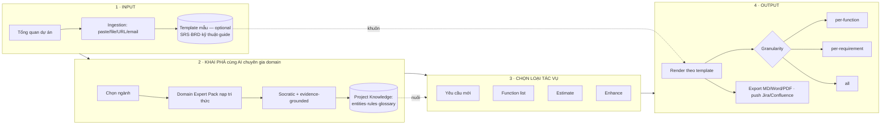
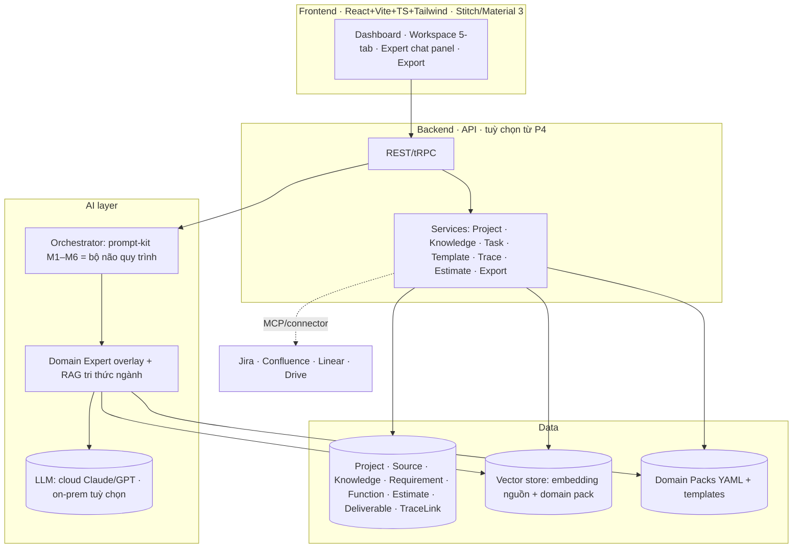

<!--
  Document ID: IMPLPLAN-BASUPER-1.0
  Date: 2026-06-03
  Version: 1.0
  Status: Draft — for approval
  Source: chạy theo prompt-master "Phương án triển khai BA Super App v2" (web-search 2025–2026).
          Kế thừa: 00-project/vision.md (VISION-BASUPER-1.0), docs/01-business/product-brief.md (PB-BASUPER-1.0),
          docs/02-requirements/user-flows.md (UF-BASUPER-1.0), 02-web-app/ (prototype Stitch/Material 3).
  Template: implementation-plan (product + technical + roadmap + estimate).
-->

# Phương án triển khai — BA Super App v2

> **Executive summary.** v1 đã chứng minh ý tưởng: prompt-kit + web app biến AI thành Senior BA chạy pipeline M1–M6 với Quality Gate + Traceability. Nhưng v1 còn là "trình tạo tài liệu tuyến tính": người dùng tự lái, chưa có **chuyên gia ngành** đồng hành, input/template rời rạc, output thiếu lựa chọn granularity. **v2** tái cấu trúc trải nghiệm quanh **4 lớp** — **Input → Khai phá cùng AI chuyên gia theo domain → Chọn loại tác vụ (Yêu cầu mới / Function list / Estimate / Enhance) → Output theo template (per-function / per-requirement / all)** — chắt lọc pattern hay nhất của các công cụ BA/AI 2025–2026 (vertical AI agent, evidence-grounding, EARS quality scoring, live traceability, auto-estimate). Mục tiêu: rút ngắn ≥50% thời gian, **tin được** (không bịa, có gate + provenance), và **xuất linh hoạt đúng khuôn doanh nghiệp**. Tài liệu này trình bày cả **sản phẩm/UX** lẫn **kiến trúc/kỹ thuật**, kèm feature list, estimate và roadmap P1→P4.

---

## 1. Tư tưởng & định vị v2

**Tagline:** *"Chuyên gia BA theo ngành trong túi bạn — khai phá đúng, sinh đúng khuôn, xuất đúng cái cần."*

| | v1 (hiện tại) | v2 (đề xuất) |
|---|---|---|
| Lái quy trình | Người dùng tự biết hỏi gì | **AI chuyên gia ngành** dẫn dắt Socratic |
| Tri thức ngành | Qua biến `[DOMAIN]` chung | **Domain Expert Pack** nạp sẵn entity/rule/compliance |
| Đơn vị công việc | Cả "dự án" | **4 loại tác vụ** tự chọn (req mới / function list / estimate / enhance) |
| Template | Cứng trong prompt | **Template marketplace** + bám "khuôn mẫu" user tải lên |
| Output | Cả bộ deliverable | **Chọn granularity**: per-function / per-requirement / all |
| Tin cậy | Gate completeness/consistency | + **EARS quality score**, **provenance** (mỗi req trỏ nguồn), **live impact** |

**[WHY]** Thị trường 2026 dịch chuyển từ "AI viết tài liệu chung" sang **vertical AI agent** (nạp sẵn tri thức ngành) + **spec-driven, evidence-grounded** (chống "vibe-spec" trôi khỏi ý định). v2 đặt cược đúng vào hai trục này — cũng là điểm yếu lộ rõ của các đối thủ generic.

---

## 2. Khảo sát app BA/AI hiện đại (2025–2026) — học gì

| App / xu hướng | Ý tưởng hay | BA Super App học gì |
|---|---|---|
| **ChatPRD** | Copilot PM; **template marketplace** cộng đồng; **spec → prototype** (v0/Lovable/bolt) | Template marketplace theo domain; nút "spec → màn hình/prototype" (nối Claude Design) |
| **Atlassian Rovo** | Agent platform; **search xuyên nguồn** (Drive/SharePoint); PRD ở Confluence → epic/issue ở Jira | Ingestion đa nguồn + **push deliverable sang Jira/Confluence**; agent hội thoại trên tri thức dự án |
| **Jama Connect Advisor** | Chấm điểm requirement theo **INCOSE/EARS**; auto **test-case**; **Live Traceability** cảnh báo impact khi upstream đổi | **Requirement Quality Score**; auto-gen test case từ AC; **impact analysis** trên đồ thị trace |
| **Spec-Driven Development** (Kiro, Spec Kit, **BMAD**, Cursor, Antigravity) | **EARS notation** cho US → AC phủ edge-case; agent đọc spec → sinh code + test | Chuẩn hoá AC bằng EARS; spec là "source of truth" cho mọi output xuống dưới |
| **Vertical AI agents** (Harvey-legal, Hippocratic-health, Sierra-CS) | Agent **nạp sẵn tri thức ngành + compliance + data model** | **Domain Expert Pack** — linh hồn của v2 |
| **AI estimation** (Xamun, scagile, **ScopeMaster**) | Story point tức thì; **function point** COSMIC/IFPUG **tự động từ requirement** | **Estimate engine**: function/story point + complexity (tái dùng mô hình ở `budget_dashboard`) |
| 2026 trend chung | PRD **grounded trong evidence thật**, không "văn AI" | **Provenance**: mỗi requirement trỏ về câu/đoạn nguồn |

*Nguồn ở cuối tài liệu (mục Sources).* **[WHY]** Không phát minh lại bánh xe: mỗi tính năng lõi của v2 đều có tiền lệ đã được thị trường kiểm chứng; ta ghép chúng thành một luồng BA Việt-hoá, có kỷ luật.

---

## 3. Trải nghiệm mục tiêu — 4 lớp

**User journey (end-to-end).**
1. **Tạo dự án** → nhập tổng quan (tên, domain, mục tiêu, compliance) → nạp tài liệu nguồn (HSYC/notes/URL). *(Optional)* tải **template mẫu** của tổ chức cho SRS/BRD/kỹ thuật/guide làm "khuôn bám".
2. **Khai phá cùng chuyên gia ngành**: chọn domain → Expert Pack nạp tri thức → hội thoại Socratic (có option + default, **không đoán bừa**) → chốt **Project Knowledge** (entities/rules/glossary), mỗi mục **trỏ nguồn** (provenance).
3. **Chọn loại tác vụ** muốn làm ngay (có thể nhiều lần, song song theo function): *Yêu cầu mới · Function list · Estimate · Enhance*.
4. **Sinh & kiểm**: pipeline con chạy → Quality Gate (completeness/consistency/traceability/feasibility) + **EARS quality score** → refine ≤3 vòng.
5. **Xuất**: chọn granularity (per-function / per-requirement / all) + template + format → export hoặc push thẳng Jira/Confluence.

**Màn hình chính (kế thừa prototype Stitch/Material 3):** Dashboard · Workspace (tab **Thông tin / Nguồn dữ liệu / Khai phá (Expert) / Tác vụ / Báo cáo-Xuất**) — bản đồ hoá lại 5 tab cũ sang trục 4 lớp; thêm **panel chat chuyên gia ngành** thường trực bên phải Workspace.

---

## 4. Domain Expert Pack (linh hồn v2)

**Cấu trúc 1 pack** (`/domain-packs/<industry>.yaml` + prompt-overlay):

| Thành phần | Nội dung | Dùng để |
|---|---|---|
| `entities` | Thực thể nghiệp vụ chuẩn ngành (vd Banking: Khách hàng, Hồ sơ vay, TSĐB, Lịch trả nợ) | Mồi domain model, gợi ý khi khai phá |
| `business_rules` | Thư viện rule mẫu (BR-xx) + ràng buộc | Gợi ý rule, kiểm consistency |
| `compliance` | Khung tuân thủ (Banking: NHNN/PCI-DSS; Health: HIPAA; Insurance: IFRS17…) | Nhắc NFR, cảnh báo rủi ro pháp lý |
| `glossary` | Thuật ngữ ↔ định nghĩa | Chuẩn hoá ngôn ngữ, dịch HSYC |
| `kpi_patterns` | KPI/metric đặc thù ngành | Gợi ý success metric cho requirement |
| `templates` | SRS/BRD/kỹ thuật/guide "chuẩn ngành" | Khuôn output mặc định nếu user không tải template |
| `expert_persona` | Tính cách + câu hỏi Socratic + checklist review | Định hình "AI chuyên gia" |

**Cách hoạt động:** chọn domain → hệ thống nạp pack làm **system-overlay** cho LLM (RAG tri thức ngành + prompt-kit M1–M6 hiện có làm "bộ não quy trình"). **[WHY]** Tách *tri thức ngành* (pack, dữ liệu) khỏi *quy trình BA* (prompt-kit, code) → thêm ngành mới = thêm 1 file pack, không sửa lõi (đúng triết lý "domain-adaptive qua biến" của v1, nâng cấp lên cấp "agent").

**7 ngành khởi điểm:** Banking & Finance · Insurance · Fintech · E-commerce · SaaS/Platform · Healthcare · Game. (MBL Insurance & BIDV Banking có sẵn dữ liệu thật để seed 2 pack đầu.)

---

## 5. Bốn loại tác vụ (mỗi loại 1 pipeline con)

| Loại | Input | Các bước | Deliverable | Gate đặc thù |
|---|---|---|---|---|
| **(a) Yêu cầu mới** | Mô tả nhu cầu + Project Knowledge | Elicit (Socratic) → viết requirement **EARS** + AC (Given/When/Then) → map vào BRD-REQ/SRS-FR | Requirement card + AC + trace links | EARS quality score ≥ ngưỡng; có provenance |
| **(b) Function list** | Scope/epic | Phân rã scope → cây **Function** (module → feature → function) → gắn req liên quan | Function tree + bảng FUNC-xx | Mỗi function ≥1 requirement; không orphan |
| **(c) Estimate** | Function list (hoặc requirement set) | Tự tính **function point/story point** + **complexity (1–10)** → quy đổi man-day theo cơ cấu nỗ lực | Bảng estimate + tổng MD + dải tin cậy | Có giả định ghi rõ; cảnh báo function "mơ hồ" |
| **(d) Enhance** | Requirement/function hiện hữu + thay đổi mong muốn | **Impact analysis** trên đồ thị trace → sinh **delta spec** (thêm/sửa/bỏ) → cập nhật version | Change set + impact report + AC mới | Live traceability: liệt kê mọi item bị ảnh hưởng trước khi chốt |

**[WHY]** Người dùng thật hiếm khi cần "cả bộ tài liệu" mỗi lần — họ cần *"viết giúp 1 requirement"*, *"liệt kê chức năng"*, *"ước lượng"*, hoặc *"đổi cái đang có"*. Đóng gói thành 4 tác vụ rõ ràng = đúng nhịp công việc, mỗi tác vụ vẫn chảy chung vào traceability của dự án.

---

## 6. Hệ thống Template & Output

**Template engine.** Mỗi loại đầu ra (SRS/BRD/kỹ thuật/guide) có template chuẩn (kế thừa `01-framework/templates/` + AIPlat). **Cơ chế bám "khuôn mẫu" user tải lên:** khi có template mẫu → hệ thống **trích cấu trúc** (heading/section/field/bảng) làm schema, rồi **map nội dung sinh ra vào đúng khuôn đó** (giữ ID/header convention của tổ chức). Không có → dùng template built-in của Domain Pack.

**Ma trận Output (granularity × format):**

| Granularity \ Format | Markdown | Word/PDF | Push Jira/Confluence |
|---|---|---|---|
| **Per-function** | ✅ | ✅ | ✅ (1 issue/function) |
| **Per-requirement** | ✅ | ✅ | ✅ (1 issue/req) |
| **All (tổng quan)** | ✅ | ✅ (bộ tài liệu) | ✅ (epic + children) |

**[WHY]** "Xuất từng function / từng yêu cầu / tất cả" là yêu cầu trực tiếp của chủ sản phẩm: phục vụ cả người cần 1 mẩu (dán vào ticket) lẫn người cần bộ tài liệu trình duyệt. Provenance + template-binding đảm bảo bản xuất **đúng khuôn doanh nghiệp**, không phải "văn AI".

---

## 7. Traceability & Quality

- **EARS AC**: mọi requirement viết theo EARS (Ubiquitous/Event/State/Unwanted/Optional) → AC phủ edge-case, máy đọc được. **[WHY]** chuẩn 2026 của spec-driven; giảm mơ hồ, cho phép auto-gen test case.
- **Requirement Quality Score** (học Jama Advisor): chấm completeness/atomic/không mơ hồ/đo lường được → cảnh báo trước khi đóng gate.
- **Live Traceability graph**: `Function → US → BRD-REQ → SRS-FR → TC`. Đổi 1 node → **impact analysis** liệt kê downstream bị ảnh hưởng (đặc biệt cho tác vụ Enhance).
- **Quality Gate fail-closed** (kế thừa v1): chưa PASS (đủ section + nhất quán + traceable + feasible) → phase/tác vụ chưa "xong".
- **Provenance / anti-fabrication**: mỗi requirement/entity/rule lưu **trỏ nguồn** (tài liệu + vị trí). Không có nguồn → đánh dấu *"giả định — cần xác nhận"*, không tự chốt.

---

## 8. Feature list

| ID | Tính năng | Loại tác vụ liên quan | MoSCoW | Release |
|---|---|---|---|---|
| FEAT-01 | Project setup + Ingestion đa nguồn (paste/file/URL/email) | tất cả | Must | P1 |
| FEAT-02 | Upload **template mẫu** + trích schema để bám khuôn | Output | Should | P1 |
| FEAT-03 | **Domain Expert Pack** (7 ngành) + chọn/nạp | Khai phá | Must | P1 |
| FEAT-04 | **Discovery copilot** Socratic + evidence-grounded → Project Knowledge | Khai phá | Must | P1 |
| FEAT-05 | Tác vụ **Yêu cầu mới** (EARS + AC + trace) | (a) | Must | P2 |
| FEAT-06 | Tác vụ **Function list** (cây function) | (b) | Must | P2 |
| FEAT-07 | Tác vụ **Estimate** (function/story point + complexity → MD) | (c) | Should | P2 |
| FEAT-08 | Tác vụ **Enhance** (impact analysis + delta spec) | (d) | Should | P2 |
| FEAT-09 | **Requirement Quality Score** (EARS/INCOSE) | (a)(d) | Should | P2 |
| FEAT-10 | **Live Traceability graph** + impact view | (a)(b)(d) | Must | P2 |
| FEAT-11 | **Template engine** + **Output granularity** (per-func/req/all) × format | Output | Must | P3 |
| FEAT-12 | Auto **test-case** từ AC | (a) | Could | P3 |
| FEAT-13 | **Push Jira/Confluence/Linear** | Output | Should | P3 |
| FEAT-14 | **Spec → prototype** (nối Claude Design) | Output | Could | P3 |
| FEAT-15 | Backend đa người dùng + lưu cloud + RBAC | nền tảng | Must (scale) | P4 |
| FEAT-16 | Nối **LLM thật** trong web (on-prem/cloud) + RAG tri thức ngành | tất cả | Must | P4 |
| FEAT-17 | Estimate học **lịch sử** (calibrate theo dự án đã đóng) | (c) | Could | P4 |

---

## 9. Kiến trúc & kỹ thuật

**Stack đề xuất.**
- **FE:** kế thừa React + Vite + TS + Tailwind, design system Stitch/Material 3 hiện có (đã có `styles.css`). State: Zustand/Context. (P1–P3 vẫn có thể chạy client-side trước.)
- **BE (từ P4, tuỳ chọn sớm hơn nếu cần đa người dùng):** Node (NestJS) hoặc Java/Spring (đồng bộ hệ Evo). DB **PostgreSQL + pgvector** (RAG), object store cho file nguồn.
- **AI:** **prompt-kit M1–M6 làm orchestrator** (bộ não quy trình, đã có) + **Domain Expert overlay** (pack) + **RAG** (embedding nguồn dự án & pack) → LLM (cloud Claude/GPT; on-prem tuỳ chọn cho khách nhạy cảm dữ liệu). **MCP/connector** để push Jira/Confluence và (về sau) để agent đọc spec.
- **Data model (rút gọn):** `Project(id, domain, compliance…)` · `Source(projectId, type, text, provenance)` · `Knowledge(entity|rule|term, source_ref)` · `Requirement(id, EARS, AC, quality_score, status)` · `Function(id, parent, requirement_ids)` · `Estimate(target_ref, fp/sp, complexity, md)` · `Deliverable(type, template_ref, render)` · `TraceLink(from, to, type)`.
- **Bảo mật/compliance:** secrets qua env/vault; không log PII thô; per-domain compliance nhắc ở NFR; tuỳ chọn **on-prem LLM** cho dữ liệu nhạy cảm (Banking/Health). **[WHY]** Tách FE/AI/Data theo lớp cho phép **ship dần client-side (P1–P3)** rồi mới gắn backend (P4) — giảm rủi ro, sớm có giá trị.

---

## 10. Estimate

### 10a. App tự ước lượng thế nào (FEAT-07)
- **Đầu vào:** function list (hoặc requirement set) đã chốt.
- **Sizing:** mỗi function → **complexity 1–10** (học mô hình thang màu ở `budget_dashboard.html`) + quy đổi **function point** (IFPUG/COSMIC, học ScopeMaster) hoặc **story point** (học scagile/Xamun).
- **Quy đổi MD:** áp **cơ cấu nỗ lực** mẫu (từ `budget_data` thật của BIDV: Development ~53% · Testing ~16% · BA ~12% · Design/Arch ~10% · PM+QA ~9%) → tổng man-day + dải tin cậy.
- **Cảnh báo:** function "mơ hồ"/thiếu AC → đánh dấu *"estimate rủi ro cao"*. **[WHY]** Ước lượng từ requirement có cấu trúc đáng tin hơn "đoán điểm"; tái dùng dữ liệu thật đã có trong repo.

### 10b. Estimate nỗ lực XÂY v2 (giả định: team 2–3 người, AI qua API, kế thừa prototype FE)

| Phase | Hạng mục chính | Man-day (dải) | Giả định |
|---|---|---|---|
| **P1** | Input + Template-intake + Domain Packs (2 ngành seed) + Discovery copilot | **40–55** | Dùng lại FE prototype; LLM qua API; 2 pack (Banking/Insurance) |
| **P2** | 4 pipeline tác vụ + EARS quality + Live Traceability | **55–75** | Trace graph dựng mới; EARS scorer rule-based + LLM |
| **P3** | Template engine + Output granularity + Export/Push + spec→prototype | **40–55** | Word/PDF render qua thư viện; connector Jira/Confluence |
| **P4** | Backend + multi-user + RBAC + LLM-trong-web + estimate học lịch sử | **50–70** | Có backend; on-prem LLM tuỳ chọn |
| | **Tổng v2** | **≈ 185–255 MD** | *Giả định — cần chốt scope từng phase* |

> ⚠️ Con số là **giả định để hoạch định**, không phải cam kết. Sẽ tinh chỉnh sau khi chốt scope P1 và năng lực team thật.

---

## 11. Roadmap P1 → P4

| Phase | Mục tiêu | Scope (feature) | DoD phase |
|---|---|---|---|
| **P1 — Nền tảng & Khai phá** | "Chuyên gia ngành dẫn dắt input→tri thức" | FEAT-01,02,03,04 | Tạo dự án → nạp nguồn → chọn ngành → có Project Knowledge có provenance; 2 pack seed chạy thật |
| **P2 — Bốn tác vụ & Chất lượng** | "Sinh đúng + truy vết + đo chất lượng" | FEAT-05,06,07,08,09,10 | 4 tác vụ chạy end-to-end; trace graph + impact; EARS score; gate fail-closed |
| **P3 — Template & Xuất linh hoạt** | "Xuất đúng khuôn, đúng granularity" | FEAT-11,12,13,14 | Xuất per-function/req/all × MD/Word/PDF; bám template mẫu; push Jira/Confluence |
| **P4 — Scale & AI-trong-web** | "Đa người dùng, LLM thật, học lịch sử" | FEAT-15,16,17 | Backend + RBAC; LLM live (cloud/on-prem); estimate calibrate |

**[WHY]** Mỗi phase **tự nó có giá trị dùng được** (P1 đã giúp khai phá; P2 đã sinh tài liệu; P3 đã xuất; P4 mới scale) → giảm rủi ro, dễ demo & gọi vốn/duyệt từng chặng.

---

## 12. Rủi ro & ⚠️ Open Questions / Assumptions (Red-Team)

**Rủi ro chính & giảm thiểu**
- **Chất lượng Domain Pack quyết định tất cả** → bắt đầu 2 ngành có dữ liệu thật (Banking/Insurance), review bởi BA thật trước khi mở rộng.
- **LLM bịa / trôi spec** → provenance bắt buộc + EARS + gate fail-closed + "human chốt" (kế thừa nguyên tắc v1).
- **Phình scope** (4 tác vụ × 7 ngành × 3 granularity) → ship theo phase, MoSCoW chặt, P1 chỉ 2 ngành.
- **Template-binding khó với file mẫu lộn xộn** → P3 hỗ trợ template chuẩn trước, "trích schema từ file mẫu" là Should, có fallback.
- **Dữ liệu nhạy cảm (Banking/Health)** → tuỳ chọn on-prem LLM + không log PII.

**⚠️ Open Questions cần chốt**
1. **Đối tượng triển khai v2:** vẫn local-first (như v1) hay hướng SaaS đa người dùng ngay? (ảnh hưởng có cần backend ở P1 không).
2. **LLM:** dùng cloud (Claude/GPT) hay bắt buộc on-prem cho một số khách? Ngân sách token?
3. **Mức "AI chuyên gia":** chatbot gợi ý (nhẹ) hay agent tự chạy nhiều bước (nặng, cần guardrail)?
4. **Template chuẩn:** lấy bộ template AIPlat hiện có làm gốc, hay tổ chức có bộ khác bắt buộc?
5. **Estimate:** đơn vị chính là **function point** hay **story point**? Có dữ liệu lịch sử để calibrate không?
6. **Tích hợp:** Jira/Confluence/Linear — cái nào ưu tiên P3?
7. **Phạm vi P1 chốt cứng:** 2 ngành nào, bao nhiêu loại nguồn ingestion?

**Giả định đang dùng:** team 2–3 người · kế thừa FE prototype · LLM qua API · 2 pack seed có dữ liệu thật · estimate là số hoạch định (không cam kết).

---

## Sources (web-search 2026-06-03)
- ChatPRD & alternatives — buildbetter.ai/best-chatprd-alternatives-in-2026 · chatprd.ai
- Atlassian Rovo — atlassian.com/software/rovo · atlassian.com/software/jira/ai
- Jama Connect Advisor (AI requirements, Live Traceability) — jamasoftware.com/solutions/artificial-intelligence · jamasoftware.com/blog/ai-requirements-management
- Spec-Driven Development & EARS (Kiro/BMAD/Spec Kit) — marktechpost.com/2026/05/08/9-best-ai-tools-for-spec-driven-development-in-2026 · augmentcode.com/tools/best-spec-driven-development-tools
- Vertical AI agents 2026 — actgsys.com/en/blog/vertical-ai-agents-industry-specific-2026
- AI estimation (ScopeMaster, scagile, Xamun) — scopemaster.com · scagile.io/en/ai-story-point-calculator · xamun.ai/story-points

*implementation-plan.md v1.0 — Phương án triển khai BA Super App v2: 4 lớp (Input → Khai phá cùng AI chuyên gia domain → 4 loại tác vụ → Output theo template), toàn diện sản phẩm + kỹ thuật + estimate + roadmap. Trạng thái: Draft chờ duyệt.*
